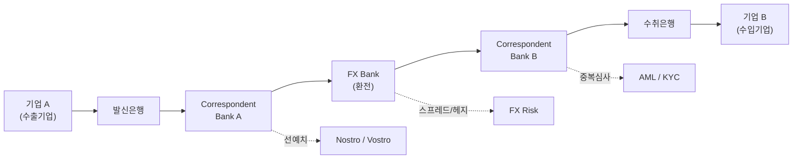
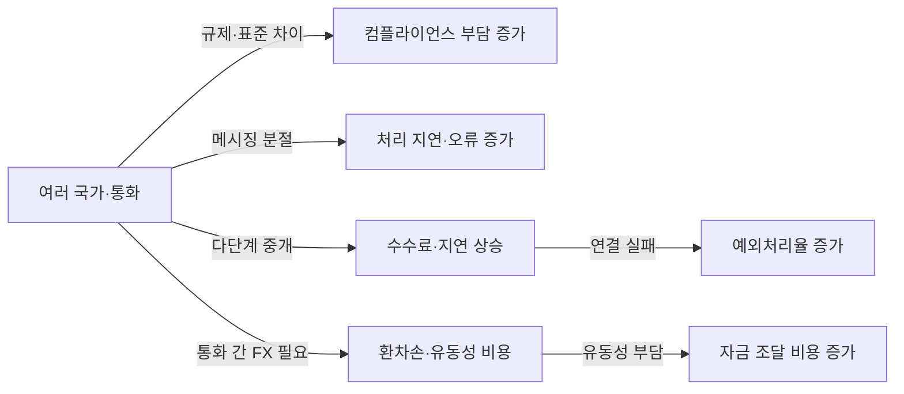
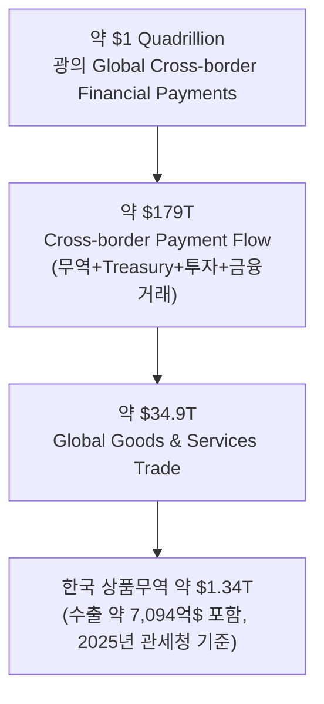

# 01 - 1단계: 광범위한 탐색 — B2B 국경간 이종통화 결제·정산 인프라 시장

## 한눈에 보기

| 항목 | 내용 |
|---|---|
| 문제 시장 | B2B 국경간 이종통화 결제·정산 인프라 시장 |
| 핵심 마찰 | 법·규제 분절, 데이터·메시징 분절, 중개은행망 분절, 유동성 분절, 환전(FX) 분절, 운영시간 분절 — 6유형 |
| 새 인프라 후보 | 기존 금융망 고도화, 실시간 지급망 연결, 로컬통화 직접결제, CBDC/멀티CBDC, 토큰화 예금, 스테이블코인 — 6갈래 |
| 잠정 결론 | 압도적인 글로벌 표준은 아직 없음. 국가마다 서로 다른 Settlement Architecture를 동시에 실험 중 |

## 연구 질문 (1단계에서 설정)

> **Q1.** B2B 국경간 이종통화 결제·정산은 현재 어떠한 구조로 이루어지며, 이 과정에서 기업과 금융기관은 어떤 구조적 마찰을 겪고 있는가? 또한 이러한 문제를 해결하기 위해 기존 금융망 개선, CBDC, 토큰화 예금, 스테이블코인 등 어떤 새로운 결제·정산 인프라가 시도되어 왔는가?
>
> **Q2.** 한국과 유사하게 국제무역 규모가 크고 독자적인 통화·금융시스템을 가진 국가들은 B2B 국경간 이종통화 결제·정산의 구조적 마찰을 줄이기 위해 어떤 인프라를 도입하고 있는가? 각 방식은 실제 상용화·거래규모·참여기업·비용·속도 측면에서 어느 정도의 성과를 거두었으며 향후 확장 가능성은 어떠한가?

## 시장 정의

> 서로 다른 통화를 사용하는 기업과 금융기관이 국경간 자금을 지급·환전·정산하는 과정에서 필요한 금융·기술 인프라 시장.

## 문제 구조 한눈에 보기

기업 A→B 간 자금이 오가려면 발신은행과 수취은행 사이에 최소 1개 이상의 중개은행(코리어은행)과 별도의 FX 처리 단계를 거친다. 이 다단계 구조 자체가 아래 6가지 마찰의 근원이다.

## 구조적 마찰 6유형

| 마찰 유형 | 핵심 현상 | 기업·금융기관 영향 |
|---|---|---|
| 법·규제 분절 | 국가마다 다른 AML/KYC·제재 기준을 결제 단계마다 반복 심사 | 처리 지연, 중복 컴플라이언스 비용 |
| 데이터·메시징 분절 | SWIFT MT 등 비구조화 포맷과 ISO 20022 도입 속도 차이 | 자동처리(STP) 저해, 수동 재처리·오류 |
| 중개은행망 분절 | 코리어은행 수가 지속 감소, 통화·지역별로 경로가 다름 | 단계마다 수수료·지연 누적 |
| 유동성 분절 | 통화별로 노스트로/보스트로 계좌를 별도 선예치 | 운전자본 비효율, 자본 기회비용 |
| 환전(FX) 분절 | 비기축통화 쌍은 유동성이 얕아 스프레드가 큼(예: USD-KRW 40~50bp) | 환전비용·환위험 증가 |
| 운영시간 분절 | 국가별 RTGS 영업시간·영업일 불일치 | 결제 대기, 유동성 추가 조달 필요 |

## 마찰의 인과관계

전통적 경로 기준 참고 수치: 세계은행 조사(2024)로는 소액 국제송금 평균비용 6.5%(중소기업 B2B는 5% 이상, 대기업은 1~3%), 글로벌 노스트로 예치금 규모는 업계 추정 27조~100조 달러 수준이다.

## 새로운 결제·정산 인프라 6갈래

| 인프라 유형 | 대표 사례 | 핵심 특징 |
|---|---|---|
| 기존 금융망 고도화 | SWIFT GPI, ISO 20022 | 기존 코리어 체인 내 개선. 규제 친화적이나 24/7 미지원 |
| 실시간 지급망 연결 | PayNow–PromptPay(싱가포르-태국) | 국가 간 즉시결제망(IPS) 상호연계, 소액·고빈도 거래에 유리 |
| 로컬통화 직접결제 | 인도-UAE 루피 직접결제(2023) | 제3의 기축통화(USD) 배제, 양국 통화쌍 직접 거래 |
| CBDC / 멀티 CBDC | mBridge(중국·홍콩·UAE·태국) | 중앙은행 디지털화폐 간 직접 정산, 거버넌스 복잡도 높음 |
| 토큰화 예금 / 통합원장 | Project Agorá, 홍콩 Ensemble, 한국 한강 프로젝트 | 상업은행 예금을 토큰화해 공동원장에서 원자적(atomic) 결제 |
| 스테이블코인 | USDC·USDT 등 | 24/7 즉시 정산, 온·오프램프 및 규제가 관건 |

## 국가별 아키텍처 선택 스냅샷

| 국가 | 주요 전략 | 대표 프로젝트 | 현재 단계 |
|---|---|---|---|
| 일본 | 기존 은행화폐 토큰화 | Project Agorá | Prototype → 실가치 테스트 |
| 홍콩 | 토큰화 예금 + e-HKD 병행 | e-HKD Pilot(Phase 1→2) | 실가치 Pilot |
| 싱가포르 | 다중 Rail 동시 실험(Multi-Rail) | Project Guardian | Live Trial + Pilot |
| UAE | 멀티 CBDC 직접 연결 | Digital Dirham, mBridge | MVP / 실거래 확대 |
| 중국 | 멀티 CBDC(mBridge 참여) | e-CNY, mBridge | MVP / 국내는 상용, 해외는 제한적 |
| 인도 | 로컬통화 직접결제(신기술 없이) | INR-AED LCS(2023) | 상용 운영 |
| 한국 | 복수 모델 동시 검증 | Agorá 참여, 한강 프로젝트, 역외 원화결제망 | Prototype / Pilot |

인도 사례가 특히 의미 있는 이유는, 새로운 디지털 화폐 없이 **기존 은행망 안에서 통화쌍만 직접 연결**해도 마찰을 줄일 수 있음을 보여주기 때문이다. 이는 4단계 가설(통화 차이 자체가 별도의 마찰 원인인가)과 직접 연결된다.

## 시장 규모의 층위

시장 규모는 하나의 숫자로 단정할 수 없다. $1Q를 그대로 쓰면 과대평가, $34.9T(무역)만 쓰면 기업 Treasury·계열사 간 자금이동을 과소평가한다. 따라서 $179T의 국경간 지급 흐름을 상위 모수로 두고, 그 안에서 B2B·이종통화·인프라 적용 가능 거래로 좁혀가는 방식이 타당하다 — 이 좁히는 작업이 2단계의 과제다.

## 이 탐색이 가리키는 다음 질문

- **범위**: 이 넓은 문제 중 어떤 거래유형·어떤 국가군·어떤 기간을 볼 것인가 → 2단계
- **원인**: 6가지 마찰은 서로 다른 문제인가, 아니면 하나의 공통 원인에서 파생되는가 → 3단계
- **가설**: 만약 공통 원인이 있다면, 그 원인은 "국가·관할권 차이"만으로 설명되는가, 아니면 "통화 차이" 자체가 별도 변수인가(인도의 로컬통화 직접결제 사례가 시사하는 지점) → 4단계
