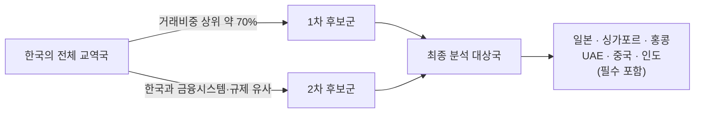

# 02 - 2단계: 범위 축소 — 분석 대상의 구체화

## 한눈에 보기

| 축소 기준 | 결정 |
|---|---|
| 거래유형 | 기업의 무역대금 결제 + 기업 Treasury/Intercompany 자금 이동 |
| 지역 | 한국 중심. 거래비중 상위(약 70%) 국가 + 한국과 금융시스템(규제 포함)이 유사한 국가(일본·싱가포르·홍콩·UAE·중국·인도 필수 포함) |
| 기간 | 2024년~2026년 |
| 핵심지표 | 미정 → 본 문서에서 후보안 제시 |

1단계에서 확인한 시장은 $179T 규모의 국경간 지급 흐름 전체였다. 이는 그대로 분석하기엔 너무 넓으므로, 아래 세 축으로 좁힌다.

## 거래유형: 왜 무역대금·Treasury/Intercompany인가

$179T 흐름은 무역대금($34.9T) 외에도 Treasury, 투자, 금융기관 간 거래를 포함한다. 이 중 **기업(비금융기관)이 실제로 겪는 마찰**에 초점을 맞추기 위해 두 유형만 남긴다.

| 거래유형 | 포함 이유 |
|---|---|
| 무역대금 결제 | 1단계 마찰(코리어은행·FX·규제)이 가장 직접적으로 나타나는 영역이자, $34.9T 실물무역이라는 명확한 하한선이 있음 |
| Treasury / Intercompany 자금이동 | 해외법인·계열사 간 자금이동은 무역대금과 마찰 구조는 같지만 통계상 무역으로 잡히지 않아, 포함하지 않으면 시장을 과소평가함 |
| (제외) 투자·금융기관 간 거래 | 자본시장·증권결제 인프라(예: DvP)는 결제 구조와 규제 주체가 달라 별도 분석이 필요한 영역 |

## 지역: 국가 선정 기준

| 국가 | 한국과의 유사성 | 선정 근거 |
|---|---|---|
| 일본 | 매우 높음 | 제조업 중심 수출입 구조, 독자 통화(JPY), 대형 은행 중심 금융시스템 |
| 중국 | 높음 (교역비중) | 한국의 최대 교역상대국군, 다만 자본통제로 접근 방식은 상이 |
| 홍콩 | 높음 | 중국-글로벌 금융 게이트웨이, 아시아 금융허브로서 규제 실험이 앞섬 |
| 싱가포르 | 높음 | 글로벌 FX·Treasury 허브, 다중 Rail 실험의 선행시장 |
| UAE | 중간 | 무역·금융 허브, 비석유 무역 비중 확대, Multi-CBDC 실거래 선두 |
| 인도 | 중간 | 대형 무역경제 + 독자통화(INR) 국제화 시도, "디지털 자산 없는 해법" 반례 |

**남은 과제**: "거래비중 약 70%"를 충족하는 정확한 국가 목록은 관세청·무역협회(K-stat)의 국가별 수출입 통계로 확정해야 한다. 중국·미국·베트남·일본·홍콩·대만 등이 통상 한국 교역 상위권으로 알려져 있으나, 본 문서에서는 공식 비중 수치를 확인하지 못해 확정하지 않았다.

## 기간: 2024~2026년

이 구간을 선택한 이유는 1단계에서 확인한 핵심 프로젝트가 이 3년에 몰려 있기 때문이다.

| 시점 | 사건 |
|---|---|
| 2024-01 | UAE-중국 mBridge 실거래(5천만 AED) |
| 2024 | 홍콩 e-HKD Phase 2(토큰화 예금 확장) |
| 2024~2025 | 한국 한강 프로젝트 2단계(실거래 테스트) |
| 2025 | 한국은행 ISO 20022 도입 |
| 2026-03 | BOK-Wire+ RTGS 운영시간 확대(09~20시) |
| 2026-09(예정) | 한국 역외 원화결제망 시범 운영 |

## 핵심지표(안)

1단계에서 아직 확정하지 못한 부분이다. 마찰 6유형과 국가별 성숙도 비교가 요구하는 지표를 기준으로 다음을 후보로 제안한다.

| 범주 | 지표 | 측정 대상 | 데이터 출처 후보 |
|---|---|---|---|
| 비용 | 거래 건당 총비용(중개수수료+FX 스프레드, %) | 국경간 이종통화 B2B 결제 1건 | 세계은행 송금비용 DB, 은행 고시환율 |
| 속도 | 결제 개시~기업계좌 최종입금 소요시간 | 동일 | SWIFT gpi 통계, 각국 중앙은행 발표 |
| 유동성 | 노스트로/보스트로 예치 규모, 자금 기회비용 | 은행·기업 운전자본 | BIS 보고서, 개별 은행 공시 |
| 상용화 단계 | Pilot / MVP / Live Trial / 상용 4단계 구분 | 국가별 대표 프로젝트 | 각국 중앙은행·BIS 프로젝트 문서 |
| 채택 규모 | 참여 금융기관 수, 실거래 누적 규모(달러 환산) | 국가별 대표 프로젝트 | 프로젝트 공식 발표 |
| 확장성 | 참여국·통화 확대 계획, 법제화 진행 상황 | 국가별 정책 로드맵 | 중앙은행·금융당국 보도자료 |

이 중 "비용·속도·유동성"은 마찰의 **크기**를, "상용화 단계·채택 규모·확장성"은 대안 인프라의 **성숙도**를 측정한다. 5단계(정량적 검증)에서 실제 수치를 채워 넣을 예정이다.
