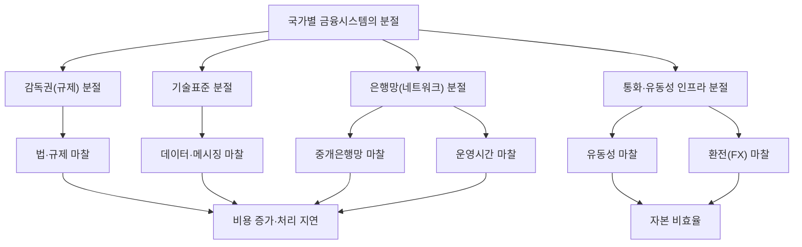

# 03 - 3단계: 핵심 원인 분석 — 구조적 마찰의 근본 원인

## 한눈에 보기

- 연구 질문: 6가지 구조적 마찰은 각각 왜 발생하는가?
- 잠정 답: 근본 원인은 **국가별 금융시스템의 분절(Fragmentation)** — 6가지 마찰 모두 이 하나의 원인이 서로 다른 측면에서 드러난 결과다.

## 연구 질문 (3단계에서 설정)

> B2B 국경간 결제·정산에서는 구체적으로 어떤 구조적 마찰이 발생하며, 각 마찰의 근본 원인은 무엇인가?
>
> **근본 원인: 국가별 금융 시스템의 분절**

## 마찰별 근본 원인 매핑

1단계에서 나열한 6가지 마찰은 겉보기엔 서로 다른 문제지만, 모두 "국가마다 금융시스템이 독립적으로 설계·운영된다"는 하나의 사실로 환원된다.

| 마찰 유형 | 구체적 현상 | 분절의 성격 |
|---|---|---|
| 법·규제 분절 | 국가별 AML/KYC·제재 기준이 서로 연동되지 않아 결제마다 중복 심사 | 감독권(관할권)의 분절 |
| 데이터·메시징 분절 | SWIFT MT·로컬 포맷·ISO 20022 도입 속도가 국가마다 다름 | 기술표준 거버넌스의 분절 |
| 중개은행망 분절 | 코리어은행 네트워크가 국가쌍별로 다르게 형성되고 지속 축소 | 은행 간 상호연결(네트워크)의 분절 |
| 유동성 분절 | 통화별 노스트로 계좌를 국가마다 별도로 선예치해야 함 | 통화별 예치 인프라의 분절 |
| 환전(FX) 분절 | 통화쌍마다 시장 깊이·스프레드가 달라 기축통화 경유가 필요 | 통화 유동성 시장의 분절 |
| 운영시간 분절 | RTGS 영업시간·영업일이 국가마다 달라 정산이 대기 상태에 놓임 | 결제망 운영시간의 분절 |

## 인과 다이어그램

## 근거 사례

- **Project Agorá(BIS)**: 국가별로 반복되던 규제 심사를 공동원장에서 한 번의 사전 심사(pre-screening)로 통합하는 실험을 진행했다. 이는 "법·규제 분절"이 실제로 국가 간 감독권이 분리되어 있기 때문에 발생한다는 것을 역으로 증명한 사례다 — 원장을 공유하자 마찰이 줄었다.
- **SEPA(유로존 단일유로시장)**: 유로존 내부는 여러 국가로 나뉘어 있지만(국경은 존재) 통화(EUR)와 결제 인프라(TARGET2)가 사실상 하나로 통합되어, 국경간 거래임에도 마찰이 거의 없다. 이는 마찰의 크기를 좌우하는 것이 "국경 자체"가 아니라 "시스템이 얼마나 분절되어 있는가"임을 보여주는 대조 사례다.

## 남은 질문 → 4단계로

SEPA 사례는 동시에 새로운 질문을 만든다. SEPA는 "국경은 있지만 통화·시스템은 분절되지 않은" 경우인데, 그렇다면 **국경(관할권) 분절과 통화 분절은 같은 것인가, 별개로 작동하는 두 변수인가**? 이 질문이 4단계 가설 수립의 출발점이다.
