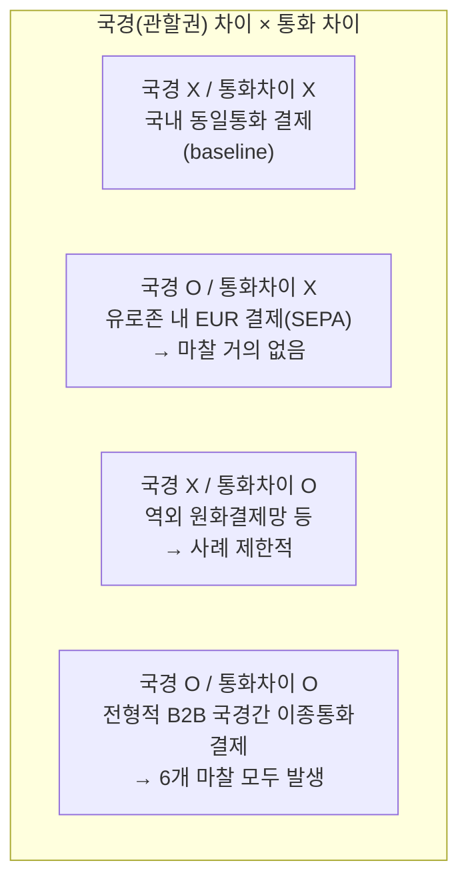

# 04 - 4단계: 가설 수립

## 한눈에 보기

| 가설 | 내용 | 현재 상태 |
|---|---|---|
| H1 | B2B 국경간 결제/정산에서 관찰되는 개별 마찰의 상위 근본원인은 국가별 금융시스템의 분절이다 | 3단계 분석의 1차 결론. 5단계 정량 검증 대상 |
| H2 | 통화 차이는 국경·관할권 차이에서 발생하는 기본 마찰을 넘어, 독립적인 핵심 시장 세그먼트로 구분할 만큼 추가적인 경제적 마찰을 발생시킨다 | 열린 질문. SEPA·인도 사례가 정황 근거이나 정량 검증 전 |

## 가설 1: 금융시스템 분절이 상위 근본원인이다

> B2B 국경간 결제/정산에서 관찰되는 개별 마찰의 상위 근본원인은 국가별 금융시스템의 분절이다.

**근거**: 3단계에서 매핑한 6가지 마찰(법·규제, 데이터·메시징, 중개은행망, 유동성, 환전, 운영시간)이 모두 "감독권·기술표준·은행망·통화 인프라가 국가마다 독립적으로 운영된다"는 하나의 사실로 환원됨을 확인했다. Project Agorá가 원장을 공유해 규제 마찰을 줄인 사례는 원인과 결과의 방향성(분절 → 마찰)을 뒷받침한다.

**검증이 필요한 지점**: 지금까지의 근거는 사례 기반(정성적)이다. 국가쌍(country-pair)별로 "분절도"를 정량화하고, 이것이 실제 비용·속도 지표와 상관관계를 갖는지 확인해야 H1이 1차 결론에서 검증된 결론으로 승격된다.

## 가설 2: 통화 차이는 별도의 시장 세그먼트를 만드는가

> B2B 국경간 결제·정산에서 통화 차이는 국경·관할권 차이에서 발생하는 기본 마찰을 넘어, 독립적인 핵심 시장 세그먼트로 구분할 만큼 추가적인 경제적 마찰을 발생시킨다.

이는 3단계 말미에서 SEPA 사례가 제기한 질문(국경 분절과 통화 분절은 같은 변수인가)에 대한 답을 시도하는 가설이다. "국경 차이"와 "통화 차이"를 독립된 두 축으로 놓으면 4가지 경우가 생긴다.

| 사분면 | 대표 사례 | 관찰된 마찰 수준 | H2에 대한 함의 |
|---|---|---|---|
| 국경 X · 통화차이 X | 국내 동일통화 결제 | 최소(기준선) | — |
| 국경 O · 통화차이 X | 유로존 내 EUR 결제(SEPA) | 매우 낮음 | 국경만으로는 마찰이 크지 않음을 시사 |
| 국경 X · 통화차이 O | 역외 원화결제망, 역내 외화결제 | 제한적이나 존재 | 통화차이만으로도 일부 마찰이 발생함을 시사 |
| 국경 O · 통화차이 O | 전형적 B2B 국경간 이종통화 결제 | 최대(6개 마찰 모두) | 두 요인이 결합할 때 마찰이 가장 큼 |

**H2를 뒷받침하는 정황**: SEPA(국경 O·통화차이 X)의 낮은 마찰은 "국경 자체는 마찰의 충분조건이 아니다"를 보여준다. 반대로 인도의 로컬통화 직접결제(LCS)는 국경과 관할권을 그대로 둔 채 **통화 경로만 직접 연결**해도 마찰(특히 FX 비용)이 줄어든다는 것을 보여준다 — 이는 통화차이가 국경·관할권 차이와 분리해 다룰 수 있는 별도 변수임을 시사한다.

**아직 검증되지 않은 지점**: "국경 X·통화차이 O" 사분면의 사례가 아직 많지 않아, 통화차이 단독의 마찰 크기를 독립적으로 계량하기 어렵다. 또한 "독립적인 핵심 시장 세그먼트로 구분할 만큼"이라는 조건은 정성적 정황만으로는 판단할 수 없고, 마찰 지표(비용·속도)를 4개 사분면에 걸쳐 비교하는 정량 데이터가 필요하다.

## 5단계로 넘기는 검증 계획(안)

| 가설 | 검증에 필요한 데이터 | 예상 시각화 |
|---|---|---|
| H1 | 국가쌍별 "분절도"(규제 차이·메시징 표준 차이·코리어은행 단계 수 등)와 비용·속도 지표 간 상관관계 | 산점도(분절도 vs 처리비용/시간) |
| H2 | 위 2×2 사분면별 실제 마찰 지표(비용·속도) 비교 | 사분면별 막대그래프 또는 히트맵 |

두 가설 모두 2단계에서 제안한 핵심지표(비용·속도·유동성 등)를 국가쌍·통화쌍 단위로 채워 넣어야 검증이 가능하다. 이 데이터 확보와 시각화가 5단계(정량적 검증)의 과제다.
