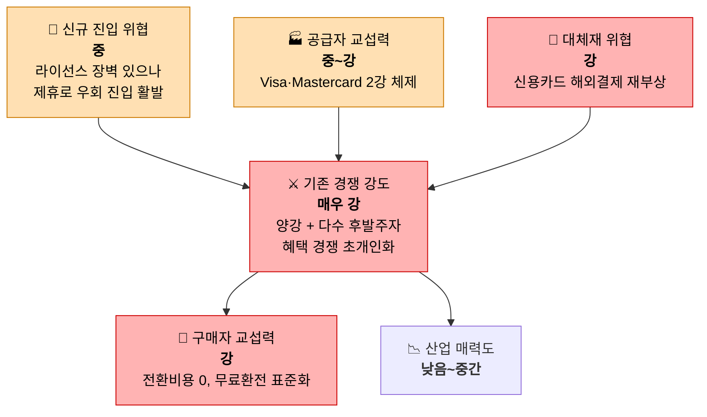

# Area A - 해외에서 쓸 수 있는 모바일 간편결제/여행자 결제 서비스

대상: 트래블월렛, 하나 트래블로그, 삼성페이, 애플페이, 토스뱅크 체크카드 등 "해외여행 결제"를 핵심 축으로 하는 국내 핀테크/카드 서비스

## 한눈에 보기

## 5가지 힘 요약표

| 힘 | 강도 | 핵심 근거 |
|---|---|---|
| 공급자 교섭력 | 🟧 중~강 | Visa·Mastercard 2강 체제, 마스터카드 점유율 39.3%까지 확대 |
| 구매자 교섭력 | 🟥 강 | 전환비용 0, 무료환전 업계 표준화로 차별화력 상실 |
| 신규 진입 위협 | 🟧 중 | 라이선스 자본금 요건 있으나 제휴(Alipay+) 기반 진입 활발 |
| 대체재 위협 | 🟥 강 | 신용카드 해외결제가 혜택 측면에서 재부상 |
| 기존 경쟁 강도 | 🟥 매우 강 | 트래블월렛·트래블로그 양강 + 카드사·토스뱅크 후발 추격 |

## 1. 공급자 교섭력 — **중 ~ 강**

- 국제브랜드(Visa·Mastercard) 의존도가 절대적. 2025년 상반기 기준 마스터카드 39.3%, 비자 25.5%로 마스터카드 비중이 2020년 25.1% → 2025년 39.3%까지 꾸준히 확대됨.
- 비자가 2016년 수수료를 1.1%로 인상한 뒤 유지하자, 카드사들이 상대적으로 저렴한 마스터카드 중심 트래블카드로 이동 — 국제브랜드의 가격 결정력이 카드사 포트폴리오 구성까지 좌우.
- 예외: 트래블월렛은 아시아 최초로 Visa Principal License와 해외송금업·전자금융업·온라인환전업 허가를 직접 취득해, 국제브랜드·은행에 대한 의존을 일부 내부화함 — 공급자 힘을 낮추는 전략적 대응 사례.
- NFC 결제 인프라(단말기 보급률 90%+, VAN사)도 공급자 축에 포함되며, 애플페이는 NFC 인증단말기가 필요해 삼성페이(MST, 범용 단말기)보다 인프라 의존도가 높음.

**판단**: 국제브랜드 2강 체제에 대한 의존이 구조적으로 강하나, 라이선스 직접 취득으로 일부 완화 가능 → 중~강.

## 2. 구매자 교섭력 — **강**

- 전환비용이 거의 0에 가까움: 앱만 설치하면 즉시 발급, 트래블월렛·트래블로그 "둘 다 발급해 상황별로 쓰라"는 멀티호밍이 표준적 소비 행태로 보도됨.
- 무료환전(환율우대 100%)이 트래블월렛, 트래블로그, 토스뱅크, 하나카드 등 업계 전반의 기본값이 되어 더 이상 차별화 요소가 아님 — 오히려 캐시백(KB 10%, 우리 5%) 경쟁으로 확전.
- 소비자는 여러 서비스의 혜택을 실시간 비교하며 이동하는 힘을 갖고 있고, 카드사들은 이를 붙잡기 위해 수익을 계속 깎아내는 구조.

**판단**: 표준화된 무료 서비스 + 낮은 전환비용 = 구매자 우위가 명확함 → 강.

## 3. 신규 진입자의 위협 — **중**

- 법적 장벽 존재: 선불전자지급수단 발행업 자본금 20억 원 이상, 전자지급결제대행업 자본금 10억 원 이상 + 전산인력 5인 이상, 종합지급결제사업자는 200억 원 자본금 요건.
- 그러나 실질 진입은 계속 발생 중: 토스뱅크가 2025년 8월 수수료 전면 면제로 후발 공세, 신한·KB·우리 등 카드사도 잇따라 트래블카드 라인업 확장.
- 카카오페이는 알리페이+(Ant Group) 네트워크에 연동해 자체 해외 가맹점 인프라 구축 없이 전 세계 1.5억 개 가맹점에 접근 — 플랫폼 제휴가 진입장벽을 실질적으로 낮추는 새로운 경로가 됨.

**판단**: 법적 장벽은 있으나 제휴 기반 진입 경로가 열려 있어 신규 진입이 계속 관찰됨 → 중.

## 4. 대체재의 위협 — **강**

- 일반 신용카드 해외결제가 다시 강력한 대체재로 부상: 국제브랜드 수수료(약 1%)를 부담해도 적립·혜택이 좋아 "무료환전 트래블카드보다 더 이득"이라는 비교 기사가 다수 등장.
- 현금, 은행 외화통장/환전주머니, 와이어바알리 같은 송금 기반 환전 서비스도 대체 채널로 작동.
- 다만 오픈서베이(2025) 조사에서는 트래블카드 사용률이 급증하며 현금·일반카드 의존도는 하락 — 대체재 위협이 상존하지만 트렌드는 트래블카드 쪽으로 이동 중.

**판단**: 대체재 자체의 매력도가 여전히 높아 가격 인상 여력을 제약함 → 강.

## 5. 산업 내 경쟁 강도 — **매우 강**

- 트래블월렛(카드 발급 기준 시장점유율 40%) vs 하나 트래블로그(가입자 700만) 양강 구도.
- 신한 SOL트래블, KB 트래블러스, 우리 위비트래블, 토스뱅크까지 뛰어들며 후발 추격 심화.
- 2025년 초 기준으로 CJ ONE·와이파이도시락·대한항공기내면세점·이마트·올리브영·GS25·트립닷컴·카모아 등 제휴 러시가 동시다발적으로 발생 — 혜택 경쟁이 "초개인화" 단계로 진화 중이라는 평가.
- 토스뱅크의 수수료 면제 재도입(2025.8)으로 가격 경쟁이 다시 불붙음.

**판단**: 플레이어 수, 제휴 경쟁, 가격/혜택 경쟁 모두 최고 수준 → 매우 강.

---

## 종합 평가

**산업 매력도**: 낮음 ~ 중간.

시장 자체는 빠르게 성장했다(트래블월렛 3년 평균 성장률 315%).
그러나 이미 다수의 대형 카드사·핀테크가 동시에 뛰어들어 무료환전·캐시백 경쟁으로 수익을 깎아내는 **성숙기~레드오션 국면**에 진입했다.
후발주자가 살아남으려면 저비용(수수료 면제) 경쟁보다는 특정 세그먼트(예: 특정 여행지, 특정 소비 채널) 차별화·집중화 전략이 필요하다.
