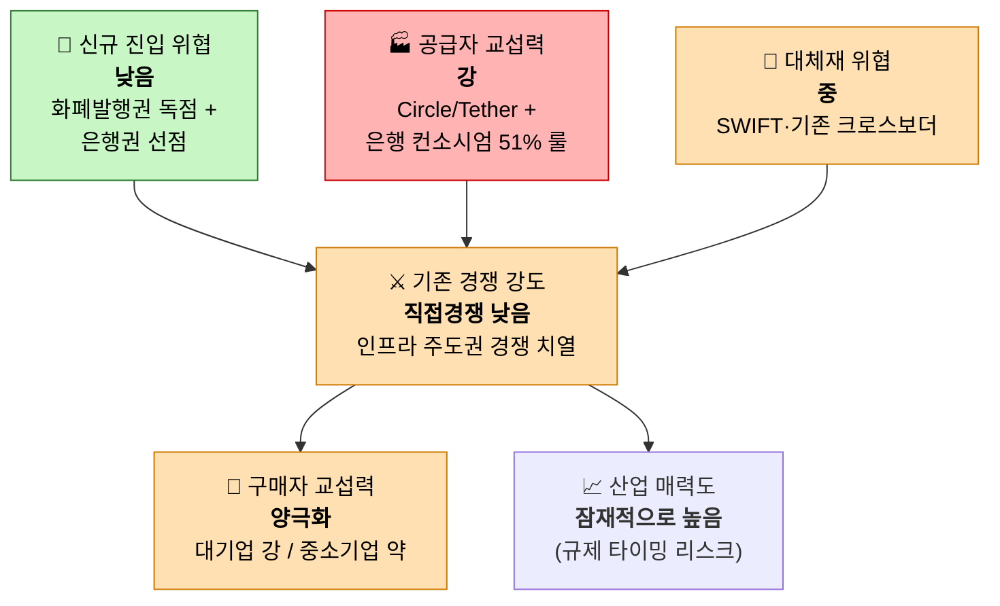

# Area B - 수출입 기업을 위한 달러-원화 스테이블코인 환전/정산 B2B 서비스

대상: 무역대금 결제 과정에서 USDC/USDT 등 달러 스테이블코인을 원화(또는 원화 스테이블코인)로 환전·정산해주는 B2B 서비스 — 하나금융·두나무 컨소시엄, 유니카(UniKA), 헥토파이낸셜 등이 준비 중인 영역

## 한눈에 보기

## 5가지 힘 요약표

| 힘 | 강도 | 핵심 근거 |
|---|---|---|
| 공급자 교섭력 | 🟥 강 | Circle(USDC)/Tether 소수 발행사 + 은행 컨소시엄 "51% 룰" |
| 구매자 교섭력 | 🟧 양극화 | 대기업은 컨소시엄 직접 참여, 중소기업은 접근성 제약(홍콩 우회) |
| 신규 진입 위협 | 🟩 낮음 | 헌법상 화폐발행권 독점(한국은행) + 은행권 선점 |
| 대체재 위협 | 🟧 중 | SWIFT·Wise·모인 등, 단 비용·속도 열위 |
| 기존 경쟁 강도 | 🟧 직접경쟁 낮음 / 인프라경쟁 치열 | 상용서비스 부재(pilot), 은행 vs 빅테크 주도권 경쟁 |

## 1. 공급자 교섭력 — **강**

- 달러 스테이블코인 발행이 Circle(USDC)·Tether(USDT) 소수 업체에 집중. 2026년 1분기 전체 스테이블코인 공급량은 3,150억 달러로 사상 최고치이며, USDC는 조정거래량 기준 2019년 이후 최초로 USDT를 추월(약 64% 점유).
- 원화 쪽은 구조적으로 더 강한 공급자 의존이 설계되고 있음: 한국은행이 원화 스테이블코인 발행 시 은행 컨소시엄 지분 51% 이상을 요구하는 "51% 룰"을 밀고 있어, 발행 인프라 자체가 은행 중심으로 고정될 가능성이 큼.
- 이미 은행권이 컨소시엄으로 선점 경�과 중: 하나금융(BNK·iM금융·SC제일은행·OK저축은행 + 두나무 기술기반) vs 신한·우리·NH농협 등 10여 개 은행 연합 "유니카(UniKA)".

**판단**: 발행사(Circle/Tether)와 국내 은행 컨소시엄이라는 이중의 소수 공급자 구조 → 강.

## 2. 구매자 교섭력 — **양극화 (대기업 강 / 중소기업 약하지만 니즈 매우 큼)**

- 대기업(삼성전자 등)은 비자·블랙록 스테이블코인 이니셔티브에 신한금융·두나무와 함께 직접 참여해 표준 설계 단계부터 관여 — 협상력이 사실상 공급자 수준.
- 중소기업은 반대로 법인 실명계좌 기반 가상자산거래소 이용이 막혀 있어, 홍콩 현지법인이나 해외 파트너사를 거쳐 스테이블코인을 현금화한 뒤 달러로 송금하는 우회 구조를 쓰고 있음 — 접근성 자체가 제약된 상태.
- 그럼에도 "결제지연·환전비용·증빙부담"을 해소하려는 중소기업의 니즈는 명확하게 존재 — 이는 서비스가 이 니즈를 풀어줄 경우 락인(lock-in) 효과가 클 수 있다는 뜻.

**판단**: 세그먼트별로 힘의 크기가 완전히 다름 — 대기업은 강한 협상력, 중소기업은 낮은 협상력이지만 미충족 수요가 크다는 점이 전략적으로 중요.

## 3. 신규 진입자의 위협 — **낮음**

- 헌법상 화폐발행권이 한국은행에 독점되어 있어 민간의 원화 스테이블코인 발행은 현재 사실상 금지 상태. 과거 블록체인 기업들의 시도는 모두 규제로 무산됨.
- 신규 법안(디지털자산기본법)에서도 자본금 요건이 50억~250억 원 범위로 논의되고 있고, 재무건전성·내부통제·전문인력·보안 요건이 추가될 예정.
- 은행권이 이미 하나금융 SPC, 유니카 등 다수 컨소시엄을 결성해 시장을 선점 중이며 "쏠림 현상"까지 보도됨 — 즉, 법적 장벽과 선점 효과가 동시에 작동.

**판단**: 규제 장벽 + 은행권 선점이 겹쳐 신규 진입이 매우 어려움 → 낮음. (이는 먼저 자리 잡는 플레이어에게는 매우 유리한 조건.)

## 4. 대체재의 위협 — **중**

- 기존 크로스보더 결제/송금 서비스(SWIFT, Wise, 토스, 센트비, 모인 "비즈플러스", 유트랜스퍼Biz 등)가 이미 활발히 경쟁 중이며, 모인 비즈플러스는 은행 대비 최대 90% 저렴·4배 빠른 기업용 해외송금을 표방.
- 다만 이들 서비스가 스테이블코인을 직접 결합했다는 증거는 아직 확인되지 않음 — 즉 현재는 "구세대 대체재"이지만, 향후 이들이 스테이블코인을 흡수하면 경쟁자로 전환될 가능성이 있음.
- 비용/속도 비교: 스테이블코인은 초~3분 내 정산·수수료 1% 이하, SWIFT는 1~5영업일·건당 25~50달러 또는 총비용 2~7% — 스테이블코인이 상당한 비용/속도 우위를 가짐(일반 크로스보더 기준 자료, 무역금융 특화 통계는 아님).

**판단**: 대체재가 존재하고 경쟁력도 있지만, 스테이블코인 대비 비용/속도 열위가 뚜렷 → 중.

## 5. 산업 내 경쟁 강도 — **낮음(직접 경쟁) / 치열함(인프라 주도권 경쟁)**

- 원화-달러 스테이블코인 B2B 무역정산이라는 특정 니치는 아직 상용 서비스가 없는 파일럿(검증) 단계 — 유니카·판게아 프로젝트 모두 "검증 프로젝트"로 명시됨. 직접적인 고객 쟁탈 경쟁은 아직 벌어지지 않았다.
- 반대로 발행·유통·인프라 역할을 누가 쥘 것인가를 둘러싼 경쟁은 이미 치열함: "은행 vs 빅테크" 구도로 하나금융·두나무·네이버파이낸셜 연합과 신한·우리·NH 등 유니카 연합이 대립.
- 헥토파이낸셜(무역대금 해외정산 고객사 2023년 6개 → 현재 40개 이상, 연 200%대 성장)처럼 인접 영역에서 이미 실적을 쌓은 뒤 스테이블코인 정산으로 확장을 준비하는 플레이어도 존재.

**판단**: 최종 고객 대상 경쟁은 아직 시작 전이지만, 인프라·라이선스 주도권 경쟁이 매우 치열해 "누가 먼저 표준을 잡는가"가 향후 시장 구조를 결정할 것으로 보임.

---

## 종합 평가

**산업 매력도**: 잠재적으로 높음, 단 규제 타이밍 리스크가 큼. 신규 진입 장벽이 매우 높다는 것은 먼저 자리 잡으면 방어력이 강하다는 뜻이지만, 동시에 민간 발행이 "사실상 금지"인 현재 상태에서는 시장 진입 자체가 법 통과 시점에 종속된다. 은행 컨소시엄 중심으로 공급 구조가 고정되고 있어, 독립 핀테크가 들어가려면 은행 컨소시엄의 파트너(기술·인프라 제공자)로 포지셔닝하는 전략이 현실적이다. 중소기업 세그먼트의 미충족 수요(결제 지연·환전비용·증빙부담)가 명확하다는 점은 규제가 풀렸을 때 빠르게 치고 나갈 수 있는 근거가 된다.
