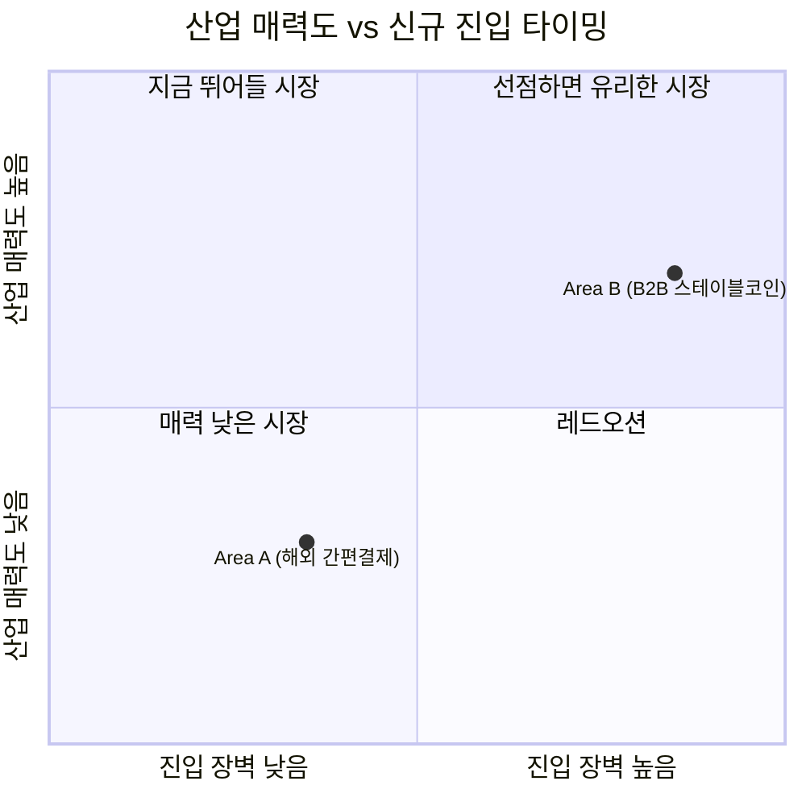

# 비교 분석: 해외 간편결제(Area A) vs B2B 스테이블코인 무역정산(Area B)

## 5가지 힘 비교표

| 힘 | Area A: 해외 간편결제 | Area B: B2B 스테이블코인 무역정산 |
|---|---|---|
| 공급자 교섭력 | 중~강 (Visa·Mastercard 2강 체제) | 강 (Circle/Tether + 은행 컨소시엄 51% 룰) |
| 구매자 교섭력 | 강 (전환비용 0, 무료환전 표준화) | 양극화 (대기업 강 / 중소기업 약하지만 니즈 큼) |
| 신규 진입 위협 | 중 (법적 장벽 있으나 제휴로 우회 가능) | 낮음 (헌법상 발행권 독점 + 은행권 선점) |
| 대체재 위협 | 강 (신용카드가 오히려 재부상) | 중 (SWIFT·기존 크로스보더가 비용/속도 열위) |
| 경쟁 강도 | 매우 강 (양강 + 다수 후발주자 혜택 경쟁) | 낮음(직접) / 치열함(인프라 주도권) |
| **산업 단계** | **성숙기 ~ 레드오션** | **초기(pilot) 단계, 규제 대기 중** |
| **산업 매력도** | 낮음 ~ 중간 | 잠재적으로 높음 (타이밍 리스크 동반) |

## 매력도 x 진입 타이밍 지도

Area A는 진입 장벽이 낮고 매력도도 낮은 "레드오션" 구역에, Area B는 진입 장벽이 매우 높고 잠재 매력도가 큰 "선점하면 유리한 시장" 구역에 위치한다.

## 핵심 차이: "이미 결정된 시장" vs "아직 결정되지 않은 시장"

Area A는 다섯 가지 힘이 거의 모든 축에서 기업에 불리하게 작동한다. 구매자는 자유롭게 갈아타고, 대체재(신용카드)는 오히려 더 매력적으로 재부상하고 있으며, 이미 대형 카드사·핀테크가 총출동해 무료환전·캐시백으로 마진을 깎아내는 중이다. 성장률(트래블월렛 3년 315%)은 높지만, 그 성장의 과실 대부분이 경쟁 속에서 소비자·가맹점에게 돌아가는 구조다. **"타이밍"으로 보면 이미 늦었고, 남은 전략은 저비용 경쟁이 아니라 특정 세그먼트 집중화뿐이다.**

Area B는 정반대다. 신규 진입 장벽이 헌법 수준(화폐발행권 독점)으로 극단적으로 높고, 상용 서비스가 아직 없는 파일럿 단계라 직접적인 경쟁이 존재하지 않는다. 대신 "누가 인프라·라이선스를 먼저 쥐는가"를 둘러싼 컨소시엄 간 주도권 경쟁이 지금 벌어지고 있다. 이는 일반 스타트업이 진입하기는 거의 불가능하지만, **법이 통과되는 시점에 이미 파트너십을 맺어둔 소수의 플레이어에게는 매우 높은 수익성이 열리는 구조**라는 뜻이다.

## 전략적 시사점

1. **Area A**: 신규 진입/신규 투자 매력도는 낮다. 이미 대형 카드사·핀테크가 장악한 성숙 시장에서 저비용 경쟁으로는 생존이 어렵고, 특정 여행지·소비 채널에 집중한 차별화(집중화 전략)만이 현실적 선택지다.
2. **Area B**: "지금 뛰어드는 것"이 아니라 "지금 자리를 잡아두는 것"이 전략의 핵심이다. 직접 발행 라이선스를 노리기보다, 은행 컨소시엄(하나금융 SPC, 유니카)의 기술·정산 파트너로 포지셔닝하거나, 중소기업의 미충족 수요(결제 지연·환전비용·증빙부담)를 해결하는 애플리케이션 레이어에서 준비해두는 것이 현실적이다.
3. **적시성 관점**: Area A는 "너무 늦은 타이밍"이고 Area B는 "너무 이른 타이밍처럼 보이지만 실제로는 지금이 관계를 구축해야 할 시점"이다. 포터의 5가지 힘 분석은 이렇게 "지금 뛰어들 시장"과 "미리 자리를 잡아둘 시장"을 구분하는 데 유용하다는 것을 이 비교가 보여준다.

## 남은 한계 (추가 검증 필요)

- Area B의 시장 규모/잠재력은 한국 수출입 총액(2025년 7,097억 달러)이라는 상한선만 확인되었고, 무역금융 시장 자체의 구체적 규모나 스테이블코인 전환 가능 비율에 대한 공식 통계는 확인하지 못했다 (한국은행·금감원 자료로 추가 확인 필요).
- 디지털자산기본법의 실제 통과 시점과 "51% 룰"의 최종 확정 여부가 Area B 전체 시나리오의 전제가 되므로, 법안 진행 상황을 주기적으로 재점검해야 한다.
