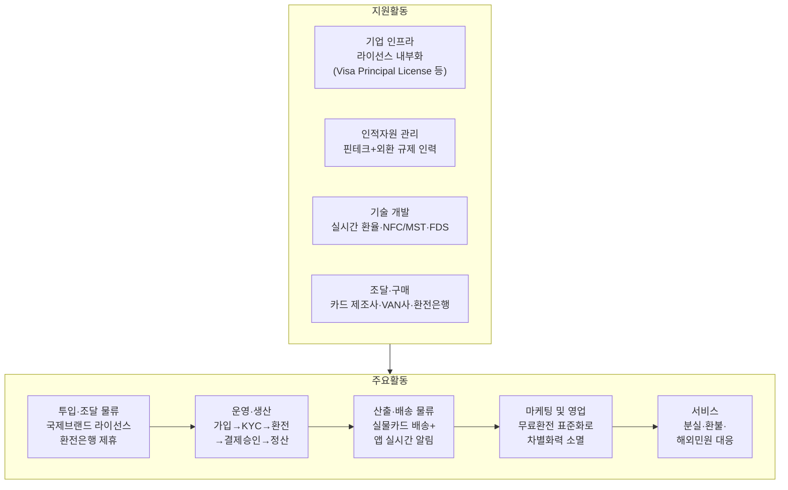

# Area A - 해외 간편결제/여행자 결제 서비스 가치사슬 분석

대상: 트래블월렛·하나 트래블로그류의 트래블카드 서비스 (Porter's Five Forces 분석과 동일 대상)

## 한눈에 보기

**핵심 요약**: 가치사슬 전체가 이미 확립되어 있어 구조를 바꿀 여지가 적고, 남은 경쟁우위는 **투입·조달 물류(라이선스 내부화)** 와 **운영(결제 안정성)** 두 지점에 집중되어 있다.

## 1. 주요활동

### 투입·조달 물류 (Inbound Logistics)

| 유형 | 질문 | 답변 |
|---|---|---|
| 🏗️ 설계 | 서비스 제공에 필요한 핵심 투입자원은 무엇인가? | 국제브랜드 라이선스(Visa/Mastercard), 환전은행·외국환업무 허가, 실시간 환율 데이터, 실물 카드 제조·발급 인프라, 고객 KYC 데이터 |
| 🏗️ 설계 | 어떤 기술·데이터는 자체 확보하고, 어떤 기능은 외부 제휴로 확보할 것인가? | 트래블월렛은 Visa Principal License·전자금융업·환전업 허가를 직접 취득해 내부화; 트래블로그는 하나은행의 기존 외환·카드 인프라를 그대로 활용(제휴형) |
| 🚀 개선 | 특정 금융회사·데이터 공급자에 대한 의존도를 줄일 수 있는가? | 마스터카드 한 축에 쏠린 국제브랜드 의존은 구조적으로 낮추기 어려움 — 라이선스 내부화(트래블월렛 방식)가 유일한 현실적 완화 경로 |
| 🚀 개선 | 외부에서 수신하는 금융데이터의 정확성·최신성을 어떻게 높일 것인가? | 실시간 환율 데이터의 지연시간이 "환율우대 100%" 약속의 신뢰도를 직접 좌우하므로 환율 피드 이중화 등이 필요 |

### 운영·생산 (Operations)

| 유형 | 질문 | 답변 |
|---|---|---|
| 🏗️ 설계 | 가입→본인확인→거래 실행 흐름을 어떻게 설계할 것인가? | 가입 → 비대면 KYC → 앱 내 원화 충전 → 실시간 환전 → 해외 가맹점 결제 승인 → 정산 |
| 🏗️ 설계 | 거래량이 급증해도 안정적으로 처리할 수 있는가? | 성수기(여행 시즌) 거래량 급증에 대비한 시스템 안정성이 핵심 과제이며, 충전·환전 단계에서 FDS·AML이 자동 작동 |
| 🚀 개선 | 결제 성공률, 인증 성공률을 어떻게 높일 것인가? | 해외 가맹점의 다양한 결제 단말 환경(오프라인/온라인)에서 승인 실패율을 낮추는 것이 경쟁력의 핵심 |
| 🚀 개선 | 부정거래 탐지율을 높이면서 정상거래 오탐을 줄일 수 있는가? | 공개된 오탐률 데이터는 없으나, FDS 고도화가 지속적 개선 과제로 남아있음 (추가 확인 필요) |

### 산출·배송 물류 (Outbound Logistics)

| 유형 | 질문 | 답변 |
|---|---|---|
| 🏗️ 설계 | 고객은 거래 결과를 어떤 채널로 전달받는가? | 앱 푸시·거래내역·환율 고시 화면 + **실물 카드 배송**(물리적 아웃바운드)이라는 이례적 조합 — 일반 디지털 금융서비스와의 차이점 |
| 🏗️ 설계 | 앱·메신저·푸시 등 채널의 역할을 어떻게 구분할 것인가? | 해외 사용 중 실시간 잔액·환율 변동 확인 UX가 핵심, 초기 온보딩 경험은 실물카드 배송 리드타임이 좌우 |
| 🚀 개선 | 장애 발생 시 현재 상태와 다음 조치를 안내할 수 있는가? | 해외 로밍 상태에서 데이터 로밍 미설정 시 푸시 누락 문제 등이 개선 여지로 지적됨 |
| 🚀 개선 | 중복되거나 과도한 알림을 줄일 수 있는가? | 공개 데이터 없음 — 실물카드 배송 지연 관리가 우선 개선 과제로 판단 (추가 확인 필요) |

### 마케팅 및 영업 (Marketing & Sales)

| 유형 | 질문 | 답변 |
|---|---|---|
| 🏗️ 설계 | 핵심 고객은 누구인가? | 핵심 고객은 해외여행객(개인); 가맹점·제휴사(CJ ONE, 면세점, 항공사, GS25)는 접점 확장 수단 |
| 🏗️ 설계 | 편리함뿐 아니라 신뢰·안전·가격·혜택을 어떻게 전달할 것인가? | "무료환전(환율우대 100%)"이 핵심 후킹 메시지였으나 업계 전반의 표준값이 되며 차별화력이 감소 |
| 🚀 개선 | 프로모션 종료 이후에도 고객이 남는가? | 여행 시즌 외 상시 소비(온라인 해외직구 등)로 사용처를 확장할 수 있는지가 재방문율의 관건 |
| 🚀 개선 | 고객 추천과 바이럴 유입이 장기 고객으로 전환되는가? | 카드 발급 자체를 추천 이벤트로 유도하는 바이럴 전략이 현재 주된 확산 방식 |

### 서비스 (Service)

| 유형 | 질문 | 답변 |
|---|---|---|
| 🏗️ 설계 | 결제 실패·송금 오류·환불 지연을 어떻게 처리할 것인가? | 분실·도난 신고, 결제 오류·환불, 이중결제·환율 분쟁 민원이 핵심 서비스 영역 |
| 🏗️ 설계 | 자동상담과 전문상담원의 역할을 어떻게 구분할 것인가? | 해외 현지에서 문제가 발생하는 특성상 다국어·24시간 대응 체계와 챗봇 셀프서비스의 비중이 중요 |
| 🚀 개선 | 반복 문의를 제품 자체의 개선으로 제거할 수 있는가? | 환율 계산 방식, 해외 ATM 수수료 조건 등 반복 문의를 앱 내 정보 제공으로 사전 해소해 상담 비용을 줄일 수 있음 |
| 🚀 개선 | 상담 채널이 바뀌어도 고객 맥락이 유지되는가? | 공개 데이터 없음 — 옴니채널 맥락 유지 여부는 추가 확인 필요 |

## 2. 지원활동

### 기업 인프라 (Firm Infrastructure)

| 유형 | 질문 | 답변 |
|---|---|---|
| 🏗️ 설계 | 전자금융업·환전업을 어떤 법인이 담당할 것인가? | 트래블월렛(독립 핀테크, 다중 라이선스 직접 확보) vs 하나카드/트래블로그(기존 은행 계열 사업부 형태) |
| 🚀 개선 | 준법·보안 조직이 제품설계 초기부터 참여하는가? | 다중 라이선스 전략(트래블월렛)은 규제 대응 부담이 크지만, 공급자 의존도를 낮추는 효과로 이어짐 |

### 인적자원 관리 (HRM)

| 유형 | 질문 | 답변 |
|---|---|---|
| 🏗️ 설계 | 금융 전문성과 소프트웨어 제품개발 역량을 어떻게 결합할 것인가? | 카드사 계열은 기존 조직의 규제 대응력을 활용, 독립 핀테크(트래블월렛)는 이 역량을 처음부터 구축해야 함 |
| 🚀 개선 | 특정 인력에게 지식과 권한이 집중되어 있지 않은가? | 공개 데이터 없음 — 추가 확인 필요 |

### 기술 개발 (Technology Development)

| 유형 | 질문 | 답변 |
|---|---|---|
| 🏗️ 설계 | 핵심 경쟁력을 만드는 기술은 무엇인가? | 실시간 환율 연동 시스템, NFC/MST 결제 기술, 이상거래 탐지(FDS) 모델 |
| 🚀 개선 | 서비스별 중복개발을 줄이고 재사용률을 높일 수 있는가? | 애플페이(NFC 전용)와 삼성페이(MST+NFC 겸용)의 단말기 호환성 차이가 실제 결제 성공률에 직접 영향을 줌 |

### 조달·구매 (Procurement)

| 유형 | 질문 | 답변 |
|---|---|---|
| 🏗️ 설계 | 공급자를 가격뿐 아니라 보안·가용성 기준으로 평가하는가? | 카드 실물 제조·발급사, VAN사, 환전은행, 클라우드 인프라가 핵심 조달 대상 |
| 🚀 개선 | 구매 규모 증가에 따라 단가와 SLA를 개선할 수 있는가? | 국제브랜드(비자·마스터카드) 협상력은 구매 규모가 커질수록 개선되지만, 소수 브랜드 독점 구조상 근본적 개선은 제한적 |

---

## 요약: 가치가 만들어지는 지점

이 산업의 가치는 "① 라이선스·제휴 확보(투입) → ② 안정적이고 빠른 환전·결제 처리(운영) → ③ 마케팅 혜택을 통한 신규 고객 유치"의 순환에서 만들어진다.
다만 무료환전·캐시백이 업계 표준이 되며 **마케팅 및 영업 단계에서의 차별화력이 소멸**되고 있다.
실질적인 경쟁우위는 라이선스 내부화(투입·조달 물류)와 결제 안정성(운영)에서만 확보 가능한 상태다.
