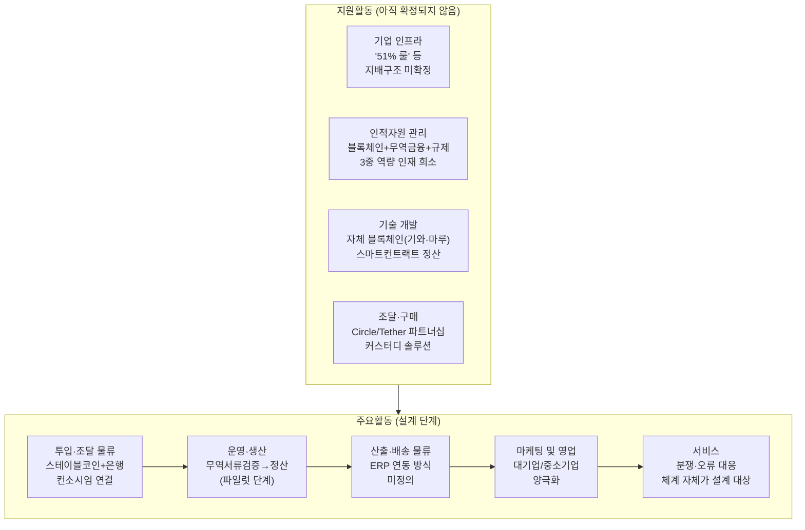

# Area B - B2B 스테이블코인 무역정산 서비스 가치사슬 분석

대상: 하나금융·두나무 컨소시엄, 유니카(UniKA) 등이 준비 중인 달러-원화 스테이블코인 기반 무역대금 정산 서비스 (Porter's Five Forces 분석과 동일 대상)

## 한눈에 보기

**핵심 요약**: 다섯 개 활동 모두 "어떻게 설계할 것인가"에 머물러 있으며, 특히 **기업 인프라(지배구조)** 가 확정되지 않으면 나머지 활동을 설계하기 어렵다는 것이 이 산업의 특징이다.

## 1. 주요활동

### 투입·조달 물류 (Inbound Logistics)

| 유형 | 질문 | 답변 |
|---|---|---|
| 🏗️ 설계 | 서비스 제공에 필요한 핵심 투입자원은 무엇인가? | 달러 스테이블코인(USDC/USDT) 접근 경로, 은행 컨소시엄 기반 원화 스테이블코인 발행 인프라, 기업실사(KYB) 데이터, 무역서류(신용장·인보이스·선하증권) 연동 |
| 🏗️ 설계 | 금융회사가 플랫폼에 참여할 유인은 무엇인가? | 하나금융 컨소시엄은 발행(하나은행)·유통(업비트)·결제인프라(네이버파이낸셜)·기술기반(두나무 "기와")으로 역할을 분담해 각자의 강점을 투입 |
| 🚀 개선 | 특정 발행사·컨소시엄에 대한 의존도를 줄일 수 있는가? | 이 시장은 상용화 전이라 "설계" 질문이 곧 "개선" 질문 — Circle/Tether 및 은행 컨소시엄 의존도를 낮추는 것이 현재 컨소시엄 간 경쟁의 실질 쟁점 |
| 🚀 개선 | 외부 API·인프라 장애에 대비한 대체 경로가 있는가? | 아직 파일럿 단계라 대체 경로 자체가 설계되지 않음 (추가 확인 필요) |

### 운영·생산 (Operations)

| 유형 | 질문 | 답변 |
|---|---|---|
| 🏗️ 설계 | 고객 요청을 실제 금융 가치로 변환하는 핵심 처리과정은 무엇인가? | 무역서류 검증 → 스테이블코인 수령 → 원화 환전/정산 → AML·CFT 심사 → 기업 계좌 입금 |
| 🏗️ 설계 | 거래량이 급증해도 안정적으로 처리할 수 있는가? | 파일럿(검증) 단계로 실거래 처리 안정성은 아직 검증되지 않음 |
| 🚀 개선 | 처리시간과 수동처리 비율을 줄일 수 있는가? | 스마트컨트랙트 기반 자동정산(해시드오픈파이낸스 "마루" 사례)으로 수동 대사 업무를 줄이는 것이 핵심 개선 축 |
| 🚀 개선 | 빠른 배포와 거래 안정성을 동시에 확보할 수 있는가? | 공개 데이터 없음 — 상용화 이후 검증 필요 (추가 확인 필요) |

### 산출·배송 물류 (Outbound Logistics)

| 유형 | 질문 | 답변 |
|---|---|---|
| 🏗️ 설계 | 가맹점·금융 파트너에게 필요한 정보는 어떤 방식으로 제공할 것인가? | 정산 결과를 기업 회계·ERP 시스템에 API로 연동 + 블록체인 특유의 투명성(온체인 트랜잭션 추적)을 정산 증빙으로 활용 |
| 🚀 개선 | 복잡한 정보를 비교·증빙 가능한 형태로 제공할 수 있는가? | 무역서류상 요구되는 회계·세무 증빙 형식과 블록체인 트랜잭션 기록 사이의 간극을 메우는 것이 실제 상용화의 관문 |

### 마케팅 및 영업 (Marketing & Sales)

| 유형 | 질문 | 답변 |
|---|---|---|
| 🏗️ 설계 | 핵심 고객은 누구인가? | 대기업(비자·블랙록 컨소시엄에 직접 참여해 표준설계 단계부터 관여) vs 중소기업(법인 계좌 기반 거래소 이용이 막혀 홍콩 우회 등 비정상 경로 사용) |
| 🚀 개선 | 광고·추천과 객관적 정보 제공 사이의 이해상충을 어떻게 관리할 것인가? | 무역대금은 개인 소비 대비 리스크 허용도가 낮아, "속도·비용 절감"보다 은행 컨소시엄이 보증하는 "신뢰·규제준수" 메시지가 우선될 가능성이 높음 |

### 서비스 (Service)

| 유형 | 질문 | 답변 |
|---|---|---|
| 🏗️ 설계 | 금융사고 발생 시 조사·보상·재발방지를 어떻게 수행할 것인가? | 아직 상용 서비스가 없어 설계 단계이며, 분쟁 발생 시 법적 책임 소재(발행사/은행/플랫폼 중 누구인가)가 먼저 정의되어야 함 |
| 🚀 개선 | 반복 문의를 제품 자체의 개선으로 제거할 수 있는가? | 공개 데이터 없음 — 상용화 이후 확인 필요 |

## 2. 지원활동

### 기업 인프라 (Firm Infrastructure)

| 유형 | 질문 | 답변 |
|---|---|---|
| 🏗️ 설계 | 이사회·리스크관리·준법감시의 역할은 무엇인가? | 한국은행의 "51% 룰"(원화 스테이블코인 발행 시 은행 컨소시엄 지분 51% 이상 요구)이 지배구조를 근본적으로 결정하며, 발행-유통 기능의 분리 여부도 아직 미결 |
| 🚀 개선 | 법인과 조직이 늘어나며 책임이 분산되고 있지 않은가? | 하나금융 SPC vs 유니카(UniKA) 두 컨소시엄의 경쟁 구도 자체가 아직 유동적이라 책임 소재도 함께 유동적 |

### 인적자원 관리 (HRM)

| 유형 | 질문 | 답변 |
|---|---|---|
| 🏗️ 설계 | 필요한 인재는 누구인가? | 블록체인 엔지니어, 무역금융 전문가, AML/규제 대응 인력이라는 세 축의 결합이 필요 |
| 🚀 개선 | 특정 인력에게 지식과 권한이 집중되어 있지 않은가? | 이 조합을 갖춘 인재가 매우 희소해 은행권·빅테크 간 확보 경쟁이 예상되며, 집중 위험이 구조적으로 내재 |

### 기술 개발 (Technology Development)

| 유형 | 질문 | 답변 |
|---|---|---|
| 🏗️ 설계 | 핵심 경쟁력을 만드는 기술은 무엇인가? | 두나무의 자체 블록체인 "기와(GIWA)", 해시드오픈파이낸스의 "마루(Maroo)" 같은 자체 인프라, 스마트컨트랙트 기반 자동정산 |
| 🚀 개선 | API 변경에 따른 파트너 비용을 최소화할 수 있는가? | 온체인-오프체인 데이터 연동, 다중서명 커스터디가 핵심 기술 과제로 남아있음 |

### 조달·구매 (Procurement)

| 유형 | 질문 | 답변 |
|---|---|---|
| 🏗️ 설계 | 필요한 클라우드·보안·인증 솔루션은 무엇인가? | Circle(USDC)·Tether(USDT) 같은 스테이블코인 발행사와의 파트너십, 커스터디 솔루션, 블록체인 감사기관 |
| 🚀 개선 | 핵심 공급자에 대한 대안과 전환계획이 있는가? | 헥토파이낸셜처럼 기존 무역대금 해외정산 사업(고객사 40개 이상, 연 200%대 성장)에서 구축한 조달망을 스테이블코인 정산으로 확장하려는 시도가 관찰됨 |

---

## 요약: 가치가 만들어지는 지점

이 산업은 아직 "가치사슬이 설계되는 중"인 단계다.
가장 큰 가치는 **기업 인프라(누가 발행·유통 라이선스를 쥐는가)** 와 **투입·조달 물류(어떤 컨소시엄·기술 파트너와 연결되는가)** 에서 결정된다.
운영·마케팅·서비스는 아직 규제가 확정되지 않아 설계조차 유동적이다.
즉 Area A와 달리 이 산업에서는 **"어디에 먼저 자리를 잡는가"가 가치사슬 전체의 승부를 가른다.**
