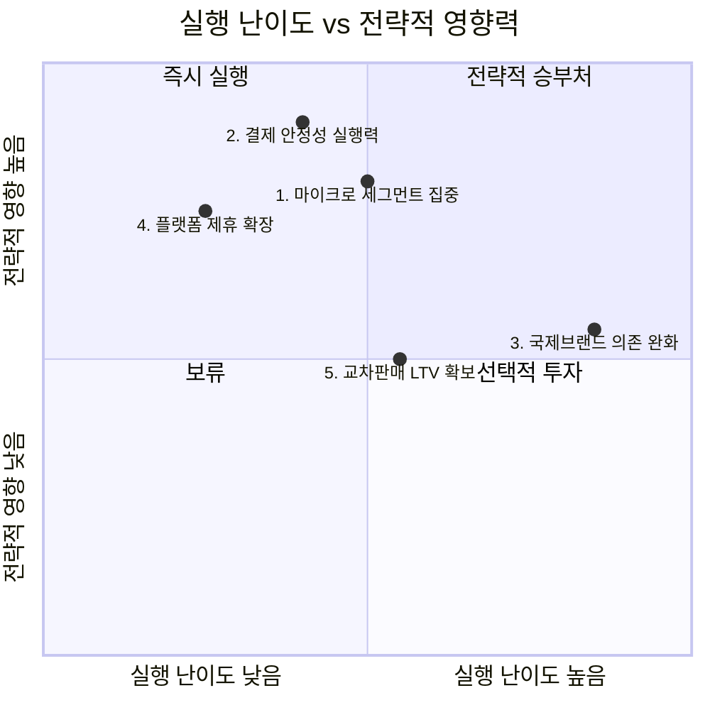

# 신규 진입자를 위한 Top 5 핵심 성공 요인 — Area A: 해외 간편결제/여행자 결제 서비스

## 우선순위 지도

이 시장은 이미 다섯 가지 힘 대부분이 신규 진입자에게 불리하게 작동하는 성숙~레드오션 국면이다.
따라서 KSF의 초점은 "어떻게 시장 전체와 싸우지 않고 이길 것인가"에 맞춰야 한다.

## Top 5 핵심 성공 요인

### 1. 마이크로 세그먼트 집중 전략 (Niche Segmentation)

무료환전과 캐시백은 더 이상 차별화 요소가 아니라 업계 전체의 기본값이 되었다.
Five Forces 분석은 구매자 교섭력을 "강"으로 판정했는데, 그 근거가 바로 "무료환전이 트래블월렛·트래블로그·토스뱅크·하나카드 등 업계 전반의 기본값이 되어 더 이상 차별화 요소가 아님"이라는 사실이다.
가치사슬 분석 역시 마케팅 및 영업 단계에서 "무료환전 표준화로 차별화력 소멸"을 이 산업의 핵심 요약으로 명시했다.
전체 시장을 상대로 가격·혜택 경쟁을 벌이면 트래블월렛(시장점유율 40%)과 트래블로그(가입자 700만)라는 양강 및 신한·KB·우리·토스뱅크 후발주자의 자원 경쟟에 그대로 노출된다.
따라서 신규 진입자는 특정 여행지, 특정 소비 채널(예: 특정 국가의 특정 가맹점 생태계) 등 좁고 명확한 세그먼트에 자원을 집중해야 한다.

### 2. 결제 안정성 실행력 (Operational Excellence in Payment Processing)

가치사슬 분석의 운영·생산 활동은 "해외 가맹점의 다양한 결제 단말 환경(오프라인/온라인)에서 승인 실패율을 낮추는 것이 경쟁력의 핵심"이라고 명시한다.
동시에 Five Forces 분석은 대체재 위협을 "강"으로 판정했는데, 근거는 "일반 신용카드 해외결제가 다시 강력한 대체재로 부상"하고 있다는 점이다.
이 두 사실을 연결하면 결론은 명확하다.
결제가 한 번이라도 실패하면 고객은 즉시 신용카드로 이탈할 수 있는 대체재를 이미 손에 쥐고 있다.
따라서 결제 승인 성공률과 환전 처리 지연시간을 업계 최상위 수준으로 관리하는 실행력이, 무료환전이라는 소멸된 차별화 요소를 대신할 유일한 신뢰 기반 경쟟우위다.

### 3. 국제브랜드 의존 완화를 위한 라이선스 내부화 (License Internalization)

Five Forces 분석은 공급자 교섭력을 "중~강"으로 판정하며, 그 근거로 마스터카드 비중이 2020년 25.1%에서 2025년 39.3%까지 확대된 국제브랜드 2강 체제를 지목한다.
가치사슬 분석의 투입·조달 물류 활동은 이 문제에 대한 유일한 현실적 해법을 이미 제시한다.
"트래블월렛은 Visa Principal License·전자금융업·환전업 허가를 직접 취득해 내부화"했으며, 이는 "공급자 힘을 낮추는 전략적 대응 사례"로 명시되어 있다.
반면 트래블로그처럼 기존 은행 인프라에 의존하는 제휴형 모델은 국제브랜드의 가격 결정력에 그대로 노출된다.
따라서 신규 진입자는 초기 비용이 크더라도 라이선스를 직접 확보하는 경로를 검토해야 하며, 이것이 장기적인 원가 구조의 승부처가 된다.

### 4. 플랫폼 제휴 기반 저비용 가맹점 확장 (Platform Partnership for Merchant Access)

Five Forces 분석은 신규 진입 위협을 "중"으로 판정하면서, 법적 장벽(자본금 요건)이 있음에도 "제휴 기반 진입 경로가 열려 있어 신규 진입이 계속 관찰됨"을 근거로 든다.
구체적 증거는 "카카오페이가 알리페이+(Ant Group) 네트워크에 연동해 자체 해외 가맹점 인프라 구축 없이 전 세계 1.5억 개 가맹점에 접근"한 사례다.
가치사슬 관점에서 이는 투입·조달 물류 단계의 막대한 인프라 투자 부담을 제휴 계약 하나로 우회한 것과 같다.
신규 진입자에게 자체 가맹점망 구축은 현실적으로 불가능한 자원 요건이므로, 이미 검증된 글로벌 결제 네트워크와의 제휴가 시장 진입 자체를 가능하게 하는 전제 조건이 된다.

### 5. 교차판매를 통한 고객생애가치(LTV) 확보 (Cross-sell to Financial Products)

가치사슬 분석의 마케팅 및 영업 활동은 개선 질문으로 "프로모션 종료 이후에도 고객이 남는가?"를 던지며, "여행 시즌 외 상시 소비로 사용처를 확장할 수 있는지가 재방문율의 관건"이라고 답한다.
이 시장의 근본적 약점은 소비가 여행이라는 특정 이벤트에 묶여 있어 시즌성이 강하다는 점이다.
Five Forces 분석이 확인한 "구매자 교섭력 강"(낮은 전환비용, 자유로운 멀티호밍) 상황에서는 이 시즌 소비가 끝나는 순간 고객이 다른 서비스로 이탈할 위험이 크다.
따라서 신규 진입자는 트래블카드를 단독 상품이 아니라 자산관리·환전·해외소비 데이터를 매개로 한 교차판매 채널로 설계해, 여행이 끝난 뒤에도 관계가 지속되는 고객생애가치 구조를 만들어야 한다.

---

## 종합: 선택과 집중의 순서

한정된 자원을 가진 신규 진입자라면, **4번(플랫폼 제휴)** 로 저비용 진입 기반을 먼저 마련하고, **2번(결제 안정성)** 으로 신뢰를 확보한 뒤, **1번(마이크로 세그먼트)** 으로 실제 차별화를 만들어야 한다.
**3번(라이선스 내부화)** 은 자본이 뒷받침될 때 승부수로 던질 항목이며, **5번(교차판매)** 은 앞의 네 가지가 자리 잡은 뒤 장기 수익성을 지키기 위한 다음 단계다.
