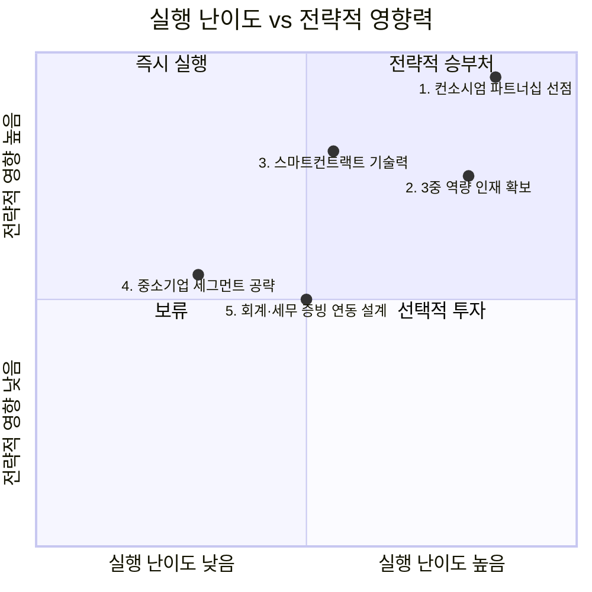

# 신규 진입자를 위한 Top 5 핵심 성공 요인 — Area B: B2B 스테이블코인 무역정산 서비스

## 우선순위 지도

이 시장은 신규 진입 장벽이 헌법 수준(화폐발행권 독점)으로 극단적으로 높고, 가치사슬 전체가 아직 설계되는 중인 초기 시장이다.
따라서 KSF의 초점은 "어떻게 지금 아직 정해지지 않은 구조에 올라탈 것인가"에 맞춰야 한다.

## Top 5 핵심 성공 요인

### 1. 은행 컨소시엄 파트너십 선점 (Early Consortium Partnership)

Five Forces 분석은 신규 진입 위협을 "낮음"으로 판정하며, 그 근거로 "헌법상 화폐발행권이 한국은행에 독점되어 있어 민간의 원화 스테이블코인 발행은 현재 사실상 금지 상태"라는 사실을 든다.
가치사슬 분석의 기업 인프라 활동은 이를 더 직접적으로 못박는다.
"'51% 룰' 등 지배구조가 확정되지 않으면 나머지 활동을 설계하기 어렵다는 것이 이 산업의 특징"이며, 이미 "하나금융 SPC"와 "유니카(UniKA)"라는 두 컨소시엄이 시장을 선점한 상태다.
독자적으로 발행 라이선스를 취득하는 경로는 사실상 막혀 있으므로, 신규 진입자가 취할 수 있는 유일한 현실적 경로는 이 두 컨소시엄 중 하나의 기술·정산 파트너로 지금 자리를 잡는 것이다.
이는 선택 가능한 옵션이 아니라, 다른 모든 KSF가 성립하기 위한 전제 조건이다.

### 2. 3중 역량 인재의 조기 확보 (Blockchain × Trade Finance × Regulatory Talent)

가치사슬 분석의 인적자원 관리 활동은 이 산업에 "블록체인 엔지니어, 무역금융 전문가, AML/규제 대응 인력이라는 세 축의 결합이 필요"하다고 규정하며, "이 조합을 갖춘 인재가 매우 희소해 은행권·빅테크 간 확보 경쟁이 예상"된다고 명시한다.
Five Forces 분석이 확인한 "인프라 주도권 경쟁이 치열"한 상황과 겹쳐 보면, 이 인재풀 자체가 공급이 제한된 전략적 자원이라는 점이 드러난다.
경쟁사가 먼저 이 인재를 흡수하면 신규 진입자는 기술 구현 단계에서부터 뒤처지게 된다.
따라서 시장이 아직 파일럿 단계인 지금, 이 3중 역량 인재를 조기에 확보하는 것이 후발주자와의 격차를 만드는 핵심 요인이다.

### 3. 스마트컨트랙트 기반 자동정산 기술력 (Smart-Contract Settlement Automation)

Five Forces 분석은 대체재 위협을 "중"으로 판정하면서, SWIFT는 "1~5영업일·건당 25~50달러"인 반면 스테이블코인은 "초~3분 내 정산·수수료 1% 이하"라는 비용·속도 우위를 근거로 든다.
그러나 이 우위는 자동화되지 않으면 실현되지 않는다.
가치사슬 분석의 기술 개발 활동은 "두나무의 자체 블록체인 '기와', 해시드오픈파이낸스의 '마루' 같은 자체 인프라"와 "스마트컨트랙트 기반 자동정산이 경쟁 우위의 핵심 승부처"라고 명시한다.
이 서비스의 존재 이유 자체가 SWIFT 대비 속도·비용 우위이므로, 수동 대사 업무가 남아있는 반쪽짜리 자동화로는 대체재를 이길 수 없다.
따라서 스마트컨트랙트 기반 자동정산 역량을 자체 기술로 확보하는 것이 이 산업에서 가장 직접적인 제품 경쟁력이다.

### 4. 중소기업 세그먼트의 미충족 수요 공략 (Underserved SME Capture)

Five Forces 분석은 구매자 교섭력을 "양극화"로 판정한다.
대기업은 "비자·블랙록 스테이블코인 이니셔티브에 직접 참여해 표준 설계 단계부터 관여"하는 반면, 중소기업은 "법인 실명계좌 기반 가상자산거래소 이용이 막혀 있어, 홍콩 현지법인이나 해외 파트너사를 거쳐 스테이블코인을 현금화한 뒤 달러로 송금하는 우회 구조"를 쓰고 있다.
가치사슬 분석의 마케팅 및 영업 활동도 동일한 양극화를 확인하며, 중소기업의 "결제지연·환전비용·증빙부담"이라는 미충족 수요가 명확하게 존재한다고 명시한다.
대기업 고객은 이미 컨소시엄에 직접 참여해 협상력이 공급자 수준에 이르므로, 신규 진입자가 그들을 상대로 얻을 수 있는 마진은 제한적이다.
따라서 신규 진입자가 실질적으로 파고들 수 있는 시장은 접근성이 제약된 채 방치된 중소기업 세그먼트다.

### 5. 회계·세무 증빙 체계와 온체인 데이터의 연동 설계 (Compliance-Ready Documentation)

가치사슬 분석의 산출·배송 물류 활동은 "무역서류상 요구되는 회계·세무 증빙 형식과 블록체인 트랜잭션 기록 사이의 간극을 메우는 것이 실제 상용화의 관문"이라고 명시적으로 지목한다.
이는 기술적으로는 이미 해결된 온체인 투명성이, 실제 기업 회계·세무 실무에서는 아직 인정받지 못하는 형식적 간극이 존재한다는 뜻이다.
가치사슬 분석의 서비스 활동 역시 "분쟁 발생 시 법적 책임 소재(발행사/은행/플랫폼 중 누구인가)가 먼저 정의되어야 함"을 지적하며, 이 문제가 아직 누구도 풀지 않은 상태임을 보여준다.
이 간극을 먼저 해결하는 사업자가 실제 상용화 이후 첫 실거래 고객을 확보하게 되므로, 이는 기술력만큼 중요한 실행 과제다.

---

## 종합: 선택과 집중의 순서

**1번(컨소시엄 파트너십)** 은 다른 모든 것의 전제 조건이므로 지금 즉시, 가장 먼저 확보해야 한다.
그 위에서 **2번(인재 확보)** 과 **3번(기술력)** 을 병행해 실제 서비스를 구현할 역량을 쌓아야 한다.
**4번(중소기업 세그먼트)** 은 대기업과 정면충돌하지 않고 초기 매출을 낼 수 있는 현실적 진입점이며, **5번(증빙 연동)** 은 상용화 문턱을 넘기 위한 마지막 실행 과제로 이어진다.
