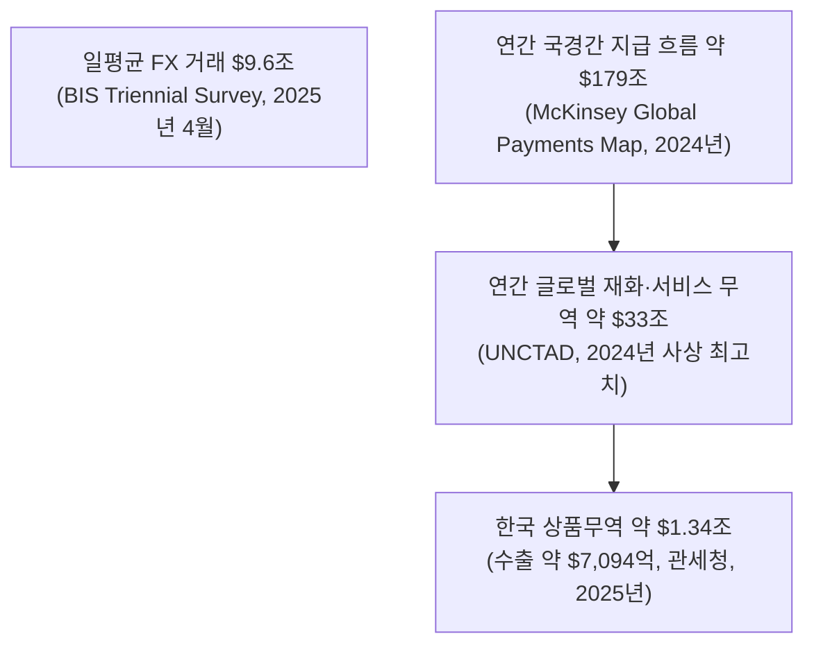
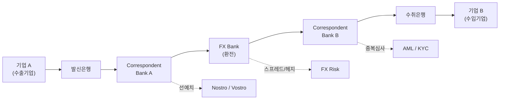

# 01 - 1단계: 광범위한 탐색 — B2B 국경간 이종통화 결제·정산 인프라 시장

## 한눈에 보기

| 항목 | 내용 |
|---|---|
| 문제 시장 | B2B 국경간 이종통화 결제·정산 인프라 시장 |
| 상위 시장 규모 | 국경간 지급 흐름 연간 약 $179조(McKinsey, 2024년 기준), 그중 재화·서비스 무역 약 $33조(UNCTAD, 2024년 사상 최고치) |
| FX 시장 규모 | 일평균 외환거래 $9.6조(BIS 2025년 4월 조사, 2022년 대비 28%↑) |
| 핵심 마찰 | 법·규제 분절, 데이터·메시징 분절, 중개은행망 분절, 유동성 분절, 환전(FX) 분절, 운영시간 분절 — 6유형 |
| 마찰의 크기 | 소액 송금 평균비용 6.5%(중소기업 B2B 5%+), 트랩된 노스트로 유동성 $5조~27조(McKinsey·BIS, 추정치 편차 큼) |
| 이종통화 거래 비중 | 정확한 공식 통계는 없음. 다만 글로벌 무역의 약 54%가 USD로 청구서가 발행되는 반면 미국의 무역 비중은 약 10%에 불과하다는 점(ECB/CEPR, 2025)에서, **대다수의 국경간 무역이 최소 한쪽 당사자에게는 이종통화 거래**라는 추론이 가능 — 4절에서 상세 |
| 신규 인프라 현황 | mBridge 누적 거래 $55.5억, e-CNY가 거래량의 95% 차지(2025년 11월 기준); Project Agorá는 2026년 7월 30일 실거래 테스트 완료(한국은행 포함 5개국 중앙은행 참여); 스테이블코인 시가총액 약 $3,130억(2026년 중반) |
| 잠정 결론 | 압도적인 글로벌 표준은 아직 없음. 국가마다 서로 다른 Settlement Architecture를 동시에 실험 중이며, 한국은행도 Agorá 실거래 테스트에 직접 참여하는 단계까지 왔음 |

## 연구 질문 (1단계에서 설정)

> **Q1.** B2B 국경간 이종통화 결제·정산은 현재 어떠한 구조로 이루어지며, 이 과정에서 기업과 금융기관은 어떤 구조적 마찰을 겪고 있는가? 또한 이러한 문제를 해결하기 위해 기존 금융망 개선, CBDC, 토큰화 예금, 스테이블코인 등 어떤 새로운 결제·정산 인프라가 시도되어 왔는가?
>
> **Q2.** 한국과 유사하게 국제무역 규모가 크고 독자적인 통화·금융시스템을 가진 국가들은 B2B 국경간 이종통화 결제·정산의 구조적 마찰을 줄이기 위해 어떤 인프라를 도입하고 있는가? 각 방식은 실제 상용화·거래규모·참여기업·비용·속도 측면에서 어느 정도의 성과를 거두었으며 향후 확장 가능성은 어떠한가?

## 시장 정의

> 서로 다른 통화를 사용하는 기업과 금융기관이 국경간 자금을 지급·환전·정산하는 과정에서 필요한 금융·기술 인프라 시장.

**자료 안내**: 이 문서는 팀 내부 리서치(`리서치DB/`)를 출발점으로 삼되, 핵심 수치는 BIS·McKinsey·UNCTAD·SWIFT·언론 보도 등 1차·공신력 있는 자료로 재검증했다. 내부 리서치와 외부 검증치가 다른 경우 외부 공신력 자료를 우선하고 그 근거를 명시했다.

---

# 1. 시장 규모 — 얼마나 큰 문제인가

## 1.1 시장 규모의 층위

McKinsey는 전체 결제산업을 연간 거래액 $200조, 거래건수 3.6조 건, 매출 $2.5조(테이크레이트 0.125%) 규모로 추산한다. 이 중 국경간 지급이 약 $179조로, 무역대금($33조)뿐 아니라 기업 Treasury·계열사간 자금이동·금융기관간 거래를 모두 포함한다. 무역만 보면 시장을 과소평가하고, $179조를 그대로 쓰면 국경간 이종통화 결제와 무관한 거래(동일통화권 내 이동 등)까지 포함해 과대평가한다 — 그래서 2단계에서 거래유형별로 좁히는 작업이 필요하다.

## 1.2 한국의 위치

한국 상품무역은 2025년 기준 약 $1.34조(수출 약 $7,094억 + 수입) 규모다. 기업 규모별로 보면 대기업 수출이 $4,688억(+3.4%), 중견기업이 $1,252억(+2%), 중소기업이 $1,135억(+7.2%)으로 모두 증가했다(관세청·국가데이터처, 2025년 잠정치). 한국은 무역 결제 통화가 구조적으로 USD에 크게 의존한다는 점에서, 아래 4절의 "이종통화 비중" 문제가 특히 중요한 시장이다.

---

# 2. 현재 결제 구조 — 어떻게 정산되고 있는가

## 2.1 전통적 결제 흐름

기업 A→B 간 자금이 오가려면 발신은행과 수취은행 사이에 최소 1개 이상의 중개은행(코리어은행)과 별도의 FX 처리 단계를 거친다. 이 다단계 구조 자체가 아래 마찰의 근원이다.

## 2.2 국가별 기존 결제 인프라(레일) 현황

각국은 이미 자국 통화 결제를 위한 RTGS·즉시결제망을 갖추고 있지만, **국경을 넘는 순간 이 인프라들은 서로 연결되지 않고 SWIFT·코리어은행 경로로 되돌아간다.**

| 국가/지역 | 주요 결제망 및 특성 | 국경간 연계 시도 |
|---|---|---|
| 한국 | BOK-Wire+ RTGS(09:00~20:00, 2026년 확대), Smart Deal FX 플랫폼 | Project Agorá 실거래 테스트 직접 참여(2026-07) |
| 일본 | BOJ-NET RTGS(09:00~17:00 → 19:00 확대 예정) | Project Agorá 실거래 테스트 참여 |
| 싱가포르 | FAST(즉시결제), RTGS 연계, 다중통화 지원 | MAS Ubin/Guardian 참여, PayNow-PromptPay 등 ASEAN 연계 |
| 홍콩 | HKD RTGS, CIPS(중국 위안화망) 연결 | mBridge 참여, e-HKD 내부 실험 |
| 중국 | CIPS + eCNY(디지털 위안) 국내 파일럿 | mBridge 주도 — 2025년 11월 기준 거래량의 95%가 e-CNY |
| UAE | AED RTGS(UAEFTS), 높은 SWIFT 가맹도 | mBridge 참여(2024-10 BIS 탈퇴 후 참여 중앙은행이 직접 운영) |
| 인도 | RTGS + IMPS/NEFT(24h), UPI(국내 즉시결제) | UAE와 로컬통화 직접결제(LCS) 협정(2023) |
| EU/SEPA | EUR TARGET2(RTGS), SEPA(단일유로시장) | 유로존 내부는 사실상 마찰 없음(3단계에서 재론) |
| 영국·미국 등 서구권 | Fedwire·CHIPS·FedNow(미국), CHAPS(영국) | Project Agorá 실거래 테스트 참여(BOE·NY Fed 등) |

---

# 3. 구조적 마찰 — 왜 비싸고 느린가

## 3.1 마찰 6유형

| 마찰 유형 | 핵심 현상 | 기업·금융기관 영향 |
|---|---|---|
| 법·규제 분절 | 국가마다 다른 AML/KYC·제재 기준을 결제 단계마다 반복 심사 | 처리 지연, 중복 컴플라이언스 비용 |
| 데이터·메시징 분절 | SWIFT MT 등 비구조화 포맷과 ISO 20022 도입 속도 차이 | 자동처리(STP) 저해, 수동 재처리·오류 |
| 중개은행망 분절 | 코리어은행 관계가 최근 10여 년간 약 20~30% 감소, 통화·지역별로 경로가 다름 | 단계마다 수수료·지연 누적 |
| 유동성 분절 | 통화별로 노스트로/보스트로 계좌를 별도 선예치 | 운전자본 비효율, 자본 기회비용 |
| 환전(FX) 분절 | 비기축통화 쌍은 유동성이 얕아 스프레드가 큼 | 환전비용·환위험 증가 |
| 운영시간 분절 | 국가별 RTGS 영업시간·영업일 불일치 | 결제 대기, 유동성 추가 조달 필요 |

## 3.2 마찰의 계량치(재검증)

| 항목 | 수치 | 출처/비고 |
|---|---|---|
| 소액 송금(200달러) 평균비용 | 6.5%(세계은행, 2024) | 대기업 B2B는 1~3%, 중소기업 B2B는 5% 이상 |
| 트랩된 노스트로/보스트로 유동성 | $5조~$27조(추정치 편차 큼) | McKinsey는 $10조 이상으로 추산, 상단 $27조는 BIS 관련 추산치로 인용됨 — 원자료에 있던 "$100조" 상단은 외부 검증에서 확인되지 않아 채택하지 않음 |
| 중개은행(코리어) 네트워크 | 활성 관계 약 20~30% 감소(최근 10여 년), 활성 코리도 수 10,800→9,800개(2011~2018) | BIS CPMI |
| SWIFT gpi 처리 속도 | 약 60%가 30분 내 수취인 계좌에 입금, 거의 100%가 24시간 내 완료 | SWIFT 공식 지표 |
| FX 스프레드 | 통상 0.5~4% | $100,000 거래 시 2%는 $2,000 손실 |

3단계(핵심 원인 분석)에서 이 마찰들을 "국가별 금융시스템 분절"이라는 공통 원인으로 환원해 다룬다.

---

# 4. 이종통화 거래 비중 추정 — 전체 시장에서 얼마를 차지하는가

이 질문에 답하는 공식 통계(예: "국경간 지급의 OO%가 이종통화 거래")는 BIS·SWIFT·McKinsey 어디에서도 직접 공표하지 않는다. 통화쌍별 결제 데이터는 상업적으로 민감해 세분화 공개가 되지 않기 때문이다. 대신 신뢰할 수 있는 조각 데이터를 조합해 근거 있는 추정 범위를 제시한다.

## 4.1 추정의 재료

| 재료 | 수치 | 함의 |
|---|---|---|
| 글로벌 수출 중 USD 청구 비중 | 약 54%(2022년 기준, ECB/CEPR 2025 분석) | SWIFT 자체 집계로도 약 50% 수준으로 유사 |
| 미국의 글로벌 무역 비중 | 약 10% | USD 청구 비중(54%)이 미국의 실제 교역 비중(10%)을 크게 초과 |
| 함의 | 최소 약 44%p(54%-10%)의 글로벌 무역은 "미국이 당사자가 아닌데도 USD로 청구"되는 거래 | 이 거래들은 최소 한쪽 당사자에게 반드시 환전(자국통화 ↔ USD)이 필요한 이종통화 거래 |

## 4.2 추정 결과와 한계

위 재료에 EUR 청구 무역 중 비유로존 거래, 그리고 JPY·GBP 등으로 청구되는 제3국간 무역까지 더하면, **국경간 무역대금 결제의 상당 부분(정황상 과반 이상)이 최소 한쪽 당사자에게는 이종통화 거래일 가능성이 높다.** 다만 이는 공개된 벤치마크 수치를 조합한 **자체 추정치**이며, 정확한 비중은 5단계(정량적 검증)에서 SWIFT Watch·BIS 통화쌍 통계 등 유료·기관용 데이터로 재확인이 필요하다.

한국 기준으로도 마찬가지다. 팀 내부 리서치(`b2b 국경간 결제정산 문제와 원인.md`)는 한국↔해외 무역대금(약 $1.3조~1.6조, SAM 후보)에서 "이종통화 결제 부분을 가려내는 작업"을 명시적으로 다음 과제로 남겨뒀다 — 이는 내부 리서치 시점에도, 이번 외부 검증에서도 여전히 미확정 상태다.

---

# 5. 신규 인프라 동향 — 무엇이 얼마나 진행됐는가

## 5.1 인프라 유형별 비교

| 기술/모델 | 비용 | 속도 | 유동성 요구 | 규제 복잡성 | 성숙도 | 추천 시나리오 |
|---|---|---|---|---|---|---|
| 전통 코리어뱅킹 | 높음(중개수수료+FX) | 수일 | 고(노스트로 대규모 예치) | 낮음(기존 규제 틀) | 매우 성숙 | 대규모·자유환시장 통화의 대기업 결제 |
| 실시간 지급망 연결(IPS) | 중간 | 분~시간 | 중(상대국 예치 필요) | 중간 | 초기 | 소액·고빈도 거래(관광·소규모 송금) |
| 로컬통화 직접결제(LCS) | 낮음(FX 비용 절감) | 빠름 | 양측 통화 유동성 필요 | 중간 | 일부 상용 | 특정 국가쌍의 대규모 무역(인도-UAE형) |
| CBDC / 멀티 CBDC | 매우 낮음(중개 제거) | 초~분 | 낮음(중앙은행 리저브) | 매우 높음(주권·법규) | 실거래 확대 중 | 대형은행·국가 간 대규모 정산 |
| 토큰화 예금 / 통합원장 | 낮음 | 초 | 중(은행 블록체인 자금) | 중(은행 기득권 규제) | 실거래 테스트 완료(2026-07) | 기업 간 대규모 채권·정산 |
| 스테이블코인 | 낮음(거래수수료+마진 0.5~1%) | 매우 빠름(초) | 중(발행사 준비금 필요) | 높음(신규 규제 필요) | 초기 상용 | 중소기업·신흥시장 거래 |

## 5.2 CBDC — mBridge, 그러나 한 통화에 쏠린 네트워크

- **거래 규모**: 2025년 11월 기준 누적 거래량 약 $55.49억, 거래 건수 4,047건 — 2022년 대비 약 2,500배 성장(로이터·The Block 보도).
- **거버넌스 변화**: BIS는 2024년 10월 이 프로젝트에서 손을 떼고 운영권을 참여 중앙은행(중국인민은행·홍콩금융관리국·태국은행·UAE중앙은행·사우디중앙은행)에 이관했다.
- **집중 리스크**: 중국의 e-CNY(디지털 위안)가 전체 거래량의 **95%**를 차지한다 — 다자간 플랫폼이라는 설계와 달리 실제로는 사실상 단일 통화 네트워크에 가깝다.
- **BIS의 새 초점**: BIS는 mBridge에서 발을 뺀 대신 서구권 중앙은행이 주도하는 Project Agorá에 역량을 집중하고 있다(아래 5.3).

## 5.3 토큰화 예금 — Project Agorá, 한국은행이 실거래 테스트에 참여

- **2026년 7월 30일**: Project Agorá가 프로토타입 단계를 넘어 **실거래(real-value) 테스트를 완료**했다. 5개 중앙은행(영란은행·프랑스은행·일본은행·**한국은행**·스위스국립은행)과 JPMorgan·Citi·UBS·Lloyds·CaixaBank 등 26개 이상의 민간 금융기관이 참여했다.
- **거래 내역**: 6개 통화에 걸쳐 약 CHF 800,000(약 8억원 상당)를 30건, 17개 시나리오로 처리했으며, 평균 결제 시간은 약 80초였다.
- **참여 범위**: 전체 참여 중앙은행은 8곳(위 5곳 + 캐나다은행·멕시코은행·뉴욕연준 혁신센터)이다.
- **의미**: 한국은행이 시뮬레이션이 아닌 **실제 자금이 오가는** 국제 공동 원장 실험에 직접 이름을 올린 첫 사례라는 점에서, 한국의 위치가 "관망"에서 "당사자"로 이동했다고 볼 수 있다.

## 5.4 스테이블코인 — 규모를 읽을 때는 "재고(시가총액)"와 "흐름(거래량)"을 구분해야 한다

- **시가총액(재고)**: 약 $3,130억(2026년 중반) — 테더(USDT)가 약 $1,847억(59%), USDC가 약 $738억(24%)으로 두 종목이 83%를 차지.
- **연간 거래량(흐름)**: 약 $33조/년 — 이는 암호자산 거래·재정거래 등을 포함한 전체 온체인 이체량이며, **B2B 국경간 무역결제만의 규모는 아니다.**
- **국경간 결제로 좁힌 흐름**: McKinsey는 국경간 결제에 실제로 쓰이는 스테이블코인 유통량을 일평균 약 $300억 수준으로 추산한다 — 전체 국경간 지급($179조/년 ≈ 일평균 약 $4,900억) 대비로는 아직 한 자릿수 % 초반의 작은 비중이다.
- **성장 전망**: Citi는 2030년 $1.9조, Standard Chartered는 2028년 말 $2조로 시가총액이 성장할 것으로 전망한다.

---

# 6. 국가별 해외 사례 심층 분석

### 🇯🇵 일본 — 기존 은행화폐의 토큰화
기존 구조는 기업→은행→코리어→FX→은행 경로로, 로컬 통화 스프레드와 1~2일의 결제 지연이 있다. BOJ·상업은행 주도로 Project Agorá에 참여해 상업은행 예금과 중앙은행 예금을 토큰화하는 실험을 진행했고, 2026년 7월 실거래 테스트에도 참여했다. 대규모 상용 기업 사용은 아직 제한적이다.

### 🇭🇰 홍콩 — 실가치 토큰화 정산 진입
중국-글로벌 금융의 게이트웨이로 HKD·RMB(CNH)를 동시에 지원한다. e-HKD Pilot(Phase 1 개념실험 → Phase 2 토큰화 예금 확장)으로 Visa·ANZ 등 11개 컨소시엄과 호주-홍콩 간 토큰화 증권결제를 시뮬레이션했다. mBridge에도 참여 중이다.

### 🇸🇬 싱가포르 — 다중 Rail 동시 실험
글로벌 FX·Treasury 허브로서 Project Guardian을 통해 CBDC·토큰화예금·규제형 스테이블코인을 동시에 검토한다. 특정 기술에 베팅하지 않고 여러 Rail의 상호운용성을 시험하는 전략이 특징이다.

### 🇦🇪 UAE — mBridge의 중심축, 그러나 리스크도 집중
디지털 디르함(CBDC) 도입과 함께 mBridge를 주도해왔다. 2024년 BIS 철수 이후에도 참여 중앙은행 체제로 프로젝트를 지속하고 있으나, 5.2절에서 본 대로 거래가 e-CNY에 쏠려 있어 UAE 입장에서도 특정 통화 의존 리스크를 안고 있다.

### 🇨🇳 중국 — mBridge를 통한 위안화 국제화
CIPS(위안화 결제망)와 자본이동 통제를 유지하면서, mBridge를 통해 e-CNY를 국제적으로 확산시키는 전략을 쓰고 있다. mBridge 거래량의 95%를 차지한다는 사실 자체가 중국의 정책 목표(위안화 국제화)와 정확히 일치한다.

### 🇮🇳 인도 — 디지털 화폐 없이 가는 반례
새 블록체인·스테이블코인 없이 **기존 은행망 안에서 통화쌍만 직접 연결**하는 로컬통화 직접결제(LCS)를 채택했다 — 2023년 인도-UAE 협정, RBI는 22개국 상대은행에 루피 전문계좌(SRVA) 개설을 허용했다. 7개국 중 "제도적 상용화"가 가장 앞선 사례이자, **새로운 디지털 화폐가 반드시 필요한 것은 아니라는 것을 보여주는 가장 중요한 반례**다.

### 🇰🇷 한국 — 관망에서 당사자로
BOK-Wire+ RTGS와 코리어뱅킹(주로 USD 중개) 체계를 쓰며, Smart Deal FX 플랫폼으로 일부 직접결제를 제공하나 대부분 SWIFT 기반이다. ① 기존망 고도화(ISO 20022 도입, RTGS 영업시간 20시까지 연장) ② 역외 원화결제망(2026년 9월 시범, 2027년 상반기 24/7 목표) ③ 스테이블코인 실증(현대카드·신한은행의 한·미, 한·일 송금 테스트) 등을 병행해왔다. 여기에 더해 **2026년 7월 Project Agorá 실거래 테스트에 5개 참여국 중 하나로 이름을 올리며**, 여러 아키텍처를 동시 검증하는 단계에서 한 걸음 더 나아갔다.

---

# 7. 종합 판단과 다음 질문

이번 외부 검증을 통해 확인한 세 가지 핵심 업데이트는 다음과 같다.

1. **시장 규모 수치는 대체로 견고하다**: 내부 리서치의 $179조(McKinsey)·$34.9조 무역(→ 최신 UNCTAD 기준 $33조) 등은 공신력 있는 자료로 재확인됐다.
2. **일부 수치는 수정이 필요했다**: 노스트로 유동성의 "$100조" 상단은 근거를 찾지 못해 제외했고, 스테이블코인 "시장 규모 $33조"는 실제로는 연간 거래량(흐름)이며 시가총액(재고)은 약 $3,130억으로 훨씬 작다는 점을 바로잡았다.
3. **가장 중요한 업데이트는 최신성이다**: mBridge의 e-CNY 95% 집중, 그리고 특히 **한국은행이 2026년 7월 Project Agorá 실거래 테스트에 참여**했다는 사실은 내부 리서치 시점에는 없던 정보로, 한국의 포지션 판단에 직접 영향을 준다.

이 탐색이 가리키는 다음 질문:

- **범위**: 이 넓은 문제 중 어떤 거래유형·어떤 국가군·어떤 기간을 볼 것인가 → 2단계
- **원인**: 6가지 마찰은 서로 다른 문제인가, 아니면 하나의 공통 원인에서 파생되는가 → 3단계
- **가설**: 만약 공통 원인이 있다면, 그 원인은 "국가·관할권 차이"만으로 설명되는가, 아니면 "통화 차이" 자체가 별도 변수인가(인도의 로컬통화 직접결제 사례, 그리고 4절의 이종통화 비중 추정이 시사하는 지점) → 4단계
- **정량화**: 4절에서 자체 추정한 "이종통화 비중"을 SWIFT Watch·BIS 통화쌍 통계로 어떻게 검증할 것인가 → 5단계(정량적 검증)에서 TAM/SAM/SOM으로 구체화

## 참고자료

- BIS, "Triennial Central Bank Survey" (2025년 4월)
- McKinsey & Company, "The 2025 McKinsey Global Payments Report"
- UNCTAD, "Global Trade Update"(2024년 12월) / "Key statistics and trends in international trade 2024"
- ECB, "Global trade invoicing patterns: new insights and the influence of geopolitics"(2025)
- BIS CPMI, correspondent banking data commentary
- SWIFT, gpi 공식 성과 지표
- Reuters/The Block, mBridge 거래량 보도(2025년 11월)
- BIS 보도자료(p260527) 및 Coindesk·Crowdfund Insider 보도, Project Agorá 실거래 테스트(2026년 7~8월)
- Reap/Transak/Statista, 스테이블코인 시가총액 통계(2026년)
- 팀 내부 리서치: `../리서치DB/` (1차 참고자료, 위 외부 자료로 교차검증)
