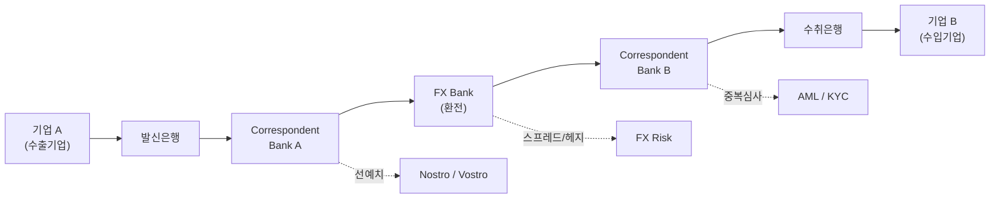
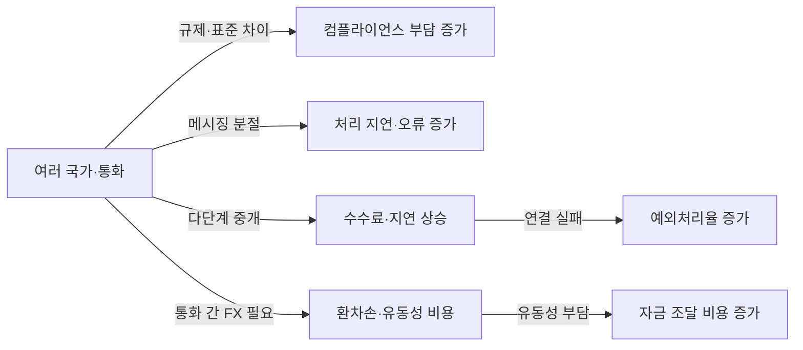
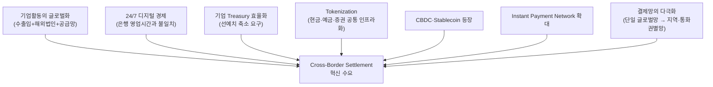
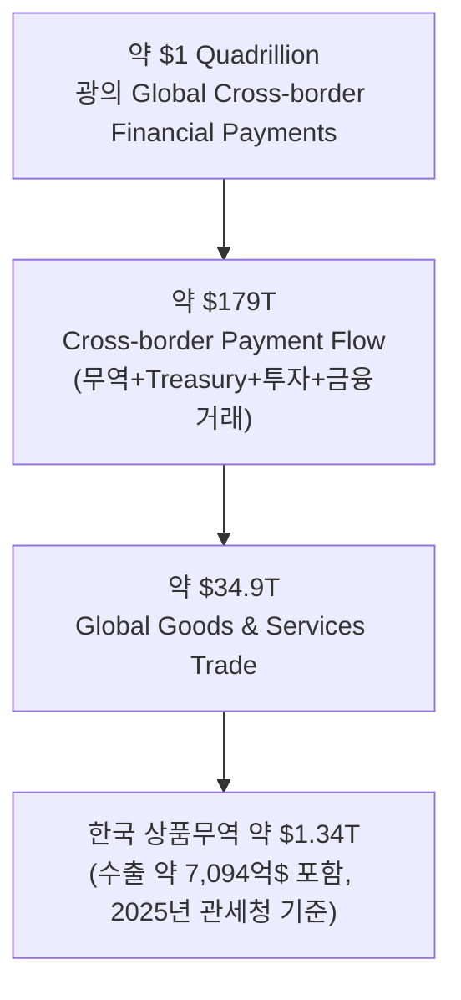
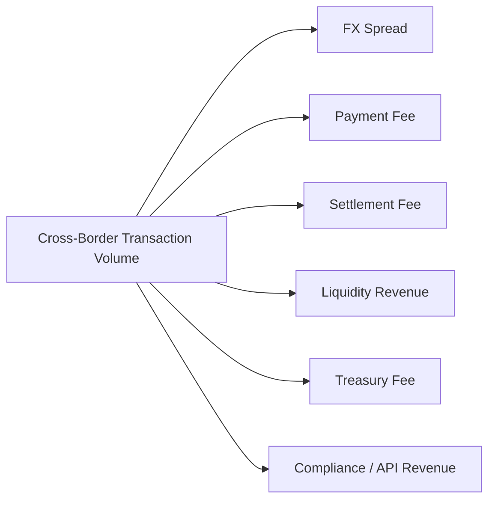
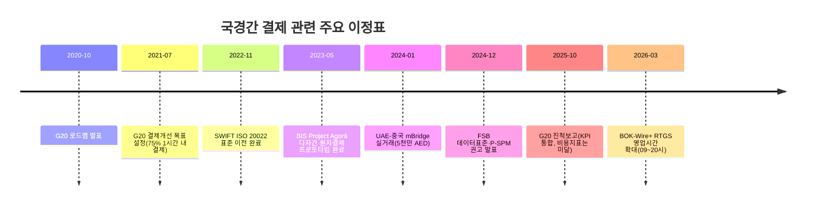
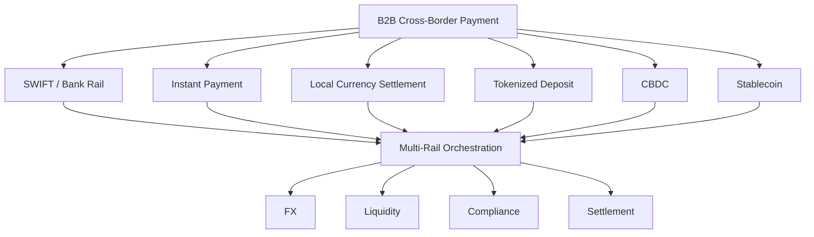

# 01 - 1단계: 광범위한 탐색 — B2B 국경간 이종통화 결제·정산 인프라 시장

## 한눈에 보기

| 항목 | 내용 |
|---|---|
| 문제 시장 | B2B 국경간 이종통화 결제·정산 인프라 시장 |
| 핵심 마찰 | 법·규제 분절, 데이터·메시징 분절, 중개은행망 분절, 유동성 분절, 환전(FX) 분절, 운영시간 분절 — 6유형 |
| 마찰의 크기(전통 경로 기준) | 소액 송금 평균비용 6.5%(중소기업 B2B는 5%+), 노스트로 예치금 업계 추정 27조~100조 달러, 처리시간 1~5영업일 |
| 새 인프라 후보 | 기존 금융망 고도화, 실시간 지급망 연결, 로컬통화 직접결제, CBDC/멀티CBDC, 토큰화 예금, 스테이블코인 — 6갈래 |
| 해외 사례 | 7개국(일본·홍콩·싱가포르·UAE·중국·인도·한국) 모두 서로 다른 Architecture를 선택 — 상용화까지 간 곳은 인도(로컬통화 직접결제)·UAE(mBridge) 정도 |
| 이종통화 거래 비중 | 리서치DB 원자료에는 "전체 국경간 지급 중 이종통화 비중"을 직접 계산한 수치가 없음 — 층위별 근사치와 미확정 지점을 본 문서 하단에 정리 |
| 잠정 결론 | 압도적인 글로벌 표준은 아직 없음. 국가마다 서로 다른 Settlement Architecture를 동시에 실험 중 |

## 연구 질문 (1단계에서 설정)

> **Q1.** B2B 국경간 이종통화 결제·정산은 현재 어떠한 구조로 이루어지며, 이 과정에서 기업과 금융기관은 어떤 구조적 마찰을 겪고 있는가? 또한 이러한 문제를 해결하기 위해 기존 금융망 개선, CBDC, 토큰화 예금, 스테이블코인 등 어떤 새로운 결제·정산 인프라가 시도되어 왔는가?
>
> **Q2.** 한국과 유사하게 국제무역 규모가 크고 독자적인 통화·금융시스템을 가진 국가들은 B2B 국경간 이종통화 결제·정산의 구조적 마찰을 줄이기 위해 어떤 인프라를 도입하고 있는가? 각 방식은 실제 상용화·거래규모·참여기업·비용·속도 측면에서 어느 정도의 성과를 거두었으며 향후 확장 가능성은 어떠한가?

## 시장 정의

> 서로 다른 통화를 사용하는 기업과 금융기관이 국경간 자금을 지급·환전·정산하는 과정에서 필요한 금융·기술 인프라 시장.

---

# A. 현재 구조 — 무엇이, 왜 문제인가

## 1. 전통적 결제 흐름

기업 A→B 간 자금이 오가려면 발신은행과 수취은행 사이에 최소 1개 이상의 중개은행(코리어은행)과 별도의 FX 처리 단계를 거친다. 이 다단계 구조 자체가 아래 6가지 마찰의 근원이다.

## 2. 국가별 기존 결제 인프라(레일) 현황

각국은 이미 자국 통화 결제를 위한 RTGS·즉시결제망을 갖추고 있지만, **국경을 넘는 순간 이 인프라들은 서로 연결되지 않고 SWIFT·코리어은행 경로로 되돌아간다.**

| 국가/지역 | 주요 결제망 및 특성 | 국경간 연계 시도 |
|---|---|---|
| 한국 | BOK-Wire+ RTGS(09:00~20:00, 2026년 확대), Smart Deal FX 플랫폼 | BIS Agorá 참여, ISO 20022 도입 중 |
| 일본 | BOJ-NET RTGS(09:00~17:00 → 19:00 확대 예정) | BIS Agorá 참여(상업은행 예금 토큰화 실험) |
| 싱가포르 | FAST(즉시결제), RTGS 연계, 다중통화 지원 | MAS Ubin/Guardian 참여, PayNow-PromptPay 등 ASEAN 연계 |
| 홍콩 | HKD RTGS, CIPS(중국 위안화망) 연결 | mBridge 참여, e-HKD 내부 실험 |
| 중국 | CIPS + eCNY(디지털 위안) 국내 파일럿 | mBridge를 통한 해외 CBDC 실험 |
| UAE | AED RTGS(UAEFTS), 높은 SWIFT 가맹도 | mBridge 발상지, Digital Dirham 추진 |
| 인도 | RTGS + IMPS/NEFT(24h), UPI(국내 즉시결제) | UAE와 로컬통화 직접결제(LCS) 협정 |
| EU/SEPA | EUR TARGET2(RTGS), SEPA(단일유로시장) | 유로존 내부는 사실상 마찰 없음(3단계에서 재론) |
| 미국 | Fedwire, CHIPS, FedNow(2023~) | JPM Coin·USDC 등 민간 스테이블코인 실험 활발 |

## 3. 구조적 마찰 6유형

| 마찰 유형 | 핵심 현상 | 기업·금융기관 영향 |
|---|---|---|
| 법·규제 분절 | 국가마다 다른 AML/KYC·제재 기준을 결제 단계마다 반복 심사 | 처리 지연, 중복 컴플라이언스 비용 |
| 데이터·메시징 분절 | SWIFT MT 등 비구조화 포맷과 ISO 20022 도입 속도 차이 | 자동처리(STP) 저해, 수동 재처리·오류 |
| 중개은행망 분절 | 코리어은행 수가 지속 감소, 통화·지역별로 경로가 다름 | 단계마다 수수료·지연 누적 |
| 유동성 분절 | 통화별로 노스트로/보스트로 계좌를 별도 선예치 | 운전자본 비효율, 자본 기회비용 |
| 환전(FX) 분절 | 비기축통화 쌍은 유동성이 얕아 스프레드가 큼(예: USD-KRW 40~50bp) | 환전비용·환위험 증가 |
| 운영시간 분절 | 국가별 RTGS 영업시간·영업일 불일치 | 결제 대기, 유동성 추가 조달 필요 |

## 4. 마찰의 계량치(전통 경로 기준)

원자료마다 추정 방식이 달라 수치 편차가 있으나, 마찰의 "크기"를 가늠할 수 있는 참고치는 다음과 같다.

| 항목 | 수치 | 비고 |
|---|---|---|
| 소액 송금(200달러) 평균비용 | 6.5%(세계은행, 2024) | 대기업 B2B는 1~3%, 중소기업 B2B는 5% 이상 |
| 은행 수수료 구성 | 발신 $15~50 + 중개 $10~30 + 수취 $10~25 + SWIFT 메시지 $0.04~0.20 | 전문가 추정치, 실제 은행마다 편차 큼 |
| FX 스프레드 | 통상 0.5~4% | $100,000 거래 시 2%는 $2,000 손실 |
| 노스트로/보스트로 예치금 | 업계 추정 27조~100조 달러 규모(자료에 따라 편차 큼) | 5% 이자 가정 시 $1B 예치당 연 $50M 기회비용 |
| 처리시간 | SWIFT gpi 기준 60%가 30분 내 메시지 도착, 그러나 최종 계좌입금은 1~5영업일 | 예: 멕시코→베트남 5만달러, 4개 은행 체인 경유 시 2~5% 손실 + 1~5일 지연 |

## 5. 마찰의 인과관계

## 6. 마찰 해소를 재촉하는 성장 동인

마찰이 그대로여도 시장이 정체되는 것이 아니라, 위 7가지 동인이 기존 체계를 계속 밀어내는 중이라는 점이 1단계 탐색에서 확인한 또 다른 축이다.

---

# B. 새로운 인프라 — 무엇을 시도하고 있는가

## 7. 새로운 결제·정산 인프라 비교

| 기술/모델 | 비용 | 속도 | 유동성 요구 | 규제 복잡성 | 성숙도 | 추천 시나리오 |
|---|---|---|---|---|---|---|
| 전통 코리어뱅킹 | 높음(중개수수료+FX) | 수일 | 고(노스트로 대규모 예치) | 낮음(기존 규제 틀) | 매우 성숙 | 대규모·자유환시장 통화의 대기업 결제 |
| 실시간 지급망 연결(IPS) | 중간 | 분~시간 | 중(상대국 예치 필요) | 중간 | 초기 | 소액·고빈도 거래(관광·소규모 송금) |
| 로컬통화 직접결제(LCS) | 낮음(FX 비용 절감) | 빠름 | 양측 통화 유동성 필요 | 중간 | 일부 상용 | 특정 국가쌍의 대규모 무역(인도-UAE형) |
| CBDC / 멀티 CBDC | 매우 낮음(중개 제거) | 초~분 | 낮음(중앙은행 리저브) | 매우 높음(주권·법규) | 실험~MVP | 대형은행·국가 간 대규모 정산 |
| 토큰화 예금 / 통합원장 | 낮음 | 초 | 중(은행 블록체인 자금) | 중(은행 기득권 규제) | 실험~초기 | 기업 간 대규모 채권·정산 |
| 스테이블코인 | 낮음(거래수수료+마진 0.5~1%) | 매우 빠름(초) | 중(발행사 준비금 필요) | 높음(신규 규제 필요) | 초기 상용 | 중소기업·신흥시장 거래 |
| 온체인 FX | 예측불가 | 빠름(초) | 낮음(스마트계약 유동성) | 매우 높음 | 연구 단계 | 소액 실험적 크로스체인 송금 |

## 8. 해외 사례 심층 분석 — 국가별로 무엇을 선택했는가

### 🇯🇵 일본 — 기존 은행화폐의 토큰화

- **선정 이유**: 제조업 중심 수출입 규모가 크고 독자통화(JPY)·대형은행 구조라는 점에서 한국과 가장 유사.
- **기존 구조**: 기업→은행→코리어→FX→은행 경로, 로컬 통화 스프레드 존재, 결제 지연 1~2일.
- **선택한 해법**: BOJ·상업은행 주도로 Project Agorá 참여 — 상업은행 예금과 중앙은행 예금을 토큰화해 공동원장에서 원자적 결제를 검증. BOJ 자체 Sandbox로 당좌예금 토큰화도 별도 추진.
- **성과/한계**: 기술 검증은 성공했으나 대규모 상용 기업 사용은 아직 제한적. 예금자 보호 등 법·제도 정비가 과제.

### 🇭🇰 홍콩 — 실가치 토큰화 정산 진입

- **선정 이유**: 중국-글로벌 금융의 게이트웨이, HKD·RMB(CNH) 결제를 동시에 지원.
- **기존 구조**: 기업→은행→코리어(FX)→은행, 엄격한 AML/KYC와 높은 USD 의존.
- **선택한 해법**: e-HKD Pilot(Phase 1 개념실험 → Phase 2 토큰화 예금 확장, Visa·ANZ 등 11개 컨소시엄 참여)으로 호주-홍콩 간 토큰화 증권결제를 시뮬레이션. 허가형 스테이블코인 가이드라인도 별도 준비 중.
- **성과/한계**: 실제 가치가 이동하는 Pilot 단계까지 진입한 몇 안 되는 사례. 다만 거래 규모는 아직 시뮬레이션 수준.

### 🇸🇬 싱가포르 — 다중 Rail 동시 실험

- **선정 이유**: 글로벌 FX·Treasury 허브, 다양한 금융실험에 가장 적극적.
- **기존 구조**: 기업→은행→싱가포르 클리어링(SPM/Nostro)→수취, 국가 간 통합체 연결은 부족.
- **선택한 해법**: Project Guardian으로 CBDC·토큰화예금·규제형 스테이블코인을 동시에 검토(주로 채권 DvP 정산에 우선 적용). Circle·StraitsX 등과 SGD 스테이블코인 기반 B2B 송금도 별도 모색. PayNow-PromptPay 등 IPS 연계도 병행.
- **성과/한계**: 특정 기술에 베팅하지 않고 여러 Rail의 상호운용성을 시험하는 전략. 대규모 상용 서비스는 아직 없음.

### 🇦🇪 UAE — 멀티 CBDC 실거래 확대

- **선정 이유**: 무역·금융 허브, 비석유 무역 확대에 따라 외환거래 효율화가 국가 과제.
- **기존 구조**: 대부분 USD 연계 송금, SWIFT/CIPS 의존, 코리어 비용·지연이 큼.
- **선택한 해법**: 디지털 디르함(CBDC) 도입과 함께 BIS mBridge를 주도. 2024년 1월 중국과 5천만 AED(약 1,360만 달러) 규모의 실거래를 성공시켰고, 2022년 20개 은행이 참여한 실거래 파일럿도 완료.
- **성과/한계**: 전통 방식(수일) 대비 수초 단위 정산을 실증한, Cross-border CBDC 중 가장 앞선 상용화 사례. 다만 특정 국가·통화(중국 등)에 거래가 집중돼 있어 범용 네트워크로 보기엔 이르다.

### 🇨🇳 중국 — 멀티 CBDC를 통한 국제화

- **선정 이유**: 세계 최대급 무역국, 위안화 국제화를 정책적으로 추진.
- **기존 구조**: 기업→은행→CIPS(위안화 결제망)→해외은행, 엄격한 자본이동 통제.
- **선택한 해법**: mBridge를 통해 e-CNY를 홍콩·태국·UAE의 CBDC와 직접 연결(2022~23년 파일럿에서 수초 내 결제 실증). 국내적으로는 e-CNY 소매 파일럿을 지속 확대.
- **성과/한계**: 기술적으로는 검증됐으나, 자본통제 정책상 위안화의 자유로운 국제 사용까지는 이어지지 않음.

### 🇮🇳 인도 — 디지털 화폐 없이 가는 반례

- **선정 이유**: 대형 무역경제이면서 독자통화(INR) 국제화를 정책 목표로 삼음.
- **기존 구조**: 기업→은행→SWIFT/코리어→은행, USD·EUR·JPY 중심 결제, 해외은행망 부재가 중소 수출기업의 문제로 지적됨.
- **선택한 해법**: 새 블록체인·스테이블코인 없이 **기존 은행망 안에서 통화쌍만 직접 연결**하는 로컬통화 직접결제(LCS)를 채택 — 2023년 인도-UAE 협정 체결, RBI는 22개국 상대은행에 루피 전문계좌(SRVA) 개설을 허용.
- **성과/한계**: 7개국 중 유일하게 "제도적 상용화"가 앞선 사례. 다만 INR 유동성이 낮아 확장에는 한계가 있고, 전체 무역 대비 침투율은 아직 제한적이다. **새로운 디지털 화폐가 반드시 필요한 것은 아니라는 것을 보여주는 가장 중요한 반례.**

### 🇰🇷 한국 — 복수 모델을 동시에 검증하는 전환기

- **기존 구조**: BOK-Wire+ RTGS와 코리어뱅킹(주로 USD 중개) 체계. Smart Deal FX 플랫폼으로 일부 직접결제를 제공하나 대부분 SWIFT 기반.
- **선택한 해법(동시 진행 중)**: ① 기존망 고도화(ISO 20022 도입, RTGS 영업시간 20시까지 연장) ② 토큰화 예금·기관용 CBDC(한강 프로젝트 — 2024년 PoC, 2025~26년 실거래 테스트, 최대 10만 명 규모) ③ 역외 원화결제망(2026년 9월 시범, 2027년 상반기 24/7 목표) ④ 스테이블코인 실증(현대카드·신한은행의 한·미, 한·일 송금 테스트, 7분 내 처리 확인) ⑤ Project Agorá 참여.
- **시사점**: 하나의 아키텍처를 확정하지 않고 4~5갈래를 동시에 실험 중이라는 점에서, 7개국 중 가장 "미확정" 단계에 있다.

## 9. 국가별 성장성 평가

| 국가 | 성장성 | 이유 | 핵심 리스크 |
|---|---|---|---|
| 일본 | ★★★★☆ | 대규모 무역·FX + 대형은행 | 기존 시스템의 높은 완성도(교체 유인 약함) |
| 홍콩 | ★★★★★ | 중국-글로벌 게이트웨이 + Digital Asset 실험 | 중국·글로벌 규제 접점의 불확실성 |
| 싱가포르 | ★★★★★ | FX·Treasury 허브 + Multi-Rail 전략 | 내수보다 금융중개 중심이라는 구조적 한계 |
| UAE | ★★★★★ | 무역허브 + 국가주도 Digital Settlement | 특정 국가·통화로 거래가 집중 |
| 중국 | — | (자료상 별도 등급 없음, mBridge 참여도는 높으나 자본통제로 국제화 제한) | 자본이동 통제 |
| 인도 | ★★★★☆ | 대형 무역경제 + INR 국제화 정책 | INR 유동성·태환성(Convertibility) 제약 |
| 한국 | ★★★★☆ | 대규모 무역 + 복수 모델 동시 검증 | 높은 USD 의존, KRW 국제유동성·외환규제 |

> 위 별점은 공식 시장 CAGR이 아니라, 원자료가 제시한 "현재 제도·수요·상용화 가능성" 기준의 정성적 평가다.

---

# C. 시장 규모 — 얼마나 큰 문제인가

## 10. 시장 규모의 층위

시장 규모는 하나의 숫자로 단정할 수 없다. $1Q를 그대로 쓰면 과대평가, $34.9T(무역)만 쓰면 기업 Treasury·계열사 간 자금이동을 과소평가한다. 따라서 $179T의 국경간 지급 흐름을 상위 모수로 두고, 그 안에서 B2B·이종통화·인프라 적용 가능 거래로 좁혀가는 방식이 타당하다.

## 11. 인프라 사업자 입장의 시장 규모(수익 풀)

거래금액(Transaction Value) 자체는 사업자의 매출이 아니다. 인프라 사업자 매출은 아래 수익원의 합으로 별도 산정해야 한다.

| 산정 방식 | 계산식 |
|---|---|
| 방식 A — Transaction 기반 | 적용 가능한 Transaction Volume × Infrastructure Take Rate |
| 방식 B — Revenue Pool 기반 | FX Revenue + Payment Fee + Settlement Fee + Liquidity Revenue + Treasury Revenue + Compliance/API Revenue |

## 12. 이종통화 거래 비중 — 전체 글로벌 시장에서 얼마나 차지하는가

이 질문에 대한 **확정 수치는 리서치DB 원자료에 존재하지 않는다.** 대신 층위별 근사치와, 다음 단계에서 반드시 좁혀야 할 지점을 정리한다.

| 층위 | 근사치 | 성격과 한계 |
|---|---|---|
| 글로벌: 무역이 전체 지급흐름에서 차지하는 비중 | $34.9T ÷ $179T ≈ **19.5%** | 이는 "무역의 비중"이지 "이종통화의 비중"은 아니다. 유로존 내부 무역처럼 국경은 있지만 동일통화(EUR)인 거래도 포함돼 있어, 실제 이종통화 비중은 이보다 낮을 가능성이 크다. |
| 한국: SAM(Core) 후보 | 한국↔해외 상품·서비스 무역대금 약 **1.3~1.6조 달러**(2025년 기준) | 원자료(`b2b 국경간 결제정산 문제와 원인.md`)가 명시적으로 "이 중 이종통화 결제 부분을 가려내는 작업이 다음 과제"라고 밝힘 — 즉 한국 기준으로도 이종통화 비중은 **아직 미확정**. |
| 자본시장 참고치 | 글로벌 스테이블코인 시장 2025년 약 28조~33조 달러(자료마다 상이) | 이종통화 B2B 결제가 이 중 얼마를 차지하는지는 "실물 규모가 공개되지 않음"으로 원자료에 명시됨. |

**5단계(정량적 검증)에서 채워야 할 것**: (1) 통화통계를 활용해 실제 FX가 동반된 지급 건수·금액 비중 추정, (2) 국가별 통화쌍 커버리지(예: USD-KRW vs EUR-KRW 비중) 적용, (3) 해외법인 배당·차입 등 기업 Treasury 자금이동 규모의 보완 추정. 이 세 가지가 채워져야 "이종통화 거래 비중"이라는 숫자를 책임 있게 제시할 수 있다.

## 13. 주요 이정표 타임라인(2020~2026)

## 14. 산업 구조의 향후 방향 — 승자독식이 아닌 Multi-Rail Orchestration

하나의 기술이 모든 결제를 대체할 가능성은 낮다. 장기적으로 중요한 경쟁 영역은 특정 Digital Currency의 발행 자체가 아니라, **여러 Rail·자산을 연결해 FX·유동성·컴플라이언스·정산을 통합 오케스트레이션하는 인프라**가 될 가능성이 크다.

---

## 이 탐색이 가리키는 다음 질문

- **범위**: 이 넓은 문제 중 어떤 거래유형·어떤 국가군·어떤 기간을 볼 것인가 → 2단계
- **원인**: 6가지 마찰은 서로 다른 문제인가, 아니면 하나의 공통 원인에서 파생되는가 → 3단계
- **가설**: 만약 공통 원인이 있다면, 그 원인은 "국가·관할권 차이"만으로 설명되는가, 아니면 "통화 차이" 자체가 별도 변수인가(인도의 로컬통화 직접결제 사례, 그리고 12절의 "이종통화 비중 미확정" 문제가 시사하는 지점) → 4단계
- **정량화**: 12절에서 확인한 "이종통화 비중 미확정" 문제를 어떻게 좁혀 나갈 것인가 → 5단계(정량적 검증)에서 TAM/SAM/SOM으로 구체화
