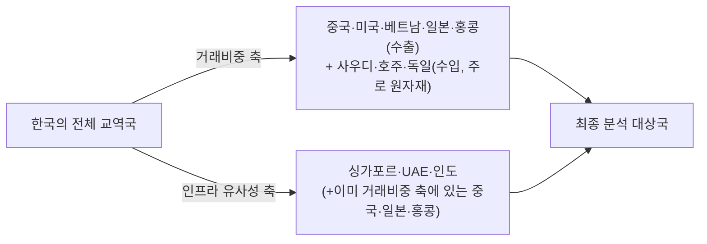

# 02 - 2단계: 범위 축소 — 분석 대상의 구체화

## 한눈에 보기

| 축소 기준 | 결정 |
|---|---|
| 거래유형 | 기업의 무역대금 결제 + 기업 Treasury/Intercompany 자금 이동 |
| 지역 | 한국 중심. 거래비중 상위(약 70%) 국가 + 한국과 금융시스템(규제 포함)이 유사한 국가(일본·싱가포르·홍콩·UAE·중국·인도 필수 포함) |
| 기간 | 2024년~2026년 |
| 핵심지표 | 미정 → 본 문서에서 후보안 제시 |

1단계에서 확인한 시장은 $179T 규모의 국경간 지급 흐름 전체였다. 이는 그대로 분석하기엔 너무 넓으므로, 아래 세 축으로 좁힌다.

## 거래유형: 왜 무역대금·Treasury/Intercompany인가

$179T 흐름은 무역대금($34.9T) 외에도 Treasury, 투자, 금융기관 간 거래를 포함한다. 이 중 **기업(비금융기관)이 실제로 겪는 마찰**에 초점을 맞추기 위해 두 유형만 남긴다.

| 거래유형 | 포함 이유 |
|---|---|
| 무역대금 결제 | 1단계 마찰(코리어은행·FX·규제)이 가장 직접적으로 나타나는 영역이자, $34.9T 실물무역이라는 명확한 하한선이 있음 |
| Treasury / Intercompany 자금이동 | 해외법인·계열사 간 자금이동은 무역대금과 마찰 구조는 같지만 통계상 무역으로 잡히지 않아, 포함하지 않으면 시장을 과소평가함 |
| (제외) 투자·금융기관 간 거래 | 자본시장·증권결제 인프라(예: DvP)는 결제 구조와 규제 주체가 달라 별도 분석이 필요한 영역 |

## 지역: 국가 선정 기준

앞서 "거래비중 상위 약 70%"와 "금융시스템 유사국(일본·싱가포르·홍콩·UAE·중국·인도 필수 포함)"을 하나의 기준처럼 묶어뒀으나, 실제 무역통계를 대입해보면 **이 둘은 서로 다른 선정 축**이라는 것이 드러난다. 아래에서 실측치로 확인한다.

### 거래비중 축: 수출 vs 수입

| 구분 | 상위국 및 비중 | 합계 | 출처 |
|---|---|---|---|
| 수출(가장 최근 공개된 국가별 세부 비중, 2023년 실적) | 중국 19.7% · 미국 18.3% · 베트남 8.5% · 일본 4.6% · 홍콩 4.0% | 상위 5개국 **55.1%** | 한국무역협회·KOTRA 공동기획(내일신문 보도) |
| 수입(최근년도 집계) | 중국 21% · 미국 12% · 일본 9% · 사우디아라비아 4% · 베트남 4% · 호주 4% · 독일 4% | 상위 7개국 약 **58%** | Trading Economics(관세청 원자료 기반) |

참고로 2020년에는 수출 상위 5개국 비중이 60.8%였으나 2023년 55.1%로 낮아져, 특정국 의존도가 완화(다변화)되는 추세다. 수출·수입 모두 정확히 "70%"에 도달하는 지점(대략 8~10위권)의 국가별 세부 비중은 이번 조사로 확정하지 못했다 — 대만·싱가포르·인도·멕시코·인도네시아·카타르 등이 다음 순위군으로 알려져 있으나, K-stat 원자료를 직접 조회해 확정해야 한다.

### 더 적절한 기준 제안: 총교역액(수출+수입 합산)

이 챕터가 다루는 시장(B2B 국경간 이종통화 결제·정산)은 수출대금 유입과 수입대금 유출을 모두 포괄한다. 따라서 수출만 보는 것보다 **총교역액(수출+수입) 기준으로 커버리지를 계산하는 쪽이 시장 정의에 더 부합한다** — 한국무역협회도 매년 이 기준으로 "10대 교역국"을 발표한다. 다만 이번 조사에서는 총교역액 기준 상위 10개국의 정확한 비중표를 확보하지 못해, 위 수출·수입 개별 표로 대체했다.

### 거래비중 축과 인프라 유사성 축은 다른 국가군을 가리킨다

"필수 포함" 6개국을 실제 거래비중 데이터에 대입하면 다음과 같다.

| 국가 | 거래비중 기준 충족 여부 | 포함 근거 |
|---|---|---|
| 중국 | 충족(수출 1위·수입 1위) | 거래비중 + 금융시스템 유사성 모두 충족 |
| 일본 | 충족(수출 4위·수입 3위) | 거래비중 + 금융시스템 유사성 모두 충족 |
| 홍콩 | 부분 충족(수출 5위, 수입은 상위 밖) | 거래비중(수출) + 금융허브로서의 실험 선도 |
| 싱가포르 | 미충족(수출입 모두 상위 밖) | 거래비중이 아니라 Multi-Rail 실험 선도라는 인프라 유사성으로 포함 |
| UAE | 미충족(원유 수입에서는 상위권이나 총교역 기준은 낮음) | 거래비중이 아니라 CBDC(mBridge) 실거래 선두라는 인프라 유사성으로 포함 |
| 인도 | 미충족(수출입 모두 상위 밖) | 거래비중이 아니라 "디지털 자산 없는 해법" 반례 가치로 포함 |

즉 6개국 중 중국·일본·홍콩은 거래비중으로도 설명되지만, **싱가포르·UAE·인도는 거래비중이 아니라 결제 인프라 실험의 대표성 때문에 포함된 국가**다. 원래 스코프는 "거래비중 상위국"과 "인프라 유사국"이라는 서로 다른 두 기준을 하나의 목록으로 합쳐둔 셈이며, 앞으로는 아래처럼 두 축을 분리해 표기하는 것이 더 정확하다.

- **거래비중 축**: 중국·미국·베트남·일본·홍콩(수출) + 사우디아라비아·호주·독일(수입, 주로 원자재) — 결제·정산 규모의 절대적 하한선을 구성.
- **인프라 유사성 축**: 싱가포르·UAE·인도 — 거래비중은 낮지만 결제 인프라 실험·규제 방향이 한국의 참고 사례가 되어 그대로 유지.
- 미국·베트남·사우디·호주·독일은 거래비중은 크지만 1단계에서 다룬 인프라 사례(mBridge·Agorá·e-HKD 등)에는 등장하지 않는다 — 5단계(정량적 검증)에서 필요 시 추가 조사 대상으로 남긴다.

## 기간: 2024~2026년

이 구간을 선택한 이유는 1단계에서 확인한 핵심 프로젝트가 이 3년에 몰려 있기 때문이다.

| 시점 | 사건 |
|---|---|
| 2024-01 | UAE-중국 mBridge 실거래(5천만 AED) |
| 2024 | 홍콩 e-HKD Phase 2(토큰화 예금 확장) |
| 2024~2025 | 한국 한강 프로젝트 2단계(실거래 테스트) |
| 2025 | 한국은행 ISO 20022 도입 |
| 2026-03 | BOK-Wire+ RTGS 운영시간 확대(09~20시) |
| 2026-09(예정) | 한국 역외 원화결제망 시범 운영 |

## 핵심지표(안)

1단계에서 아직 확정하지 못한 부분이다. 마찰 6유형과 국가별 성숙도 비교가 요구하는 지표를 기준으로 다음을 후보로 제안한다.

| 범주 | 지표 | 측정 대상 | 데이터 출처 후보 |
|---|---|---|---|
| 비용 | 거래 건당 총비용(중개수수료+FX 스프레드, %) | 국경간 이종통화 B2B 결제 1건 | 세계은행 송금비용 DB, 은행 고시환율 |
| 속도 | 결제 개시~기업계좌 최종입금 소요시간 | 동일 | SWIFT gpi 통계, 각국 중앙은행 발표 |
| 유동성 | 노스트로/보스트로 예치 규모, 자금 기회비용 | 은행·기업 운전자본 | BIS 보고서, 개별 은행 공시 |
| 상용화 단계 | Pilot / MVP / Live Trial / 상용 4단계 구분 | 국가별 대표 프로젝트 | 각국 중앙은행·BIS 프로젝트 문서 |
| 채택 규모 | 참여 금융기관 수, 실거래 누적 규모(달러 환산) | 국가별 대표 프로젝트 | 프로젝트 공식 발표 |
| 확장성 | 참여국·통화 확대 계획, 법제화 진행 상황 | 국가별 정책 로드맵 | 중앙은행·금융당국 보도자료 |

이 중 "비용·속도·유동성"은 마찰의 **크기**를, "상용화 단계·채택 규모·확장성"은 대안 인프라의 **성숙도**를 측정한다. 5단계(정량적 검증)에서 실제 수치를 채워 넣을 예정이다.

## 참고자료

- 한국무역협회(KITA)·KOTRA 공동기획, 수출 상위 5개국 비중 보도(내일신문, 2023년 실적 기준)
- Trading Economics, 한국 수입 상위국 비중(관세청 원자료 기반 집계)
- 관세청·국가데이터처, 2025년 기업특성별 무역통계(잠정치)
