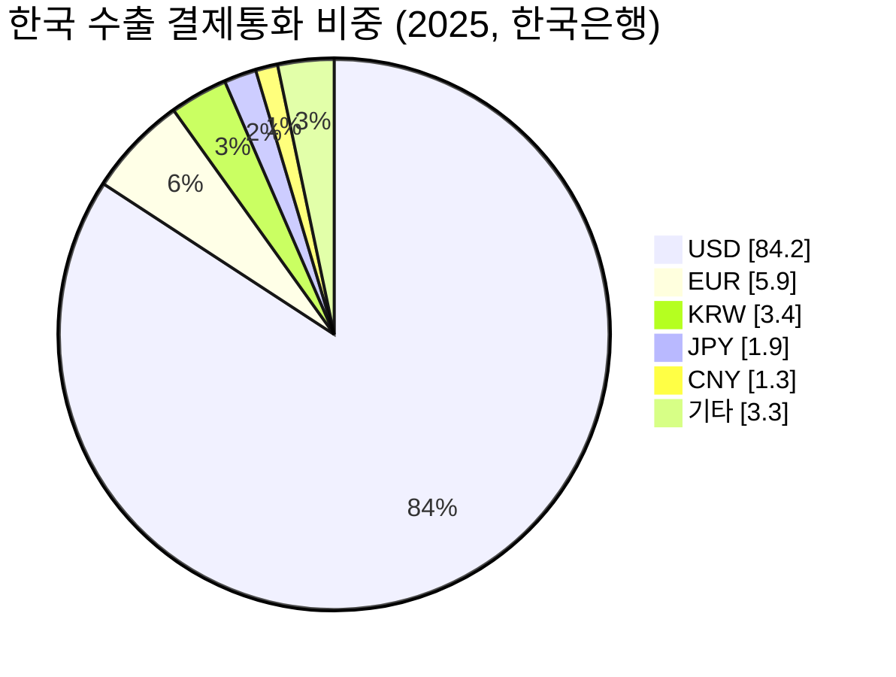
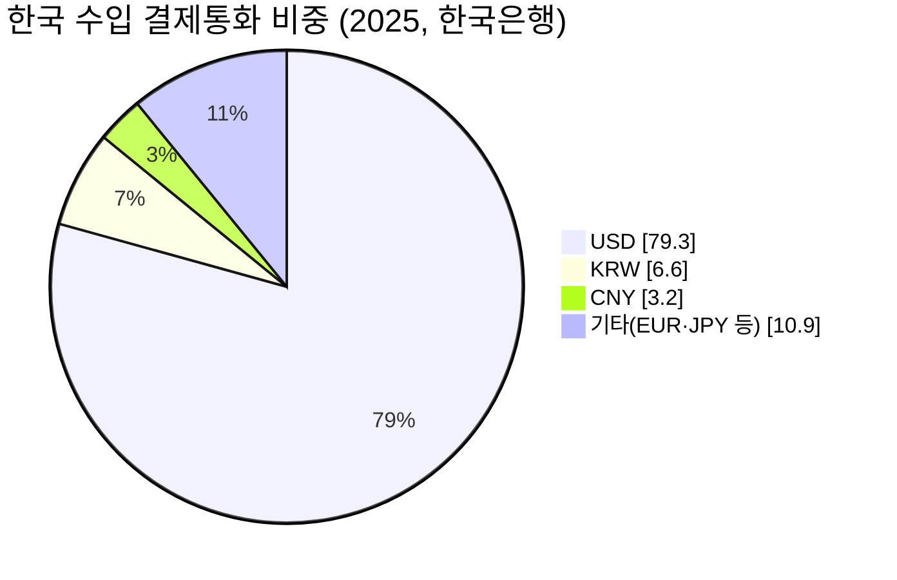
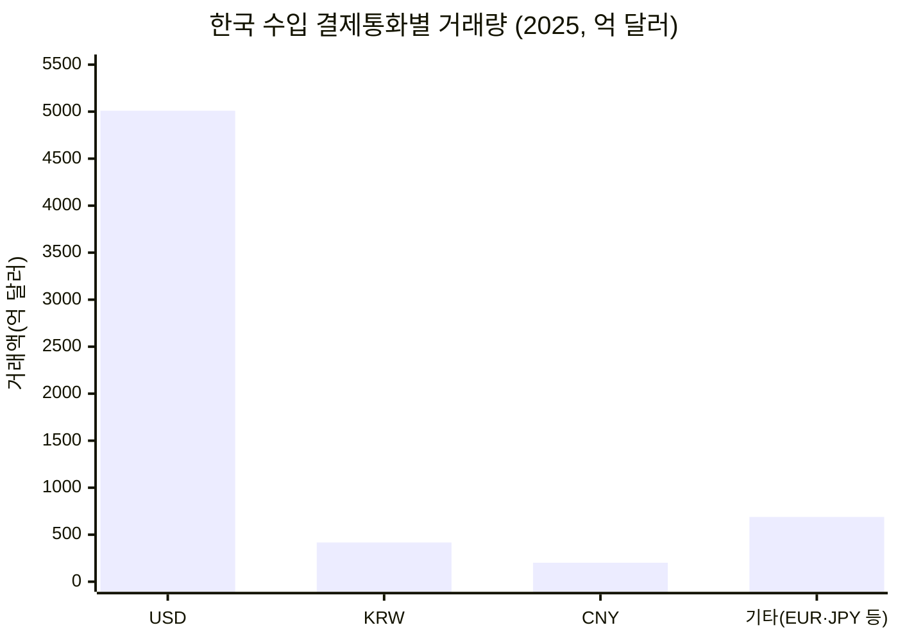
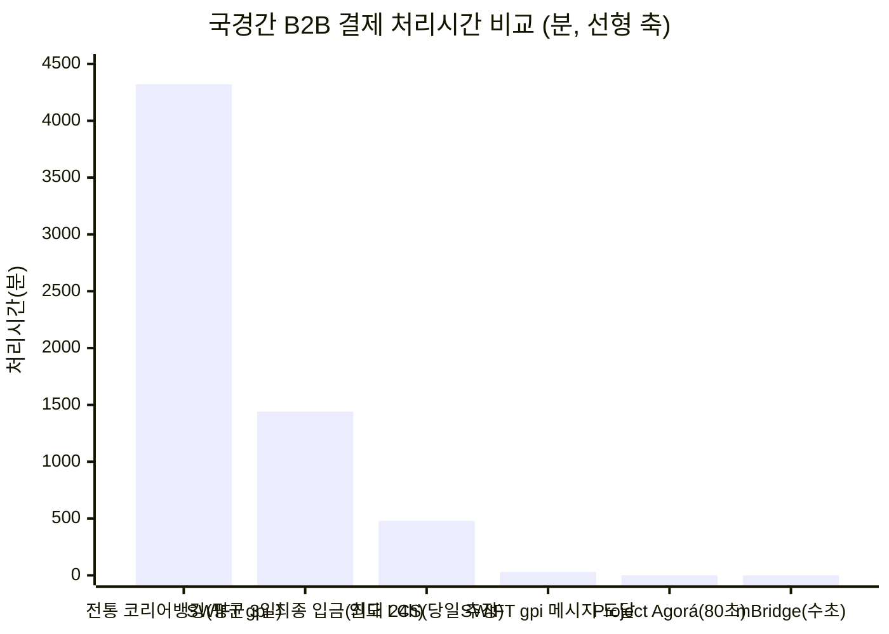
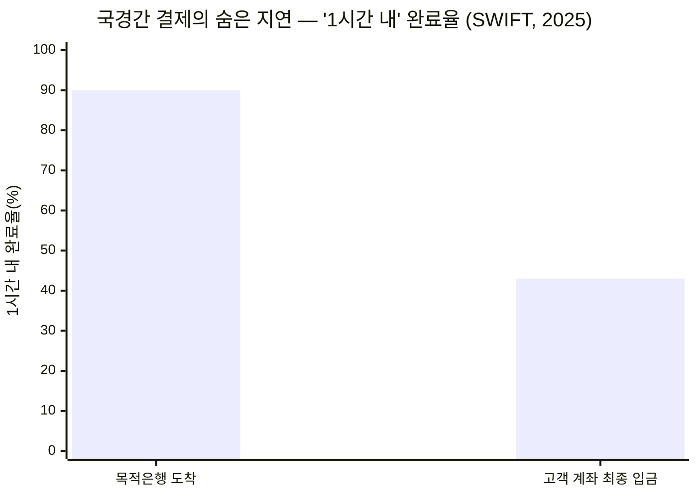
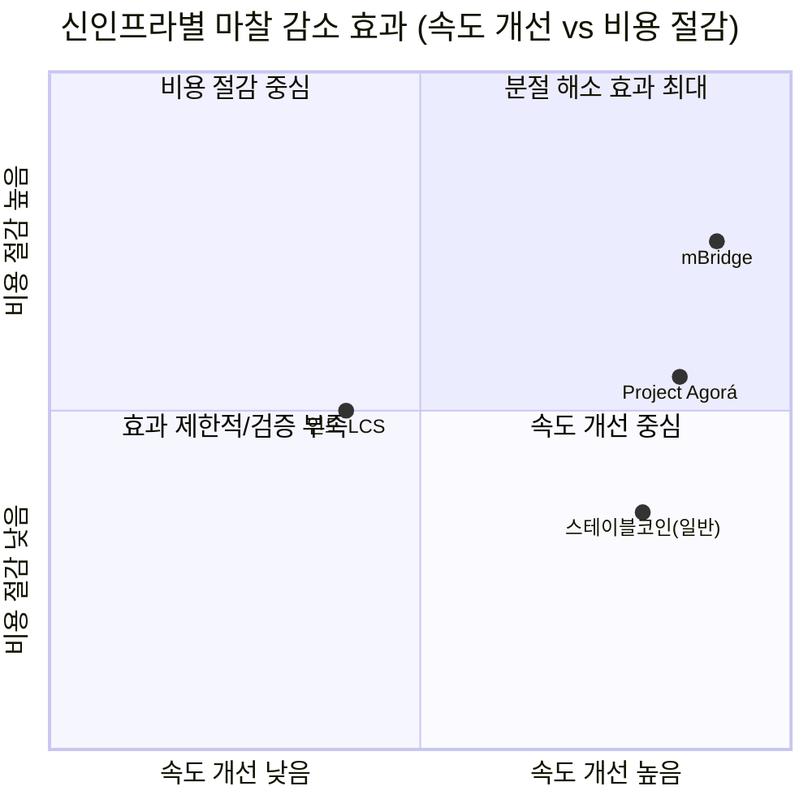
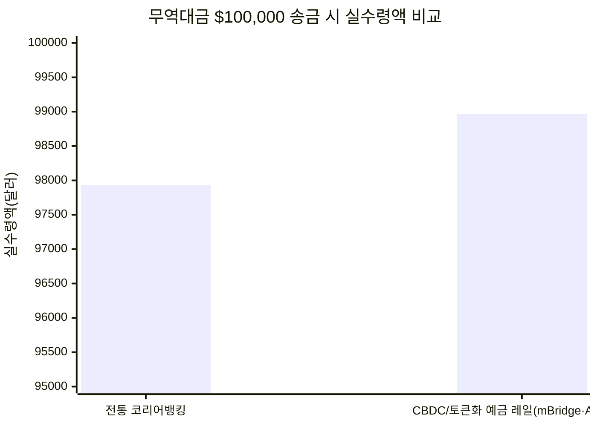

# 05 - 5단계: 정량적 검증 — 마찰의 크기를 데이터로 보여주기

## 한눈에 보기

| 질문 | 핵심 수치 |
|---|---|
| 한국 기업 거래의 이종통화 비중 | 수출의 **96.6%**, 수입의 **93.4%**가 원화(KRW)가 아닌 통화로 결제(한국은행, 2025년) |
| 이종통화 거래량(달러 환산) | 수출 중 USD 결제만 약 **5,973억 달러**(2025년 수출 7,094억 달러 중) |
| 처리속도 격차 | 전통 코리어뱅킹 평균 3일(4,320분) vs mBridge·Agorá 수초\~80초 — 약 **3,000\~20,000배** 차이 |
| 숨은 지연 | SWIFT 기준 결제의 90%가 1시간 내 수취은행에 "도착"하지만, 고객 계좌에 실제로 "입금"되는 비율은 43%뿐 |
| 신인프라의 마찰 감소 | mBridge는 비용 최대 80%·시간 3\~5일→수초 단축(20개 은행·164건·$2,200만 규모 실거래 파일럿, 2022) |

---

## 0. 5단계를 진행하려면 무엇이 필요한가

4단계까지는 정성적 가설("국가별 금융시스템 분절이 근본원인이다", "통화차이는 별도 마찰 변수다")을 세우는 단계였다. 5단계는 이 가설을 실제 수치로 검증하는 단계이므로, 아래 세 가지가 갖춰져야 한다.

1. **정량 데이터 소스**: 팀 리서치나 추정이 아니라 1차 기관 통계가 필요하다 — 이번에는 한국은행(결제통화 비중), 관세청(무역액), SWIFT·BIS(처리속도·비용), 각국 중앙은행 프로젝트 공식 발표(mBridge·Agorá 실거래 규모)를 사용했다.
2. **비교 기준선(baseline)**: "느리다/비싸다"는 상대적 진술이므로, 항상 **전통 방식과 신인프라를 같은 단위(분·달러)로 나란히 비교**해야 의미가 생긴다. 아래 모든 차트는 이 원칙을 따른다.
3. **시각화 형식**: 이 저장소는 GitHub에서 바로 렌더링되는 Mermaid를 표준으로 써왔으므로(1\~4단계 문서와 동일), 5단계도 파이차트·막대차트·쿼드런트차트를 Mermaid로 작성해 별도 도구 없이 커밋만으로 시각 자료가 재현되게 했다.

---

## 1. 한국 기업 거래의 이종통화 비중

한국은행이 2026년 4월 16일 발표한 "2025년 수출입 결제통화별 비중(확정치)"을 기준으로 한다.





**해석**: 원화(KRW) 결제 비중은 수출 3.4%, 수입 6.6%에 불과하다. 뒤집어 말하면 **수출의 96.6%, 수입의 93.4%가 한국 기업 입장에서 이종통화 거래**라는 뜻이다. 2025년은 원화 수출 결제 비중이 전년 대비 0.8%p 오르며 사상 최고치를 기록했지만(반도체장비·승용차 중심), 여전히 절대다수는 USD가 차지한다. 참고로 엔화(JPY) 수출 결제 비중은 1.9%로 역대 최저, 위안화(CNY) 수입 결제 비중은 3.2%로 역대 최고를 기록했다 — 통화 구성 자체가 서서히, 그러나 USD 절대 우위 구조 안에서 움직이고 있다.

---

## 2. 비중과 거래량을 함께 보기

비중(%)만으로는 "문제의 절대 규모"가 감이 오지 않는다. 위 비중을 2025년 실제 무역액(수출 7,094억 달러, 수입 6,318억 달러 — 관세청)에 곱해 통화별 거래량을 계산했다.

```mermaid
xychart-beta
    title "한국 수출 결제통화별 거래량 (2025, 억 달러)"
    x-axis [USD, EUR, KRW, JPY, CNY, 기타]
    y-axis "거래액(억 달러)" 0 --> 6500
    bar [5973, 419, 241, 135, 92, 234]
```



**해석**: USD 결제 거래량만 수출 약 5,973억 달러(약 8조 원 이상 규모), 수입 약 5,010억 달러다. 위 1절의 파이차트(비중)와 이 막대차트(거래량)는 같은 데이터를 "비율"과 "절대금액"이라는 서로 다른 렌즈로 보여준다 — Mermaid는 하나의 차트에서 두 단위(%·억 달러)를 겹쳐 그리는 이중축을 지원하지 않아 두 차트를 나란히 배치하는 방식을 택했다.

---

## 3. 처리속도 비교 — 전통 방식 vs 신인프라, 그리고 숨은 지연

### 3.1 처리시간 비교(분 단위, 선형 축)



| 방식 | 처리시간 | 출처 |
|---|---|---|
| 전통 코리어뱅킹 | 1\~5영업일(평균 3일 가정) | McKinsey, BIS CPMI |
| SWIFT gpi — 메시지 도달 | 90%가 1시간 내 | SWIFT 공식 지표(2025) |
| SWIFT gpi — 최종 계좌 입금 | 최대 24시간(케이스에 따라 수일) | 위와 동일 |
| 인도 LCS(로컬통화 직접결제) | 당일 처리로 알려짐(분 단위 공식 수치는 비공개, 8시간=480분으로 추정 표기) | 인도-UAE 협정 보도(2023) |
| Project Agorá | 약 80초(1.3분) | BIS 실거래 테스트(2026-07) |
| mBridge | 수초(약 10초=0.17분로 예시 표기) | BIS·태국은행 파일럿 보고서(2022) |

**해석**: 선형 축에서는 mBridge·Agorá 막대가 거의 보이지 않을 정도로 작다 — 이것이 의도한 그림이다. 전통 방식(4,320분)과 신인프라(1\~2분 이내) 사이에는 **최소 2,000배, 많게는 20,000배 이상의 격차**가 존재하며, 이 격차 자체가 "문제의 심각성"을 보여주는 가장 직관적인 지표다.

### 3.2 숨은 지연 — "도착"과 "입금"은 다르다



**해석**: SWIFT gpi 메시지의 90%가 1시간 내 수취은행에 도착하지만, 실제로 고객 계좌에 그 시간 내 입금되는 비율은 43%에 그친다. 이 **47%p의 간극**이 바로 3단계에서 다룬 "운영시간 분절"·"중개은행망 분절"이 수취은행 내부 처리 단계에서 만들어내는 지연이다 — 메시지는 빨라졌지만 자금의 실제 가용성은 그만큼 빨라지지 않았다는 뜻이다.

---

## 4. 신인프라가 "금융시스템 분절" 마찰을 얼마나 줄였나



| 인프라 | 비용 개선 | 속도 개선 | 근거 |
|---|---|---|---|
| mBridge | 최대 약 80% 비용 절감(자료에 따라 50%로도 인용) | 3\~5일 → 수초 | BIS·태국은행 파일럿(2022년 8\~9월, 20개 은행, 164건, 총 $2,200만) |
| Project Agorá | 별도 수치 미공개, 중개 단계 제거로 절감 추정 | 3\~5일 상당 → 약 80초 | BIS 실거래 테스트(2026-07-30, 6개 통화·30건) |
| 인도 LCS | 별도 수치 미공개(정성적으로 "거래비용·정산시간 감소"만 확인) | 코리어·USD 브릿지 단계 제거로 개선 | 인도-UAE 협정(2023), 무역의 20\~25%를 로컬통화로 전환 목표 |
| 스테이블코인(일반) | 거래수수료+마진 0.5\~1% 수준(중개수수료 대비 낮음) | 초 단위 | 업계 자료(1단계 문서 인용) |

**해석**: mBridge·Agorá처럼 **여러 국가의 중앙은행/상업은행 예금을 하나의 공유 원장에 올려 "분절 자체를 없애는" 방식**이 비용·속도 두 축 모두에서 가장 큰 개선을 보인다(1사분면). 반면 인도 LCS는 국가 간 시스템을 통합하지 않고 통화쌍만 직접 연결하는 방식이라 개선폭이 상대적으로 중간 수준이다 — 이는 4단계 가설(H1: 근본원인은 금융시스템 분절)과 정합적이다: **분절을 직접 해소하는 인프라일수록 마찰 감소 효과가 크다.**

---

## 5. 추가 시각화 — $100,000 송금의 실수령액 비교

마찰의 크기를 "퍼센트"가 아니라 "실제 얼마를 떼이는가"로 보여주면 체감이 더 크다.



| 방식 | 원금 | 차감 내역 | 실수령액 |
|---|---|---|---|
| 전통 코리어뱅킹 | $100,000 | 은행 수수료(발신+중개+수취, 약 $70) + FX 스프레드 2%($2,000) | 약 $97,930 |
| CBDC/토큰화 예금 레일 | $100,000 | mBridge 기준 비용 약 50\~80% 절감 가정 | 약 $98,965(추정) |

이 차이(약 $1,035, 원금의 약 1%p)가 거래 1건 기준으로는 작아 보일 수 있으나, 2절에서 확인한 한국 수출 USD 결제 거래량(약 5,973억 달러)에 그대로 곱하면 **연간 수십억 달러 단위의 잠재적 절감 여력**이 된다는 뜻이다 — 이 규모 추정을 TAM/SAM/SOM으로 구체화하는 것이 다음 작업이다.

---

## 6. 다음 단계

이번 5단계 자료로 4단계 가설을 다음과 같이 재확인했다.

- **H1(금융시스템 분절이 근본원인)**: 4절 쿼드런트 차트에서 "분절 자체를 없애는" 인프라(mBridge·Agorá)가 비용·속도 모두 가장 크게 개선된다는 점이 뒷받침한다.
- **H2(통화 차이가 별도 마찰 변수)**: 1절의 96.6%/93.4%라는 극단적 이종통화 비중 자체가, 한국처럼 국제 무역을 많이 하면서도 자국통화 결제력이 약한 국가에서 통화차이가 얼마나 큰 상수항인지를 보여준다.

6단계(반복적 정제)에서는 이 차트들의 세부 구간(예: 국가쌍별 처리시간, 기업규모별 비용 부담 차이)을 더 쪼개고, 7단계(솔루션 구체화)에서는 5절의 절감 여력 추정치를 실제 TAM/SAM/SOM 수치와 Market Segment Map으로 연결한다.

## 참고자료

- 한국은행, "2025년 수출입 결제통화별 비중"(2026-04-16 발표) — Korea Times, fnnews, Seoul Economic Daily 보도
- 관세청·국가데이터처, 2025년 연간 수출입 동향(수출 7,094억 달러·수입 6,318억 달러)
- McKinsey & Company, "The 2025 McKinsey Global Payments Report"
- BIS CPMI, cross-border payment cost·settlement time 관련 보고서
- SWIFT, gpi 공식 성과 지표(Statrys 등 분석 매체 재인용)
- BIS·Bank of Thailand, "Findings from the mBridge Pilot"(2022-10-26 보도자료)
- BIS 보도자료(p260527), Project Agorá 실거래 테스트 결과(2026-07-30)
- Khaleej Times, GKToday 등, 인도-UAE 로컬통화 직접결제(LCS) 협정 보도(2023)
