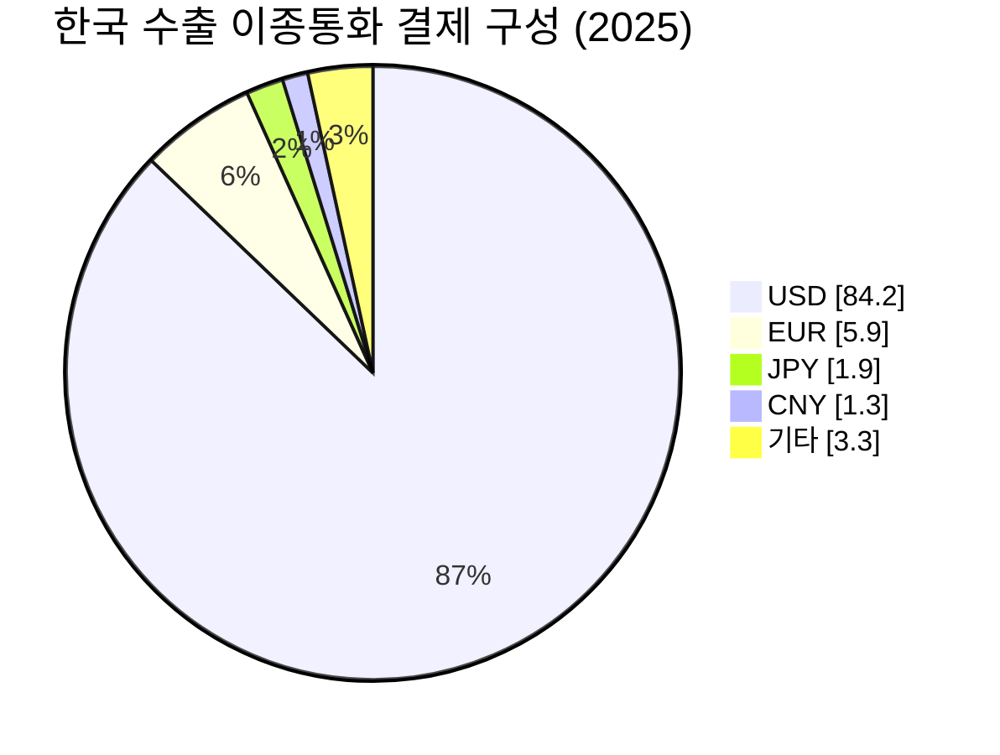
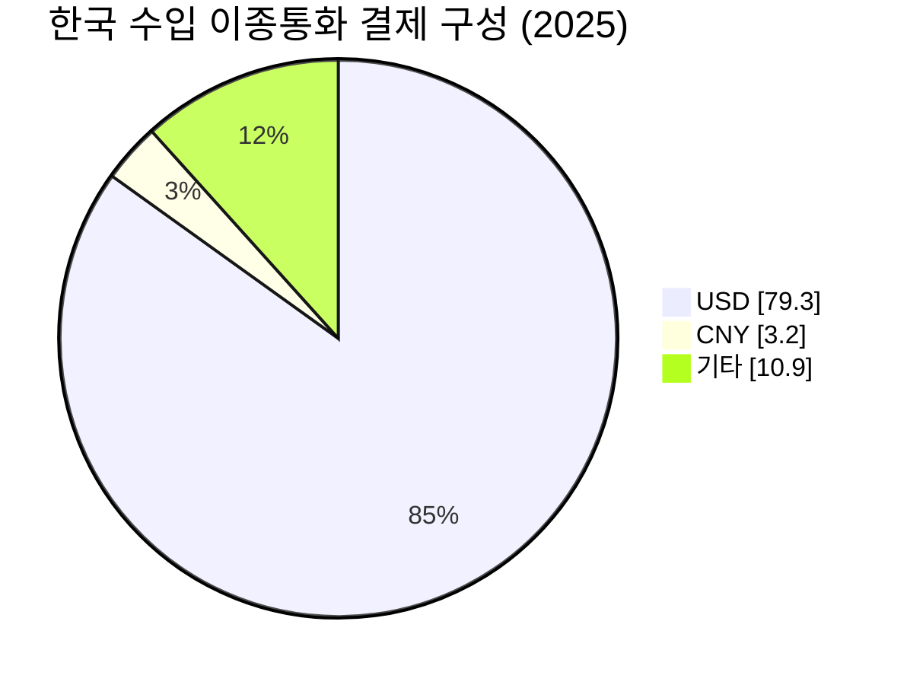
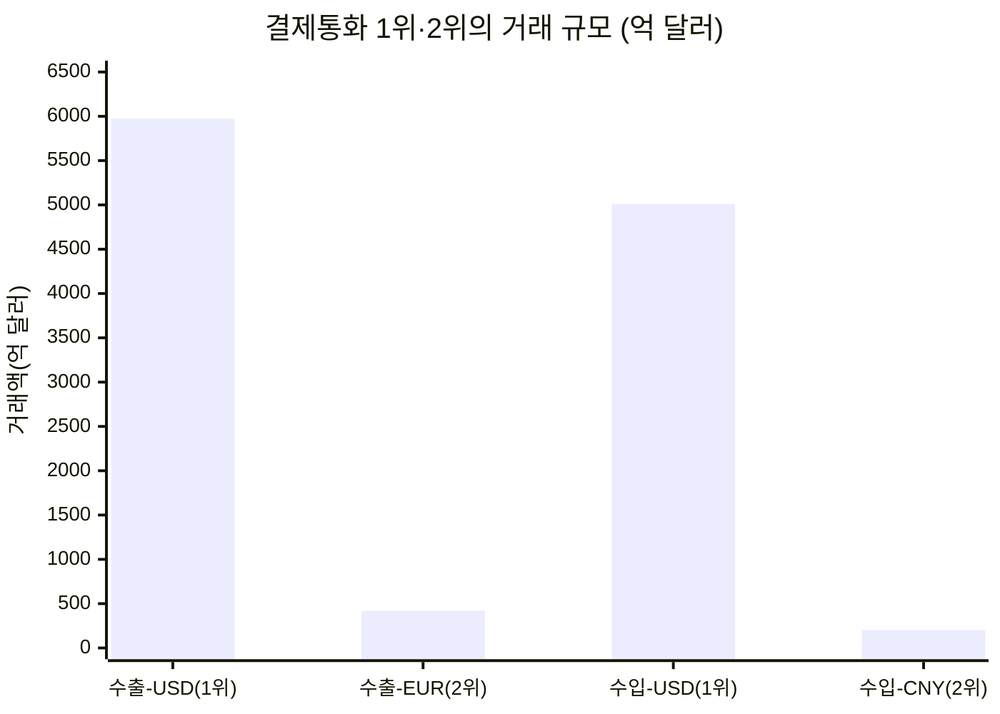
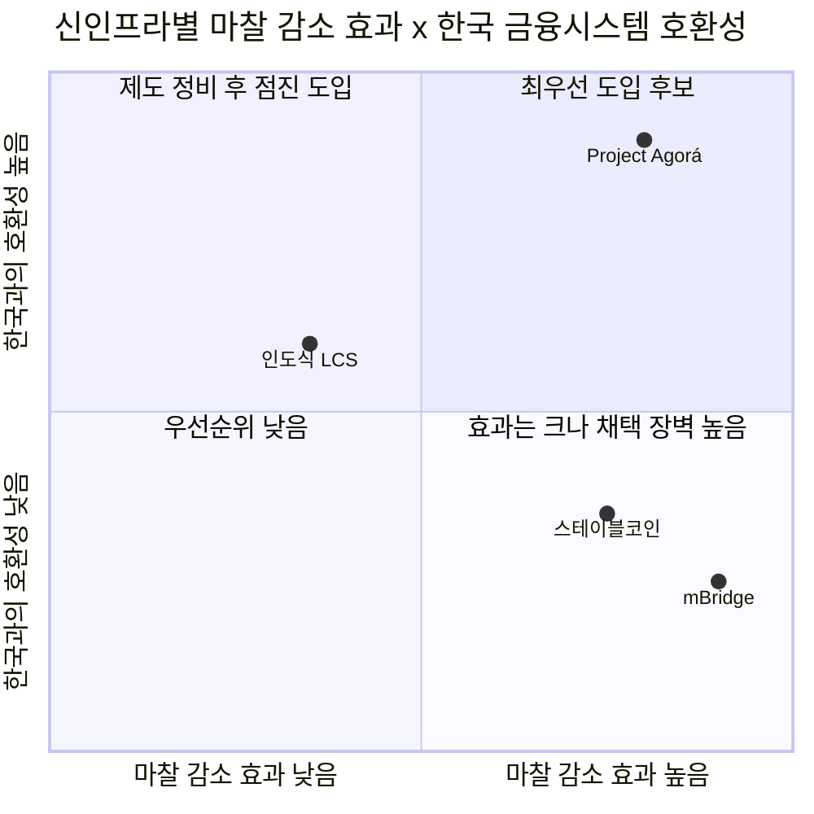
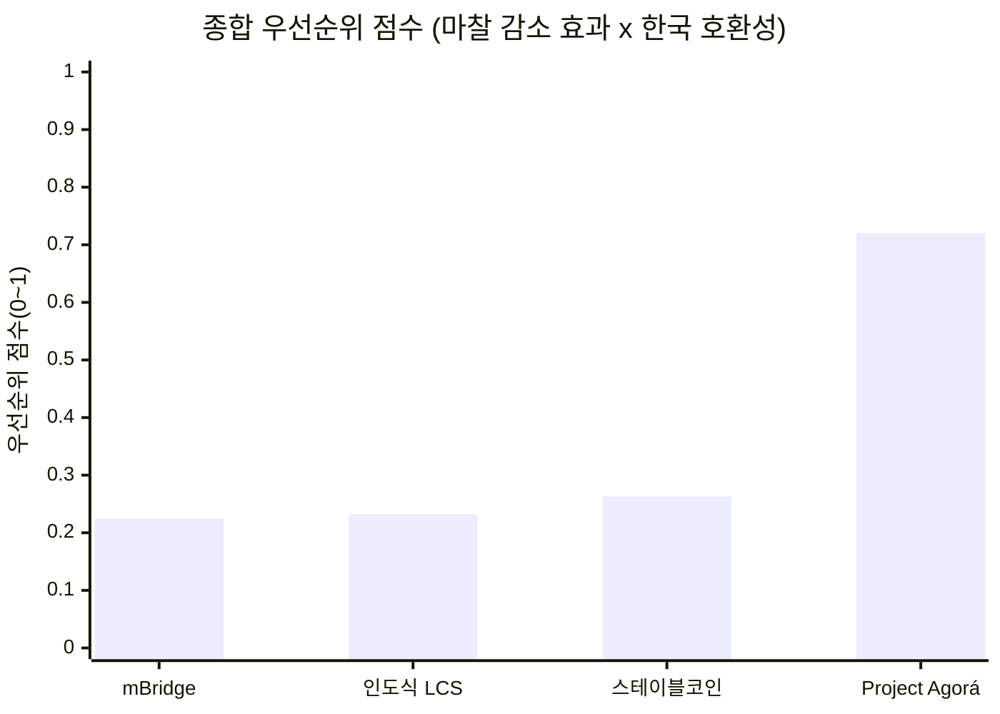

# 06 - 6단계: 반복적 정제 — 최종 시각화 자료

## 요약

- 한국의 국경간 결제는 통화 기준으로 극단적으로 집중돼 있다 — 자국통화(KRW)를 제외한 이종통화 중에서는 수출·수입 모두 USD가 80%대 안팎으로 압도적 1위이며, 2위 통화(수출 EUR 5.9%·수입 CNY 3.2%)와의 격차는 10배 이상이다.
- 신인프라 중에서는 **Project Agorá**가 마찰 감소 효과와 한국 금융시스템과의 호환성을 모두 충족하는 유일한 방식으로 확인된다 — 한국은행이 이미 실거래 테스트에 참여하고 있다는 사실이 이 결론의 핵심 근거다.
- mBridge는 마찰 감소 효과 자체는 크지만 위안화·중국 자본통제 중심 구조라 한국과의 호환성이 낮고, 인도식 로컬통화 직접결제와 스테이블코인은 효과·호환성 모두 중간 수준에 머문다.

---

## 1. 결제통화 구성 — 규모와 비중

원화(KRW)는 한국 기업 입장에서 환전이 필요 없는 자국통화이므로, 이 절의 분석에서는 제외한다 — 아래는 실제로 환전·정산 마찰이 발생하는 이종통화만을 대상으로 한다. 원화 결제 비중 자체(수출 3.4%·수입 6.6%)는 1단계 문서에서 확인할 수 있다.

### 1.1 이종통화별 구성

**그림 1. 한국 수출 이종통화 결제 구성(2025년, 한국은행 확정치)** — USD가 84.2%로 압도적 1위이며, EUR(5.9%)이 2위를 차지한다.

**그림 2. 한국 수입 이종통화 결제 구성(2025년, 한국은행 확정치)** — 개별 통화로 확인되는 2위는 위안화(CNY, 3.2%)이며, 나머지(10.9%)는 유로·엔 등이 섞인 "기타"로만 공개돼 있다.

### 1.2 1위·2위 통화의 거래 규모

**그림 3. 결제통화 1위·2위의 거래 규모(2025년, 억 달러 환산)**

| 구분 | 통화 | 비중 | 거래액(억 달러) |
|---|---|---|---|
| 수출 1위 | USD | 84.2% | 5,973 |
| 수출 2위 | EUR | 5.9% | 419 |
| 수입 1위 | USD | 79.3% | 5,010 |
| 수입 2위(개별 확인 가능 기준) | CNY | 3.2% | 202 |

원화를 제외하면 수출·수입 모두 2위 통화의 비중은 한 자릿수에 그치고, 1위 통화(USD)와의 격차는 10배 이상이다 — 시장 규모 산정의 1차 기준을 USD-KRW 코리도에 두는 근거가 된다. 다만 수입 결제통화 중 원화 다음으로 큰 비중(10.9%)은 유로·엔 등이 섞인 "기타"로만 공개돼 있어, 위안화가 실제 2위인지는 확정할 수 없다는 점은 한계로 남는다.

---

## 2. 신인프라별 마찰 감소 효과와 한국 적합성

### 2.1 마찰 감소 효과 × 한국 금융시스템 호환성

**그림 4. 신인프라별 마찰 감소 효과와 한국 금융시스템 호환성(자체 평가)** — Project Agorá만 유일하게 1사분면(최우선 도입 후보)에 위치한다.

| 방식 | 마찰 감소 효과 | 한국과의 호환성 | 호환성 판단 근거 |
|---|---|---|---|
| Project Agorá | 높음(3~5일 상당 → 약 80초) | 매우 높음 | 한국은행이 실거래 테스트에 직접 참여 중인 5개국 중 하나. 상업은행 예금·중앙은행 예금 중심 구조를 그대로 유지해 기존 은행 시스템과의 단절이 적음 |
| mBridge | 매우 높음(3~5일 → 수초, 비용 최대 80% 절감) | 낮음 | 거래량의 95%가 e-CNY로, 중국의 자본통제·국가주도 지배구조에 사실상 종속. 한국의 상대적으로 개방된 통화정책 체계와 결합 시 정책적 부담이 큼 |
| 인도식 로컬통화 직접결제(LCS) | 중간(FX 브릿지 통화 한 단계만 제거) | 중간 | 별도 기술 인프라 없이 양자 협정만으로 가능해 도입장벽은 낮으나, 원화의 국제화 수준이 인도 루피와 마찬가지로 낮아 상대국 확보가 관건 |
| 스테이블코인 | 높음(초 단위 정산, 낮은 수수료) | 낮음~중간 | 원화 스테이블코인 관련 법제가 아직 정비되지 않았고 은행권 중심 규제 방향이라 민간주도 모델과는 거리가 있음. 제도 정비 시 빠르게 도입 가능한 잠재력은 있음 |

### 2.2 종합 우선순위

**그림 5. 종합 우선순위 점수** — 그림 4의 두 축(마찰 감소 효과·호환성)을 곱한 자체 평가 점수다. Project Agorá(0.72)가 나머지 세 방식(0.22~0.26)을 큰 격차로 앞선다.

---

## 3. 전략적 시사점

1. **1순위: Project Agorá 중심 전략**. 마찰 감소 효과와 한국 금융시스템과의 호환성을 동시에 충족하는 유일한 대안이며, 한국은행이 이미 실거래 참여국이라는 점에서 추가 도입장벽이 가장 낮다.
2. **2순위군: 인도식 LCS·스테이블코인은 조건부 후보**. 인도식 LCS는 상대국과의 협정만으로 가능하지만 원화 국제화 수준이 관건이고, 스테이블코인은 국내 법제 정비가 선행돼야 한다. 두 방식 모두 Agorá 확산 이후의 보완재로 검토할 수 있다.
3. **mBridge는 기술적 매력과 별개로 정책적 우선순위에서 밀린다**. 효과 자체는 크지만 특정 통화(위안화)·특정 자본통제 체제에 사실상 종속된 네트워크이므로, 한국이 주도적으로 참여하기보다 관찰 대상으로 남겨두는 편이 합리적이다.
4. **시장 규모 산정은 USD-KRW 코리도를 1차 세그먼트로 삼는다**. 1절에서 확인한 압도적 통화 집중도(수출 84.2%·수입 79.3%)가 이 우선순위의 전제다.

## 참고자료

- 한국은행, "2025년 수출입 결제통화별 비중"(2026-04-16 발표)
- BIS·Bank of Thailand, "Findings from the mBridge Pilot"(2022-10-26)
- BIS 보도자료(p260527), Project Agorá 실거래 테스트 결과(2026-07-30)
- Khaleej Times, GKToday 등, 인도-UAE 로컬통화 직접결제(LCS) 협정 보도(2023)
- 04_TAM-SAM-SOM_마켓세그먼트 폴더 01~05 문서(1~5단계 산출물)
