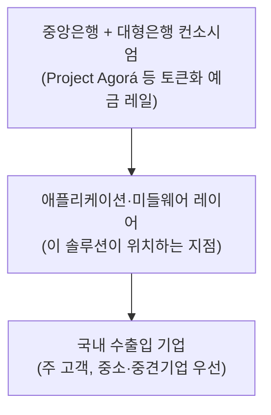
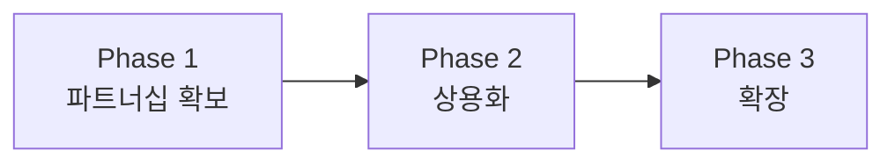

# 07 - 7단계: 솔루션 구체화 — 예금 토큰 기반 결제·정산 애플리케이션

## 요약

- 6단계 종합 우선순위(그림 5)에서 Project Agorá가 나머지 대안을 큰 격차로 앞섰다. 이번 검증에서 그 근거가 한층 구체화됐다 — Agorá의 2026년 7월 실거래 테스트는 GBP·EUR·JPY·KRW·CHF·USD 6개 통화를 다뤘고, 한국의 지배적 코리도인 **USD-KRW가 이미 실거래로 검증된 조합에 포함**돼 있었다.
- 다만 USD는 6개 통화 중 유일하게 발행 중앙은행이 실거래(real-value testing) 단계에 직접 참여하지 않았다. 뉴욕연은은 Project Agorá 자체에는 참여국으로 이름을 올렸지만, 실제 USD 토큰화 준비금을 발행하는 단계에는 참여하지 않았고 상업은행(JPMorgan·Citi 등)의 토큰화 예금이 이를 대신했다 — 국가 신용이 아니라 개별 은행 신용에 의존하는 구조라는 점은 리스크로 관리해야 한다. 공식적인 불참 사유는 공개되지 않았으나, 미국의 CBDC 정책과 연준의 토큰화 준비금 발행을 둘러싼 법적·정책적 불확실성이 배경으로 해석된다(추정).
- Agorá는 중앙은행·시스템적으로 중요한 대형은행만 참여하는 도매(wholesale) 초청제 네트워크다. 신규 진입자는 레일 자체를 구축할 수 없으므로, 솔루션은 **은행 파트너십을 통한 애플리케이션 레이어**로 정의한다.

---

## 1. 솔루션 방향의 근거

| 항목 | 내용 |
|---|---|
| 채택 인프라 | 토큰화 예금(Tokenized Deposit) — Project Agorá 계열 |
| 근거 1 | 6단계 종합 우선순위 점수 0.72(2위군 0.22\~0.26 대비 압도적) |
| 근거 2 | 한국은행이 실거래 테스트 참여국(2026-07-30) — 추가 도입장벽이 가장 낮음 |
| 근거 3(신규 확인) | 실거래 테스트 6개 통화에 USD-KRW가 포함 — 한국의 지배적 코리도(1절 6단계 문서)와 직접 일치 |
| 유의점 | 뉴욕연은은 Project Agorá 참여국이지만 실거래 단계의 USD 토큰화 준비금 발행에는 참여하지 않음 — USD 레그는 상업은행 토큰화 예금으로 대표되어 국가신용이 아닌 은행신용 리스크 존재. 불참 사유는 비공개이나 미국 CBDC 정책·연준의 토큰화 준비금 발행을 둘러싼 법적·정책적 불확실성이 배경으로 추정 |
| 접근 제약 | 도매·초청제 네트워크(중앙은행 + JPMorgan·Citi·UBS·Lloyds·CaixaBank 등) — 신규 진입자의 직접 참여 불가 |

## 2. 포지셔닝: 인프라가 아니라 애플리케이션 레이어

**그림 1. 솔루션의 위치 — 인프라(레일)와 최종 고객 사이의 애플리케이션 레이어**

03단계(핵심 성공 요인 분석)에서 이미 확인했듯, 이 시장의 1순위 성공 요인은 "은행 컨소시엄 파트너십 선점"이다. 토큰화 예금 레일 자체를 새로 만드는 것은 신규 진입자의 선택지가 아니며, 현실적인 진입 경로는 레일과 최종 고객 사이를 잇는 애플리케이션 레이어다.

## 3. 솔루션 개요

| 항목 | 내용 |
|---|---|
| 목적 | USD-KRW 코리도 중심으로, 국내 수출입 기업의 무역대금 결제·정산 마찰(FX 스프레드·처리지연·유동성 비효율)을 토큰화 예금 인프라에 연결해 감소시킨다 |
| 대상 고객 | 은행 컨소시엄과 직접 협상하기 어려운 중소·중견 수출입 기업 — 대기업은 이미 은행을 통해 직접 접근 가능 |
| 핵심 기능 | ① 토큰화 예금 ↔ 원화 온오프램프 연동 ② 실시간 정산 상태 조회 ③ 회계·ERP 연동(증빙 자동화) ④ AML/KYC 자동 심사 |
| 우선 처리 코리도 | 1차: USD-KRW / 2차: EUR-KRW·JPY-KRW(Agorá 확장 시) / 관찰 대상: CNY-KRW(mBridge 계열) |
| 수익 모델 | 거래 건당 수수료(전통 코리어뱅킹 대비 낮은 요율) + 회계·컴플라이언스 부가서비스 |

## 4. 실행 로드맵

| 단계 | 시기(안) | 핵심 활동 |
|---|---|---|
| Phase 1 — 파트너십 확보 | 착수 \~ 1년차 | 한강 프로젝트·Agorá 참여 은행(국내 4대 은행 등)과 접촉, 애플리케이션 레이어 공동 파일럿 제안 |
| Phase 2 — 상용화 | 1\~3년차 | API·미들웨어 서비스 출시, 초기 고객(USD-KRW 결제 비중이 큰 수출입 중소기업) 확보 |
| Phase 3 — 확장 | 3\~5년차 | EUR·JPY 코리도 대응 확대, CNY(mBridge)·인도식 LCS 등 대체 채널 병행 검토 |

**그림 2. 단계별 실행 순서**

## 5. 리스크와 대응

| 리스크 | 내용 | 대응 |
|---|---|---|
| USD 레그의 은행신용 의존 | 연준이 Project Agorá 참여국이면서도 실거래 준비금 발행 단계에는 불참(사유 비공개, 미국 CBDC 정책의 법적·정책적 불확실성으로 추정)해, 달러 결제가 상업은행 토큰화 예금에 의존 | 복수 파트너 은행 확보로 특정 은행 집중 리스크 분산, 연준 정책 변화 모니터링 |
| 상용화 시점 불확실성 | Agorá는 아직 1회차 실거래 테스트 단계 | 단기적으로는 기존 SWIFT·역외 원화결제망 개선과 병행 대응 |
| 신규 진입 장벽 | 은행 컨소시엄 중심 구조로 직접 참여 불가 | 03단계 KSF 1순위(파트너십 선점)에 따라 조기에 관계 구축 착수 |
| 통화 편중 | 이 솔루션은 USD-KRW에 집중되어 EUR·JPY·CNY 코리도는 후순위 | Phase 3에서 순차 확장, 그 사이 발생하는 수요는 기존 채널로 대응 |

## 참고자료

- BIS, "Project Agorá – Real value testing"(2026-07-30)
- Cointrust·Tech Times·Ledger Insights, Project Agorá 실거래 테스트 통화 구성 및 참여기관 보도(2026-07\~08)
- 04_TAM-SAM-SOM_마켓세그먼트 폴더 01\~06 문서(1\~6단계 산출물)
- 03_핵심성공요인_분석 폴더(Area B KSF: 은행 컨소시엄 파트너십 선점)
