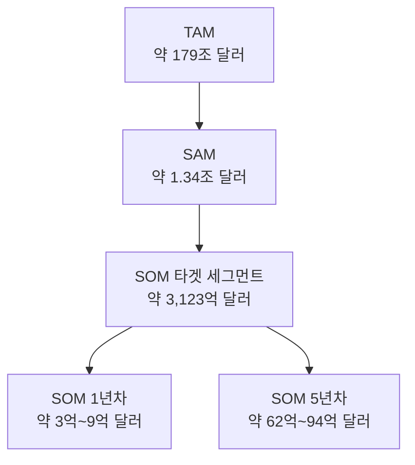
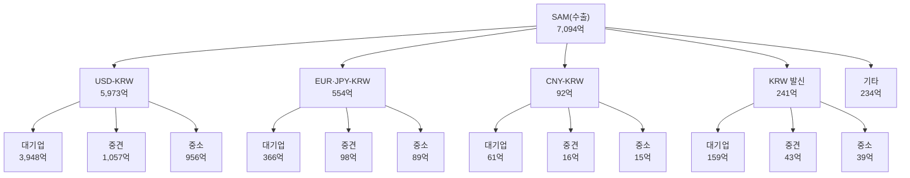
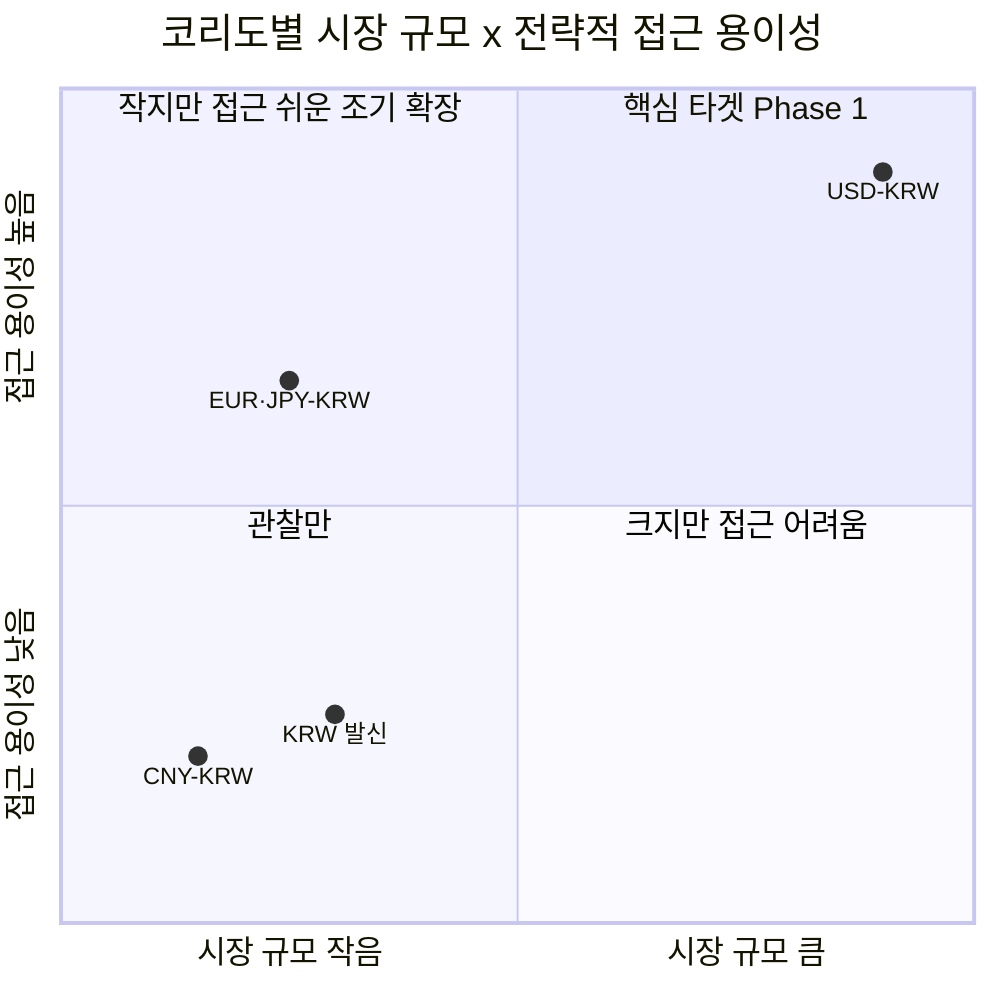

# 08 - TAM·SAM·SOM 및 Market Segment Map

## 요약

| 구분 | 정의 | 규모 | 근거 단계 |
|---|---|---|---|
| TAM | B2B 국경간 이종통화 결제·정산 인프라의 전체 시장 | **약 179조 달러** | 1단계 |
| SAM | 한국의 B2B 국경간 무역대금 결제 시장(결제통화 무관) | **약 1.34조 달러** | 2단계 |
| SOM | USD-KRW 코리도·중소중견기업 대상 확보 목표 | **1년차 약 3억\~9억 달러 → 5년차 약 62억\~94억 달러** | 7단계 |

---

## 1. TAM — 전체 시장

**정의**: 국경간 지급·환전·정산에 필요한 금융·기술 인프라의 전체 시장(1단계 시장 정의).

**근거**: McKinsey Global Payments Map(2024년) 기준 연간 국경간 지급 흐름은 약 179조 달러다. 이보다 넓은 개념(광의 국경간 금융결제, 약 1경 달러)은 금융기관간 대규모 거래까지 포함해 과대평가되고, 무역액만(약 33조 달러) 사용하면 기업 Treasury·계열사간 자금이동을 과소평가한다. 1단계에서 이미 이 판단에 따라 179조 달러를 상위 모수로 채택했다.

**TAM = 약 179조 달러**

한계: 이 수치는 동일통화권 내 거래(예: 유로존 역내)까지 포함하며, 전 세계 기준으로 "이종통화만"의 정확한 비중은 공식 통계로 분리되지 않는다.

## 2. SAM — 서비스 가능 시장

**정의**: 한국을 중심으로 한 B2B 국경간 무역대금 결제 시장. 2단계에서 거래유형(무역대금+Treasury/Intercompany)·지역(한국)으로 좁힌 시장이다.

### 결제통화를 기준으로 다시 제외하지 않는 이유

앞서 6단계에서는 "이종통화 마찰"을 분석할 때 원화(KRW) 결제분을 비교 대상에서 뺐다. 그러나 SAM은 "마찰의 종류를 분석하는 것"이 아니라 "인프라가 커버할 수 있는 시장 크기를 재는 것"이므로 기준이 다르다. 1단계에서 정리한 6가지 마찰 유형을 다시 보면:

| 마찰 유형 | 통화 전환이 있어야만 발생하는가 |
|---|---|
| 법·규제 분절 | 아니오 — 국경을 넘으면 발생 |
| 데이터·메시징 분절 | 아니오 |
| 중개은행망 분절 | 아니오 |
| 운영시간 분절 | 아니오 |
| 유동성 분절 | 부분적 |
| 환전(FX) 분절 | **예 — 이것만 순수하게 통화 전환에서 기인** |

6가지 중 5가지는 통화가 같아도 국경을 넘으면 그대로 발생한다. 토큰화 예금 인프라(7단계 솔루션)가 개선하는 것은 환전 스프레드만이 아니라 정산 구조 전체(속도·컴플라이언스·운영시간)이므로, 원화로 결제되는 거래도 이 인프라의 잠재 수요다. 다만 원화 결제 거래에서는 통화 전환의 부담이 한국 기업이 아니라 해외 거래처 쪽에 있다는 점이 다르며, 이는 5절에서 별도 세그먼트로 다룬다.

**산출**

| 구분 | 2025년 금액 |
|---|---|
| 수출 | 7,094억 달러 |
| 수입 | 6,318억 달러 |
| **합계(SAM)** | **약 1조 3,412억 달러(≈1.34조 달러)** |

한계: 2단계에서 SAM에 포함하기로 한 기업 Treasury·계열사간 자금이동은 한국 기준 별도 통계가 없어 반영하지 못했다 — 즉 이 SAM은 무역대금만 반영한 보수적 하한치다.

## 3. SOM — 실제 확보 가능 시장

**정의**: 7단계 솔루션이 실제로 겨냥하는 시장. SAM 전체가 아니라 ① USD-KRW 코리도(Phase 1 우선순위) ② 중소·중견기업(대기업은 은행에 직접 접근 가능해 제외)으로 좁힌다.

### 3.1 타겟 세그먼트 크기

| 구분 | 산출 근거 | 금액 |
|---|---|---|
| 수출 USD 거래액 | 7,094억 달러 × 84.2% | 5,973억 달러 |
| 수출 중 중소·중견기업 비중 | (중견 1,252 + 중소 1,135) ÷ 수출 7,094 = 33.7% | — |
| 수출 타겟 세그먼트 | 5,973억 × 33.7% | 약 2,013억 달러 |
| 수입 중소기업 거래액 | 중소기업 수입 1,400억 달러 × USD 79.3% | 약 1,110억 달러 |
| **타겟 세그먼트 합계** | | **약 3,123억 달러** |

한계: 수입 측 중견기업 통계가 별도 공개되지 않아 중소기업분만 반영했다 — 위 금액은 하한 추정치다.

### 3.2 시장점유율 가정과 SOM

토큰화 예금 레일은 아직 2026년 7월에 첫 실거래 테스트를 마친 단계이므로, 신규 진입자(애플리케이션 레이어)가 초기에 확보할 수 있는 몫은 크지 않다. 7단계 로드맵의 단계별 목표를 다음과 같이 가정한다.

| 시점 | 가정 점유율 | SOM(연간 거래액 기준) |
|---|---|---|
| Phase 1(1년차) | 0.1\~0.3%(파일럿 단계, 소수 파트너은행·초기 고객 한정) | 약 3억\~9억 달러 |
| Phase 2(3년차) | 1% | 약 31억 달러 |
| Phase 3(5년차) | 2\~3% | 약 62억\~94억 달러 |

**SOM 시나리오**: 1년차 약 3억\~9억 달러(기준치 0.2% 적용 시 약 6억 달러) → 3년차 약 31억 달러 → 5년차 약 62억\~94억 달러

이 점유율(1년차 0.1\~0.3%, 3년차 1%, 5년차 2\~3%)은 데이터로 확정된 값이 아니라, 은행 파트너십이 필요한 도매 인프라 기반 B2B 핀테크가 파일럿에서 상용화까지 밟는 통상적인 성장 곡선을 참고한 가정치다. 1년차는 Project Agorá 자체가 2026년 7월 첫 실거래 테스트(CHF 800,000 규모)를 막 마친 단계라는 점을 반영해 매우 보수적으로 잡았다.

## 4. TAM → SAM → SOM 퍼널

**그림 1. TAM·SAM·SOM 퍼널** — TAM에서 SAM으로 좁힐 때는 지역(한국), SAM에서 타겟 세그먼트로 좁힐 때는 통화(USD)와 고객 규모(중소·중견)가 기준이다. 타겟 세그먼트에서 SOM으로 좁힐 때는 확보 가능한 점유율(1년차 0.1\~0.3% → 5년차 2\~3%)이 기준이며, 두 시점을 함께 표시했다.

## 5. Market Segment Map

### 5.1 매트릭스 — 통화 코리도 × 기업 규모(수출 기준)

수출은 기업 규모별(대기업 66.1%·중견 17.7%·중소 16.0%) 통계가 전부 공개돼 있어 정확한 교차표를 만들 수 있다. 수입은 중소기업 비중(22.2%)만 공개되고 중견은 대기업과 묶여 있어 같은 정밀도로 교차할 수 없다 — 그래서 이 매트릭스는 수출 기준이며, 수입은 3.1절의 방식대로 별도 처리한다.

| 통화 코리도(수출) | 대기업 | 중견 | 중소 | 코리도 합계 |
|---|---|---|---|---|
| USD-KRW | 🟥 3,948억 | 🟧 1,057억 | 🟧 956억 | 5,973억 |
| EUR·JPY-KRW | 🟨 366억 | 🟩 98억 | 🟩 89억 | 554억 |
| CNY-KRW | 🟩 61억 | ⬜ 16억 | ⬜ 15억 | 92억 |
| KRW 발신 | 🟩 159억 | ⬜ 43억 | ⬜ 39억 | 241억 |
| 기타 | 🟩 155억 | ⬜ 41억 | ⬜ 37억 | 234억 |
| **기업규모 합계** | **4,689억** | **1,255억** | **1,136억** | **7,094억** |

🟥 3,000억+ · 🟧 1,000\~3,000억 · 🟨 200\~1,000억 · 🟩 50\~200억 · ⬜ 50억 미만(단위: 억 달러)

**근거**: 통화별 수출액(84.2%·5.9%·3.4%·1.9%·1.3%·3.3%) × 기업규모별 수출 비중(66.1%·17.7%·16.0%)을 곱해 산출했다. 두 비중이 통계상 서로 독립적으로 발표되어 실제 교차 데이터는 아니며, "특정 통화를 쓰는 기업의 규모 구성이 전체 수출기업의 규모 구성과 같다"는 단순화 가정을 전제한다 — 예를 들어 반도체 대기업이 USD 결제에 더 쏠려 있다면 USD-KRW의 대기업 비중은 표보다 실제로 더 클 수 있다.

### 5.2 분해도 — SAM(수출)이 세그먼트로 갈라지는 흐름

**그림 2. SAM(수출 7,094억 달러)의 코리도·기업규모별 분해도** — 5.1절 매트릭스와 같은 수치를 나무 구조로 재배열한 것이다. SAM→USD-KRW→대기업 갈래가 가장 크고, SOM 타겟(USD-KRW의 중견·중소, 굵은 글씨 없이도 두 번째로 큰 값들로 확인됨)이 그 다음으로 크다는 흐름이 드러난다. "기타"는 잔여 항목이라 더 세분화하지 않았다.

### 5.3 좌표평면 — 세그먼트별 전략적 포지셔닝

크기만으로는 우선순위를 정할 수 없다. 6\~7단계에서 판단한 "우리 솔루션(Agorá 계열)과의 접근 용이성"을 y축에 추가해 포지셔닝했다.

**그림 3. 코리도별 전략적 포지셔닝** — USD-KRW만 1사분면(핵심 타겟)에 위치한다. EUR·JPY-KRW는 규모는 작지만 Phase 1에서 확보할 Agorá 파트너십을 그대로 재사용할 수 있어 접근성이 높아 2사분면(조기 확장 후보)에, CNY-KRW는 별도 인프라(mBridge)·낮은 호환성(6단계 근거)으로 3사분면에, KRW 발신은 고객군 자체가 다르다는 점(해외 거래처 대상)에서 3사분면에 위치한다.

### 5.4 세그먼트 요약

| 세그먼트 | 규모(수출+수입 합산 가능한 경우) | 우선순위 | 권고 액션 |
|---|---|---|---|
| USD-KRW | 약 1조 983억 달러 | 1순위 | SOM 타겟(7단계 Phase 1), 중견·중소기업(3,123억 달러)부터 확보 |
| EUR·JPY-KRW | 수출 기준 554억 달러 이상 | 2순위 | Phase 1 파트너십을 재사용해 Phase 3에 조기 확장 |
| KRW 발신 | 약 658억 달러 | 3순위(별도 트랙) | 고객군을 해외 거래처로 넓히는 "역외 원화결제망"형 서비스로 SOM 밖에서 별도 검토(6절) |
| CNY-KRW | 약 294억 달러 | 관찰 | mBridge 계열 인프라·낮은 호환성으로 당분간 보류 |

## 6. SOM 밖의 확장 기회

KRW 발신 세그먼트(약 658억 달러)는 한국 기업이 아니라 해외 거래처가 환전 마찰을 겪는 영역이다. 지금의 SOM은 "국내 수출입기업"만을 고객으로 정의했기 때문에 이 세그먼트를 제외했지만, 같은 토큰화 예금 인프라로 서비스할 수 있는 영역이므로 Phase 3 이후 "역외 원화결제망" 연계 서비스로 고객군을 해외 거래처까지 넓히는 안을 다음 검토 과제로 남긴다.

## 참고자료

- 04_TAM-SAM-SOM_마켓세그먼트 폴더 01\~07 문서(1\~7단계 산출물)
- 한국은행, "2025년 수출입 결제통화별 비중"(2026-04-16 발표)
- 관세청·국가데이터처, 2025년 기업특성별 무역통계(잠정치)
- McKinsey & Company, "The 2025 McKinsey Global Payments Report"
