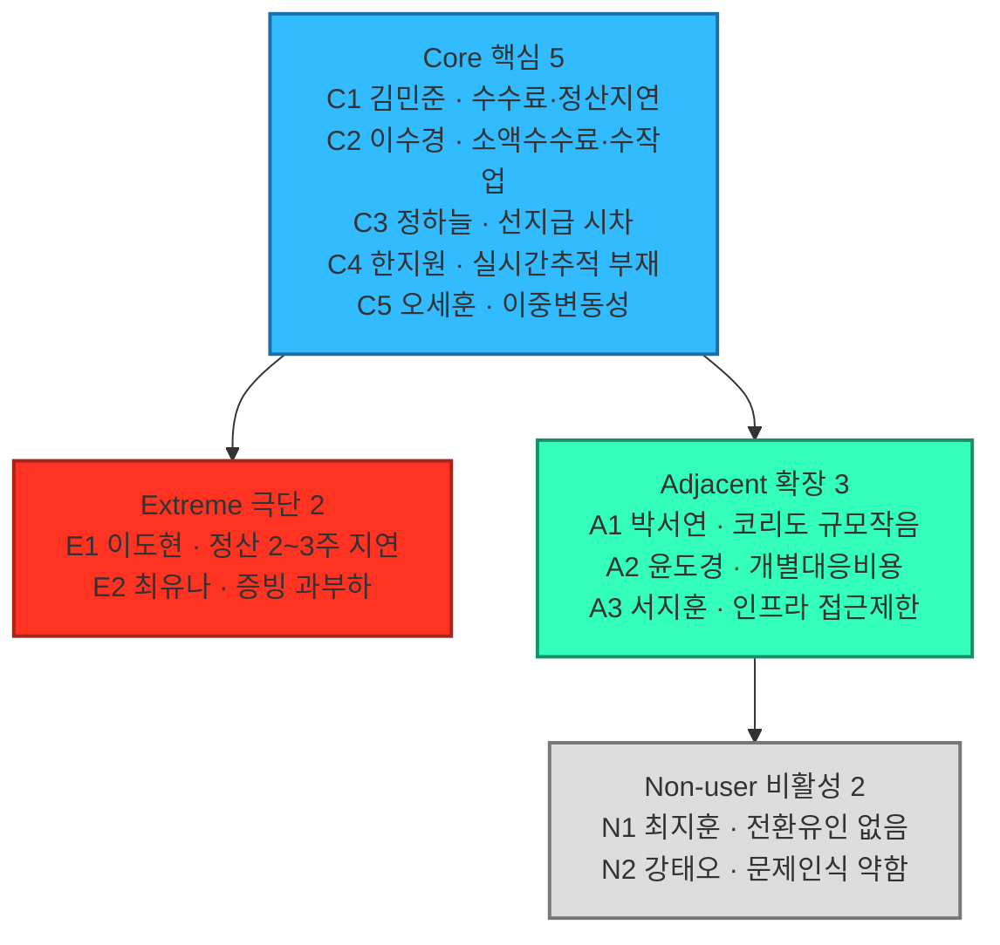
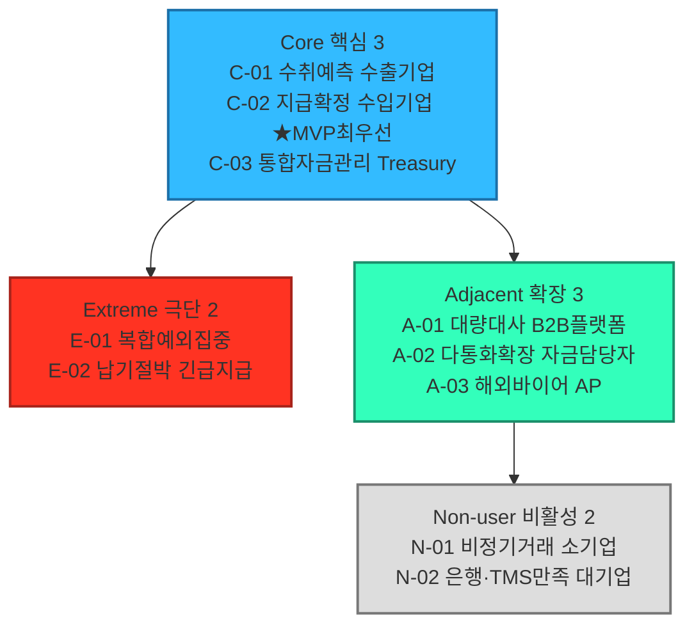

# 페르소나 스펙트럼 분석 보고서

## 요약

- 대상 세그먼트: 04챕터 `08_TAM_SAM_SOM_시장세그먼트맵.md`의 SOM 정의 — "반복적인 USD↔KRW 거래를 수행하며, 비용·정산시점·추적·대사 문제를 겪고 있고, 파트너은행과 ERP/API 연결이 가능한 국내 중소·중견 수출입기업".
- 방법론: `05_페르소나_고객여정지도/00_방법론.md` 2.1절의 5단계 워크플로우(1차 생성 → 2차 평가 → 3차 보정 → 4차 검증 → 5차 통합)를 적용했다. 외부 검증(GPT) 결과를 반영해 2단계 이후를 행동패턴 기준 10개 아키타입 체계로 재정리했다(아래 2단계 참고).
- 산출물: 1차 생성 12명(핵심 5·확장 3·극단 2·비활성 2)을 문제·행동 패턴 기준으로 재정리해 핵심 3·확장 3·극단 2·비활성 2, 총 10개 아키타입으로 수렴했다. 극단 유형은 특정 코리도(신흥시장 등)가 아니라 "우리 SOM 안에서도 발생하는 운영상 극단 상황"으로 재정의했다 — 코리도는 세그먼트 축이고 페르소나는 고객 특성 축이라는 이전 논의와 일관되게 맞췄다.
- 핵심 결론(최종 판단): **MVP 대표는 C-02(지급확정형 수입기업, 최우선)·C-01(수취예측형 수출기업)**이며, C-03은 상위 고객, A-01은 인접시장 대표, E-01·E-02는 예외·복구 검증군, N-01·N-02는 시장진입임계점·전환저항 검증군이다.
- 주의: 이 보고서의 인물명·회사명·거래 규모·손실률 등 구체 수치는 검증된 사실이 아니라 세그먼트 맵 수치를 인물 단위로 예시화한 **가설/예시값**이다. 세그먼트 맵 수치(억 달러 단위)와 직접 연결되지 않는 아키타입(C-03·A-03·E-01·E-02·N-01)은 특히 실제 조사가 필요하다.

## 0. 분석 대상과 근거 자료

이 보고서는 아래 세 문서를 1차 근거로 사용했다.

- `04_TAM-SAM-SOM_마켓세그먼트/08_TAM_SAM_SOM_시장세그먼트맵.md` — SOM 정의, 5.1 매트릭스(통화 코리도×기업 규모), 5.4 세그먼트 요약, 5.5 2×2 세그먼트 맵(정산 마찰×디지털 정산수단 적용 가능성), 6절(SOM 밖 확장 기회)
- `04_TAM-SAM-SOM_마켓세그먼트/07_7단계_솔루션구체화.md` — 대상 고객 정의(대기업 제외 이유), 솔루션 핵심 기능, 실행 로드맵
- `04_TAM-SAM-SOM_마켓세그먼트/06_6단계_반복적정제.md` — 통화별 거래 규모, 신인프라(Project Agorá)의 코리도별 호환성

## 1단계 — 1차 생성(Divergent Thinking)

00_방법론.md ①단계의 AI 프롬프트 예시("핵심 사용자 5명, 확장 사용자 3명, 극단 사용자 2명, 비활성 사용자 2명 — 각자 이름, 직무, 문제, 목표, 감정, 대체 솔루션 포함")를 그대로 적용해, 유형별로 시장 세그먼트 맵에서 근거를 갖는 후보 12명을 이름·직무 단위까지 발산했다. 이 12명은 산업(자동차부품·화장품·반도체 등)을 기준으로 나눈 초안이며, 2단계에서 행동 패턴 기준으로 다시 정리한다.

**핵심(Core) — 5명**

| 후보 | 이름 | 직무 | 문제 | 목표 | 감정 | 대체 솔루션 |
|---|---|---|---|---|---|---|
| C1 | 김민준 과장((주)한강정밀 자금팀) | 자동차부품·소재 대미 수출 자금관리 | 건별 수수료·FX 스프레드로 순매출 2\~3% 손실, 정산 3\~5일, 수작업 대사 주 2일↑ | 정산 리드타임 1일 이내, ERP 자동연동 증빙체계 | 반복 수작업에 지침, 담당자 교체 시 재설명 피로 | 주거래은행 1곳 외환서비스만 이용, 협상력 부족 |
| C2 | 이수경 대리((주)브라이트리빙 해외영업팀) | 소비재 완제품 소액다빈도 수출 정산 | 소액 거래일수록 수수료 부담이 상대적으로 크고, ERP 없이 엑셀로 수작업 | 소액 거래도 저렴하게 처리할 채널 확보 | "우리는 너무 작아 우선순위가 아닐 것"이라는 자조 | 없음 — 은행 창구 방문에 의존 |
| C3 | 정하늘 부장((주)대성소재 구매팀) | 원자재·부품 수입대금 지급 | 선지급 후 정산 확인까지 시차가 커 유동성 관리가 어려움 | 지급-확인 시차 축소로 자금계획 정확도 향상 | 환율 변동 구간에 지급이 몰리면 초조함 | 여러 은행 견적을 비교해 그때그때 선택, 관계 분산으로 협상력 약함 |
| C4 | 한지원 팀장((주)케이반도체소재 수출관리팀) | 반도체 소재 대량·고빈도 수출 정산 관리 | 거래 빈도가 높아 작은 스프레드도 누적 손실이 크고, 실시간 추적 수단이 없음 | 실시간 정산 조회로 자금 포지션 즉시 파악 | 여러 건이 겹칠 때 진행 상황을 놓칠까 불안 | 내부 스프레드시트로 수동 추적 |
| C5 | 오세훈 과장((주)그린켐 수출팀) | 화학·소재 수출 정산 및 환리스크 관리 | 원자재가·환율이 동시에 흔들리면 정산 지연이 겹쳐 손실이 배로 커짐 | 정산 시점을 예측 가능하게 해 환리스크 대응 타이밍 확보 | 이중 변동성에 대한 경계심 | 선물환 헤지 + 기존 은행 정산, 헤지 비용 부담 |

**확장(Adjacent) — 3명**

| 후보 | 이름 | 직무 | 문제 | 목표 | 감정 | 대체 솔루션 |
|---|---|---|---|---|---|---|
| A1 | 박서연 팀장((주)오션바이오 해외영업팀) | 화장품 원료 EUR·JPY 수출 정산 | Core와 동일한 마찰을 겪지만 코리도 규모(554억 달러)가 작아 은행의 우선 협상 대상이 아님 | 검증된 서비스가 있다면 같은 파트너망으로 조기 전환 | "왜 우리는 나중인가"라는 소외감 | 유럽계 은행의 다국적기업용 트레저리 서비스, 비용이 높음 |
| A2 | 윤도경 대표(트레이드링크) | 다수 화주사의 해외결제를 대리 처리하는 플랫폼 운영 | 화주사마다 은행·통화가 달라 개별 대응 비용이 큼 | 여러 화주사의 거래를 하나의 인프라로 통합 처리 | 화주사 수가 늘수록 관리 복잡도가 커지는 데 대한 부담 | 화주사별로 다른 은행 채널을 그대로 중개 |
| A3 | 서지훈 차장((주)한중무역 자금팀) | 위안화 결제 거래의 정산·리스크 관리 | mBridge 등 위안화 전용 인프라는 접근이 어렵고, 기존 SWIFT망은 느림 | 위안화 결제도 USD-KRW 수준의 처리 속도 확보 | 인프라 선택지가 제한적인 데 대한 답답함 | 기존 SWIFT 중개은행망 |

**극단(Extreme) — 2명**

| 후보 | 이름 | 직무 | 문제 | 목표 | 감정 | 대체 솔루션 |
|---|---|---|---|---|---|---|
| E1 | 이도현 대표((주)그린모빌) | 신흥시장(동남아) 배터리부품 수출 | 유동성·환전·법·규제 분절이 동시에 발생해 정산이 2\~3주씩 지연, 원재료 구매 악순환 | 정산 지연을 줄이고 싶으나, 이 코리도는 신인프라 실거래 검증 대상이 아님 | "해결해줄 곳이 없다"는 좌절감, 신규 서비스에 대한 기대·의심 공존 | 로컬 환전상·비공식 채널을 규제 리스크를 알면서도 사용 |
| E2 | 최유나 대표(유나트레이딩, 1인 무역업체) | 영업·정산·증빙을 대표 1인이 전담 | 건마다 수작업 증빙에 하루 이상 소요돼 본업(영업)에 쓸 시간이 없음 | 증빙·신고 자동화로 영업에 쓸 시간을 되찾는 것 | 관리 업무에 압도돼 사업 확장을 미루는 조바심 | 세무사·관세사 외주 — 매출 대비 비용 부담이 과도함 |

**비활성(Non-user) — 2명**

| 후보 | 이름 | 직무 | 문제 | 목표 | 감정 | 대체 솔루션 |
|---|---|---|---|---|---|---|
| N1 | 최지훈 부장((주)한빛전자 글로벌자금팀) | 대기업 USD-KRW 글로벌 자금관리 | 은행 우대처리·자체 TMS로 실질 마찰이 이미 낮음 | 전환 유인이 없으며, 신생 애플리케이션 레이어에 자금을 노출하는 리스크를 우려 | 신중하고 보수적 — "이미 문제가 없는데 왜 바꾸나" | 기존 은행 딜링데스크 + 자체 TMS |
| N2 | 강태오 과장((주)신성무역 자금팀) | 위안화 결제 거래 관리 | 현재 방식(SWIFT)에 큰 불만은 없고, 속도가 느리다는 인식만 있음 | 명확한 전환 목표가 없음 — 문제 인식 자체가 약함 | 새 인프라보다 익숙한 방식에 대한 신뢰가 더 큼 | 기존 SWIFT 중개은행망 |

**1차 생성 후보 12명 시각화** — 12명 각각을 낱개 상자로 펼치면 한눈에 들어오지 않아, 유형별 1개 상자에 구성원과 문제 키워드만 나열하는 방식으로 압축했다. 상세 속성(목표·감정·대체 솔루션)은 위 표를 참고한다.

Core(위)→Extreme·Adjacent(중간)→Non-user(아래) 순으로 흐르며, 상자 4개로만 구성해 가로·세로 어느 한쪽으로 크게 치우치지 않도록 했다. 이 12명을 어떻게 재정리했는지는 2단계에서 다룬다.

## 2단계 — 2차 평가(Convergent Filtering): 행동패턴 기준 10개 아키타입으로 재정리

산업(자동차부품·화장품 등) 기준으로 나눈 1단계 12명은 결제 상품 관점에서는 구분력이 약하다는 외부 검증 의견을 받아들여, "어떤 산업인가"가 아니라 "결제·정산에서 어떤 행동패턴을 보이는가"를 기준으로 재정리했다. 그 결과 핵심 3·확장 3·극단 2·비활성 2, 총 10개 아키타입으로 수렴했다.

| 아키타입 | 아키타입명 | 원 후보 매핑 | 재정리 근거 |
|---|---|---|---|
| C-01 | 수취예측형 수출기업 재무담당자 | C1+C4+C5 통합 | 자동차부품·반도체소재·화학소재는 산업만 다를 뿐, "수출 대금을 받는 시점을 예측하고 싶다"는 동일한 행동패턴이라 하나로 묶었다 |
| C-02 | 지급확정형 수입기업 결제담당자(MVP 최우선) | C3 | 수입기업은 "대금을 낸 뒤 확인까지의 시차"라는, 수출기업과는 반대 방향의 문제를 겪어 별도 아키타입으로 유지 |
| C-03 | 통합자금관리형 중견기업 Treasury Manager | 신규(가설) | C1\~C5 어느 후보도 다루지 못한 "여러 코리도·법인의 포지션을 한눈에 보고 싶다"는 상위 관리자 시점을 신규로 추가 |
| A-01 | 대량대사형 B2B 플랫폼 정산운영자 | A2 | 변경 없음 |
| A-02 | 다통화확장형 글로벌 자금담당자 | A1+A3 통합 | EUR·JPY와 CNY는 통화만 다를 뿐 "다음 통화로 확장할 때 같은 마찰을 겪는다"는 동일 패턴이라 통합 |
| A-03 | 한국거래형 해외 바이어 AP Manager | 신규(가설) | 08문서 6절(KRW 발신·역외 원화결제망, 약 658억 달러)에서 이미 다룬 "해외 거래처가 마찰을 겪는" 관점을 페르소나로 처음 구체화 |
| E-01 | 복합예외집중형 정산운영자 | E2 재정의 | "1인 무역업체"라는 규모 조건을 빼고, 규모와 무관하게 예외처리가 몰리는 시점의 행동패턴으로 일반화 |
| E-02 | 납기절박형 긴급지급 담당자 | 신규(가설), E1 대체 | E1(신흥시장·자본통제 코리도)은 코리도라는 세그먼트 축을 페르소나 축에 다시 섞은 것이라 정리 대상으로 판단해 제외했다. 극단 사용자는 "우리 SOM 밖의 다른 시장"이 아니라 "우리 SOM 안에서도 벌어지는 운영상 극단 상황"이어야 앞서 논의한 축 분리 원칙과 맞는다. 대안으로 "결제 마감이 임박한 긴급지급"이라는, USD-KRW 핵심 고객군 안에서도 벌어질 수 있는 극단 상황을 신규로 세웠다 |
| N-01 | 비정기거래형 소기업 | 신규(가설) | "거래가 드물어 편익 자체가 작다"는, N2와는 다른 비사용 원인을 별도로 세웠다 |
| N-02 | 기존 은행·TMS 만족형 대기업 | N1(+N2 흡수) | N2(위안화 결제 대기업)도 "이미 익숙한 방식에 만족"이라는 동일 메커니즘이라 N1에 흡수 통합 |

## 3단계 — 3차 보정(Contextual Rewriting): 페르소나 카드

토큰화 예금 기반 결제·정산 애플리케이션(07문서 3절 솔루션 개요)을 기준으로 10개 아키타입을 구체화했다. **아래 인물명·회사명·구체 수치는 모두 가설/예시값이며, 실제 인터뷰·데이터로 검증되지 않았다.**

### C-01 수취예측형 수출기업 재무담당자 — 김민준 과장, (주)한강정밀(예시)

| 항목 | 내용 |
|---|---|
| 회사 프로필(예시값) | 자동차부품·반도체소재·화학소재 등 대미 수출 중견기업, 연 수출액 약 1,500만 달러(USD-KRW), SAP ERP 구축 |
| 문제 | 건별 중개은행 수수료·FX 스프레드로 순매출 2\~3%(가설) 손실, 정산까지 3\~5일 소요, 수작업 대사·증빙에 주 2일 이상 소요 |
| 목표 | 정산 리드타임을 하루 이내로 축소하고, ERP 자동 연동 증빙체계로 대사 인력 부담을 줄이는 것 |
| 감정 | 반복되는 수작업에 지쳐 있고, 은행 담당자가 바뀔 때마다 절차를 재설명해야 하는 데 피로감을 느낀다 |
| 대체 솔루션 | 주거래은행 1곳의 외환 서비스만 이용 — 비교견적을 낼 협상력이 부족하다 |

### C-02 지급확정형 수입기업 결제담당자(MVP 최우선) — 정하늘 부장, (주)대성소재(예시)

| 항목 | 내용 |
|---|---|
| 회사 프로필(예시값) | 원자재·부품 수입 중견기업(USD-KRW), 구매팀이 해외 공급사 대금 지급을 담당 |
| 문제 | 선지급 후 정산 확인까지 시차가 커 유동성 관리가 어렵고, 지급 확정 시점을 예측할 수 없다 |
| 목표 | 지급-확인 시차를 축소해 자금계획의 정확도를 높이는 것 |
| 감정 | 환율 변동 구간에 지급이 몰리면 초조하다 |
| 대체 솔루션 | 여러 은행 견적을 비교해 그때그때 선택 — 관계가 분산돼 협상력이 약하다 |
| MVP 우선 지정 이유 | 수출 측(C-01)보다 "지급을 확정해야 하는" 문제가 유동성 관리에 곧바로 연결돼 문제 심각도가 더 높다고 판단(4단계 근거 참고) |

### C-03 통합자금관리형 중견기업 Treasury Manager — 배시온 이사(가칭), (주)한강정밀(예시, C-01과 같은 회사의 상위 관리자 시점)

| 항목 | 내용 |
|---|---|
| 회사 프로필(예시값·신규 아키타입) | 여러 코리도(USD·EUR·JPY 등)와 계열사를 동시에 관리하는 중견기업 트레저리 총괄 |
| 문제 | 코리도·법인마다 거래 은행이 달라 전체 통화 포지션을 한눈에 보지 못한다 |
| 목표 | 전체 통화 포지션을 통합해 보여주는 대시보드 확보 |
| 감정 | 부분적으로만 최적화되는 상황이 반복되는 데 대한 답답함 |
| 대체 솔루션 | 법인·코리도별 은행 리포트를 수동으로 취합 |

### A-01 대량대사형 B2B 플랫폼 정산운영자 — 윤도경 대표, 트레이드링크(예시)

| 항목 | 내용 |
|---|---|
| 회사 프로필(예시값) | 다수 화주사의 해외결제를 대리 처리하는 B2B 결제 플랫폼 운영자 |
| 문제 | 화주사마다 은행·통화가 달라 개별 대응 비용이 크다 |
| 목표 | 여러 화주사의 거래를 하나의 인프라로 통합 처리 |
| 감정 | 화주사 수가 늘수록 관리 복잡도가 기하급수적으로 커지는 데 대한 부담 |
| 대체 솔루션 | 화주사별로 다른 은행 채널을 그대로 중개 |

### A-02 다통화확장형 글로벌 자금담당자 — 박서연 팀장, (주)오션바이오(예시)

| 항목 | 내용 |
|---|---|
| 회사 프로필(예시값) | 유럽·일본(EUR·JPY-KRW) 수출 중견기업 — 위안화(CNY-KRW) 등 다른 통화 확장 시에도 동일 패턴 반복 | 
| 문제 | Core와 동일한 마찰을 겪지만 코리도 규모가 작아 은행의 우선 협상 대상이 되지 못한다 |
| 목표 | 검증된 서비스가 있다면 같은 파트너망으로 조기 전환 |
| 감정 | "이미 검증된 서비스가 있다면 왜 우리는 나중인가"라는 소외감 |
| 대체 솔루션 | 유럽계 은행의 다국적기업용 트레저리 서비스, 비용이 높음 |

### A-03 한국거래형 해외 바이어 AP Manager — Mia Tan(가칭), Southeast Textile Co.(예시, 해외법인)

| 항목 | 내용 |
|---|---|
| 회사 프로필(예시값·신규 아키타입) | 한국 공급사에 KRW 또는 USD로 대금을 지급하는 해외 바이어측 AP(Accounts Payable) 담당자. 08문서 6절 "KRW 발신" 세그먼트(약 658억 달러)에 대응 |
| 문제 | 한국 결제망 접근이 어려워 대금 지급이 지연되고, 한국 공급사와의 관계가 나빠진다 |
| 목표 | 한국 공급사에 대한 결제를 더 간단하고 예측 가능하게 만드는 것 |
| 감정 | 결제 실패로 거래 관계에 대한 신뢰를 잃을까 하는 불안 |
| 대체 솔루션 | 현지 은행의 크로스보더 서비스 — 비용과 시간이 많이 든다 |
| 비고 | 고객군이 국내가 아니라 해외이므로, SOM(국내 수출입기업)과는 별도 트랙이다(08문서 6절과 동일한 결론). 추가 확인: 리서치DB `deepresearch-해외사례.md`에 한국은행이 이 문제를 직접 겨냥한 "원화국제결제망"을 구축 중이라는 기록이 있다(2026-09 시범 운영, 2027년 상반기 24/7 전환, KB·우리·하나·신한 4개 은행 참여, 목적은 외국인 원화거래 접근성 개선). 즉 A-03의 문제 자체는 실재하지만, 우리 애플리케이션이 아니라 한은 주도 인프라가 먼저 해소할 가능성이 있다 — MVP 적합성을 "낮음"으로 유지하는 근거가 하나 더 늘었다 |

### E-01 복합예외집중형 정산운영자 — 최유나 대표, 유나트레이딩(예시, 규모와 무관하게 재정의)

| 항목 | 내용 |
|---|---|
| 회사 프로필(예시값) | 영업·정산·증빙을 소수 인력이 전담하는 무역업체 — 규모가 아니라 "예외 처리가 몰리는 상황"이 핵심 |
| 문제 | 건마다 수작업 증빙에 하루 이상 소요돼 본업(영업)에 쓸 시간이 없다 |
| 목표 | 증빙·신고 자동화로 영업에 쓸 시간을 되찾는 것 |
| 감정 | 관리 업무에 압도돼 사업 확장을 미루는 조바심 |
| 대체 솔루션 | 세무사·관세사 외주 — 매출 대비 비용 부담이 과도하다 |

### E-02 납기절박형 긴급지급 담당자 — 한이든 과장(가칭), (주)스피드모터스(예시, 신규)

| 항목 | 내용 |
|---|---|
| 회사 프로필(예시값·신규 아키타입) | USD-KRW 핵심 고객군(C-01·C-02와 동일 세그먼트) 안에서도, 특정 선적·계약 건이 갑자기 긴급해지는 상황을 겪는 담당자 |
| 문제 | 일반 정산 리드타임(3\~5일)으로는 선적 마감을 맞추지 못해 위약금 리스크가 발생 |
| 목표 | 확정된 초단기 결제 옵션 확보 |
| 감정 | 마감 시한을 앞둔 압박감 |
| 대체 솔루션 | 프리미엄 수수료를 주고 특급송금을 이용 |
| 비고 | 특정 코리도(신흥시장 등)가 아니라 SOM 핵심 고객군 안에서도 발생하는 시점적 극단 상황이라는 점에서 E-01과 함께 "예외·복구 검증군"으로 묶었다 |

### N-01 비정기거래형 소기업 — 정다은 대표(가칭), (주)라인크래프트(예시, 신규)

| 항목 | 내용 |
|---|---|
| 회사 프로필(예시값·신규 아키타입) | 연 2\~3회만 해외거래가 발생하는 소규모 제조업체 |
| 문제 | 도입해도 쓸 일이 드물어, 학습·연동 비용이 얻는 편익보다 크다 |
| 목표 | 명확한 전환 목표가 없음 — 전환 필요성 자체를 느끼지 못한다 |
| 감정 | "가끔 쓸 걸 위해 새 시스템을 배우고 싶지 않다" |
| 대체 솔루션 | 그때그때 은행 창구를 방문 |
| N-02와의 차이 | N-02는 "이미 만족해서" 비사용이고, N-01은 "편익이 너무 작아서" 비사용이다 — 비사용 원인 자체가 다르다 |

### N-02 기존 은행·TMS 만족형 대기업 — 최지훈 부장, (주)한빛전자(예시)

| 항목 | 내용 |
|---|---|
| 회사 프로필(예시값) | USD-KRW 대기업, 4대 은행과 우대환율·전용 딜링데스크 계약 체결, 자체 TMS 구축 |
| 문제 | 실질적 마찰이 이미 낮다 — 은행이 대기업 물량을 우대 처리하고, 내부 TMS가 대사·리포팅을 자동화한다 |
| 목표 | 전환 유인이 없으며, 검증되지 않은 신생 애플리케이션 레이어에 자금을 노출하는 리스크를 우려한다 |
| 감정 | 신중하고 보수적 — "이미 문제가 없는데 왜 바꾸나" |
| 대체 솔루션 | 기존 은행 딜링데스크와 자체 TMS |

## 4단계 — 4차 검증: 10개 아키타입 교차평가

근거 없는 정밀 점수 대신 `매우 높음·높음·중간·낮음` 4단계로만 평가했다. 세그먼트 맵에 수치 근거가 없는 아키타입은 근거/비고에 "가설"로 명시했다. 표 아래 "리서치DB 재검토 결과"에서 이 가설들을 실제로 확인한 내용을 정리했다.

| 아키타입 | 문제심각도 | 발생빈도 | 도입가능성 | 사업잠재력 | MVP 적합성 | 근거/비고 |
|---|---|---|---|---|---|---|
| C-01 수취예측형 수출기업 | 높음 | 높음 | 높음 | 높음 | 높음 | 08문서 3.1 SOM 타겟(수출 측), 07문서 대상 고객 정의와 부합 |
| C-02 지급확정형 수입기업 | 매우 높음 | 높음 | 높음 | 높음 | 매우 높음 | 08문서 3.1 수입 측 타겟(약 1,110억 달러). 지급 확정성이 유동성 관리에 직결돼 문제심각도를 최상으로 판단 |
| C-03 통합자금관리 Treasury | 중간 | 중간 | 중간 | 높음 | 중간 | 신규 아키타입 — 세그먼트 맵·리서치DB 모두에 "여러 코리도 통합관리"를 특정한 수치·근거 없음(가설 유지) |
| A-01 대량대사 B2B플랫폼 | 높음 | 높음 | 중간 | 높음 | 중간 | 08문서 5.5 Q1 사례. 다만 대리 구조라 "국내 수출입기업"이라는 SOM 정의와는 정확히 일치하지 않음. 리서치DB에도 "화주사 대리형 플랫폼"을 특정한 근거는 없음(가설 유지) |
| A-02 다통화확장 자금담당자 | 중간 | 중간 | 중간 | 중간 | 낮음 | 08문서 5.4(EUR·JPY 554억, CNY 92억 달러) — Phase 1 이후 대상 |
| A-03 해외바이어 AP | 중간 | 중간 | 낮음 | 중간 | 낮음 | 08문서 6절 KRW 발신(약 658억 달러) 근거. **리서치DB 확인: 한국은행이 이 문제를 겨냥한 "원화국제결제망"을 이미 구축 중(2026-09 시범, 2027 상반기 24/7)** — 문제는 실재하나 우리 MVP가 아니라 한은 인프라가 먼저 해소할 가능성 |
| E-01 복합예외집중 | 높음 | 낮음 | 중간 | 낮음 | 중간 | **리서치DB 확인**: 원 마찰유형 리서치(`b2b 국경간 결제정산 문제와 원인.md`)에 "데이터·메시징 표준 미흡 → STP 저해 → 예외처리율 증가"가 이미 기록돼 있어, 메커니즘 자체는 가설이 아니라 원 리서치에 근거를 둔다. 다만 발생 규모는 별도 산출 없음 |
| E-02 납기절박 긴급지급 | 높음 | 낮음 | 중간 | 낮음 | 중간 | 정산 리드타임이 통상 1\~5일이라는 전제는 리서치DB 다수 소스(SWIFT GPI 관련)로 뒷받침되나, "선적 마감을 못 맞춘다"는 구체적 시나리오 자체는 확인 못함(가설 유지) |
| N-01 비정기거래 소기업 | 낮음 | 낮음 | 높음 | 낮음 | 낮음 | **리서치DB 확인**: 원 리서치(`deepresearch_cross-border...market.md`)의 전략 시사점에 "저빈도·단기거래는 현행 방식도 허용범위"라는 문장이 이미 있어, 이 아키타입의 방향 자체는 원 리서치와 일치. 다만 국내 기업 중 몇 %가 이런 저빈도 거래기업인지는 확인 못함 |
| N-02 은행·TMS만족 대기업 | 낮음 | 높음 | 높음 | 낮음 | 낮음 | 07문서 대기업 제외 논리, 08문서 5.1 대기업 비중(66.1%) |

### 리서치DB 재검토 결과

`요약`에서 "실제 조사가 필요하다"고 표시한 5개 아키타입(C-03·A-03·E-01·E-02·N-01)을 `리서치DB/` 원자료로 다시 확인했다.

- **upgrade(원 리서치에 근거 있음)**: E-01(예외처리율 증가 메커니즘), N-01(저빈도 거래는 현행 방식도 허용범위)은 이번 보고서를 위해 지어낸 가정이 아니라, 04챕터 1단계 리서치 원자료에 이미 있던 시사점이다.
- **upgrade(관련 정책 확인)**: A-03(해외 바이어)이 겪는 문제 자체는 실재하며, 한국은행이 "원화국제결제망"으로 별도 대응 중이라는 사실을 확인했다 — 다만 이는 A-03의 MVP 적합성을 낮추는 방향의 근거다(경쟁·대체 인프라가 이미 진행 중).
- **여전히 가설(리서치DB에 근거 없음)**: C-03(통합 자금관리 대시보드 니즈), A-01(화주사 대리형 플랫폼이 정확히 이 구조인지), E-02(선적 마감 시나리오의 구체적 발생 빈도)는 이번 재검토로도 뒷받침 자료를 찾지 못했다 — 실제 인터뷰가 필요하다.

## 5단계 — 5차 통합: 최종 판단(Persona Spectrum Map)

**그림 1. 페르소나 스펙트럼 맵(10개 아키타입 최종본)** — 1단계 12명을 2단계에서 행동패턴 기준 10개로 재정리한 결과다. C-02에만 "★MVP최우선" 표시를 남기고, 나머지 서열은 아래 최종 판단 표로 분리했다.

### 핵심 질문에 대한 답

- (핵심) 이상적인 주요 고객군은 누구인가? → C-02 지급확정형 수입기업(최우선), C-01 수취예측형 수출기업
- (확장) 유사한 제품/서비스를 사용하고 있는 사람은 누구인가? → A-02 다통화확장형 글로벌 자금담당자(유럽계 은행 트레저리 서비스 이용 중)
- (비활성) 이 제품/서비스를 사용할 수 없는 사람은 누구인가? → N-02(이미 만족해서), N-01(편익이 작아서) — 원인이 서로 다른 두 유형
- (극단) 가장 자주 실패를 경험하는 사람은 누구인가? → E-01(예외처리 과부하), E-02(긴급지급 마감) — 둘 다 특정 코리도가 아니라 SOM 핵심 고객군 안에서도 발생하는 운영상 극단 상황

### 최종 판단과 전략 액션

| 역할 | 아키타입 | 전략 액션 |
|---|---|---|
| MVP 대표 | C-02(최우선), C-01 | Phase 1 파일럿 — 파트너은행 공동 온보딩. C-02(지급확정)를 우선 검증한 뒤 C-01(수취예측) 확장 |
| 상위 고객 | C-03 | 통합 대시보드는 MVP 이후 로드맵 과제로 별도 검토 |
| 인접시장 대표 | A-01 | 대리 구조(플랫폼)라 SOM 정의와 정확히 일치하지 않음 — 별도 파트너십 트랙으로 검토 |
| 예외·복구 검증군 | E-01, E-02 | MVP 기능(예외처리 자동화·초단기 결제)이 이 두 상황까지 흡수하는지 스트레스테스트 |
| 시장진입임계점·전환저항 검증군 | N-01, N-02 | N-01은 "얼마나 낮은 빈도까지 편익이 유지되는가", N-02는 "얼마나 나아져야 전환하는가"를 각각 검증 |

## 시사점과 다음 단계

- 이번 재정리는 04챕터 SOM·Market Segment Map의 숫자를 인물 단위로 옮긴 것이지, 별도 설문·인터뷰로 검증된 결과는 아니다 — 4단계에 "가설"로 표시한 아키타입(C-03·A-03·E-01·E-02·N-01) 중에서도 C-03·A-01·E-02는 리서치DB 재검토로도 뒷받침 자료를 찾지 못해 실제 조사 우선순위가 가장 높다.
- 다음 단계(고객 여정지도)는 MVP 대표(C-02 최우선, C-01)의 거래 여정을 중심으로 작성하고, C-03·A-01\~A-03은 확장 검토 축, E-01·E-02는 예외 시나리오 스트레스테스트 축, N-01·N-02는 전환 저항 검증 축으로 활용한다.

## 참고자료

- `04_TAM-SAM-SOM_마켓세그먼트/08_TAM_SAM_SOM_시장세그먼트맵.md`
- `04_TAM-SAM-SOM_마켓세그먼트/07_7단계_솔루션구체화.md`
- `04_TAM-SAM-SOM_마켓세그먼트/06_6단계_반복적정제.md`
- `05_페르소나_고객여정지도/00_방법론.md`
- `이미지/0810_3.png` — 1단계 12명 시각화의 클러스터 레이아웃 참고 이미지
- `리서치DB/deepresearch-해외사례.md` — 한국은행 "원화국제결제망" 구축 현황(A-03 재검토)
- `리서치DB/b2b 국경간 결제정산 문제와 원인.md` — 데이터·메시징 분절과 예외처리율 증가(E-01 재검토)
- `리서치DB/deepresearch_cross-border cross-currency payment_settlement infra market.md` — 거래빈도별 적용 시나리오(N-01 재검토)
