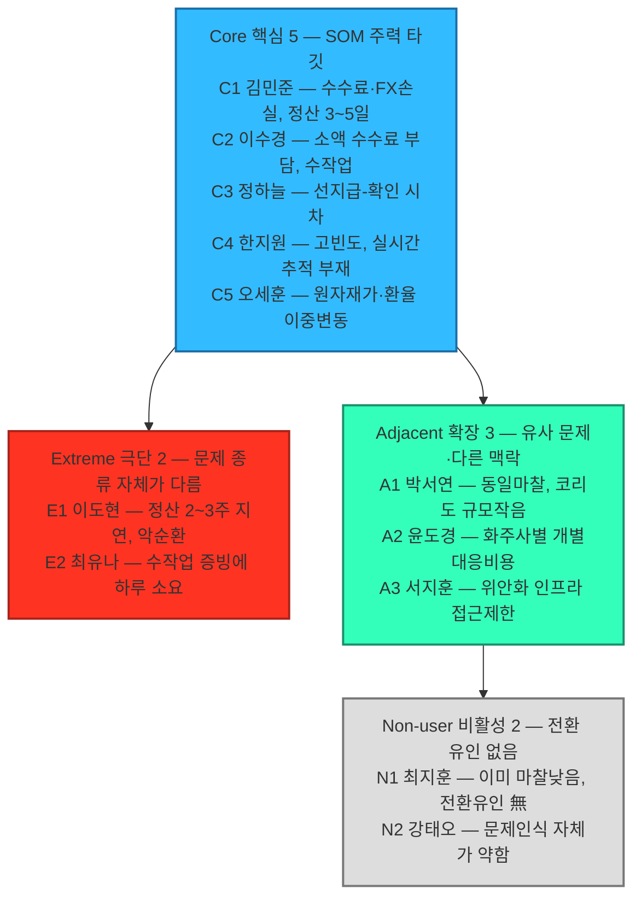
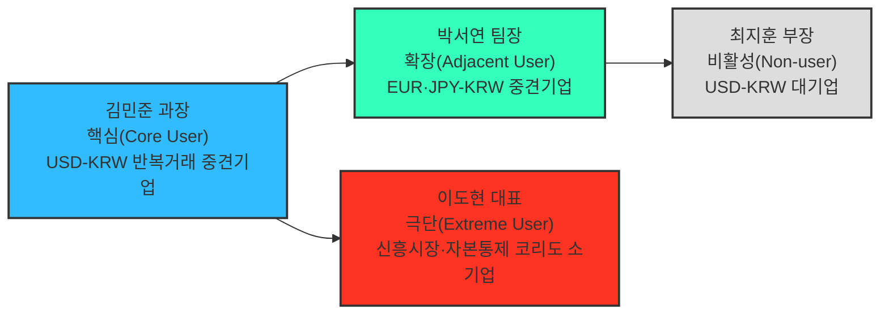

# 페르소나 스펙트럼 분석 보고서

## 요약

- 대상 세그먼트: 04챕터 `08_TAM_SAM_SOM_시장세그먼트맵.md`의 SOM 정의 — "반복적인 USD↔KRW 거래를 수행하며, 비용·정산시점·추적·대사 문제를 겪고 있고, 파트너은행과 ERP/API 연결이 가능한 국내 중소·중견 수출입기업".
- 방법론: `05_페르소나_고객여정지도/00_방법론.md` 2.1절의 5단계 워크플로우(1차 생성 → 2차 평가 → 3차 보정 → 4차 검증 → 5차 통합)를 그대로 적용했다.
- 산출물: 1차 생성에서 나온 12개 후보(핵심 5·확장 3·극단 2·비활성 2)를 2차 평가로 좁혀 Core·Adjacent·Extreme·Non-user 4개 페르소나를 확정했다. 04챕터 Market Segment Map의 세그먼트(5.1·5.4·5.5절)를 각각 한 명의 구체적 인물로 구체화했다.
- 핵심 결론: SOM·MVP 핵심 고객은 **USD-KRW 반복거래 중견기업**이며, EUR·JPY-KRW 중견기업은 조기 확장 대상, 신흥시장·자본통제 코리도 기업은 마찰은 가장 크지만 현재 로드맵 밖, 대기업은 전환 유인이 없어 비활성 상태로 남는다.

## 0. 분석 대상과 근거 자료

이 보고서는 아래 세 문서를 1차 근거로 사용했다.

- `04_TAM-SAM-SOM_마켓세그먼트/08_TAM_SAM_SOM_시장세그먼트맵.md` — SOM 정의, 5.1 매트릭스(통화 코리도×기업 규모), 5.4 세그먼트 요약, 5.5 2×2 세그먼트 맵(정산 마찰×디지털 정산수단 적용 가능성)
- `04_TAM-SAM-SOM_마켓세그먼트/07_7단계_솔루션구체화.md` — 대상 고객 정의(대기업 제외 이유), 솔루션 핵심 기능, 실행 로드맵
- `04_TAM-SAM-SOM_마켓세그먼트/06_6단계_반복적정제.md` — 통화별 거래 규모, 신인프라(Project Agorá)의 코리도별 호환성

## 1단계 — 1차 생성(Divergent Thinking)

00_방법론.md ①단계의 AI 프롬프트 예시("핵심 사용자 5명, 확장 사용자 3명, 극단 사용자 2명, 비활성 사용자 2명 — 각자 이름, 직무, 문제, 목표, 감정, 대체 솔루션 포함")를 그대로 적용해, 유형별로 시장 세그먼트 맵에서 근거를 갖는 후보 12명을 이름·직무 단위까지 발산했다.

**핵심(Core) — 5명**

| 후보 | 이름 | 직무 | 문제 | 목표 | 감정 | 대체 솔루션 |
|---|---|---|---|---|---|---|
| C1 | 김민준 과장((주)한강정밀 자금팀) | 자동차부품·소재 대미 수출 자금관리 | 건별 수수료·FX 스프레드로 순매출 2\~3% 손실, 정산 3\~5일, 수작업 대사 주 2일↑ | 정산 리드타임 1일 이내, ERP 자동연동 증빙체계 | 반복 수작업에 지침, 담당자 교체 시 재설명 피로 | 주거래은행 1곳 외환서비스만 이용, 협상력 부족 |
| C2 | 이수경 대리((주)브라이트리빙 해외영업팀) | 소비재 완제품 소액다빈도 수출 정산 | 소액 거래일수록 수수료 부담이 상대적으로 크고, ERP 없이 엑셀로 수작업 | 소액 거래도 저렴하게 처리할 채널 확보 | "우리는 너무 작아 우선순위가 아닐 것"이라는 자조 | 없음 — 은행 창구 방문에 의존 |
| C3 | 정하늘 부장((주)대성소재 구매팀) | 원자재·부품 수입대금 지급 | 선지급 후 정산 확인까지 시차가 커 유동성 관리가 어려움 | 지급-확인 시차 축소로 자금계획 정확도 향상 | 환율 변동 구간에 지급이 몰리면 초조함 | 여러 은행 견적을 비교해 그때그때 선택, 관계 분산으로 협상력 약함 |
| C4 | 한지원 팀장((주)케이반도체소재 수출관리팀) | 반도체 소재 대량·고빈도 수출 정산 관리 | 거래 빈도가 높아 작은 스프레드도 누적 손실이 크고, 실시간 추적 수단이 없음 | 실시간 정산 조회로 자금 포지션 즉시 파악 | 여러 건이 겹칠 때 진행 상황을 놓칠까 불안 | 내부 스프레드시트로 수동 추적 |
| C5 | 오세훈 과장((주)그린켐 수출팀) | 화학·소재 수출 정산 및 환리스크 관리 | 원자재가·환율이 동시에 흔들리면 정산 지연이 겹쳐 손실이 배로 커짐 | 정산 시점을 예측 가능하게 해 환리스크 대응 타이밍 확보 | 이중 변동성에 대한 경계심 | 선물환 헤지 + 기존 은행 정산, 헤지 비용 부담 |

**확장(Adjacent) — 3명**

| 후보 | 이름 | 직무 | 문제 | 목표 | 감정 | 대체 솔루션 |
|---|---|---|---|---|---|---|
| A1 | 박서연 팀장((주)오션바이오 해외영업팀) | 화장품 원료 EUR·JPY 수출 정산 | Core와 동일한 마찰을 겪지만 코리도 규모(554억 달러)가 작아 은행의 우선 협상 대상이 아님 | 검증된 서비스가 있다면 같은 파트너망으로 조기 전환 | "왜 우리는 나중인가"라는 소외감 | 유럽계 은행의 다국적기업용 트레저리 서비스, 비용이 높음 |
| A2 | 윤도경 대표(트레이드링크) | 다수 화주사의 해외결제를 대리 처리하는 플랫폼 운영 | 화주사마다 은행·통화가 달라 개별 대응 비용이 큼 | 여러 화주사의 거래를 하나의 인프라로 통합 처리 | 화주사 수가 늘수록 관리 복잡도가 커지는 데 대한 부담 | 화주사별로 다른 은행 채널을 그대로 중개 |
| A3 | 서지훈 차장((주)한중무역 자금팀) | 위안화 결제 거래의 정산·리스크 관리 | mBridge 등 위안화 전용 인프라는 접근이 어렵고, 기존 SWIFT망은 느림 | 위안화 결제도 USD-KRW 수준의 처리 속도 확보 | 인프라 선택지가 제한적인 데 대한 답답함 | 기존 SWIFT 중개은행망 |

**극단(Extreme) — 2명**

| 후보 | 이름 | 직무 | 문제 | 목표 | 감정 | 대체 솔루션 |
|---|---|---|---|---|---|---|
| E1 | 이도현 대표((주)그린모빌) | 신흥시장(동남아) 배터리부품 수출 | 유동성·환전·법·규제 분절이 동시에 발생해 정산이 2\~3주씩 지연, 원재료 구매 악순환 | 정산 지연을 줄이고 싶으나, 이 코리도는 신인프라 실거래 검증 대상이 아님 | "해결해줄 곳이 없다"는 좌절감, 신규 서비스에 대한 기대·의심 공존 | 로컬 환전상·비공식 채널을 규제 리스크를 알면서도 사용 |
| E2 | 최유나 대표(유나트레이딩, 1인 무역업체) | 영업·정산·증빙을 대표 1인이 전담 | 건마다 수작업 증빙에 하루 이상 소요돼 본업(영업)에 쓸 시간이 없음 | 증빙·신고 자동화로 영업에 쓸 시간을 되찾는 것 | 관리 업무에 압도돼 사업 확장을 미루는 조바심 | 세무사·관세사 외주 — 매출 대비 비용 부담이 과도함 |

**비활성(Non-user) — 2명**

| 후보 | 이름 | 직무 | 문제 | 목표 | 감정 | 대체 솔루션 |
|---|---|---|---|---|---|---|
| N1 | 최지훈 부장((주)한빛전자 글로벌자금팀) | 대기업 USD-KRW 글로벌 자금관리 | 은행 우대처리·자체 TMS로 실질 마찰이 이미 낮음 | 전환 유인이 없으며, 신생 애플리케이션 레이어에 자금을 노출하는 리스크를 우려 | 신중하고 보수적 — "이미 문제가 없는데 왜 바꾸나" | 기존 은행 딜링데스크 + 자체 TMS |
| N2 | 강태오 과장((주)신성무역 자금팀) | 위안화 결제 거래 관리 | 현재 방식(SWIFT)에 큰 불만은 없고, 속도가 느리다는 인식만 있음 | 명확한 전환 목표가 없음 — 문제 인식 자체가 약함 | 새 인프라보다 익숙한 방식에 대한 신뢰가 더 큼 | 기존 SWIFT 중개은행망 |

**1차 생성 후보 12명 시각화** — 12명 각각을 낱개 상자로 펼치면 한눈에 들어오지 않아, 유형별 1개 상자에 구성원과 문제 키워드만 나열하는 방식으로 압축했다. 상세 속성(목표·감정·대체 솔루션)은 위 표를 참고한다.

Core(위)→Extreme·Adjacent(중간)→Non-user(아래) 순으로 흐르며, 상자 4개로만 구성해 가로·세로 어느 한쪽으로 크게 치우치지 않도록 했다. 어떤 4명이 남을지는 다음 2단계에서 정한다.

## 2단계 — 2차 평가(Convergent Filtering)

각 유형에서 문제·행동·맥락의 현실성이 더 높은 후보 1개씩만 남겼다.

| 유형 | 최종 선정 | 제외 후보와 그 이유 |
|---|---|---|
| 핵심 | C1(USD-KRW 중견 수출입기업) | C2는 ERP/API 연동 여력이 낮아 SOM 조건("파트너은행과 ERP/API 연결 가능")을 충족하는 비중이 낮음. C3는 중견 수입기업 규모 통계가 미공개라 근거가 약함. C4·C5는 특정 산업에 치우쳐 표본 대표성이 낮음 |
| 확장 | A1(EUR·JPY-KRW 중견 수출입기업) | A2는 고객군 자체가 다른(1개 기업이 아니라 다수 거래처를 대리) 구조라 "유사 니즈·다른 맥락"이라는 확장 정의보다 별도 채널 세그먼트에 가까움. A3는 06문서에서 이미 "관찰 대상"으로 분류돼 있어 확장보다 비활성 쪽 후보(N2)와 성격이 겹침 |
| 극단 | E1(신흥시장·자본통제 코리도 수출기업) | E2는 Q1(핵심)에서 이미 다루는 문제의 강도 차이일 뿐이라, 극단 정의가 요구하는 "문제 종류 자체의 차이"에는 못 미침 |
| 비활성 | N1(USD-KRW 대기업 자금팀) | N2는 거래 규모(92억 달러)가 작고 근거 문서(06)도 정성적 판단에 가까워, 07문서가 명시적 제외 논리를 제공하는 대기업 쪽이 더 강한 근거를 가짐 |

## 3단계 — 3차 보정(Contextual Rewriting): 페르소나 카드

토큰화 예금 기반 결제·정산 애플리케이션(07문서 3절 솔루션 개요)을 기준으로 4개 페르소나를 구체화했다.

### 핵심(Core) — 김민준 과장, (주)한강정밀 자금팀

| 항목 | 내용 |
|---|---|
| 회사 프로필 | 자동차 부품·반도체 소재 대미 수출 중견기업, 연 수출액 약 1,500만 달러(USD-KRW), SAP ERP 구축, 월 40\~60건 해외송금 처리 |
| 문제 | 건별 중개은행 수수료·FX 스프레드로 순매출 2\~3% 손실, 정산까지 3\~5일 소요, 수작업 대사·증빙에 주 2일 이상 소요 |
| 목표 | 정산 리드타임을 하루 이내로 축소하고, ERP 자동 연동 증빙체계로 대사 인력 부담을 줄이는 것 |
| 감정 | 반복되는 수작업에 지쳐 있고, 은행 담당자가 바뀔 때마다 절차를 재설명해야 하는 데 피로감을 느낀다 |
| 대체 솔루션 | 주거래은행 1곳의 외환 서비스만 이용 — 비교견적을 낼 협상력이 부족하다 |
| 서비스에 대한 태도 | 파일럿 참여 의향이 높다 — 파트너은행이 기존 거래은행과 겹치면 전환 저항이 거의 없다 |

### 확장(Adjacent) — 박서연 팀장, (주)오션바이오 해외영업팀

| 항목 | 내용 |
|---|---|
| 회사 프로필 | 유럽·일본 화장품 원료 수출 중견기업, 연 수출액 약 800만 유로·1.2억 엔 상당(EUR·JPY-KRW) |
| 문제 | Core와 동일한 마찰(정산 지연·수작업 대사)을 겪지만, 코리도 규모(554억 달러)가 작아 은행의 우선 협상 대상이 되지 못한다 |
| 목표 | USD-KRW용으로 먼저 검증된 서비스가 있다면 같은 파트너 은행망을 통해 빠르게 옮겨 타고 싶다 |
| 감정 | "이미 검증된 서비스가 있다면 왜 우리는 나중인가"라는 소외감 |
| 대체 솔루션 | 유럽계 은행의 다국적기업용 트레저리 서비스를 부분적으로 이용 중이나 비용이 높다 |
| 서비스에 대한 태도 | Phase 1 종료 후 조기 확장 대상으로 스스로를 인식하며, 대기 명단 등록을 먼저 요청하는 유형이다 |

### 극단(Extreme) — 이도현 대표, (주)그린모빌

| 항목 | 내용 |
|---|---|
| 회사 프로필 | 동남아 등 신흥시장(자본통제·비태환 통화 코리도)에 배터리 부품을 수출하는 소기업, 현지 은행과의 코레스폰던트 관계가 약함 |
| 문제 | 유동성·환전·법·규제 분절이 동시에 발생해 대금 정산이 2\~3주씩 지연되고, 다음 수출 물량의 원재료 구매가 막히는 악순환을 겪는다 |
| 목표 | 어떤 방식이든 정산 지연을 줄이고 싶으나, 이 코리도는 신인프라(Project Agorá 등)의 실거래 검증 대상이 아니다 |
| 감정 | "이 문제를 해결해줄 곳이 없다"는 좌절감과, 신규 핀테크 서비스에 대한 기대·의심이 공존한다 |
| 대체 솔루션 | 로컬 환전상·비공식 채널을 규제 리스크를 알면서도 현금흐름 때문에 불가피하게 사용한다 |
| 서비스에 대한 태도 | 현재 로드맵(Phase 1\~3) 밖의 서비스 대상이다 — 다만 이 실패 경험이 Phase 3 이후 신흥시장 코리도 확장 우선순위를 정하는 근거가 된다 |

### 비활성(Non-user) — 최지훈 부장, (주)한빛전자 글로벌자금팀

| 항목 | 내용 |
|---|---|
| 회사 프로필 | USD-KRW 대기업(연 수출액 수십억 달러), 4대 은행과 우대환율·전용 딜링데스크 계약 체결, 자체 TMS 구축 |
| 문제 | 실질적 마찰이 이미 낮다 — 은행이 대기업 물량을 우대 처리하고, 내부 TMS가 대사·리포팅을 자동화한다 |
| 목표 | 새 인프라로 전환할 유인이 없으며, 오히려 검증되지 않은 신생 애플리케이션 레이어에 자금 흐름을 노출하는 리스크를 우려한다 |
| 감정 | 신중하고 보수적이다 — "이미 문제가 없는데 왜 바꿔야 하나" |
| 대체 솔루션 | 기존 은행 딜링데스크와 자체 TMS |
| 서비스에 대한 태도 | 비활성 — Phase 1\~2 타겟에서 명시적으로 제외되며, Agorá 참여 은행이 표준화된 이후에나 재검토 대상이 된다 |

## 4단계 — 4차 검증(AI Peer Review)

| 페르소나 | 존재 확률 판단 | 근거 | 잔여 리스크 |
|---|---|---|---|
| 핵심 | 높음 | 08문서 3.1절 타겟 세그먼트(약 3,123억 달러)가 이 유형의 실제 집계치이며, 07문서가 "대상 고객"으로 명시 | 이 세그먼트 중 ERP/API 연동 여력이 있는 기업의 정확한 비중은 별도 통계가 없어 추정치에 의존 |
| 확장 | 중간\~높음 | EUR·JPY-KRW 세그먼트(554억 달러, 08문서 5.4절 2순위)는 실제 존재 | "USD-KRW 서비스를 대기한다"는 구체적 행동 패턴은 실증 데이터 없이 로드맵상 가정 |
| 극단 | 높음(마찰 자체는) | Q4 세그먼트(자본통제·비태환 코리도)는 06문서의 mBridge 분석·1\~3단계 마찰 유형 분석에서 이미 확인된 범주 | 개별 인물(이도현 대표)은 예시일 뿐 실제 인터뷰 대상이 아니며, 정량 규모는 08문서에도 별도 산출되지 않음 |
| 비활성 | 매우 높음 | 07문서가 대기업을 "이미 은행 직접 접근 가능"으로 명시적으로 제외했고, 08문서 5.1절 매트릭스에서 대기업이 수출의 66.1%를 차지한다는 사실이 이 유형의 규모를 뒷받침 | 대기업 내에서도 신사업팀 등 예외적으로 신기술 도입에 적극적인 부서가 있을 가능성은 반영하지 못함 |

## 5단계 — 5차 통합(Persona Spectrum Map)

**그림 1. 페르소나 스펙트럼 맵** — 1\~2단계에서 12명 중 선정된 4개 페르소나만 통합한 최종 결과다(Core→Adjacent, Core→Extreme, Adjacent→Non-user). 1차 생성 12명 전체 풀은 1단계 시각화를 참고.

### 핵심 질문에 대한 답

- (핵심) 이상적인 주요 고객군은 누구인가? → 김민준 과장형 — USD-KRW 반복거래 중견 수출입기업
- (확장) 유사한 제품/서비스를 사용하고 있는 사람은 누구인가? → 박서연 팀장형 — 유럽계 은행 트레저리 서비스를 쓰는 EUR·JPY-KRW 중견기업
- (비활성) 이 제품/서비스를 사용할 수 없는 사람은 누구인가? → 최지훈 부장형 — 이미 은행 우대조건·자체 TMS를 갖춘 대기업
- (극단) 가장 자주 실패를 경험하는 사람은 누구인가? → 이도현 대표형 — 신흥시장·자본통제 코리도의 소기업

### 세그먼트 매핑과 전략 액션

| 페르소나 | 대응 세그먼트(08문서 근거) | 우선순위 | 전략 액션 |
|---|---|---|---|
| 핵심 | Q1 핵심 공략 시장 / SOM 타겟(3,123억 달러) | 1순위 | Phase 1 파일럿 — 파트너은행 공동 온보딩 |
| 확장 | EUR·JPY-KRW 세그먼트(554억 달러, 2순위) | 2순위 | Phase 1 파트너십을 재사용해 Phase 3에 조기 확장 |
| 극단 | Q4 장기 잠재 시장(자본통제·신흥시장 코리도) | 관찰 | 로드맵 밖 — Phase 3 이후 확장 우선순위 결정에 참고 |
| 비활성 | Q2 효율 개선 시장(대기업) | 후순위 | Phase 1\~2 타겟에서 제외, 장기적으로만 재검토 |

## 시사점과 다음 단계

- 이번 페르소나 스펙트럼은 04챕터 SOM·Market Segment Map의 숫자를 인물 단위로 옮긴 것이지, 별도 설문·인터뷰로 검증된 결과는 아니다 — 4단계 검증에 남긴 잔여 리스크가 실제 조사 우선순위다.
- 다음 단계(고객 여정지도)는 핵심 페르소나(김민준 과장)의 거래 여정을 중심으로 작성하고, 확장·극단 페르소나는 여정상 이탈·차단 지점을 보여주는 비교 축으로 활용한다.

## 참고자료

- `04_TAM-SAM-SOM_마켓세그먼트/08_TAM_SAM_SOM_시장세그먼트맵.md`
- `04_TAM-SAM-SOM_마켓세그먼트/07_7단계_솔루션구체화.md`
- `04_TAM-SAM-SOM_마켓세그먼트/06_6단계_반복적정제.md`
- `05_페르소나_고객여정지도/00_방법론.md`
- `이미지/0810_3.png` — 5단계 페르소나 스펙트럼 맵의 3열 클러스터 레이아웃(Core|Extreme·Adjacent|Non-user) 참고 이미지
