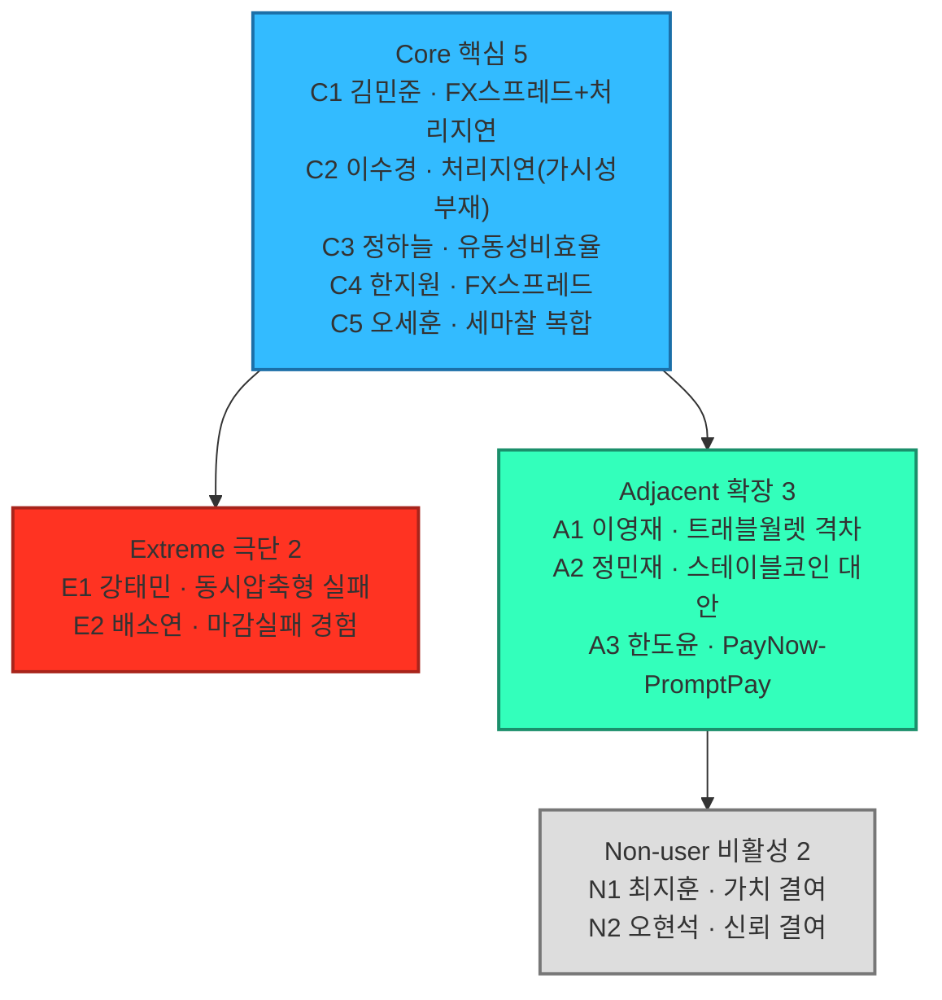
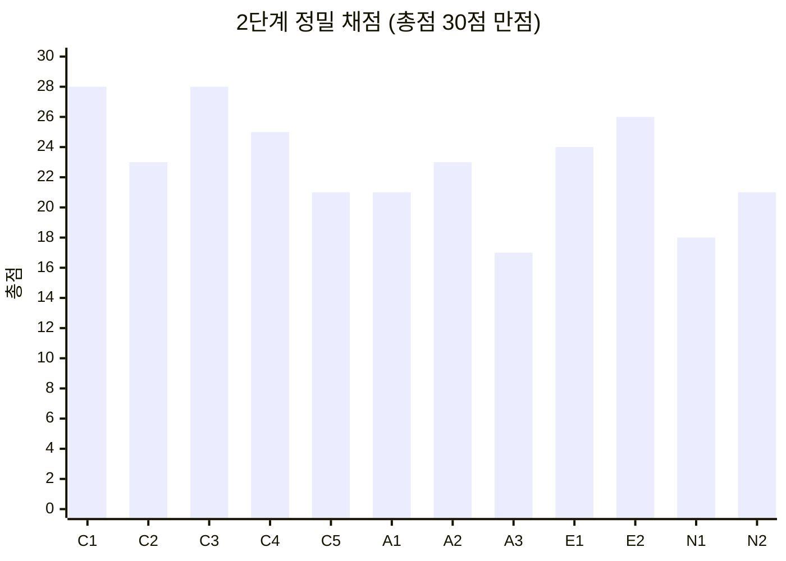

# 페르소나 스펙트럼 분석 보고서

## 요약

- 대상 세그먼트: 04챕터 `08_TAM_SAM_SOM_시장세그먼트맵.md`의 SOM 정의 — "반복적인 USD↔KRW 거래를 수행하며, 비용·정산시점·추적·대사 문제를 겪고 있고, 파트너은행과 ERP/API 연결이 가능한 국내 중소·중견 수출입기업".
- 방법론: `00_방법론.md` 2.1절의 5단계 워크플로우(1차 생성→2차 평가→3차 보정→4차 검증→5차 통합)를 처음부터 다시 적용한다. **현재 1\~2단계(1차 생성, 2차 평가)까지 확정**했고, 3\~5단계는 다음 회차에 이어서 진행한다. 최종 4명: Core=김민준(C1)·Adjacent=정민재(A2)·Extreme=강태민(E1)·Non-user=최지훈(N1).
- 솔루션 재확인: 우리가 서비스하려는 솔루션은 "USD-KRW 코리도 중심으로, 국내 수출입기업의 무역대금 결제·정산 마찰(**FX 스프레드·처리지연·유동성비효율**)을 토큰화 예금 인프라에 연결해 감소시킨다"이다. 1단계 12명 전원을 이 세 마찰에 정확히 대응시켜, 이전 회차에서 나타난 "솔루션과의 연결이 헐거워지는" 문제를 1차 생성 단계부터 차단했다.
- 유형별 재정의 원칙: 핵심(매출·거래빈도), 확장(유사 니즈를 이미 다른 서비스로 해소 중인 인접 시장), 극단(같은 세 마찰이 반복적 실패로 이어지는 상황), 비활성(인식·가치·신뢰 결여로 사용을 꺼리는 집단) — 00_방법론.md의 목적·생성포인트·핵심질문에 맞춰 각 유형을 다시 검증했다.
- 주의: 인물명·회사명·구체 수치는 모두 가설/예시값이다.

## 0. 분석 대상과 근거 자료

- `04_TAM-SAM-SOM_마켓세그먼트/08_TAM_SAM_SOM_시장세그먼트맵.md` — SOM 정의, 5.1\~5.5절 세그먼트 맵
- `04_TAM-SAM-SOM_마켓세그먼트/07_7단계_솔루션구체화.md` — 솔루션 개요, 대상 고객 정의
- `04_TAM-SAM-SOM_마켓세그먼트/06_6단계_반복적정제.md` — 신인프라 비교, 마찰 감소 효과
- `01_Porters_Five_Forces_모델/01_영역A_해외간편결제.md` — Area A(해외 간편결제) 시장 데이터
- `리서치DB/` 원자료 — 마찰 유형별 정량치, 신인프라 사례(스테이블코인·실시간지급망 등)

## 1단계 — 1차 생성(Divergent Thinking)

00_방법론.md ①단계 예시("핵심 5명·확장 3명·극단 2명·비활성 2명, 각자 이름·직무·문제·목표·감정·대체 솔루션 포함")를 적용했다. 이전 회차와의 차이는 두 가지다.

1. **문제를 세 마찰(FX 스프레드·처리지연·유동성비효율)에 정확히 대응시켰다** — "산업이 다르다"·"세그먼트가 다르다" 같은 느슨한 차별화 대신, 각 후보가 정확히 어떤 마찰을 겪는지(또는 겪지 않는지) 명시했다.
2. **확장(Adjacent)은 "이미 유사 서비스를 쓰고 있는 실제 시장"으로만 채웠다** — 파일럿 단계 인프라(한강프로젝트 등)나 우리 타겟 기업 자신의 다른 측면(국내 결제 등)은 제외하고, 상용화돼 실제로 쓰이고 있는 서비스(트래블월렛, 스테이블코인 실증, PayNow-PromptPay)의 사용자만 남겼다.
3. **극단(Extreme)은 "실패를 실제로 경험"으로, 비활성(Non-user)은 "인식·가치·신뢰 결여"로 명확히 구분했다** — 00_방법론.md의 목적·생성포인트·핵심질문에 정확히 대응시켰다.

### 핵심(Core) — 5명 (목적: 주력 타깃 설정 / 생성포인트: 매출·거래빈도 중심)

| ID | 이름 | 직무 | 문제 | 목표 | 감정 | 대체 솔루션 |
|---|---|---|---|---|---|---|
| C1 | 김민준 과장 | 수출기업 자금담당 | 건별 환전 시 FX 스프레드로 손실을 보고, 정산 완료 시점이 확정되지 않는 처리지연을 겪고 있다 | FX 스프레드를 줄이고 정산 완료 시점을 확정받는 것 | 매번 다른 대기시간에 대한 피로감 | 주거래은행 1곳만 이용, 협상력 부족 |
| C2 | 이수경 대리 | 수출기업 재무담당 | 고빈도 거래 상태를 실시간으로 볼 수 없어 처리지연을 겪고 있다 | 실시간 정산 상태 조회 | 여러 건이 겹칠 때 놓칠까 불안 | 내부 스프레드시트로 수동 추적 |
| C3 | 정하늘 부장 | 수입기업 결제담당 | 선지급 후 확인까지 시차가 커 유동성비효율을 겪고 있다 | 지급-확인 시차 축소 | 환율 변동기에 지급 몰리면 초조 | 여러 은행 견적 비교, 협상력 약함 |
| C4 | 한지원 팀장 | 수입기업 구매담당 | 환전 스프레드가 매입원가에 직결되는 FX 스프레드를 겪고 있다 | 환전 스프레드 축소·고정 | 원가 계산이 매번 흔들리는 데 대한 불만 | 선물환 헤지, 헤지비용 부담 |
| C5 | 오세훈 과장 | 수출입 겸업기업 자금담당 | 수출·수입을 동시에 해 FX 스프레드·처리지연·유동성비효율을 모두 겪고 있다 | 세 마찰을 한 인프라로 동시에 줄이는 것 | 하나만 고쳐도 나머지가 남는 답답함 | 코리도별로 다른 은행·담당자 상대 |

### 확장(Adjacent) — 3명 (목적: 확장 기회 탐색 / 핵심질문: "유사한 서비스를 이미 쓰고 있는 사람은?")

| ID | 이름 | 직무 | 문제 | 목표 | 감정 | 대체 솔루션 |
|---|---|---|---|---|---|---|
| A1 | 이영재 대리(가칭) | 중견 수출기업 해외영업팀 | 출장 시 개인 명의 트래블월렛으로는 환율우대 100%로 FX 스프레드 없이 즉시 결제가 확정되는데, 회사의 무역대금 결제는 여전히 FX 스프레드·처리지연을 겪고 있다 | 회사 무역대금 결제도 개인 결제 수준의 확정성 확보 | 개인 경험과 회사 업무 사이의 괴리에 대한 답답함 | 출장경비는 트래블월렛, 무역대금은 기존 은행 그대로 |
| A2 | 정민재 과장(가칭) | (주)대한물산 해외법인 자금팀 | 규제가 허용되는 해외법인간 자금이동에서는 스테이블코인(USDT)으로 처리지연(전송시간)을 상당히 줄인 경험이 있으나, 한국 본사와 연결하려면 외환신고·AML·회계처리·원화 환전 문제가 남아 기존 SWIFT를 그대로 쓴다 | 해외법인 간 경험한 속도를 한국 관련 결제에도 일부라도 확보 | 속도는 개선됐는데 정작 본사 쪽엔 적용이 안 되는 데 대한 답답함 | 해외법인간은 스테이블코인, 한국 관련 결제는 기존 SWIFT |
| A3 | 한도윤 과장(가칭) | 중견 수출기업 동남아 지사 자금담당 | 동남아 지사간(싱가포르-태국) 결제는 PayNow-PromptPay로 이미 처리지연·유동성비효율 없이 즉시 확정되는데, 본사(한국)와의 결제는 왜 그렇게 안 되는지 궁금하다 | 본사와의 결제도 지사간 수준의 즉시성 확보 | 지사와 본사 사이의 인프라 격차에 대한 의아함 | 지사간은 PayNow-PromptPay, 본사와는 기존 SWIFT |

### 극단(Extreme) — 2명 (목적: 제품 개선 및 포용적 설계 / 핵심질문: "자주 실패를 경험하는 사람은?")

| ID | 이름 | 직무 | 문제 | 목표 | 감정 | 대체 솔루션 |
|---|---|---|---|---|---|---|
| E1 | 강태민 부장(가칭) | 중견 수출입기업 자금담당 | 월말·분기말에 여러 건의 대금이 동시에 몰리면 FX 스프레드·처리지연·유동성비효율이 한꺼번에 겹쳐, 결제 지연으로 위약금·거래처 신뢰 상실 등 **실패를 반복적으로 경험**한다 | 마감 전 위험을 예측하고 유동성을 예약해, 동시 마감 상황에서도 실패 없이 포지션을 유지하는 것 | 여러 건이 한꺼번에 터질 때마다 또 실패할까 하는 두려움 | 월말 전 일부 지급을 조기 실행하고 여유자금을 선확보, 중요 거래에 우선순위 부여. 지연·반려 시 은행에 긴급확인 요청하나 겹칠수록 대응이 어려움 |
| E2 | 배소연 과장(가칭) | 중견 수출기업 자금담당 | 처리지연으로 정산 완료 시점을 예측할 수 없어, **계약상 지급 마감을 실제로 놓쳐 위약금을 낸 경험**이 있다 | 확정된 초단기 처리 옵션으로 마감 실패를 막는 것 | 한 번 실패해본 뒤로 마감이 다가오면 드는 압박감 | 프리미엄 수수료를 주고 특급송금(대안 채널) 이용 |

### 비활성(Non-user) — 2명 (목적: 시장 진입 장벽 및 거부 요인 파악 / 핵심질문: "사용할 수 없는 또는 사용하기를 꺼리는 사람은?")

| ID | 이름 | 직무 | 문제 | 목표 | 감정 | 대체 솔루션 |
|---|---|---|---|---|---|---|
| N1 | 최지훈 부장 | 대기업 자금팀 | **가치 결여** — 은행 우대·전용 딜링데스크·자체 TMS로 FX 스프레드·처리지연·유동성비효율이 모두 이미 낮아, 전환해도 얻을 가치가 크지 않다고 판단해 사용을 꺼린다 | 전환 유인 없음 | "이미 문제가 없는데 왜 바꾸나" | 기존 은행 딜링데스크 + 자체 TMS |
| N2 | 오현석 이사(가칭) | 중견 수출입기업 자금담당(보수적 재무정책) | **신뢰 결여** — 기존 코레스뱅킹은 검증된 신뢰도를 가진 반면, 토큰화 예금 인프라는 아직 파일럿 단계라 보안·법적 최종성에 대한 확신이 없어 사용을 꺼린다 | 신뢰가 쌓일 때까지 관망 | 검증 안 된 인프라에 회사 자금을 노출하는 게 불안함 | 느려도 검증된 기존 은행망을 그대로 고수 |

### 1차 생성 후보 12명 시각화

**그림 1. 1차 생성 12명** — 12명 전원이 FX 스프레드·처리지연·유동성비효율 중 하나 이상에 명시적으로 대응한다(Adjacent 3명은 "이미 해소된 경험"으로 대응). 어떤 4명이 남을지는 2단계에서 정한다.

## 2단계 — 2차 평가(Convergent Filtering): 정밀 채점표

00_방법론.md ②단계 프롬프트("문제·행동·맥락의 현실성 기준으로 평가해 상위 1개씩만 추천")를 기본 축으로 삼고, 세 기준만으로는 Core·Adjacent에서 동점이 나와 세 기준(문제심각도·사업잠재력·솔루션적합성)을 추가해 재채점했다.

### 2.1 평가 기준(6개, 5점 척도)

| 기준 | 의미 |
|---|---|
| 문제 현실성 | 세그먼트맵·리서치DB에 직접 근거가 있는가 |
| 행동 현실성 | 직무·상황에 비춰 구체적이고 실제 관찰되는 행동인가 |
| 맥락 현실성 | 유형 정의(핵심/확장/극단/비활성)·SOM과 정확히 부합하는가 |
| 문제심각도 | 이 마찰이 유발하는 금전적 손실·리스크의 크기 |
| 사업잠재력 | 08문서 세그먼트 규모, 또는 독립적 확장 시장으로서의 가치 |
| 솔루션적합성 | 07문서 핵심기능(①온오프램프 ②실시간조회 ③ERP증빙자동화 ④AML/KYC)이 이 문제를 얼마나 직접 해결하는가 |

### 2.2 채점표(12명 전원, 30점 만점)

| 유형 | 후보 | 문제 | 행동 | 맥락 | 심각도 | 잠재력 | 적합성 | 총점 |
|---|---|---|---|---|---|---|---|---|
| Core | **C1 김민준 ★선정** | 5 | 4 | 5 | 4 | 5 | 5 | **28** |
| Core | C2 이수경 | 4 | 4 | 4 | 3 | 3 | 5 | 23 |
| Core | C3 정하늘 | 5 | 4 | 5 | 5 | 4 | 5 | 28 |
| Core | C4 한지원 | 4 | 4 | 5 | 4 | 3 | 5 | 25 |
| Core | C5 오세훈 | 3 | 4 | 4 | 5 | 2 | 3 | 21 |
| Adjacent | A1 이영재 | 5 | 4 | 5 | 2 | 2 | 3 | 21 |
| Adjacent | **A2 정민재 ★선정** | 5 | 4 | 5 | 3 | 3 | 3 | **23** |
| Adjacent | A3 한도윤 | 3 | 3 | 4 | 2 | 2 | 3 | 17 |
| Extreme | **E1 강태민 ★선정** | 3 | 4 | 5 | 5 | 3 | 4 | 24 |
| Extreme | E2 배소연 | 4 | 4 | 5 | 5 | 3 | 5 | **26** |
| Non-user | **N1 최지훈 ★선정** | 5 | 5 | 5 | 1 | 1 | 1 | 18 |
| Non-user | N2 오현석 | 4 | 3 | 4 | 3 | 4 | 3 | 21 |

### 2.3 선별 결과와 판단이 필요했던 지점

- **Core — C1(28점) 확정.** C3(정하늘, 28점)와 6개 기준 전부를 적용해도 동점이었다 — C1(수출·세그먼트 규모가 더 큼)과 C3(수입·문제심각도가 더 높음)가 서로 다른 축에서 강해 숫자로는 갈리지 않았다. 최종 선택은 사용자 판단으로 확정했다.
- **Adjacent — A2(23점).** A1(이영재, 21점)은 문제·행동·맥락 현실성은 높지만, "회사가 Core와 같은 솔루션을 채택하면 A1의 불만도 함께 해소되는" 구조라 독립적 사업잠재력·솔루션적합성이 낮게 나왔다. A2(정민재)는 해외법인 트레저리라는 별도 의사결정 주체를 대표해 확장 시장으로서의 가치가 더 크다고 판단했다. 다만 원래 문제 서술이 "스테이블코인으로 세 마찰을 모두 해소했다"고 과장돼 있었다 — 실제로 미국-멕시코 실증처럼 양쪽 다 USD 표시인 거래는 환전 자체가 없어 FX 스프레드·유동성비효율이 "해소"됐다고 볼 근거가 아니다. 처리지연(전송시간) 개선만 실증된 것으로 정정하고, 한국 본사 연결 시 남는 문제(외환신고·AML·회계·원화 환전)를 명시했다.
- **Extreme — E1(24점), 채점 결과와 다르게 선정.** 숫자상으로는 E2(배소연, 26점)가 더 높지만, E2("마감을 한 번 놓쳤다")는 사실 Core(C1·C2)가 겪는 처리지연 문제의 심한 버전에 가까워 극단이 요구하는 "문제 종류 자체의 차이"에는 못 미친다. E1("여러 거래가 동시에 몰릴 때 시스템이 감당 못 한다")은 동시성·용량이라는 다른 종류의 실패를 보여주고, 제품 기회도 "더 빠른 송금"이 아니라 "마감 전 위험예측·유동성 예약·은행별 컷오프 관리"라는 새 기능으로 이어져 극단의 목적(제품 개선 및 포용적 설계)에 더 부합한다고 판단했다.
- **Non-user — N1(18점), 채점 결과와 다르게 선정.** 숫자상으로는 N2(오현석, 21점)가 더 높지만, "사업잠재력(전환 가능성)"이라는 기준 자체가 비활성 유형의 목적(전환 후보 발굴이 아니라 진입장벽 파악)과 맞지 않는다고 판단했다. N1(최지훈, 대기업)은 07문서가 명시적으로 제외한 세그먼트의 경계를 가장 깨끗하게 보여주는 사례라 그대로 선정했다.

**최종 4명**: Core=C1(김민준) · Adjacent=A2(정민재) · Extreme=E1(강태민) · Non-user=N1(최지훈)

## 다음 단계

- 3단계(3차 보정)부터 이어서 진행한다 — 확정된 4명을 07문서 솔루션(토큰화 예금 기반 결제·정산 애플리케이션) 맥락으로 구체화한다.
- 4\~5단계(검증, 통합 맵)는 3단계 결과가 확정된 뒤 다시 작성한다.

## 참고자료

- `04_TAM-SAM-SOM_마켓세그먼트/08_TAM_SAM_SOM_시장세그먼트맵.md`
- `04_TAM-SAM-SOM_마켓세그먼트/07_7단계_솔루션구체화.md`
- `04_TAM-SAM-SOM_마켓세그먼트/06_6단계_반복적정제.md`
- `01_Porters_Five_Forces_모델/01_영역A_해외간편결제.md` — 트래블월렛 환율우대 100%, 시장점유율 40%(A1 근거)
- `05_페르소나_고객여정지도/00_방법론.md`
- `리서치DB/deepresearch-해외사례.md` — 현대카드·신한은행 스테이블코인 실증(A2 근거), 한강프로젝트 예금토큰 현황
- `리서치DB/deepresearch_B2B정산.md` — PayNow-PromptPay 실시간지급망 연결(A3 근거)
- `리서치DB/deepresearch_cross-border cross-currency payment_settlement infra market.md` — 기존 방식의 높은 신뢰도 vs 신인프라의 시범단계 한계(N2 근거)
