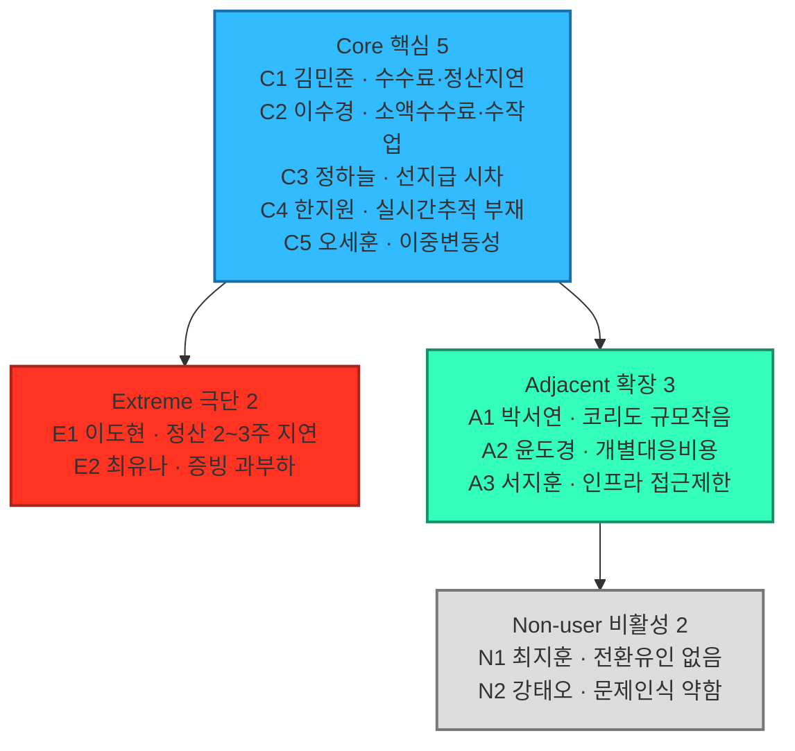
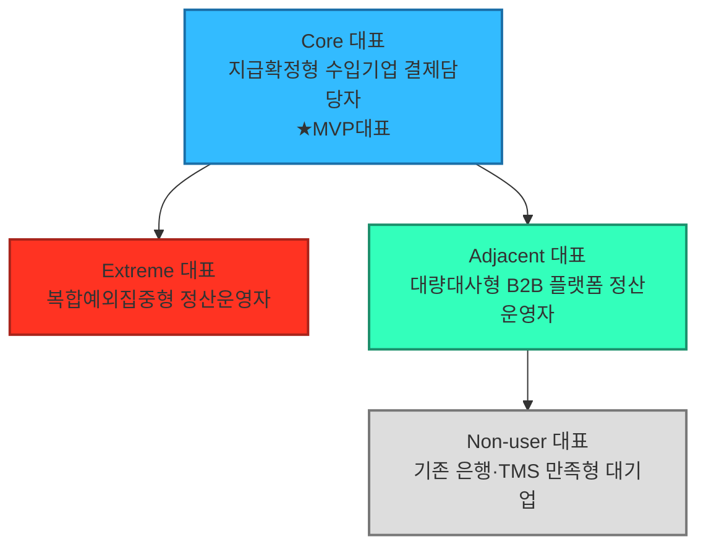

# 페르소나 스펙트럼 분석 보고서

## 요약

- 대상 세그먼트: 04챕터 `08_TAM_SAM_SOM_시장세그먼트맵.md`의 SOM 정의 — "반복적인 USD↔KRW 거래를 수행하며, 비용·정산시점·추적·대사 문제를 겪고 있고, 파트너은행과 ERP/API 연결이 가능한 국내 중소·중견 수출입기업".
- 방법론: `05_페르소나_고객여정지도/00_방법론.md` 2.1절의 5단계 워크플로우를, 각 단계 산출물 개수(①12명 → ②4개 대표 → ③4종 카드 → ④검증 리포트 → ⑤4-노드 Map)까지 표에 명시된 그대로 적용했다.
- 산출물: 1차 생성 후보 12명(핵심5·확장3·극단2·비활성2) 중 문제·행동·맥락의 현실성 기준으로 유형별 상위 1명씩만 선별해, 핵심(Core)·확장(Adjacent)·극단(Extreme)·비활성(Non-user) 각 1명, 총 4개 대표 페르소나로 수렴했다.
- 핵심 결론(최종 판단): **MVP 대표는 Core 대표(지급확정형 수입기업 결제담당자, 원 후보 C3)**이며, Adjacent 대표(대량대사형 B2B 플랫폼 정산운영자, A2)는 확장 파트너십 검토 대상, Extreme 대표(복합예외집중형 정산운영자, E2)는 예외처리 스트레스테스트 대상, Non-user 대표(기존 은행·TMS 만족형 대기업, N1)는 전환저항 검증 대상이다.
- 주의: 이 보고서의 인물명·회사명·거래 규모·손실률 등 구체 수치는 검증된 사실이 아니라 세그먼트 맵 수치를 인물 단위로 예시화한 **가설/예시값**이다.
- 선별에서 빠진 후보(C1·C2·C4·C5, A1·A3, N2, E1)는 삭제된 것이 아니라 1단계 원본 표에 그대로 남아 있으며, 향후 확장 검토 시 다시 불러올 수 있다.

## 0. 분석 대상과 근거 자료

이 보고서는 아래 세 문서를 1차 근거로 사용했다.

- `04_TAM-SAM-SOM_마켓세그먼트/08_TAM_SAM_SOM_시장세그먼트맵.md` — SOM 정의, 5.1 매트릭스(통화 코리도×기업 규모), 5.4 세그먼트 요약, 5.5 2×2 세그먼트 맵(정산 마찰×디지털 정산수단 적용 가능성), 6절(SOM 밖 확장 기회)
- `04_TAM-SAM-SOM_마켓세그먼트/07_7단계_솔루션구체화.md` — 대상 고객 정의(대기업 제외 이유), 솔루션 핵심 기능, 실행 로드맵
- `04_TAM-SAM-SOM_마켓세그먼트/06_6단계_반복적정제.md` — 통화별 거래 규모, 신인프라(Project Agorá)의 코리도별 호환성

## 1단계 — 1차 생성(Divergent Thinking)

00_방법론.md ①단계의 AI 프롬프트 예시("핵심 사용자 5명, 확장 사용자 3명, 극단 사용자 2명, 비활성 사용자 2명 — 각자 이름, 직무, 문제, 목표, 감정, 대체 솔루션 포함")를 그대로 적용해, 유형별로 시장 세그먼트 맵에서 근거를 갖는 후보 12명을 이름·직무 단위까지 발산했다.

**핵심(Core) — 5명**

| 후보 | 이름 | 직무 | 문제 | 목표 | 감정 | 대체 솔루션 |
|---|---|---|---|---|---|---|
| C1 | 김민준 과장((주)한강정밀 자금팀) | 자동차부품·소재 대미 수출 자금관리 | 건별 수수료·FX 스프레드로 순매출 2\~3% 손실, 정산 3\~5일, 수작업 대사 주 2일↑ | 정산 리드타임 1일 이내, ERP 자동연동 증빙체계 | 반복 수작업에 지침, 담당자 교체 시 재설명 피로 | 주거래은행 1곳 외환서비스만 이용, 협상력 부족 |
| C2 | 이수경 대리((주)브라이트리빙 해외영업팀) | 소비재 완제품 소액다빈도 수출 정산 | 소액 거래일수록 수수료 부담이 상대적으로 크고, ERP 없이 엑셀로 수작업 | 소액 거래도 저렴하게 처리할 채널 확보 | "우리는 너무 작아 우선순위가 아닐 것"이라는 자조 | 없음 — 은행 창구 방문에 의존 |
| C3 | 정하늘 부장((주)대성소재 구매팀) | 원자재·부품 수입대금 지급 | 선지급 후 정산 확인까지 시차가 커 유동성 관리가 어려움 | 지급-확인 시차 축소로 자금계획 정확도 향상 | 환율 변동 구간에 지급이 몰리면 초조함 | 여러 은행 견적을 비교해 그때그때 선택, 관계 분산으로 협상력 약함 |
| C4 | 한지원 팀장((주)케이반도체소재 수출관리팀) | 반도체 소재 대량·고빈도 수출 정산 관리 | 거래 빈도가 높아 작은 스프레드도 누적 손실이 크고, 실시간 추적 수단이 없음 | 실시간 정산 조회로 자금 포지션 즉시 파악 | 여러 건이 겹칠 때 진행 상황을 놓칠까 불안 | 내부 스프레드시트로 수동 추적 |
| C5 | 오세훈 과장((주)그린켐 수출팀) | 화학·소재 수출 정산 및 환리스크 관리 | 원자재가·환율이 동시에 흔들리면 정산 지연이 겹쳐 손실이 배로 커짐 | 정산 시점을 예측 가능하게 해 환리스크 대응 타이밍 확보 | 이중 변동성에 대한 경계심 | 선물환 헤지 + 기존 은행 정산, 헤지 비용 부담 |

**확장(Adjacent) — 3명**

| 후보 | 이름 | 직무 | 문제 | 목표 | 감정 | 대체 솔루션 |
|---|---|---|---|---|---|---|
| A1 | 박서연 팀장((주)오션바이오 해외영업팀) | 화장품 원료 EUR·JPY 수출 정산 | Core와 동일한 마찰을 겪지만 코리도 규모(554억 달러)가 작아 은행의 우선 협상 대상이 아님 | 검증된 서비스가 있다면 같은 파트너망으로 조기 전환 | "왜 우리는 나중인가"라는 소외감 | 유럽계 은행의 다국적기업용 트레저리 서비스, 비용이 높음 |
| A2 | 윤도경 대표(트레이드링크) | 다수 화주사의 해외결제를 대리 처리하는 플랫폼 운영 | 화주사마다 은행·통화가 달라 개별 대응 비용이 큼 | 여러 화주사의 거래를 하나의 인프라로 통합 처리 | 화주사 수가 늘수록 관리 복잡도가 커지는 데 대한 부담 | 화주사별로 다른 은행 채널을 그대로 중개 |
| A3 | 서지훈 차장((주)한중무역 자금팀) | 위안화 결제 거래의 정산·리스크 관리 | mBridge 등 위안화 전용 인프라는 접근이 어렵고, 기존 SWIFT망은 느림 | 위안화 결제도 USD-KRW 수준의 처리 속도 확보 | 인프라 선택지가 제한적인 데 대한 답답함 | 기존 SWIFT 중개은행망 |

**극단(Extreme) — 2명**

| 후보 | 이름 | 직무 | 문제 | 목표 | 감정 | 대체 솔루션 |
|---|---|---|---|---|---|---|
| E1 | 이도현 대표((주)그린모빌) | 신흥시장(동남아) 배터리부품 수출 | 유동성·환전·법·규제 분절이 동시에 발생해 정산이 2\~3주씩 지연, 원재료 구매 악순환 | 정산 지연을 줄이고 싶으나, 이 코리도는 신인프라 실거래 검증 대상이 아님 | "해결해줄 곳이 없다"는 좌절감, 신규 서비스에 대한 기대·의심 공존 | 로컬 환전상·비공식 채널을 규제 리스크를 알면서도 사용 |
| E2 | 최유나 대표(유나트레이딩, 1인 무역업체) | 영업·정산·증빙을 대표 1인이 전담 | 건마다 수작업 증빙에 하루 이상 소요돼 본업(영업)에 쓸 시간이 없음 | 증빙·신고 자동화로 영업에 쓸 시간을 되찾는 것 | 관리 업무에 압도돼 사업 확장을 미루는 조바심 | 세무사·관세사 외주 — 매출 대비 비용 부담이 과도함 |

**비활성(Non-user) — 2명**

| 후보 | 이름 | 직무 | 문제 | 목표 | 감정 | 대체 솔루션 |
|---|---|---|---|---|---|---|
| N1 | 최지훈 부장((주)한빛전자 글로벌자금팀) | 대기업 USD-KRW 글로벌 자금관리 | 은행 우대처리·자체 TMS로 실질 마찰이 이미 낮음 | 전환 유인이 없으며, 신생 애플리케이션 레이어에 자금을 노출하는 리스크를 우려 | 신중하고 보수적 — "이미 문제가 없는데 왜 바꾸나" | 기존 은행 딜링데스크 + 자체 TMS |
| N2 | 강태오 과장((주)신성무역 자금팀) | 위안화 결제 거래 관리 | 현재 방식(SWIFT)에 큰 불만은 없고, 속도가 느리다는 인식만 있음 | 명확한 전환 목표가 없음 — 문제 인식 자체가 약함 | 새 인프라보다 익숙한 방식에 대한 신뢰가 더 큼 | 기존 SWIFT 중개은행망 |

**1차 생성 후보 12명 시각화** — 12명 각각을 낱개 상자로 펼치면 한눈에 들어오지 않아, 유형별 1개 상자에 구성원과 문제 키워드만 나열하는 방식으로 압축했다. 상세 속성(목표·감정·대체 솔루션)은 위 표를 참고한다.

Core(위)→Extreme·Adjacent(중간)→Non-user(아래) 순으로 흐르며, 상자 4개로만 구성해 가로·세로 어느 한쪽으로 크게 치우치지 않도록 했다. 이 12명을 어떻게 4명으로 좁혔는지는 2단계에서 다룬다.

## 2단계 — 2차 평가(Convergent Filtering): 유형별 상위 1명 선별

00_방법론.md ②단계 프롬프트("각 페르소나를 문제·행동·맥락의 현실성 기준으로 평가해, 상위 1개씩만 추천해줘")를 그대로 적용해, 1단계 12명 중 유형별로 가장 현실성 있는 1명만 선별했다.

| 유형 | 선별 | 선택 사유 |
|---|---|---|
| 핵심(Core) | C3 정하늘 부장 — 지급확정형 수입기업 결제담당자 | C1·C4·C5(수출 측, 수수료·정산지연·이중변동성)는 산업만 다를 뿐 문제 패턴이 서로 대체 가능하지만, C3(수입 측 지급 확정성 문제)는 유동성 관리에 직결되는 별개 문제 축이라 대표성이 가장 높다. C2(소액다빈도 수출)는 문제 심각도가 상대적으로 낮다 |
| 확장(Adjacent) | A2 윤도경 대표 — 대량대사형 B2B 플랫폼 정산운영자 | 08문서 5.5 Q1 사례와 직접 매칭되는 유일한 후보다. A1(EUR·JPY 코리도)·A3(위안화 코리도)는 통화 확장 시나리오로 유사해 A2보다 근거 밀도가 낮다 |
| 극단(Extreme) | E2 최유나 대표 — 복합예외집중형 정산운영자 | E1(신흥시장·자본통제 코리도)은 코리도라는 세그먼트 축과 페르소나 축을 다시 섞은 사례라 제외했다. E2는 SOM 핵심 고객군 안에서도 벌어지는 운영상 극단 상황이라 축 분리 원칙에 맞는다 |
| 비활성(Non-user) | N1 최지훈 부장 — 기존 은행·TMS 만족형 대기업 | 07문서 대기업 제외 논리, 08문서 대기업 비중(66.1%)과 직접 연결된다. N2(위안화 결제 대기업)는 동일 메커니즘("이미 만족")의 하위 사례라 근거 밀도가 N1보다 낮다 |

## 3단계 — 3차 보정(Contextual Rewriting): 4종 페르소나 카드

토큰화 예금 기반 결제·정산 애플리케이션(07문서 3절 솔루션 개요)을 기준으로 4명을 구체화했다. **아래 인물명·회사명·구체 수치는 모두 가설/예시값이며, 실제 인터뷰·데이터로 검증되지 않았다.**

### Core 대표 — 지급확정형 수입기업 결제담당자(원 후보 C3) — 정하늘 부장, (주)대성소재(예시)

| 항목 | 내용 |
|---|---|
| 회사 프로필(예시값) | 원자재·부품 수입 중견기업(USD-KRW), 구매팀이 해외 공급사 대금 지급을 담당 |
| 문제 | 선지급 후 정산 확인까지 시차가 커 유동성 관리가 어렵고, 지급 확정 시점을 예측할 수 없다 |
| 목표 | 지급-확인 시차를 축소해 자금계획의 정확도를 높이는 것 |
| 감정 | 환율 변동 구간에 지급이 몰리면 초조하다 |
| 대체 솔루션 | 여러 은행 견적을 비교해 그때그때 선택 — 관계가 분산돼 협상력이 약하다 |
| MVP 대표 지정 이유 | 08문서 3.1 수입 측 타겟(약 1,110억 달러)과 직접 연결되고, 지급 확정성이 유동성 관리에 곧바로 이어져 문제 심각도가 가장 높다고 판단(4단계 근거 참고) |

### Adjacent 대표 — 대량대사형 B2B 플랫폼 정산운영자(원 후보 A2) — 윤도경 대표, 트레이드링크(예시)

| 항목 | 내용 |
|---|---|
| 회사 프로필(예시값) | 다수 화주사의 해외결제를 대리 처리하는 B2B 결제 플랫폼 운영자 |
| 문제 | 화주사마다 은행·통화가 달라 개별 대응 비용이 크다 |
| 목표 | 여러 화주사의 거래를 하나의 인프라로 통합 처리 |
| 감정 | 화주사 수가 늘수록 관리 복잡도가 기하급수적으로 커지는 데 대한 부담 |
| 대체 솔루션 | 화주사별로 다른 은행 채널을 그대로 중개 |

### Extreme 대표 — 복합예외집중형 정산운영자(원 후보 E2) — 최유나 대표, 유나트레이딩(예시)

| 항목 | 내용 |
|---|---|
| 회사 프로필(예시값) | 영업·정산·증빙을 소수 인력이 전담하는 무역업체 — 규모가 아니라 "예외 처리가 몰리는 상황"이 핵심 |
| 문제 | 건마다 수작업 증빙에 하루 이상 소요돼 본업(영업)에 쓸 시간이 없다 |
| 목표 | 증빙·신고 자동화로 영업에 쓸 시간을 되찾는 것 |
| 감정 | 관리 업무에 압도돼 사업 확장을 미루는 조바심 |
| 대체 솔루션 | 세무사·관세사 외주 — 매출 대비 비용 부담이 과도하다 |

### Non-user 대표 — 기존 은행·TMS 만족형 대기업(원 후보 N1) — 최지훈 부장, (주)한빛전자(예시)

| 항목 | 내용 |
|---|---|
| 회사 프로필(예시값) | USD-KRW 대기업, 4대 은행과 우대환율·전용 딜링데스크 계약 체결, 자체 TMS 구축 |
| 문제 | 실질적 마찰이 이미 낮다 — 은행이 대기업 물량을 우대 처리하고, 내부 TMS가 대사·리포팅을 자동화한다 |
| 목표 | 전환 유인이 없으며, 검증되지 않은 신생 애플리케이션 레이어에 자금을 노출하는 리스크를 우려한다 |
| 감정 | 신중하고 보수적 — "이미 문제가 없는데 왜 바꾸나" |
| 대체 솔루션 | 기존 은행 딜링데스크와 자체 TMS |

## 4단계 — 4차 검증(AI Peer Review): 존재 확률과 근거

00_방법론.md ④단계 프롬프트("이 4명의 페르소나가 실제 시장에서 존재할 확률과 근거를 설명해줘")에 따라, 4개 대표 페르소나 각각의 존재 확률과 근거를 정리했다.

| 페르소나 | 존재 확률 | 근거 |
|---|---|---|
| Core — 지급확정형 수입기업 결제담당자 | 매우 높음 | 08문서 3.1 수입 측 타겟(약 1,110억 달러)과 직접 연결되고, 지급 확정성이 유동성 관리에 직결된다는 문제 메커니즘은 세그먼트 맵 수치로 뒷받침된다 |
| Adjacent — 대량대사형 B2B 플랫폼 정산운영자 | 중간 | 08문서 5.5 Q1 사례로 그룹 존재는 확인되나, 화주사 대리형 플랫폼이 정확히 이 구조인지는 리서치DB에 특정 근거가 없어 가설로 유지한다 |
| Extreme — 복합예외집중형 정산운영자 | 높음 | 리서치DB `b2b 국경간 결제정산 문제와 원인.md`에 "데이터·메시징 표준 미흡 → STP 저해 → 예외처리율 증가" 메커니즘이 이미 기록돼 있어, 지어낸 가정이 아니라 원 리서치에 근거를 둔다 |
| Non-user — 기존 은행·TMS 만족형 대기업 | 매우 높음 | 07문서 대기업 제외 논리와 08문서 대기업 비중(66.1%)이 직접 뒷받침한다 |

## 5단계 — 5차 통합(Spectrum Map): 최종 판단

**그림 1. 페르소나 스펙트럼 맵(4개 대표 최종본)** — 1단계 12명 중 유형별 1명씩만 남긴 결과다.

### 핵심 질문에 대한 답

- (핵심) 이상적인 주요 고객군은 누구인가? → Core 대표: 지급확정형 수입기업 결제담당자
- (확장) 유사한 제품/서비스를 사용하고 있는 사람은 누구인가? → Adjacent 대표: 대량대사형 B2B 플랫폼 정산운영자
- (비활성) 이 제품/서비스를 사용할 수 없는 사람은 누구인가? → Non-user 대표: 기존 은행·TMS 만족형 대기업
- (극단) 가장 자주 실패를 경험하는 사람은 누구인가? → Extreme 대표: 복합예외집중형 정산운영자

### 최종 판단과 전략 액션

| 역할 | 대표 페르소나 | 전략 액션 |
|---|---|---|
| MVP 대표 | Core — 지급확정형 수입기업 | Phase 1 파일럿 — 파트너은행 공동 온보딩 |
| 확장 검토 | Adjacent — 대량대사형 B2B 플랫폼 | 대리 구조라 SOM 정의(국내 수출입기업)와 정확히 일치하지 않음 — 별도 파트너십 트랙으로 검토 |
| 예외·복구 검증 | Extreme — 복합예외집중형 정산운영자 | MVP 예외처리 자동화 기능이 이 상황까지 흡수하는지 스트레스테스트 |
| 전환저항 검증 | Non-user — 은행·TMS 만족형 대기업 | "얼마나 나아져야 전환하는가"를 검증 |

## 시사점과 다음 단계

- 이번 수렴은 방법론 표의 산출물 개수(4개)를 그대로 지켰다. 선별에서 빠진 8명(C1·C2·C4·C5, A1·A3, N2, E1)은 삭제된 것이 아니라 1단계 원본 표에 그대로 남아 있어 정보 손실은 없다.
- 다음 단계(고객 여정지도)는 MVP 대표(Core, 지급확정형 수입기업)의 거래 여정을 중심으로 작성하고, Adjacent·Extreme·Non-user 대표는 각각 확장·예외·전환저항 검증 축으로 활용한다.

## 참고자료

- `04_TAM-SAM-SOM_마켓세그먼트/08_TAM_SAM_SOM_시장세그먼트맵.md`
- `04_TAM-SAM-SOM_마켓세그먼트/07_7단계_솔루션구체화.md`
- `04_TAM-SAM-SOM_마켓세그먼트/06_6단계_반복적정제.md`
- `05_페르소나_고객여정지도/00_방법론.md`
- `이미지/0810_3.png` — 1단계 12명 시각화의 클러스터 레이아웃 참고 이미지
- `리서치DB/b2b 국경간 결제정산 문제와 원인.md` — 데이터·메시징 분절과 예외처리율 증가(Extreme 대표 근거)
