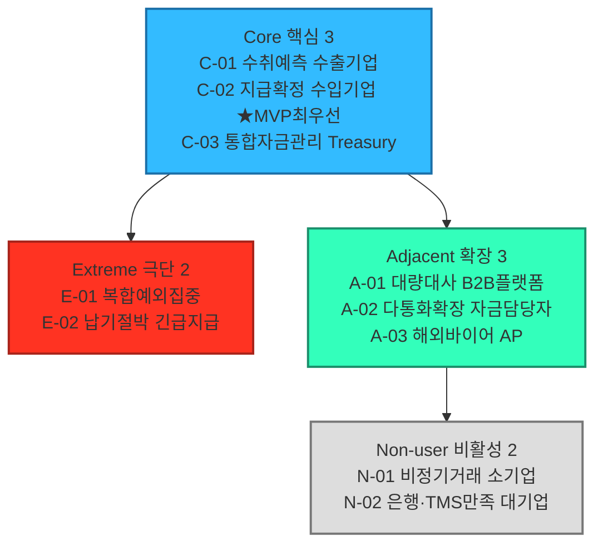

# 페르소나 스펙트럼 분석 보고서

## 요약

- 대상: 04챕터 SOM(USD-KRW 반복거래, 정산 마찰을 겪는 국내 중소·중견 수출입기업)에 `00_방법론.md`의 5단계 워크플로우(1차 생성→2차 평가→3차 보정→4차 검증→5차 통합)를 적용했다.
- 산출: 1차 생성 12명을 행동패턴 기준(산업 아님)으로 재정리해 핵심 3·확장 3·극단 2·비활성 2, 총 10개 아키타입으로 수렴했다.
- 최종 판단: **MVP 대표는 C-02(지급확정형 수입기업, 최우선)·C-01(수취예측형 수출기업)**. C-03은 상위 고객, A-01은 인접시장 대표, E-01·E-02는 예외 검증군, N-01·N-02는 전환저항 검증군이다.
- 극단 유형은 특정 코리도(신흥시장 등)가 아니라 "SOM 안에서도 발생하는 운영상 극단 상황"으로 정의했다 — 코리도는 세그먼트 축, 페르소나는 고객특성 축이라는 원칙을 유지하기 위해서다.
- 주의: 인물명·회사명·수치는 전부 가설/예시값이다. C-03·A-01·A-03·E-01·E-02·N-01은 세그먼트 맵에 정량 근거가 없어 실제 조사가 필요하다(아래 "확인이 필요한 가설" 참고).

## 10개 아키타입

| ID | 유형 | 인물(예시) | 핵심 문제 | 목표 | MVP 적합성 |
|---|---|---|---|---|---|
| C-01 | 핵심 | 김민준 과장, 한강정밀 | 수출대금 정산 3\~5일 지연, 수수료 손실 | 정산 리드타임 1일 이내 | 높음 |
| C-02 | 핵심 | 정하늘 부장, 대성소재 | 수입대금 선지급 후 확인 시차로 유동성 관리 어려움 | 지급-확인 시차 축소 | **매우 높음(★최우선)** |
| C-03 | 핵심 | 배시온 이사(가칭) | 코리도·법인별 포지션을 한눈에 못 봄 | 통합 포지션 대시보드 | 중간(가설) |
| A-01 | 확장 | 윤도경 대표, 트레이드링크 | 화주사마다 은행·통화가 달라 개별대응 비용 큼 | 여러 화주사 거래를 하나의 인프라로 통합 | 중간(SOM 정의와 불일치 소지) |
| A-02 | 확장 | 박서연 팀장, 오션바이오 | 코리도 규모(EUR·JPY 554억 달러)가 작아 우선협상 대상 아님 | 같은 파트너망으로 조기 전환 | 낮음(Phase 1 이후) |
| A-03 | 확장 | Mia Tan(가칭), 해외법인 | 한국 결제망 접근 어려워 대금 지급 지연 | 한국 공급사 결제 간소화 | 낮음(한은 "원화국제결제망"이 먼저 해소할 가능성) |
| E-01 | 극단 | 최유나 대표, 유나트레이딩 | 예외처리 과부하로 본업 시간 부족 | 증빙·신고 자동화 | 중간(예외처리 검증군) |
| E-02 | 극단 | 한이든 과장(가칭) | 통상 리드타임(1\~5일)으론 선적 마감 못 맞춤(가설) | 확정된 초단기 결제 옵션 | 중간(예외처리 검증군) |
| N-01 | 비활성 | 정다은 대표(가칭) | 거래가 드물어 도입 편익이 비용보다 작음 | 전환 필요성 자체를 못 느낌 | 낮음(전환저항 검증군) |
| N-02 | 비활성 | 최지훈 부장, 한빛전자 | 은행 우대·자체 TMS로 이미 마찰이 낮음 | 전환 유인 없음 | 낮음(전환저항 검증군) |

**도출 과정**: 1차 생성에서 산업별(자동차부품·화장품 등)로 12명을 브레인스토밍했으나, 결제상품 관점에서 구분력이 약해 2차 평가에서 "어떤 행동패턴을 보이는가"로 다시 묶었다(예: C1·C4·C5는 모두 "수취를 예측하고 싶다"는 동일 패턴이라 C-01로 통합). 3\~4차에서 각 아키타입을 문제·목표·감정·대체 솔루션까지 구체화하고, `매우 높음·높음·중간·낮음` 4단계로 문제심각도·발생빈도·도입가능성·사업잠재력·MVP 적합성을 평가했다.

## 최종 판단과 전략 액션

| 역할 | 아키타입 | 전략 액션 |
|---|---|---|
| MVP 대표 | C-02(최우선), C-01 | Phase 1 파일럿 — C-02(지급확정)를 우선 검증한 뒤 C-01(수취예측) 확장 |
| 상위 고객 | C-03 | 통합 대시보드는 MVP 이후 로드맵 과제로 별도 검토 |
| 인접시장 대표 | A-01 | 대리 구조(플랫폼)라 SOM 정의와 정확히 일치하지 않음 — 별도 파트너십 트랙 |
| 예외·복구 검증군 | E-01, E-02 | MVP 기능(예외처리 자동화·초단기 결제)이 이 두 상황까지 흡수하는지 스트레스테스트 |
| 전환저항 검증군 | N-01, N-02 | N-01은 "얼마나 낮은 빈도까지 편익이 유지되는가", N-02는 "얼마나 나아져야 전환하는가"를 검증 |

**그림 1. 페르소나 스펙트럼 맵** — Core→Adjacent, Core→Extreme, Adjacent→Non-user 순으로 통합했다.

## 확인이 필요한 가설

`리서치DB/` 원자료로 재검토한 결과다.

- **근거 있음**: E-01(데이터·메시징 분절이 예외처리율을 높인다는 점), N-01(저빈도·단기거래는 현행 방식도 허용범위라는 점)은 이번에 지어낸 가정이 아니라 04챕터 1단계 원 리서치에 이미 있던 시사점이다.
- **문제는 실재하나 MVP 부적합 쪽으로 강화**: A-03이 겪는 문제는 실재하지만, 한국은행이 "원화국제결제망"을 이미 구축 중이다(2026-09 시범운영, 2027 상반기 24/7, KB·우리·하나·신한 참여) — 우리 MVP가 아니라 한은 인프라가 먼저 해소할 가능성이 있다.
- **여전히 순수 가설**: C-03(통합 대시보드 니즈), A-01(화주사 대리형 플랫폼 구조), E-02(선적 마감 시나리오의 실제 발생 빈도)는 리서치DB에도 뒷받침 자료가 없다 — 실제 인터뷰가 우선 조사 대상이다.

## 다음 단계

고객 여정지도는 MVP 대표(C-02 최우선, C-01)의 거래 여정을 중심으로 작성하고, C-03·A-01\~A-03은 확장 검토 축, E-01·E-02는 예외 시나리오 축, N-01·N-02는 전환저항 검증 축으로 활용한다.

## 참고자료

- `04_TAM-SAM-SOM_마켓세그먼트/08_TAM_SAM_SOM_시장세그먼트맵.md`
- `04_TAM-SAM-SOM_마켓세그먼트/07_7단계_솔루션구체화.md`
- `04_TAM-SAM-SOM_마켓세그먼트/06_6단계_반복적정제.md`
- `05_페르소나_고객여정지도/00_방법론.md`
- `리서치DB/deepresearch-해외사례.md` — 한국은행 "원화국제결제망"(A-03 재검토)
- `리서치DB/b2b 국경간 결제정산 문제와 원인.md` — 데이터·메시징 분절과 예외처리율(E-01 재검토)
- `리서치DB/deepresearch_cross-border cross-currency payment_settlement infra market.md` — 거래빈도별 적용 시나리오(N-01 재검토)
