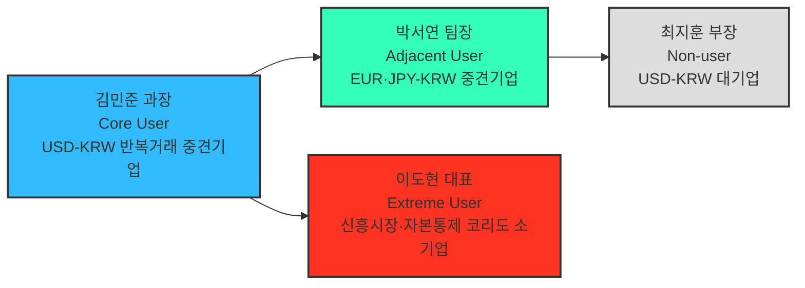

# 페르소나 스펙트럼 분석 보고서

## 요약

- 대상 세그먼트: 04챕터 `08_TAM_SAM_SOM_시장세그먼트맵.md`의 SOM 정의 — "반복적인 USD↔KRW 거래를 수행하며, 비용·정산시점·추적·대사 문제를 겪고 있고, 파트너은행과 ERP/API 연결이 가능한 국내 중소·중견 수출입기업".
- 방법론: `05_페르소나_고객여정지도/00_방법론.md` 2.1절의 5단계 워크플로우(1차 생성 → 2차 평가 → 3차 보정 → 4차 검증 → 5차 통합)를 그대로 적용했다.
- 산출물: Core·Adjacent·Extreme·Non-user 4개 페르소나. 04챕터 Market Segment Map의 세그먼트(5.1·5.4·5.5절)를 각각 한 명의 구체적 인물로 구체화했다.
- 핵심 결론: SOM·MVP 핵심 고객은 **USD-KRW 반복거래 중견기업**이며, EUR·JPY-KRW 중견기업은 조기 확장 대상, 신흥시장·자본통제 코리도 기업은 마찰은 가장 크지만 현재 로드맵 밖, 대기업은 전환 유인이 없어 비활성 상태로 남는다.

## 0. 분석 대상과 근거 자료

이 보고서는 아래 세 문서를 1차 근거로 사용했다.

- `04_TAM-SAM-SOM_마켓세그먼트/08_TAM_SAM_SOM_시장세그먼트맵.md` — SOM 정의, 5.1 매트릭스(통화 코리도×기업 규모), 5.4 세그먼트 요약, 5.5 2×2 세그먼트 맵(정산 마찰×디지털 정산수단 적용 가능성)
- `04_TAM-SAM-SOM_마켓세그먼트/07_7단계_솔루션구체화.md` — 대상 고객 정의(대기업 제외 이유), 솔루션 핵심 기능, 실행 로드맵
- `04_TAM-SAM-SOM_마켓세그먼트/06_6단계_반복적정제.md` — 통화별 거래 규모, 신인프라(Project Agorá)의 코리도별 호환성

## 1단계 — 1차 생성(Divergent Thinking)

유형별로 시장 세그먼트 맵에서 근거를 갖는 후보를 먼저 나열했다.

| 유형 | 후보 | 근거(세그먼트 맵) |
|---|---|---|
| 핵심(Core) | ① USD-KRW 반복거래 중견 수출입기업 ② USD-KRW 반복거래 중소 수출입기업 | 08문서 3.1·5.1(USD-KRW 중견 1,057억·중소 956억 달러), 5.5 Q1 |
| 확장(Adjacent) | ① EUR·JPY-KRW 중견 수출입기업 ② 다수 거래처 관리 B2B 결제 플랫폼 | 08문서 5.4(EUR·JPY-KRW 554억 달러, 2순위), 5.5 Q1 두 번째 사례 |
| 극단(Extreme) | ① 신흥시장·자본통제 코리도 수출기업 ② 수작업 대사 부담이 극심한 초소형기업 | 08문서 5.5 Q4(자본통제·비태환 통화, 고위험 신흥시장, 유동성 연결 부족 코리도) |
| 비활성(Non-user) | ① USD-KRW 대기업 자금팀 ② CNY-KRW 거래기업(mBridge 계열 관찰 대상) | 07문서(대기업은 은행 직접 접근 가능해 제외), 08문서 5.5 Q2 |

## 2단계 — 2차 평가(Convergent Filtering)

각 유형에서 문제·행동·맥락의 현실성이 더 높은 후보를 선정했다.

| 유형 | 최종 선정 | 제외 후보와 그 이유 |
|---|---|---|
| 핵심 | USD-KRW 반복거래 중견 수출입기업 | 중소기업은 세그먼트 규모는 있으나(956억 달러) ERP/API 연동 여력이 낮아 SOM 조건("파트너은행과 ERP/API 연결 가능")을 충족하는 비중이 중견기업보다 낮다고 판단 |
| 확장 | EUR·JPY-KRW 중견 수출입기업 | B2B 결제 플랫폼은 고객군 자체가 다른(1개 기업이 아니라 다수 거래처를 대리) 구조라 "유사 니즈·다른 맥락"이라는 확장 정의보다 별도 채널 세그먼트에 가까움 |
| 극단 | 신흥시장·자본통제 코리도 수출기업 | 초소형기업의 수작업 부담은 Q1(핵심)에서 이미 다루는 문제의 강도 차이일 뿐이라 별도 극단 사례로 보기 어려움. Q4는 문제의 종류 자체(법·규제·유동성 분절 동시 발생)가 다르다 |
| 비활성 | USD-KRW 대기업 자금팀 | CNY-KRW는 07문서에서 이미 "관찰 대상"으로 분류돼 있어 비활성보다는 관망 세그먼트에 가깝고, 대기업 제외 논리(07문서 대상 고객 정의)가 더 명시적인 근거를 갖는다 |

## 3단계 — 3차 보정(Contextual Rewriting): 페르소나 카드

토큰화 예금 기반 결제·정산 애플리케이션(07문서 3절 솔루션 개요)을 기준으로 4개 페르소나를 구체화했다.

### 핵심(Core) — 김민준 과장, (주)한강정밀 자금팀

| 항목 | 내용 |
|---|---|
| 회사 프로필 | 자동차 부품·반도체 소재 대미 수출 중견기업, 연 수출액 약 1,500만 달러(USD-KRW), SAP ERP 구축, 월 40\~60건 해외송금 처리 |
| 문제 | 건별 중개은행 수수료·FX 스프레드로 순매출 2\~3% 손실, 정산까지 3\~5일 소요, 수작업 대사·증빙에 주 2일 이상 소요 |
| 목표 | 정산 리드타임을 하루 이내로 축소하고, ERP 자동 연동 증빙체계로 대사 인력 부담을 줄이는 것 |
| 감정 | 반복되는 수작업에 지쳐 있고, 은행 담당자가 바뀔 때마다 절차를 재설명해야 하는 데 피로감을 느낀다 |
| 대체 솔루션 | 주거래은행 1곳의 외환 서비스만 이용 — 비교견적을 낼 협상력이 부족하다 |
| 서비스에 대한 태도 | 파일럿 참여 의향이 높다 — 파트너은행이 기존 거래은행과 겹치면 전환 저항이 거의 없다 |

### 확장(Adjacent) — 박서연 팀장, (주)오션바이오 해외영업팀

| 항목 | 내용 |
|---|---|
| 회사 프로필 | 유럽·일본 화장품 원료 수출 중견기업, 연 수출액 약 800만 유로·1.2억 엔 상당(EUR·JPY-KRW) |
| 문제 | Core와 동일한 마찰(정산 지연·수작업 대사)을 겪지만, 코리도 규모(554억 달러)가 작아 은행의 우선 협상 대상이 되지 못한다 |
| 목표 | USD-KRW용으로 먼저 검증된 서비스가 있다면 같은 파트너 은행망을 통해 빠르게 옮겨 타고 싶다 |
| 감정 | "이미 검증된 서비스가 있다면 왜 우리는 나중인가"라는 소외감 |
| 대체 솔루션 | 유럽계 은행의 다국적기업용 트레저리 서비스를 부분적으로 이용 중이나 비용이 높다 |
| 서비스에 대한 태도 | Phase 1 종료 후 조기 확장 대상으로 스스로를 인식하며, 대기 명단 등록을 먼저 요청하는 유형이다 |

### 극단(Extreme) — 이도현 대표, (주)그린모빌

| 항목 | 내용 |
|---|---|
| 회사 프로필 | 동남아 등 신흥시장(자본통제·비태환 통화 코리도)에 배터리 부품을 수출하는 소기업, 현지 은행과의 코레스폰던트 관계가 약함 |
| 문제 | 유동성·환전·법·규제 분절이 동시에 발생해 대금 정산이 2\~3주씩 지연되고, 다음 수출 물량의 원재료 구매가 막히는 악순환을 겪는다 |
| 목표 | 어떤 방식이든 정산 지연을 줄이고 싶으나, 이 코리도는 신인프라(Project Agorá 등)의 실거래 검증 대상이 아니다 |
| 감정 | "이 문제를 해결해줄 곳이 없다"는 좌절감과, 신규 핀테크 서비스에 대한 기대·의심이 공존한다 |
| 대체 솔루션 | 로컬 환전상·비공식 채널을 규제 리스크를 알면서도 현금흐름 때문에 불가피하게 사용한다 |
| 서비스에 대한 태도 | 현재 로드맵(Phase 1\~3) 밖의 서비스 대상이다 — 다만 이 실패 경험이 Phase 3 이후 신흥시장 코리도 확장 우선순위를 정하는 근거가 된다 |

### 비활성(Non-user) — 최지훈 부장, (주)한빛전자 글로벌자금팀

| 항목 | 내용 |
|---|---|
| 회사 프로필 | USD-KRW 대기업(연 수출액 수십억 달러), 4대 은행과 우대환율·전용 딜링데스크 계약 체결, 자체 TMS 구축 |
| 문제 | 실질적 마찰이 이미 낮다 — 은행이 대기업 물량을 우대 처리하고, 내부 TMS가 대사·리포팅을 자동화한다 |
| 목표 | 새 인프라로 전환할 유인이 없으며, 오히려 검증되지 않은 신생 애플리케이션 레이어에 자금 흐름을 노출하는 리스크를 우려한다 |
| 감정 | 신중하고 보수적이다 — "이미 문제가 없는데 왜 바꿔야 하나" |
| 대체 솔루션 | 기존 은행 딜링데스크와 자체 TMS |
| 서비스에 대한 태도 | 비활성 — Phase 1\~2 타겟에서 명시적으로 제외되며, Agorá 참여 은행이 표준화된 이후에나 재검토 대상이 된다 |

## 4단계 — 4차 검증(AI Peer Review)

| 페르소나 | 존재 확률 판단 | 근거 | 잔여 리스크 |
|---|---|---|---|
| 핵심 | 높음 | 08문서 3.1절 타겟 세그먼트(약 3,123억 달러)가 이 유형의 실제 집계치이며, 07문서가 "대상 고객"으로 명시 | 이 세그먼트 중 ERP/API 연동 여력이 있는 기업의 정확한 비중은 별도 통계가 없어 추정치에 의존 |
| 확장 | 중간\~높음 | EUR·JPY-KRW 세그먼트(554억 달러, 08문서 5.4절 2순위)는 실제 존재 | "USD-KRW 서비스를 대기한다"는 구체적 행동 패턴은 실증 데이터 없이 로드맵상 가정 |
| 극단 | 높음(마찰 자체는) | Q4 세그먼트(자본통제·비태환 코리도)는 06문서의 mBridge 분석·1\~3단계 마찰 유형 분석에서 이미 확인된 범주 | 개별 인물(이도현 대표)은 예시일 뿐 실제 인터뷰 대상이 아니며, 정량 규모는 08문서에도 별도 산출되지 않음 |
| 비활성 | 매우 높음 | 07문서가 대기업을 "이미 은행 직접 접근 가능"으로 명시적으로 제외했고, 08문서 5.1절 매트릭스에서 대기업이 수출의 66.1%를 차지한다는 사실이 이 유형의 규모를 뒷받침 | 대기업 내에서도 신사업팀 등 예외적으로 신기술 도입에 적극적인 부서가 있을 가능성은 반영하지 못함 |

## 5단계 — 5차 통합(Persona Spectrum Map)

**그림 1. 페르소나 스펙트럼 맵** — 00_방법론.md 그림 1의 구조(Core→Adjacent, Core→Extreme, Adjacent→Non-user)를 실제 인물로 구체화한 것이다.

### 핵심 질문에 대한 답

- (핵심) 이상적인 주요 고객군은 누구인가? → 김민준 과장형 — USD-KRW 반복거래 중견 수출입기업
- (확장) 유사한 제품/서비스를 사용하고 있는 사람은 누구인가? → 박서연 팀장형 — 유럽계 은행 트레저리 서비스를 쓰는 EUR·JPY-KRW 중견기업
- (비활성) 이 제품/서비스를 사용할 수 없는 사람은 누구인가? → 최지훈 부장형 — 이미 은행 우대조건·자체 TMS를 갖춘 대기업
- (극단) 가장 자주 실패를 경험하는 사람은 누구인가? → 이도현 대표형 — 신흥시장·자본통제 코리도의 소기업

### 세그먼트 매핑과 전략 액션

| 페르소나 | 대응 세그먼트(08문서 근거) | 우선순위 | 전략 액션 |
|---|---|---|---|
| 핵심 | Q1 핵심 공략 시장 / SOM 타겟(3,123억 달러) | 1순위 | Phase 1 파일럿 — 파트너은행 공동 온보딩 |
| 확장 | EUR·JPY-KRW 세그먼트(554억 달러, 2순위) | 2순위 | Phase 1 파트너십을 재사용해 Phase 3에 조기 확장 |
| 극단 | Q4 장기 잠재 시장(자본통제·신흥시장 코리도) | 관찰 | 로드맵 밖 — Phase 3 이후 확장 우선순위 결정에 참고 |
| 비활성 | Q2 효율 개선 시장(대기업) | 후순위 | Phase 1\~2 타겟에서 제외, 장기적으로만 재검토 |

## 시사점과 다음 단계

- 이번 페르소나 스펙트럼은 04챕터 SOM·Market Segment Map의 숫자를 인물 단위로 옮긴 것이지, 별도 설문·인터뷰로 검증된 결과는 아니다 — 4단계 검증에 남긴 잔여 리스크가 실제 조사 우선순위다.
- 다음 단계(고객 여정지도)는 핵심 페르소나(김민준 과장)의 거래 여정을 중심으로 작성하고, 확장·극단 페르소나는 여정상 이탈·차단 지점을 보여주는 비교 축으로 활용한다.

## 참고자료

- `04_TAM-SAM-SOM_마켓세그먼트/08_TAM_SAM_SOM_시장세그먼트맵.md`
- `04_TAM-SAM-SOM_마켓세그먼트/07_7단계_솔루션구체화.md`
- `04_TAM-SAM-SOM_마켓세그먼트/06_6단계_반복적정제.md`
- `05_페르소나_고객여정지도/00_방법론.md`
