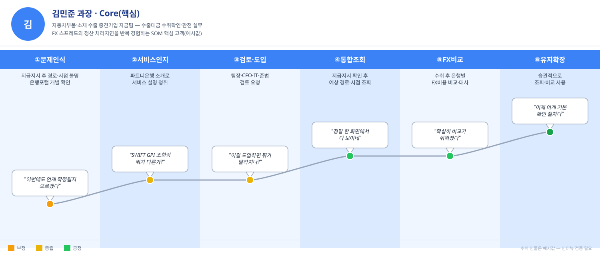
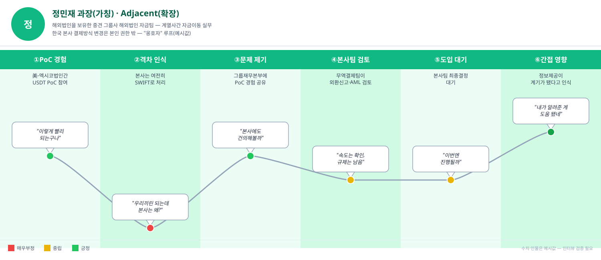
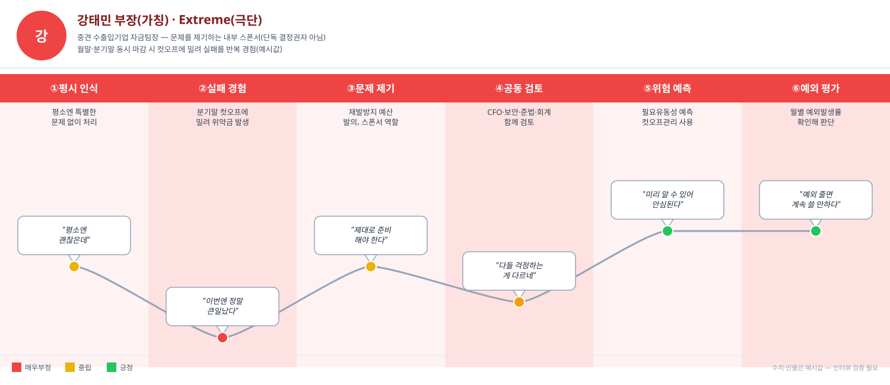
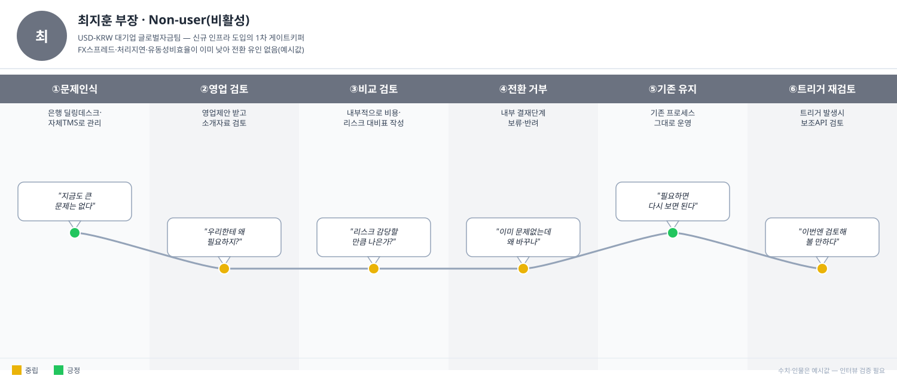
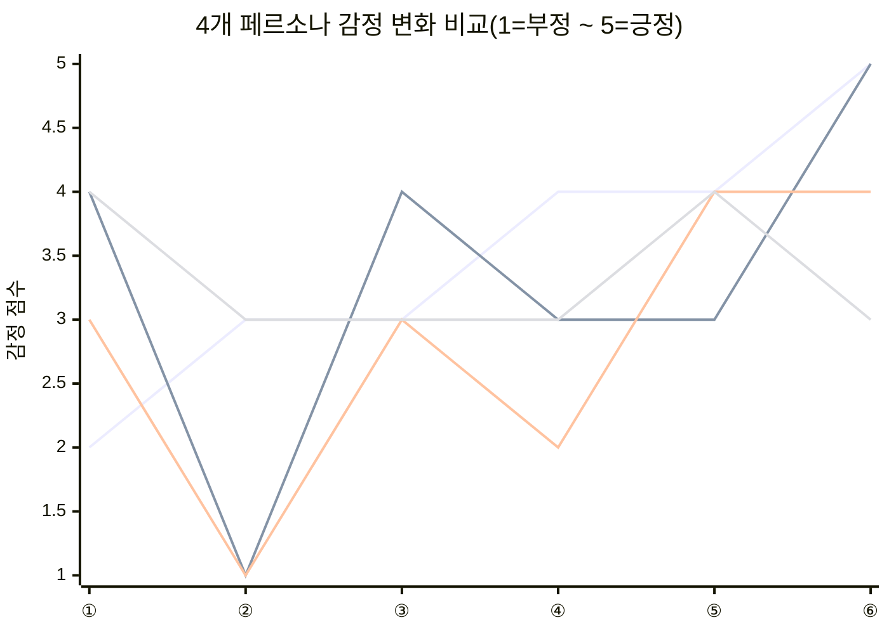

# 고객 여정지도 (Customer Journey Map)

## 요약

- 방법론: `00_방법론.md` 3절(CJM 개념·표 템플릿)과 `01_페르소나스펙트럼_분석보고서.md`에서 최종 확정한 4개 대표 페르소나(김민준·정민재·강태민·최지훈)를 근거로 작성했다.
- 페르소나마다 여정 단계 이름과 흐름을 다르게 잡았다 — Core(김민준)는 "정상 운영 루프", Extreme(강태민)은 "실패→다부서 공동검토 루프", Adjacent(정민재)는 "본인이 결정권자가 아닌 옹호자 루프", Non-user(최지훈)는 "전환 거부·트리거 대기 루프"가 핵심이라 각자 다르게 구성했다(방법론 3.1절 "여정 단계에 고정된 정답은 없다" 원칙에 따름).
- 핵심 결론: 4개 페르소나 모두 "문제 인식/실패 경험" 단계가 가장 치명적인 Pain Point이며, 잔존 마찰은 Core는 "비교는 되지만 실제 전환까지 별도 협상 필요", Adjacent는 "본사팀 검토가 규제 불확실성으로 지연", Extreme은 "대체경로가 제안+승인이라 판단 부담 남음", Non-user는 "리스크 회피형 전환 거부"다. 상세는 5절 종합 비교표 참고.
- 주의: 이전 버전(정하늘·윤도경·최유나·최지훈 기준)은 01문서 재작업으로 폐기됐다 — 이번 버전이 확정본이다.
- 감정 시각화: 각 단계표의 감정 칸에 신호등 색(🔴부정\~🟠\~🟡중립\~🟢긍정)을 붙였고, 페르소나별로 실제 여정지도 이미지(`이미지/CJM_*.svg`)를 만들어 행동·말풍선 인용·감정 곡선을 한 그림에 담았다. Core·Adjacent·Extreme은 중간 단계에서 급락 후 회복하는 V자형이고, Non-user만 등락이 거의 없다(5절 비교 차트 참고).
- 관여 주체·마찰 태그 추가: 각 단계에 실제로 누가 움직이는지(본인/팀장/CFO·IT보안·준법·회계/그룹재무본부·무역결제팀)와 어떤 마찰(FX 스프레드·처리지연·유동성비효율)이 관련되는지를 표에 명시했다. Adjacent(정민재)는 대부분 단계가 "해당없음"으로 나온다 — 이 페르소나의 Pain Point가 세 마찰이 아니라 조직·규제 이슈에서 온다는 걸 다시 확인시켜준다.

## 0. 참고 자료

- `05_페르소나_고객여정지도/00_방법론.md` 3절 — CJM 개념, 여정 단계 정의 방법, 표 템플릿
- `05_페르소나_고객여정지도/01_페르소나스펙트럼_분석보고서.md` — 4개 대표 페르소나 카드(담당업무·거래맥락·문제발생상황·서비스개입시점·기대가치 등)와 4단계 존재확률 검증
- `04_TAM-SAM-SOM_마켓세그먼트/07_7단계_솔루션구체화.md` — 솔루션 개요(토큰화 예금 기반 결제·정산 애플리케이션)

## 1. Core — 김민준 과장, 자동차부품·소재 수출 중견기업 자금팀

| 단계 | 관여 주체 | 관련 마찰 | 고객 행동 | 고객 생각 | 감정 | Pain Point | 개선 기회 |
|---|---|---|---|---|---|---|---|
| ①문제인식(Before) | 본인 | 처리지연 | 거래처가 지급지시한 후에도 어느 은행 경로로 언제 도착할지 몰라 여러 은행 포털을 개별 확인 | "이번에도 언제 확정될지 모르겠다" | 🟠 **초조** | 지급지시 이후에도 **도착 시점을 예측할 수 없음** | 지급지시 등록 즉시 예상 경로·시점을 보여주는 서비스가 있다는 걸 알려야 함 |
| ②서비스 인지·탐색 | 본인 | 처리지연 | 파트너은행 소개로 서비스 설명을 들음 | "이게 SWIFT GPI 조회와 뭐가 다른가?" | 🟡 **반신반의** | 기본 상태조회는 이미 익숙해 **차별점을 못 느낄 수 있음** | **다중은행 비교·FX비용비교**라는 차별점을 수치로 보여주는 데모 |
| ③검토·도입결정 | 본인(발의) + **팀장·CFO·IT·준법**(검토) | 해당없음(도입장벽) | 팀장·CFO·IT·준법 부서에 검토 요청 | "이걸 도입하면 뭐가 달라지나?" | 🟡 **기대와 부담 공존** | 기존 거래은행이 파트너망에 없으면 **도입 자체가 무의미** | **파트너은행 목록·연동 가이드**를 사전에 명확히 제공 |
| ④지급지시 등록·통합조회(첫 사용) | 본인 | 처리지연 | 거래처의 지급지시 등록을 확인한 뒤 서비스에서 예상 경로·시점 조회 | "정말 한 화면에서 다 보이네" | 🟢 **기대** | 신규 프로세스라 매 단계를 재확인하며 익숙해지는 시간이 필요 | **온보딩 초기 단축 체크리스트** 제공 |
| ⑤FX비용비교·대사(반복 사용) | 본인 | FX스프레드 | 수취 후 은행별 총 FX 비용을 비교하고 대사 처리 | "확실히 비교가 쉬워졌다" | 🟢 **안정** | 비교는 쉬워졌지만 **실제 전환(은행 변경)까지는 별도 협상이 필요** | 비교 결과를 바로 실행할 수 있는 **연계 기능** |
| ⑥유지·확장(완료 후) | 본인 | 해당없음(락인 리스크) | 다음 거래에도 습관적으로 조회·비교를 사용 | "이제 이게 기본 확인 절차다" | 🟢 **신뢰** | 협상력이 약해 서비스 조건이 바뀌면 **대안이 마땅치 않음(락인 우려)** | 장기 이용 고객 대상 **조건 고정·우대 정책** |

## 2. Adjacent — 정민재 과장(가칭), 해외법인을 보유한 중견 그룹사 해외법인 자금팀

정민재는 본사 결제방식 변경에 대한 결정권이 없다 — 여정은 "도입"이 아니라 "옹호(advocacy)"를 중심으로 구성했다.

| 단계 | 관여 주체 | 관련 마찰 | 고객 행동 | 고객 생각 | 감정 | Pain Point | 개선 기회 |
|---|---|---|---|---|---|---|---|
| ①PoC 경험 | 본인 + 그룹재무본부 | 처리지연 | 미국-멕시코법인간 2만 달러 규모 USDT 송금 PoC에 참여 | "이렇게 빨리 되는구나" | 🟢 **놀라움** | 1회성 실증이라 **일상 업무로는 이어지지 않음** | PoC 성과를 상용 프로세스로 확장하는 **경로 제시** |
| ②격차 인식(**결정적**) | 본인 | 해당없음(인프라 격차 인식) | 본사가 여전히 SWIFT로 처리하는 걸 봄 | "우리 계열사끼리는 되는데 본사는 왜 안 되나" | 🔴 **답답함** | 같은 그룹인데 왜 격차가 나는지 **설명이 없음** | 해외법인-본사간 인프라 격차를 설명하는 **자료** |
| ③내부 문제제기 | 본인 → **그룹재무본부** | 해당없음(조직 커뮤니케이션) | 그룹 재무본부에 PoC 경험을 공유 | "이거 본사에도 건의해볼까" | 🟢 **기대** | 본인 권한 밖이라 **건의만 하고 결정은 못함** | 정보제공자가 바로 쓸 수 있는 **요약자료·비교표** |
| ④본사팀 검토(본인은 관찰) | **무역결제팀** | 해당없음(규제·컴플라이언스) | 무역결제팀이 외환신고·AML·회계를 검토 시작 | "속도는 확인했는데 규제 문제가 남아있네" | 🟡 **조심스러운 기대** | 외환신고·AML·회계·내부통제 기준이 아직 불명확해 **검토가 길어짐** | **규제 리스크를 낮추는 기능**(AML/KYC 자동심사)을 먼저 제시 |
| ⑤도입여부 대기 | **무역결제팀** | 해당없음 | 본사팀의 최종 결정을 기다림 | "이번엔 진행될까" | 🟡 **관망** | 본인 업무(계열사간 이동)와 별개로 진행돼 **관여도가 낮음** | **진행상황을 공유받을 채널** |
| ⑥간접 영향(완료 후) | 본인 + 무역결제팀 | 해당없음 | 본사가 도입하면 자신의 정보제공이 계기였다고 인식 | "내가 알려준 게 도움이 됐네" | 🟢 **만족** | 본인의 기여가 조직 내에서 **잘 드러나지 않을 수 있음** | 도입 성공사례 공유 시 **기여자 인지** |

## 3. Extreme — 강태민 부장(가칭), 중견 수출입기업 자금팀장

강태민은 단독 결정권자가 아니라 문제를 제기하는 내부 스폰서다 — 여정에 "다부서 공동검토" 단계를 넣었다.

| 단계 | 관여 주체 | 관련 마찰 | 고객 행동 | 고객 생각 | 감정 | Pain Point | 개선 기회 |
|---|---|---|---|---|---|---|---|
| ①평시 문제인식(약함) | 본인 | 해당없음(평시라 마찰 약함) | 평소엔 특별한 문제 없이 업무 처리 | "평소엔 괜찮은데" | 🟡 **무관심** | 상시 대응체계에 **투자할 필요를 못 느낌** | 평시에도 **잠재 리스크를 보여주는 지표** |
| ②실패 경험(**결정적**) | 본인 | **FX스프레드+처리지연+유동성비효율(동시압축)** | 분기말 동시 마감 시 은행 컷오프에 밀려 위약금 발생 | "이번엔 정말 큰일났다" | 🔴 **당황·압박** | 은행별 컷오프 시간이 달라 **어디서 밀릴지 예측 불가** | 마감 전 **컷오프·처리량을 미리 보여주는 경고** |
| ③내부 문제제기·예산 발의 | 본인(스폰서) | 해당없음(내부 프로세스) | 재발 방지를 위해 예산을 발의, 내부 스폰서 역할 | "이번엔 제대로 준비해야 한다" | 🟡 **결심** | 단독 결정이 안 돼 **여러 부서를 설득해야 함** | 발의자가 활용할 **문제사례·근거자료** 제공 |
| ④공동검토 | **CFO·IT보안·준법·회계** | 해당없음(내부 승인 프로세스) | CFO·IT보안·준법·회계 부서가 함께 검토 | "다들 걱정하는 부분이 다르네" | 🟠 **조율의 어려움** | 각 부서의 우려(보안·규제·회계)를 **개별적으로 해소해야 함** | 부서별 우려에 대응하는 자료(**보안인증·규제대응**) 사전 제공 |
| ⑤위험예측 사용(도입 후) | 본인 | 처리지연+유동성비효율 | 마감 전 필요유동성 예측·컷오프관리·우선순위설정·경고 기능 사용 | "이제 미리 알 수 있어서 안심된다" | 🟢 **안심** | 대체경로가 **자동전환이 아니라 제안+승인**이라 여전히 본인 판단이 필요 | **승인 절차를 더 빠르게** 만드는 UX 개선 |
| ⑥예외처리율 평가(완료 후) | 본인 | 해당없음(운영 지표 평가) | 월별 예외 발생률을 확인해 지속 여부 판단 | "예외가 줄어들면 계속 쓸 만하다" | 🟢 **조건부 신뢰** | 예외 발생률이 기대만큼 안 줄면 **재검토 위험** | **예외 발생률을 낮추는 사전검사** 강화 |

## 4. Non-user — 최지훈 부장, USD-KRW 대기업 글로벌자금팀

다른 세 페르소나는 "감정 급락→회복"의 V자 곡선을 보이는 반면, 최지훈은 등락이 거의 없는 완만한 곡선이다 — 감정적으로 불편함을 느끼지 않는다는 것 자체가 전환이 어려운 이유다.

| 단계 | 관여 주체 | 관련 마찰 | 고객 행동 | 고객 생각 | 감정 | Pain Point | 개선 기회 |
|---|---|---|---|---|---|---|---|
| ①문제인식(Before, 약함) | 본인 | **FX스프레드·처리지연·유동성비효율 모두 이미 낮음** | 기존 은행 딜링데스크·자체 TMS로 자금 관리 | "지금도 큰 문제는 없다" | 🟢 **안정** | 문제인식 자체가 낮아 **새 서비스를 찾을 동기가 없음** | "문제 해결"이 아니라 **"추가 효율" 관점**으로 접근 |
| ②영업제안 검토 | 본인 | 해당없음 | 영업 제안을 받고 소개자료 검토 | "우리한테 왜 필요하지?" | 🟡 **무관심에 가까운 신중함** | 기존 방식과 차별점이 명확히 전달 안 되면 **검토조차 시작하지 않음** | **대기업 특화 효율 지표**로 어필 |
| ③비교 검토 | 본인 | 해당없음(리스크 계산) | 내부적으로 비용·리스크 대비표 작성 | "리스크를 감당할 만큼 나은가?" | 🟡 **신중** | 지급지시 권한·운영 의존성을 신규 서비스에 넘기는 **리스크가 기대 이득보다 크게 느껴짐** | **보안·규제 준수 인증**, 레퍼런스 기업 사례 제시 |
| ④전환 거부(**결정적**) | **본인(게이트키퍼)** | 해당없음(리스크 회피) | 내부 결재 단계에서 보류·반려 | "이미 문제가 없는데 왜 바꾸나" | 🟡 **보수적 확신** | 검증되지 않은 서비스에 지급지시 권한·운영을 넘기는 **리스크 회피 성향** | **파일럿 규모를 극소화**(소액 거래만)해 리스크 최소화 |
| ⑤기존 유지(완료 상태) | 본인 | 해당없음 | 기존 프로세스 그대로 운영 | "필요하면 그때 다시 보면 된다" | 🟢 **안정** | 재검토 트리거가 없으면 **영구적 비활성 상태로 남음** | **트리거**(SLA 악화·신규 코리도·규제 변화) 모니터링해 재접근 시점 포착 |
| ⑥트리거 재검토 | 본인 (+ 필요 시 CFO·이사회) | 해당없음(외부 환경 변화) | 신규 국가·통화 진출, 은행 SLA 악화, TMS 미지원 레일 등장, 규제 변화 시 보조 API 도입 검토 | "이번엔 검토해볼 만하다" | 🟡 **재고 여지** | 독립형 플랫폼 전체 도입이 아니라 **보조 API로만 제한적 검토** | 기존 TMS와 **무중단 연동**을 증명하는 레퍼런스 제공 |

## 5. 종합 비교 — 페르소나별 결정적 Pain Point

**그림. 감정 변화 비교** — 선 순서대로 김민준·정민재·강태민·최지훈이다(mermaid xychart-beta는 범례를 지원하지 않아 순서로 구분). 김민준·정민재·강태민 세 명은 ②\~④단계에서 크게 떨어졌다가 회복하는 V자 곡선을 그리는 반면, 최지훈만 4점대 안팎에서 거의 움직이지 않는다 — 이 완만함 자체가 "왜 전환이 안 되는지"를 보여준다.

| 페르소나 | 진입 Pain Point | 이용 중 잔존 마찰 | 개선기회 우선순위 |
|---|---|---|---|
| **Core(김민준)** | 지급지시 후에도 **도착 시점을 예측할 수 없음** | 비교는 되지만 실제 전환(은행 변경)까지 별도 협상이 필요 | 🟢 **1순위** — SWIFT GPI 대비 차별점(다중은행·FX비용비교)을 명확히 증명하는 것이 MVP 핵심 |
| **Adjacent(정민재)** | 본사와의 인프라 격차, **본인은 결정권 밖** | 본사팀 검토가 규제 불확실성으로 지연 | 🟡 **관찰** — 존재확률이 중간(01문서 4단계)이라, 세그먼트 규모부터 인터뷰로 확인 필요 |
| **Extreme(강태민)** | 컷오프 밀림으로 **실제 실패(위약금) 경험** | 대체경로가 자동전환이 아니라 제안+승인이라 판단 부담이 남음 | 🟢 **1순위** — 마감 전 위험예측·경고 기능이 MVP 핵심 검증 대상 |
| **Non-user(최지훈)** | **문제인식 자체가 낮음** | 전환 거부(리스크 회피)가 결정적 이탈 지점 | ⚪ **3순위** — 트리거 모니터링에 집중, 상시 전환 시도는 비효율적 |

## 다음 단계

- Core·Extreme의 "1순위" 개선기회(다중은행·FX비용비교 증명, 마감 전 위험예측·경고)는 07문서 솔루션 핵심 기능과 대조해 MVP 기능 명세 우선순위에 반영이 필요하다.
- Adjacent(정민재)는 CJM보다 앞서, 이 세그먼트가 실제로 존재하는 규모인지(대기업·금융회사 한정 여부) 인터뷰로 먼저 확인해야 한다 — 01문서 4단계에서 남긴 잔여 리스크다.
- Non-user는 CJM상 전환 유도 지점이 없다 — 트리거 모니터링 체계(영업/CRM 관점)는 이 챕터 범위를 벗어나므로 별도 과제로 남긴다.

## 참고자료

- `05_페르소나_고객여정지도/00_방법론.md`
- `05_페르소나_고객여정지도/01_페르소나스펙트럼_분석보고서.md`
- `04_TAM-SAM-SOM_마켓세그먼트/07_7단계_솔루션구체화.md`
- `이미지/CJM_김민준.svg`, `CJM_정민재.svg`, `CJM_강태민.svg`, `CJM_최지훈.svg` — 페르소나별 여정지도 인포그래픽
