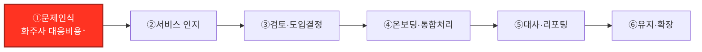
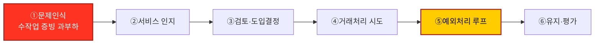
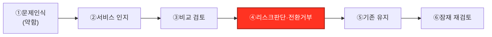

# 고객 여정지도 (Customer Journey Map)

## 요약

- 방법론: `00_방법론.md` 3절(CJM 개념·표 템플릿)과 `01_페르소나스펙트럼_분석보고서.md`의 4개 대표 페르소나(Core·Adjacent·Extreme·Non-user)를 근거로 작성했다.
- 각 페르소나가 서비스를 접하기 전(기존 방식의 고통)부터 서비스 인지·검토·도입·반복 사용·이용 완료 후까지 겪는 행동·생각·감정·Pain Point·개선기회를 정리했다.
- 여정 단계는 페르소나마다 다르게 정의했다 — Core·Adjacent는 "정상 운영 루프", Extreme은 "예외 처리 루프", Non-user는 "전환 거부·잠재 재검토"가 핵심이라 단계 이름과 흐름을 각각 다르게 잡았다(방법론 3.1절 "여정 단계에 고정된 정답은 없다" 원칙에 따름).
- 핵심 결론: 4개 페르소나 모두 "문제인식" 단계(=페르소나 카드의 원 문제)가 가장 치명적인 Pain Point이며, 이용 중에는 Core는 ERP 자동연동 미흡, Adjacent는 대리 구조의 책임 소재 불명확, Extreme은 예외 처리 루프 반복, Non-user는 리스크 회피형 전환 거부가 각각 잔존 마찰이다. 상세는 5절 종합 비교표 참고.

## 0. 참고 자료

- `05_페르소나_고객여정지도/00_방법론.md` 3절 — CJM 개념, 여정 단계 정의 방법, 표 템플릿
- `05_페르소나_고객여정지도/01_페르소나스펙트럼_분석보고서.md` — 4개 대표 페르소나 카드(회사 프로필·문제·목표·감정·대체 솔루션)와 존재확률 검증
- `04_TAM-SAM-SOM_마켓세그먼트/07_7단계_솔루션구체화.md` — 솔루션 개요(토큰화 예금 기반 결제·정산 애플리케이션)

## 1. Core 대표 — 지급확정형 수입기업 결제담당자(정하늘 부장, (주)대성소재)

| 단계 | 고객 행동 | 고객 생각 | 감정 | Pain Point | 개선 기회 |
|---|---|---|---|---|---|
| ①문제인식(Before) | 여러 은행 견적을 그때그때 비교해 지급처를 정함 | "이번에도 언제 확정될지 모르겠다" | 초조 | 지급 확정 시점을 예측할 수 없어 유동성 계획이 불가능함 | 지급 확정 시점을 사전 고지하는 서비스 존재를 알려야 함 |
| ②서비스 인지·탐색 | 파트너은행 소개로 서비스 설명을 들음 | "이게 지급 확정 지연을 해결해줄까?" | 반신반의 | 기존 대체 솔루션(은행 비교)에 익숙해 새 서비스의 실질 이득을 가늠하기 어려움 | 지급확정 시차 축소 효과를 수치로 보여주는 데모·시뮬레이션 제공 |
| ③검토·도입결정 | 내부 결재, ERP 연동 가능성 검토 | "협상력 없는 우리도 이걸 쓸 수 있나?" | 기대와 부담 공존 | ERP·기존 은행 프로세스와의 연동 여부가 불확실해 결정이 지연됨 | 파일럿 온보딩 체크리스트·연동 가이드 사전 제공 |
| ④지급 준비·실행(첫 사용) | 인보이스 확정, 환율 확인 후 서비스로 지급 등록·송금 지시 | "이번엔 정말 하루 안에 끝날까?" | 기대 | 신규 프로세스라 담당자가 매 단계를 재확인해야 해 시간이 걸림 | 온보딩 초기 단계용 단축 체크리스트 제공 |
| ⑤확인·대사(반복 사용) | 정산 확정 알림 확인, 내부 회계 반영 | "확실히 전보다 빨라졌다" | 안정 | 확정 알림이 와도 ERP 자동 반영이 안 되면 수작업 대사가 남음 | ERP 자동연동 증빙체계로 대사 인력 부담 제거 |
| ⑥유지·확장(완료 후) | 다음 지급 계획에 확정된 리드타임을 반영 | "이제 이걸 기본값으로 쓰면 되겠다" | 신뢰 | 협상력이 약해 서비스 비용·조건이 바뀌면 대안이 마땅치 않음(락인 우려) | 장기 이용 고객 대상 조건 고정·우대 정책 |

## 2. Adjacent 대표 — 대량대사형 B2B 플랫폼 정산운영자(윤도경 대표, 트레이드링크)

| 단계 | 고객 행동 | 고객 생각 | 감정 | Pain Point | 개선 기회 |
|---|---|---|---|---|---|
| ①문제인식(Before) | 화주사별로 다른 은행 채널을 각각 중개 | "화주사가 늘수록 감당이 안 된다" | 부담 | 화주사 수 증가에 따라 관리 복잡도가 기하급수적으로 커짐 | 다수 화주사 거래를 하나의 인프라로 통합할 방법 필요 |
| ②서비스 인지·탐색 | 서비스 소개 자료·레퍼런스 검토 | "화주사별 은행 채널을 하나로 통합할 수 있나?" | 관심 | 대리 구조(화주사 대신 처리)가 SOM 정의(국내 수출입기업 직접 이용)와 맞는지 확신이 없음 | B2B 플랫폼 전용 파트너십 트랙과 연동 사례 제시 |
| ③검토·도입결정 | 기술 연동(API) 가능성 검토, 화주사 데이터 마이그레이션 계획 | "화주사들에게 이 전환을 어떻게 설명하지?" | 신중 | 화주사 전체를 한 번에 전환하기엔 리스크가 커 단계적 전환 방안이 필요함 | 화주사 일부만 우선 전환하는 파일럿 옵션 제공 |
| ④온보딩·통합처리(첫 사용) | 일부 화주사 거래를 통합 인프라에 연결 | "일단 몇 곳만 해보자" | 시험적 기대 | 화주사별로 요구하는 데이터 형식이 달라 초기 연동에 시간이 든다 | 화주사 데이터 형식 표준 템플릿 제공 |
| ⑤대사·리포팅(반복 사용) | 통합 대사 결과를 화주사별로 분리해 전달 | "이제 한 곳에서 다 보인다" | 안정 | 화주사 수가 늘면 리포팅 개별화 요청이 늘어 운영 부담이 다시 커질 수 있음 | 화주사별 자동 리포팅 템플릿·대시보드 제공 |
| ⑥유지·확장(완료 후) | 신규 화주사 온보딩을 서비스 표준 절차로 진행 | "화주사가 늘어도 부담이 늘지 않는다" | 신뢰 | 대리 구조 특유의 리스크(화주사 자금 흐름을 대신 처리)에 대한 책임 소재가 명확하지 않음 | 대리 처리 구조에 맞는 책임·정산 분리 정책 명문화 |

## 3. Extreme 대표 — 복합예외집중형 정산운영자(최유나 대표, 유나트레이딩)

| 단계 | 고객 행동 | 고객 생각 | 감정 | Pain Point | 개선 기회 |
|---|---|---|---|---|---|
| ①문제인식(Before) | 세무사·관세사 외주로 증빙 처리 | "이 비용, 매출 대비 너무 크다" | 조바심 | 외주 비용이 매출 대비 과도해 사업 확장을 미루게 됨 | 증빙·신고를 자동화할 저비용 대안 필요 |
| ②서비스 인지·탐색 | 서비스의 증빙 자동화 기능 확인 | "이게 정말 수작업을 줄여줄까?" | 기대와 의심 공존 | 1인 체제라 새 도구를 검증할 시간조차 부족함 | 도입 전 무료·저비용 체험 기간 제공 |
| ③검토·도입결정 | 체험판으로 일부 거래 처리 | "일단 부담 없이 해보자" | 조심스러운 기대 | 기존 외주와 병행해야 해 이중 비용이 잠시 발생함 | 전환 기간 중 병행 사용 지원(외주 인터페이스 연동) |
| ④거래처리 시도(첫 사용) | 거래 등록 후 자동 증빙 생성 시도 | "대부분은 되는데, 이 건은 왜 막히지?" | 당황 | 예외(서류 미비·정보 불일치)가 발생하면 자동화가 멈추고 다시 수작업으로 전환됨 | 예외 발생 시 즉시 원인을 알려주는 가이드형 안내 |
| ⑤예외처리 루프(반복되는 핵심 단계) | 예외 건을 수작업으로 보완해 재제출 | "결국 또 나 혼자 다 해야 하네" | 압도됨 | 예외 처리가 몰리는 시점에 본업(영업)에 쓸 시간이 다시 사라짐 | 예외 처리 전담 지원 채널(우선 대응) 제공 |
| ⑥유지·평가(완료 후) | 월별 예외 발생률을 확인해 지속 여부 판단 | "예외만 줄어들면 계속 쓸 만하다" | 조건부 신뢰 | 예외 발생률이 기대만큼 줄지 않으면 다시 외주로 돌아갈 위험이 있음 | 예외 발생률을 낮추는 자동 서류 사전 검사 강화 |

## 4. Non-user 대표 — 기존 은행·TMS 만족형 대기업(최지훈 부장, (주)한빛전자)

| 단계 | 고객 행동 | 고객 생각 | 감정 | Pain Point | 개선 기회 |
|---|---|---|---|---|---|
| ①문제인식(Before, 약함) | 기존 은행 딜링데스크·자체 TMS로 자금 관리 | "지금도 큰 문제는 없다" | 안정 | 문제 인식 자체가 낮아 새 서비스를 찾을 동기가 없음 | 대기업 대상은 "문제 해결"이 아니라 "추가 효율" 관점으로 접근 필요 |
| ②서비스 인지 | 영업 제안을 받고 소개자료를 검토 | "우리한테 왜 필요하지?" | 무관심에 가까운 신중함 | 기존 방식과 차별점이 명확히 전달되지 않으면 검토조차 시작하지 않음 | 대기업 특화 효율 지표(대사 시간 추가 절감 등)로 어필 |
| ③비교 검토 | 내부적으로 비용·리스크 대비표 작성 | "지금 방식보다 나은 점이 리스크를 감당할 만큼 큰가?" | 신중 | 신생 애플리케이션 레이어에 자금을 노출하는 리스크가 기대 이득보다 크게 느껴짐 | 보안·규제 준수 인증, 레퍼런스 기업 사례 제시 |
| ④리스크판단·전환거부(결정적 단계) | 내부 결재 단계에서 보류·반려 | "이미 문제가 없는데 왜 바꾸나" | 보수적 확신 | 검증되지 않은 신규 서비스에 대한 리스크 회피 성향이 전환을 막는 가장 큰 요인 | 파일럿 규모를 극소화(일부 소액 거래만)해 리스크 부담 최소화 |
| ⑤기존 유지(완료 상태) | 기존 프로세스 그대로 운영 | "필요하면 그때 다시 보면 된다" | 안정 | 재검토 트리거가 없으면 영구적 비활성 상태로 남음 | 재검토 트리거(은행 서비스 변경·규제 변화)를 모니터링해 재접근 시점 포착 |
| ⑥잠재 재검토 | 트리거 발생 시(예: 주거래은행 서비스 축소) 대안 재검토 | "그때는 그 서비스도 한번 봐야겠다" | 재고 여지 | 트리거 발생 시점을 예측할 수 없어 영업 측이 재접근 시점을 놓치기 쉬움 | 정기적 재접촉(뉴스레터·업데이트 공유)으로 최상위 회상 유지 |

## 5. 종합 비교 — 페르소나별 결정적 Pain Point

| 페르소나 | 진입 Pain Point(①문제인식) | 이용 중 잔존 마찰 | 개선기회 우선순위 |
|---|---|---|---|
| Core(지급확정형 수입기업) | 지급 확정 시점 예측 불가 → 유동성 관리 어려움 | ERP 자동연동 미흡 시 수작업 대사 재발생(⑤) | 1순위 — ERP 자동연동 증빙체계, MVP 핵심 기능과 직결 |
| Adjacent(대량대사 B2B 플랫폼) | 화주사 수 증가에 따른 기하급수적 관리 복잡도 | 대리 구조의 책임·정산 분리 소재 불명확(⑥) | 2순위 — 파트너십 트랙 설계 시 책임 분리 정책 선결 필요 |
| Extreme(복합예외집중형) | 수작업 증빙 과부하로 본업 시간 부족 | 예외 처리 루프 반복(⑤) — 자동화가 예외 앞에서 멈춤 | 1순위 — 예외 발생률을 낮추는 사전 검사가 MVP 예외처리 기능의 핵심 검증 대상 |
| Non-user(은행·TMS 만족형 대기업) | 문제 인식 자체가 낮음(전환 동기 부재) | 리스크 회피형 전환 거부(④)가 결정적 이탈 지점 | 3순위 — 지금 시점 전환 유도보다 재검토 트리거 모니터링에 집중 |

## 다음 단계

- Core·Extreme의 "1순위" 개선기회(ERP 자동연동, 예외 사전 검사)는 07문서 솔루션 핵심 기능과 대조해 MVP 기능 명세 우선순위에 반영이 필요하다.
- Adjacent의 "책임·정산 분리 정책"은 별도 파트너십 트랙 설계 문서에서 다뤄야 할 항목으로, 이 CJM만으로는 결론을 내지 못한다.
- Non-user는 CJM상 전환 유도 지점이 없다 — 재검토 트리거 모니터링 체계(영업/CRM 관점)는 이 챕터 범위를 벗어나므로 별도 과제로 남긴다.

## 참고자료

- `05_페르소나_고객여정지도/00_방법론.md`
- `05_페르소나_고객여정지도/01_페르소나스펙트럼_분석보고서.md`
- `04_TAM-SAM-SOM_마켓세그먼트/07_7단계_솔루션구체화.md`
