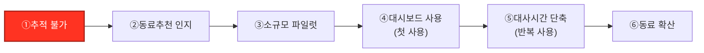
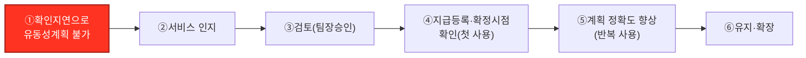
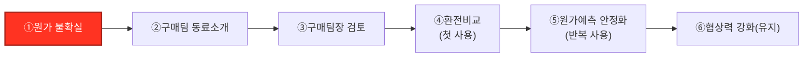
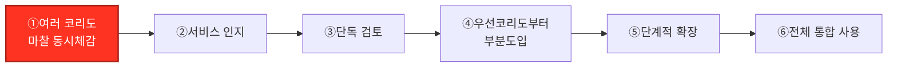
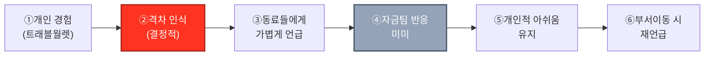
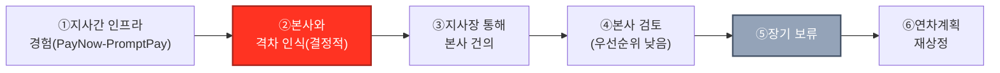
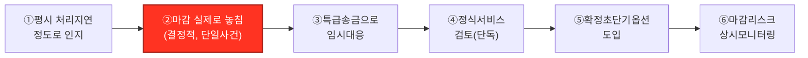
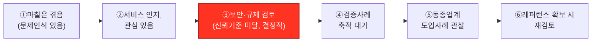

# 참고 후보 8명 — 고객 여정지도

## 요약

- 대상: `01_페르소나스펙트럼_분석보고서.md` 1단계(1차 생성) 12명 중 대표로 선정되지 않은 8명(핵심 4·확장 2·극단 1·비활성 1)의 여정지도다. 대표 4명(김민준·정민재·강태민·최지훈)의 여정지도는 `02_고객여정지도.md`를 참고한다.
- 형식 차이: 대표 4명은 커스텀 인포그래픽(SVG)까지 만들었지만, 이 8명은 참고용이라 표+흐름도만으로 가볍게 정리했다.
- 핵심 관찰: 같은 유형이라도 여정 모양이 서로 다르다 — 특히 확장(Adjacent) 2명(이영재·한도윤)은 대표(정민재)와 달리 "조직이 반응하지 않거나 장기 보류되는" 결말로 끝나, 왜 정민재가 대표로 선정됐는지를 대비적으로 보여준다. 극단(배소연)은 강태민의 "다건 동시압축형"과 달리 "단일 사건형" 실패다.
- 주의: 인물명·수치는 모두 가설/예시값이다.

## 핵심(Core) 후보 4명

### C2 — 이수경 대리, 수출기업 재무담당(고빈도 거래 가시성 특화)

| 단계 | 관여 주체 | 관련 마찰 | 고객 행동 | 고객 생각 | 감정 | Pain Point | 개선 기회 |
|---|---|---|---|---|---|---|---|
| ①추적 불가 | 본인 | 처리지연(가시성부재) | 여러 건이 겹치면 스프레드시트로 하나씩 추적 | "어느 게 문제인지 못 찾겠다" | 🟠 불안 | 다건 동시추적 불가 | 실시간 대시보드 존재를 알려야 함 |
| ②동료추천 인지 | 본인 | - | 같은 팀 동료(김민준형)가 쓰는 걸 보고 관심 | "저건 나도 필요한데" | 🟡 관심 | 본인 업무엔 어떻게 적용될지 불확실 | 고빈도거래 특화 사용사례 제시 |
| ③소규모 파일럿 | 본인 + 팀장(승인) | 해당없음(도입절차) | 일부 거래만 시범 연동 신청 | "일단 몇 건만 해보자" | 🟡 조심스러운 기대 | 팀장 승인 필요, 전체 도입은 아직 | 소규모 파일럿 승인 절차 간소화 |
| ④대시보드 사용(첫 사용) | 본인 | 처리지연 | 다건 동시 상태를 한 화면에서 확인 | "이제 놓칠 일이 없겠다" | 🟢 안심 | 초기 데이터 정합성 확인 필요 | 온보딩 시 기존 스프레드시트와 대사 지원 |
| ⑤대사시간 단축(반복 사용) | 본인 | 처리지연 | 매일 대사시간이 줄어드는 걸 체감 | "훨씬 편하다" | 🟢 만족 | 여전히 예외 건은 수동 처리 | 예외 건 자동 플래그 기능 |
| ⑥동료 확산 | 본인 | 해당없음 | 다른 팀에도 추천 | "우리팀은 다 이거 씁니다" | 🟢 신뢰 | 없음 | 팀단위 확산 인센티브 |

### C3 — 정하늘 부장, 수입기업 결제담당(유동성비효율)

| 단계 | 관여 주체 | 관련 마찰 | 고객 행동 | 고객 생각 | 감정 | Pain Point | 개선 기회 |
|---|---|---|---|---|---|---|---|
| ①확인지연 | 본인 | 유동성비효율 | 선지급 후 확인까지 자금이 묶여 계획을 못 세움 | "이번엔 또 며칠 묶일까" | 🟠 초조 | 지급-확인 시차로 자금계획 불가 | 확정 시점을 사전에 보여주는 서비스 인지 필요 |
| ②서비스 인지 | 본인 | - | 파트너은행 소개로 설명 청취 | "이게 시차를 줄여준다고?" | 🟡 반신반의 | 기존 견적비교 관행과 뭐가 다른지 불확실 | 시차 축소 효과를 수치로 보여주는 데모 |
| ③검토(팀장승인) | 본인 + 팀장 | 해당없음(도입절차) | 팀장에게 도입 필요성 보고 | "이걸로 계획이 안정되면 좋겠다" | 🟡 기대 | 협상력이 약해 은행 반응이 느릴 수 있음 | 파트너은행 사전 연동 여부 안내 |
| ④지급등록·확정시점 확인(첫 사용) | 본인 | 유동성비효율 | 지급 등록 후 확정 시점을 바로 확인 | "이번엔 미리 알 수 있었다" | 🟢 안심 | 초기엔 익숙하지 않은 절차 | 온보딩 체크리스트 제공 |
| ⑤계획 정확도 향상(반복 사용) | 본인 | 유동성비효율 | 확정 시점을 자금계획에 반영 | "계획이 훨씬 정확해졌다" | 🟢 안정 | 여러 은행 관계가 분산돼 협상력은 여전히 약함 | 파트너망 확대로 선택폭 넓히기 |
| ⑥유지·확장 | 본인 | 해당없음 | 다른 수입 거래에도 확대 적용 | "이제 기본으로 쓴다" | 🟢 신뢰 | 조건 변경 시 대안 부족(락인 우려) | 장기 이용 우대 조건 |

### C4 — 한지원 팀장, 수입기업 구매담당(FX 스프레드)

| 단계 | 관여 주체 | 관련 마찰 | 고객 행동 | 고객 생각 | 감정 | Pain Point | 개선 기회 |
|---|---|---|---|---|---|---|---|
| ①원가 불확실 | 본인 | FX스프레드 | 환전 스프레드가 매입원가에 직결돼 원가계산이 흔들림 | "매번 원가가 달라진다" | 🟠 불만 | 스프레드가 원가에 직접 반영돼 예측 불가 | 스프레드 축소·고정 옵션 인지 필요 |
| ②구매팀 동료소개 | 본인 | - | 다른 구매담당자에게 서비스 이야기를 들음 | "이게 원가를 고정해준다고?" | 🟡 관심 | 실제 효과에 대한 확신 부족 | 원가 고정 사례를 데모로 제시 |
| ③구매팀장 검토 | 본인 + 구매팀장 | 해당없음(도입절차) | 팀장에게 헤지비용 대비 효과 보고 | "헤지보다 나을까" | 🟡 신중 | 기존 선물환 헤지 관행과의 비교 필요 | 헤지 대비 비용·효과 비교자료 제공 |
| ④환전비교(첫 사용) | 본인 | FX스프레드 | 은행별 환전 스프레드를 비교해 선택 | "이번엔 스프레드가 줄었다" | 🟢 만족 | 비교는 되지만 실제 절감폭은 건별로 다름 | 예상 절감액 사전 안내 |
| ⑤원가예측 안정화(반복 사용) | 본인 | FX스프레드 | 매입원가 계산에 스프레드 변수를 안정적으로 반영 | "원가 계산이 편해졌다" | 🟢 안정 | 헤지비용 부담은 별도로 남음 | 헤지와의 결합 상품 검토 |
| ⑥협상력 강화(유지) | 본인 | 해당없음 | 공급사와의 매입단가 협상에 활용 | "이제 협상에서 유리하다" | 🟢 신뢰 | 없음 | 구매팀 전용 리포트 제공 |

### C5 — 오세훈 과장, 수출입 겸업기업 자금담당(복합 마찰)

| 단계 | 관여 주체 | 관련 마찰 | 고객 행동 | 고객 생각 | 감정 | Pain Point | 개선 기회 |
|---|---|---|---|---|---|---|---|
| ①마찰 동시체감 | 본인 | FX스프레드+처리지연+유동성비효율 | 수출·수입을 동시에 하며 코리도별로 다른 은행·담당자를 상대 | "하나만 고쳐도 나머지가 남는다" | 🟠 답답함 | 세 마찰이 동시에 겹쳐 어디부터 손볼지 모름 | 통합 해결이 가능하다는 걸 인지시켜야 함 |
| ②서비스 인지 | 본인 | - | 통합 정산 애플리케이션 소개를 들음 | "이게 다 한 번에 되나?" | 🟡 반신반의 | 겸업기업 특유의 복잡도를 이해받을지 불확실 | 겸업기업 사례 중심 데모 |
| ③단독 검토 | 본인(소규모기업, 단독 결정) | 해당없음(도입절차) | 규모가 작아 본인이 바로 결정 | "일단 제일 급한 코리도부터" | 🟡 결심 | 전체 전환은 리스크가 커 부분도입부터 고민 | 코리도별 단계도입 옵션 제공 |
| ④부분도입 | 본인 | FX스프레드+처리지연 | 가장 마찰이 큰 코리도부터 우선 도입 | "일단 여기부터는 나아졌다" | 🟢 기대 | 나머지 코리도는 여전히 예전 방식 | 도입 코리도 확장 로드맵 안내 |
| ⑤단계적 확장 | 본인 | 유동성비효율 | 남은 코리도도 순차적으로 전환 | "하나씩 좋아지고 있다" | 🟢 안정 | 전환 중간엔 두 방식을 병행해야 함 | 병행 기간 지원(대사 자동 매핑) |
| ⑥전체 통합 사용 | 본인 | 해당없음 | 모든 코리도를 한 인프라로 관리 | "이제 하나로 다 본다" | 🟢 신뢰 | 없음 | 통합 대시보드 고도화 |

## 확장(Adjacent) 후보 2명

### A1 — 이영재 대리, 중견 수출기업 해외영업팀(개인 관찰형 — 조직 반응 없음)

정민재(대표)와 달리 이영재의 관찰은 공식 조직 경로를 타지 않는다 — 그래서 "묻히는" 결말로 끝난다. 이게 왜 A2가 대표로 선정됐는지를 대비적으로 보여준다.

| 단계 | 관여 주체 | 관련 마찰 | 고객 행동 | 고객 생각 | 감정 | Pain Point | 개선 기회 |
|---|---|---|---|---|---|---|---|
| ①개인 경험 | 본인 | 해당없음(개인 결제) | 출장 시 트래블월렛으로 환율우대 100% 즉시결제 경험 | "이거 편하네" | 🟢 만족 | 회사 업무와는 무관한 개인 경험일 뿐 | - |
| ②격차 인식(결정적) | 본인 | 해당없음(인프라 격차 인식) | 회사 무역대금 결제는 여전히 느리고 비싼 걸 체감 | "왜 회사는 이렇게 안 되지?" | 🔴 답답함 | 개인 경험과 회사 업무 사이 괴리 | 이 격차를 회사에 전달할 공식 채널 필요 |
| ③동료들에게 언급 | 본인 | 해당없음(조직 커뮤니케이션) | 점심시간에 동료들에게 가볍게 이야기 | "다들 그렇긴 하대" | 🟡 공감 | 공식 문제제기 채널이 없어 대화로만 끝남 | 실무자 피드백을 모으는 공식 창구 |
| ④자금팀 반응 미미 | 자금팀(무반응) | 해당없음 | 해외영업팀 소관이 아니라 자금팀에 전달되지 않음 | "말해봤자 안 바뀌겠지" | ⚫ 무기력 | 부서간 사일로로 문제제기가 도달하지 않음 | 부서 간 피드백 연결 구조 필요 |
| ⑤개인적 아쉬움 유지 | 본인 | 해당없음 | 출장 때마다 같은 괴리를 반복 체감 | "언젠가는 바뀌겠지" | 🟡 관망 | 반복되는 불편이 누적됨 | - |
| ⑥부서이동 시 재언급 | 본인 | 해당없음 | 자금팀으로 이동하거나 관련 프로젝트 맡으면 다시 제기 | "이제는 내가 바꿔볼 수 있을까" | 🟡 재고 여지 | 우연한 계기가 없으면 영구히 묻힐 수 있음 | - |

### A3 — 한도윤 과장, 중견 수출기업 동남아 지사 자금담당(공식 건의·장기 보류형)

정민재는 그룹재무본부라는 상위 조직을 통해 검토까지 이어지지만, 한도윤은 해외지사 소속이라 본사 우선순위에서 밀린다.

| 단계 | 관여 주체 | 관련 마찰 | 고객 행동 | 고객 생각 | 감정 | Pain Point | 개선 기회 |
|---|---|---|---|---|---|---|---|
| ①지사간 인프라 경험 | 본인 | 해당없음(이미 해소된 경험) | 싱가포르-태국 지사간 결제를 PayNow-PromptPay로 즉시 처리 | "이렇게 빠른 방법이 있네" | 🟢 놀라움 | 지사간에만 한정된 경험 | - |
| ②본사와 격차 인식(결정적) | 본인 | 해당없음(인프라 격차 인식) | 본사(한국)와의 결제는 여전히 SWIFT로 지연 | "본사는 왜 이렇게 느리지?" | 🔴 의아함 | 같은 회사인데 인프라 수준이 다름 | 지사-본사 인프라 격차 설명자료 |
| ③지사장 통해 본사 건의 | 본인 → 지사장 | 해당없음(조직 커뮤니케이션) | 지사장에게 보고, 본사에 건의 요청 | "본사에도 전달됐으면" | 🟡 기대 | 해외지사발 건의는 우선순위가 낮게 취급될 수 있음 | 해외지사 피드백 전용 트랙 필요 |
| ④본사 검토(우선순위 낮음) | 본사 IT·재무팀 | 해당없음(내부 우선순위) | 본사 팀이 접수하지만 국내 안건에 우선순위를 둠 | "언제 검토될지 모르겠다" | 🟡 답답함 | 해외지사 건의가 국내 안건 뒤로 밀림 | 해외지사 건의의 시급성을 알리는 근거자료 |
| ⑤장기 보류 | 본사 IT·재무팀 | 해당없음 | 별다른 진척 없이 보류 상태 지속 | "이번 분기는 아닌가보다" | ⚫ 무기력 | 명확한 반려도, 진행도 없는 애매한 상태 | 검토 상태를 정기적으로 공유하는 절차 |
| ⑥연차계획 재상정 | 본인 + 지사장 | 해당없음 | 다음 해 예산·계획 수립 시 다시 안건으로 제시 | "올해는 될까" | 🟡 재고 여지 | 매년 반복되는 재상정 부담 | 다년도 검토 로드맵에 정식 반영 |

## 극단(Extreme) 후보 1명

### E2 — 배소연 과장, 중견 수출기업 자금담당(단일 마감실패형)

강태민(대표)은 "여러 건이 동시에 몰려 시스템이 감당 못 하는" 동시압축형 실패인 반면, 배소연은 "특정 한 건의 마감을 놓친" 단일 사건형 실패다.

| 단계 | 관여 주체 | 관련 마찰 | 고객 행동 | 고객 생각 | 감정 | Pain Point | 개선 기회 |
|---|---|---|---|---|---|---|---|
| ①평시 처리지연 인지 | 본인 | 처리지연 | 처리지연을 불편하지만 감당할 만한 수준으로 여김 | "느리긴 한데 늘 그렇지" | 🟡 무관심 | 심각성을 과소평가하기 쉬움 | 처리지연이 실제 리스크로 이어질 수 있음을 사전 경고 |
| ②마감 실제로 놓침(결정적) | 본인 | 처리지연+유동성비효율 | 계약상 지급 마감을 실제로 놓쳐 위약금 발생 | "이럴 줄은 몰랐다" | 🔴 충격 | 예측 불가능한 처리지연이 실제 금전 손실로 이어짐 | 마감 임박 건에 대한 사전 경고 |
| ③특급송금으로 임시대응 | 본인 | 처리지연 | 프리미엄 수수료를 주고 특급송금 이용 | "이번엔 비용을 더 내서라도" | 🟠 압박 | 임시방편이라 비용이 크고 반복 가능 | 확정된 초단기 처리 옵션 필요성 인지 |
| ④정식서비스 검토(단독) | 본인 | 해당없음(도입절차) | 재발 방지를 위해 본인 판단으로 서비스 검토 | "이번엔 제대로 알아봐야겠다" | 🟡 결심 | 혼자 판단해야 해 정보 탐색 부담 | 유사 실패 사례 기반 솔루션 매칭 자료 |
| ⑤확정초단기옵션 도입 | 본인 | 처리지연 | 마감이 임박한 건에 확정 초단기 옵션 적용 | "이제 마감을 놓칠 걱정은 없다" | 🟢 안심 | 옵션 비용이 일반 처리보다 높음 | 옵션 사용 빈도에 따른 요금 최적화 |
| ⑥마감리스크 상시모니터링 | 본인 | 해당없음 | 마감 임박 건을 정기적으로 점검하는 습관 형성 | "이제 미리 챙긴다" | 🟢 신뢰 | 없음 | 마감 캘린더 자동 알림 기능 |

## 비활성(Non-user) 후보 1명

### N2 — 오현석 이사, 중견 수출입기업 자금담당(신뢰 결여형)

최지훈(대표)은 "가치 결여"(마찰이 이미 낮아 필요 없음)인 반면, 오현석은 문제 인식은 있지만 "신뢰 결여"(검증 안 된 인프라에 대한 불안)로 사용을 꺼린다 — 비사용 원인 자체가 다르다.

| 단계 | 관여 주체 | 관련 마찰 | 고객 행동 | 고객 생각 | 감정 | Pain Point | 개선 기회 |
|---|---|---|---|---|---|---|---|
| ①마찰은 겪음 | 본인 | FX스프레드·처리지연·유동성비효율(존재는 인정) | 기존 코레스뱅킹의 마찰을 인지하고 있음 | "느리고 비싼 건 맞다" | 🟡 인지 | 문제는 인정하나 대안에 대한 확신 없음 | 문제 인정과 해결책 신뢰는 별개임을 이해해야 함 |
| ②서비스 인지 | 본인 | - | 토큰화 예금 기반 서비스 소개를 들음 | "괜찮아 보이긴 하는데" | 🟡 관심 | 관심은 있으나 검증 여부가 걸림 | 초기 관심을 신뢰로 전환할 자료 필요 |
| ③보안·규제 검토(결정적) | 본인 + 준법팀 | 해당없음(신뢰·검증 이슈) | 신생 인프라의 보안·법적 최종성을 검토 | "아직 검증이 안 됐다" | 🔴 불안 | 파일럿 단계 인프라에 회사 자금 노출 리스크 | 보안 인증·감사 결과 공개 |
| ④검증사례 축적 대기 | 본인 | 해당없음 | 서비스의 상용화 진행 상황을 지켜봄 | "시간이 좀 더 지나면" | 🟡 관망 | 관망하는 동안 별다른 진전 없이 시간만 흐름 | 정기적 업데이트 공유(뉴스레터 등) |
| ⑤동종업계 도입사례 관찰 | 본인 | 해당없음 | 비슷한 업종의 도입 여부를 확인 | "저기서 쓴다면 우리도" | 🟡 재고 여지 | 동종업계 사례가 없으면 계속 보류 | 업종별 레퍼런스 케이스 확보·공유 |
| ⑥레퍼런스 확보 시 재검토 | 본인 + 준법팀 | 해당없음 | 충분한 레퍼런스가 쌓이면 재검토 착수 | "이제는 검토해볼 만하다" | 🟢 재고 | 재검토 시점이 언제일지는 여전히 불확실 | 신뢰 임계점(레퍼런스 수·기간)을 구체적으로 제시 |

## 종합 — 12명 전체 여정 패턴 비교

| 페르소나 | 유형 | 여정 패턴 | 결말 |
|---|---|---|---|
| 김민준★ | Core | V자(급락→회복) | 습관적 사용 정착 |
| 이수경 | Core | 완만한 상승 | 동료 확산 |
| 정하늘 | Core | 완만한 상승 | 유지·확장 |
| 한지원 | Core | 완만한 상승 | 협상력 강화 |
| 오세훈 | Core | 단계적 상승 | 전체 통합 사용 |
| 정민재★ | Adjacent | V자(급락→회복) | 본사 도입 여부는 미결(존재확률 중간) |
| 이영재 | Adjacent | 상승 후 정체 | **조직 무반응으로 묻힘** |
| 한도윤 | Adjacent | 상승 후 정체 | **장기 보류·매년 재상정** |
| 강태민★ | Extreme | V자(급락→회복) | 예외처리 상시평가 |
| 배소연 | Extreme | V자(단일 급락→회복) | 마감리스크 상시모니터링 |
| 최지훈★ | Non-user | 평탄(고위치 유지) | 트리거 대기 |
| 오현석 | Non-user | 평탄→소폭 상승 | 레퍼런스 확보 시에만 재검토 |

★ = `01_페르소나스펙트럼_분석보고서.md`에서 확정한 대표 4명. 확장(Adjacent) 2명(이영재·한도윤)이 유일하게 "묻히거나 장기 보류되는" 부정적 결말로 끝나는데, 이는 대표 선정 당시 두 후보의 사업잠재력·솔루션적합성 점수가 낮았던 것과 일치한다.

## 참고자료

- `05_페르소나_고객여정지도/01_페르소나스펙트럼_분석보고서.md` — 1단계(1차 생성) 12명 원본 데이터
- `05_페르소나_고객여정지도/02_고객여정지도.md` — 대표 4명 여정지도(인포그래픽 포함)
- `05_페르소나_고객여정지도/00_방법론.md` — CJM 개념·표 템플릿
