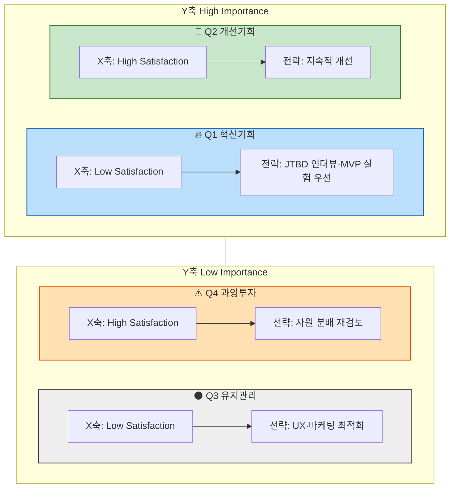

# 06 - 시장기회 분석 : 기회점수(OS) 기반 우선순위 판단 (방법론)

## 한눈에 보기

- 목적: 페르소나·고객여정지도에서 도출한 Pain/Goal 목록을 정량 점수로 환산해 우선순위를 정하는 단계다.
- 핵심 수식 두 개 — 조정형 기회점수 `AOS = Importance × (1 − Satisfaction/5)`(고객 체감 기준), 발견된 기회점수 `DOS = (Importance − Satisfaction) × Market Relevance`(시장가중 기준).
- 전통적 기회점수(OS)는 `Importance × 2 − Satisfaction` 형태로 Importance가 두 번 반영돼 시장감각을 왜곡한다 — AOS는 불만족도를 Importance와 독립적인 비율(`1 − Satisfaction/5`)로 분리해 이 문제를 없앤다.
- 평가 대상은 새로 만들지 않는다 — 05챕터에서 확정한 4개 대표 페르소나(김민준·정민재·강태민·최지훈)의 Pain/Goal과 CJM의 단계별 Pain Point를 그대로 재료로 쓴다.
- 산출 순서: ① Pain 리스트 정리 → ② Importance 평가 → ③ Satisfaction 평가 → ④ AOS 계산 → ⑤ 사분면 매트릭스 시각화. 이후 필요 시 DOS로 확장한다.

## 1. 기회점수(OS)의 한계와 조정형 기회점수(AOS)

전통적 OS는 고객의 불만족 수준을 계산할 때 기대치(Importance)와 만족도(Satisfaction)를 다음과 같이 직접 사용한다.

```
OS = Importance + (Importance − Satisfaction) = Importance × 2 − Satisfaction
```

이 수식은 Importance를 두 번 반영해 실제 시장감각을 왜곡한다. AOS는 불만족 수준을 Importance와 무관한 비율(`1 − Satisfaction/5`)로 먼저 도출한 뒤 Importance를 곱해, "중요하지만 덜 해결된 문제"의 강도만 남긴다.

```
AOS = Importance × (1 − Satisfaction/5)
```

### 1.1 AOS 구성 요소

| 항목 | 정의 |
|---|---|
| Importance | 고객에게 Pain/Goal이 얼마나 중요한가(1~5점) |
| Satisfaction | 현재 이 Pain이 얼마나 잘 해결되고 있는가(1~5점) |
| 1 − Satisfaction/5 | 충족되지 않은 영역(Unmet Need)의 비율 |
| AOS | "중요하지만 덜 해결된 문제"의 강도 |

### 1.2 점수 해석 예시

| Pain / Goal | Importance | Satisfaction | 1 − Satisfaction/5 | AOS | 해석 |
|---|---|---|---|---|---|
| 리포트 자동화의 한계 | 5 | 2(40%) | 0.6 | 5×0.6=3.0 | 명확한 혁신 기회 |
| AI 학습 피로감 | 3 | 2(40%) | 0.6 | 3×0.6=1.8 | 부분적 개선 기회 |
| 데이터 공유 비효율 | 4 | 3(60%) | 0.4 | 4×0.4=1.6 | 유지관리 대상 |
| 신뢰 부족 | 2 | 4(80%) | 0.2 | 2×0.2=0.4 | 저기회 영역 |

### 1.3 AOS 사분면 매트릭스

X축은 Satisfaction(충족도), Y축은 Importance(중요도)다.



**그림 1. AOS 사분면 매트릭스** — Q1(High Importance·Low Satisfaction)이 AOS가 가장 높은 혁신기회 영역이다.

| 사분면 | AOS 수준 | 의미 | 전략 행동 |
|---|---|---|---|
| Q1 | High | 혁신기회(High Importance + Low Satisfaction) | JTBD 인터뷰 대상, MVP 실험 우선 |
| Q2 | 중간 | 개선기회 | 지속적 개선 필요 |
| Q3 | Low | 유지/보완 | UX·마케팅 최적화 중심 |
| Q4 | 0 근처 | 과잉투자 위험 | 자원 분배 재검토 |

사분면을 가르는 상하좌우 기준점(예: 3점 중간선 vs 표본 평균선)은 데이터 표본과 판단 목적에 따라 달라진다 — 05챕터처럼 표본이 적을 때는 평균선보다 척도 중간값(3점) 기준이 해석하기 쉽다.

## 2. 평가 대상 정의 — 무엇을 점수화하는가

이 챕터는 새 Pain 리스트를 만들지 않는다. 05챕터에서 확정한 결과물을 재료로 삼는다.

| 분석 단계 | 평가 단위 = 고객 타깃 | 평가 대상 = Pain 정의 내용 |
|---|---|---|
| 페르소나 단계 | 각 페르소나의 주요 Pain·Goal | 이 사람에게 가장 중요한 고통은 무엇인가 |
| 고객 여정지도 | 여정 단계별 Pain Point / 개선기회 | 고객 여정 중 어디서 좌절이 가장 큰가 |

재료 선택 기준은 두 가지다.

1. **문제정의·Segment 단계의 Pain List가 아니라 페르소나 단계를 쓴다.** 페르소나 도출 전 단계의 Pain List는 아직 구체적 고객 타깃에 대응되지 않아, Importance·Satisfaction을 특정 인물 관점에서 평가할 수 없다.
2. **페르소나 스펙트럼 4유형(Core·Adjacent·Extreme·Non-user) 전원의 Pain List를 쓴다.** 유형별 목적이 달라(주력 타깃 설정·확장 기회 탐색·제품 개선·진입장벽 파악) 특정 유형만 골라 점수화하면 사분면 해석 자체가 왜곡된다.

분석·기획 단계에서는 유효한 문제를 최대한 많이 채점해 AOS 내림차순으로 정렬해 본다 — 소수만 미리 골라 점수화하면 Q1(혁신기회) 후보를 놓칠 수 있다.

## 3. AOS 산출 5단계 워크플로우

| 단계 | 설명 | AI 지원 프롬프트 | 산출물 |
|---|---|---|---|
| ① Pain 리스트 정리 | Persona/CJM에서 Pain·Goal 정리 | "각 페르소나의 주요 Pain/Goal을 표로 정리해줘." | Pain List |
| ② Importance 평가 | 고객 입장에서 중요도 평가(1~5) | "각 Pain이 고객의 목표 달성에 얼마나 중요한지 1~5로 평가해줘." | Importance Table |
| ③ Satisfaction 평가 | 현재 충족 수준 평가(1~5) | "현재 사용 중인 대체 솔루션의 만족도를 1~5로 평가해줘." | Satisfaction Table |
| ④ AOS 계산 | AOS = Importance × (1 − Satisfaction/5) | "위 표에 AOS 계산식을 적용하고 결과를 내줘." | AOS Table |
| ⑤ Matrix 시각화 | X: Satisfaction, Y: Importance, Bubble: AOS | "AOS 기준으로 기회가 큰 항목 순으로 정렬하고, Matrix 사분면에 배치해줘." | (Adjusted) Opportunity Score Matrix |

### 3.1 AOS 산출 프롬프트 템플릿

```markdown
# Context
나는 [산업/분야명] 시장에서 [타깃 페르소나/고객유형]을 대상으로
신규 서비스 기획을 진행 중이다.

# Task
아래 Pain/Goal 목록에 대해 Importance·Satisfaction을 평가하고 AOS를 계산하라.

| Pain/Goal | Importance(1~5) | Satisfaction(1~5) | AOS |

# Rules
1. AOS = Importance × (1 − Satisfaction/5)
2. Importance는 고객의 목표 달성에 이 Pain/Goal이 얼마나 중요한지를 기준으로 평가하라.
3. Satisfaction은 현재 대체 솔루션이 이 Pain/Goal을 얼마나 잘 해결하는지를 기준으로 평가하라.
4. 결과를 AOS 내림차순으로 정렬하라.
5. 표의 마지막 열에 "해석" 항목을 추가해 사분면 위치(혁신기회/개선기회/유지관리/과잉투자)를 표시하라.

# Output Format
| Pain/Goal | Importance | Satisfaction | AOS | 해석 |
```

### 3.2 원샷 프롬프팅의 한계

Few-Shot 전략에서는 "가능하다면 One-Shot으로"가 기본 방침이지만, 모든 상황에서 효과적이지는 않다. AOS 평가처럼 **채점 기준(Importance·Satisfaction의 판단 근거)이 평가자마다 갈릴 수 있는 과업**에서는 One-Shot이 근거 없는 점수를 만들어낼 위험이 크다 — 예시 하나만 주면 AI가 그 예시의 점수 패턴을 기계적으로 복제하거나, 반대로 근거 제시 없이 숫자만 채울 수 있다. 반면 채점 기준이 이미 명확히 고정된 반복 작업(예: 동일 템플릿의 표 포맷 변환)에는 One-Shot이 여전히 효율적이다.

## 4. AOS에서 시장가중형 DOS로 확장하기

AOS는 고객 한 명의 체감 중요도를 반영한 지표다. DOS(Discovered Opportunity Score)는 여기에 시장 규모·맥락을 곱해 "발견된 기회"를 산출한다 — 기회 점수 = 고객 미충족 × 시장 파급력 구조로, 실제 VC·PM이 쓰는 방식과 유사하다.

### 4.1 AOS vs DOS

| 구분 | AOS | DOS |
|---|---|---|
| 계산 기준 | 고객 체감 중심 | 시장가중 중심 |
| 데이터 출처 | 페르소나, 인터뷰 | TAM/SAM, 산업 리서치 |
| 목적 | 혁신 아이디어 탐색 | 시장 확장성 검증 |
| 적용 시점 | 리서치 초기 | 비즈니스 모델 검증 |
| AI 활용 | 중요도·만족도 평가 | 시장 규모 가중치 계산 |

### 4.2 DOS 정의

```
DOS = (Importance − Satisfaction) × Market Relevance
```

Market Relevance는 시장 파급력을 뜻하며, TAM-SAM-SOM 중 해당 Pain이 차지하는 상대적 비중을 쓰거나 시장 성장률·채택난이도·확산성을 추가로 고려해 평가한다. 04챕터에서 산출한 TAM(179조 달러)·SAM(1.34조 달러)·SOM(62억~94억 달러) 자료를 그대로 투입하면 "기회 강도 × 시장 확산성"을 도출할 수 있다.

### 4.3 DOS 계산 예시

| Pain | Importance | Satisfaction | Market Relevance | DOS |
|---|---|---|---|---|
| 자동화 한계 | 5 | 2 | 0.8 | (5−2)×0.8=2.4 |
| AI 학습 피로 | 3 | 2 | 0.6 | (3−2)×0.6=0.6 |
| 신뢰 부족 | 2 | 4 | 0.7 | (2−4)×0.7=−1.4 |

## 5. DOS 시뮬레이션 프롬프트 템플릿

```markdown
# Context
나는 [산업/분야명] 시장에서 [타깃 페르소나/고객유형]을 대상으로
신규 서비스 기획을 진행 중이다.

# Task
아래 Pain/Goal 목록에 대해
각 항목별로 다음 항목을 평가하고 DOS 점수를 계산하라.

| Pain/Goal | Importance(1~5) | Satisfaction(1~5) | Market Relevance(0.1~1.0) | DOS |

# Rules
1. DOS = (Importance - Satisfaction) × Market Relevance
2. Market Relevance는 TAM, 성장률, 채택난이도, 확산성 등을 고려해 평가하라.
3. 점수가 높을수록 혁신기회가 큼.
4. 결과를 DOS 내림차순으로 정렬하라.
5. 표의 마지막 열에 "기회 해석(Insight)" 항목을 추가해, 각 Pain이 가지는 의미를 설명하라.

# Output Format
| Pain/Goal | Importance | Satisfaction | Market Relevance | DOS | Insight |
```

**AI 평가 결과 예시(인공지능 기반 보고서 자동화 서비스 대상 DOS 산출)**

| Pain/Goal | Imp | Sat | Market Rel | DOS | Insight |
|---|---|---|---|---|---|
| 리포트 자동화 한계 | 5 | 2 | 0.9 | 2.7 | SaaS 자동화 시장의 고성장 트렌드와 맞물림 |
| AI 학습 피로감 | 3 | 2 | 0.7 | 0.7 | 유저 피로 문제는 UX 개선 필요하지만 확산 제한적 |
| 신뢰 부족 | 2 | 4 | 0.8 | −1.6 | 기술 수용성 문제, 단기 개선 효과 낮음 |

## 6. AOS·DOS가 충돌할 때의 판단 기준

AOS는 혁신의 가능성을, DOS는 시장의 현실성을 본다. 이 챕터는 제품↔고객 적합성을 제품↔시장 적합성(PMF, Product–Market Fit)으로 확장하는 단계이므로, 두 지표가 갈릴 때 무엇을 우선할지 판단 기준이 필요하다.

| 케이스 | 의미 | 전략 방향 |
|---|---|---|
| AOS·DOS 둘 다 높음 | BEST CASE — 고민할 것이 없다 | 즉시 타게팅 시작 |
| AOS 높음, DOS 낮음 | 고객은 고통스럽지만 시장은 작다 | 반복적으로 고객을 확보·유지하는 데 용이한 비즈니스 → Q2 타게팅 매력도·효과성 높음 |
| DOS 높음, AOS 낮음 | 시장은 크지만 고객은 덜 고통스럽다 | 시장의 다이나믹한 변화를 전제로 고객 센티먼트를 추적 관찰할 가치 → Q3 탐색적 고객분석 |

## 이 챕터의 진행 상태

- [x] 방법론 정리 → `00_방법론.md`(OS의 한계·AOS 정의, AOS 사분면 매트릭스, AOS 산출 5단계 워크플로우, DOS 확장, AOS·DOS 판단 기준)
- [~] 01단계 — ①Pain 리스트 정리 완료 → `01_Pain리스트_Goal추론.md`(05챕터 4개 대표 페르소나 중 3명의 Pain 선정, 페르소나별·Pain Point별 Goal 추론). ②Importance~⑤Matrix 시각화는 다음 회차

## 참고자료

- `06_시장기회분석/01_Pain리스트_Goal추론.md` — 실제 Pain 리스트·Goal 추론 결과
- `05_페르소나_고객여정지도/01_페르소나스펙트럼_분석보고서.md` — AOS 평가 대상인 4개 대표 페르소나(Core·Adjacent·Extreme·Non-user)의 Pain/Goal 근거
- `05_페르소나_고객여정지도/02_고객여정지도.md` — AOS 평가 대상인 여정 단계별 Pain Point 근거
- `04_TAM-SAM-SOM_마켓세그먼트/08_TAM_SAM_SOM_시장세그먼트맵.md` — DOS의 Market Relevance 산출에 쓰는 TAM-SAM-SOM 수치
- https://app.notion.com/3b3d03212bd480b19334e4afc4c66c78?pvs=21 — 사분면 상하좌우 기준점 참고(Notion)
