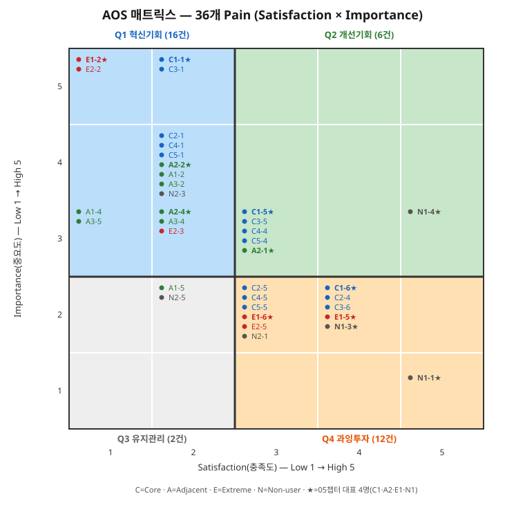

# AOS 매트릭스 — Importance·Satisfaction 평가부터 사분면 배치까지

## 요약

- `01_Pain리스트_Goal추론.md`에서 정리한 **12개 페르소나(1차 생성 전원) × 3개 = 36개 Pain**에 `00_방법론.md` 3절 워크플로우 ②~⑤단계를 한 번에 적용했다. 이전 버전(대표 4명·12개 Pain)을 전체 12명으로 확장한 결과다.
- 사분면 기준점은 36개 Pain의 Importance·Satisfaction 각각의 **중앙값**이다 — Importance 중앙값은 3.0, Satisfaction 중앙값은 **2.5**로 나왔다(대표 4명만 봤을 때는 둘 다 3.0이었으나, 표본이 늘며 Satisfaction 분포가 낮은 쪽으로 치우쳤다). 판정 규칙: Importance는 **3점 이상**을 High로, Satisfaction은 **3점 이상**을 High로 분류한다(Satisfaction은 중앙값 2.5가 정수 척도의 "3점 미만"과 "3점 이상"을 정확히 가르므로 경계 동점이 없다. Importance=3점은 중앙값과 같아 "이상=High" 규칙으로 분류했다).
- 결과: **Q1(혁신기회) 16건, Q2(개선기회) 6건, Q3(유지관리) 2건, Q4(과잉투자) 12건**. 대표 4명만 봤을 때는 Q3가 0건이었지만, 표본을 넓히자 이영재⑤·오현석⑤ 2건이 Q3에 들어왔다 — "중요하지도 않고 이미 해결도 안 된" 방치형 Pain이 참고후보 그룹에서만 나타난다는 뜻이다.
- AOS 최고점(4.0)은 **강태민②·배소연②** 동률이다 — Extreme 유형 2명 모두 "실제 위약금 손실"이라는 동일한 성격의 Pain에서 최고점을 받았다.

## 1. Importance·Satisfaction·AOS — Core (5명, 15개)

| # | 페르소나 | Pain(요약) | Imp | Sat | AOS | 사분면 | 근거 |
|---|---|---|---|---|---|---|---|
| C1-① | 김민준★ | 도착시점 예측 불가 | 5 | 2 | 3.0 | Q1 | 은행포털 개별확인만 가능, 반복업무 감소 목표에 직결(🟠초조) |
| C1-⑤ | 김민준★ | 전환에 별도 협상 필요 | 3 | 3 | 1.2 | Q2 | 비교는 개선됐으나 실행 연계는 약함(🟢안정) |
| C1-⑥ | 김민준★ | 락인 리스크 | 2 | 4 | 0.4 | Q4 | 장기이용으로 현재는 안정적, 리스크는 잠재적(🟢신뢰) |
| C2-① | 이수경 | 다건 동시추적 불가 | 4 | 2 | 2.4 | Q1 | 스프레드시트 수동추적만 가능, 목표(실시간조회)에 직결(🟠불안) |
| C2-④ | 이수경 | 초기 데이터 정합성 우려 | 2 | 4 | 0.4 | Q4 | 온보딩 단계 일시적 우려, 대부분 해소(🟢안심) |
| C2-⑤ | 이수경 | 예외 건 수동 처리 잔존 | 2 | 3 | 0.8 | Q4 | 반복 사용 단계 잔존 마찰, 심각도 낮음(🟢만족) |
| C3-① | 정하늘 | 확인지연으로 자금계획 불가 | 5 | 2 | 3.0 | Q1 | 선지급 후 시차로 계획 불가, 목표(시차축소)에 직결(🟠초조) |
| C3-⑤ | 정하늘 | 협상력 약화 잔존 | 3 | 3 | 1.2 | Q2 | 계획정확도는 개선, 은행관계 분산은 남음(🟢안정) |
| C3-⑥ | 정하늘 | 락인 우려 | 2 | 4 | 0.4 | Q4 | 유지·확장 단계 신뢰 형성, 리스크는 잠재적(🟢신뢰) |
| C4-① | 한지원 | 원가 불확실 | 4 | 2 | 2.4 | Q1 | 스프레드가 원가에 직결, 목표(스프레드고정)에 직결(🟠불만) |
| C4-④ | 한지원 | 절감폭 건별 편차 | 3 | 3 | 1.2 | Q2 | 비교는 가능해졌으나 절감폭이 일정하지 않음(🟢만족) |
| C4-⑤ | 한지원 | 헤지비용 부담 잔존 | 2 | 3 | 0.8 | Q4 | 원가예측은 안정화, 헤지비용은 별도 이슈(🟢안정) |
| C5-① | 오세훈 | 세 마찰 동시체감 | 4 | 2 | 2.4 | Q1 | 세 마찰이 겹쳐 무엇부터 손볼지 모름, 목표에 직결(🟠답답함) |
| C5-④ | 오세훈 | 미도입 코리도 잔존 | 3 | 3 | 1.2 | Q2 | 우선 코리도만 개선, 나머지는 예전 방식(🟢기대) |
| C5-⑤ | 오세훈 | 전환기 병행 부담 | 2 | 3 | 0.8 | Q4 | 단계적 확장 중 두 방식 병행 필요(🟢안정) |

## 2. Importance·Satisfaction·AOS — Adjacent (3명, 9개)

| # | 페르소나 | Pain(요약) | Imp | Sat | AOS | 사분면 | 근거 |
|---|---|---|---|---|---|---|---|
| A2-① | 정민재★ | PoC 일회성 | 3 | 3 | 1.2 | Q2 | 속도는 실증됐으나 일상화는 부수적 관심사(🟢놀라움) |
| A2-② | 정민재★ | 격차 설명 부재(결정적) | 4 | 2 | 2.4 | Q1 | 여정 중 가장 강한 부정감정, 결정적 단계(🔴답답함) |
| A2-④ | 정민재★ | 규제 불확실성 지연 | 3 | 2 | 1.8 | Q1 | 검토는 진행 중이나 권한 밖 조직 리스크(🟡조심스러운기대) |
| A1-② | 이영재 | 개인·회사 경험 괴리(결정적) | 4 | 2 | 2.4 | Q1 | 여정 중 가장 강한 부정감정, 결정적 단계(🔴답답함) |
| A1-④ | 이영재 | 부서간 사일로 | 3 | 1 | 2.4 | Q1 | 자금팀 무반응, 문제제기가 도달 자체를 못함(⚫무기력) |
| A1-⑤ | 이영재 | 반복 누적되는 아쉬움 | 2 | 2 | 1.2 | Q3 | 우연한 계기 없이는 개인 차원에 머무름(🟡관망) |
| A3-② | 한도윤 | 본사·지사 격차(결정적) | 4 | 2 | 2.4 | Q1 | 여정 중 가장 강한 부정감정, 결정적 단계(🔴의아함) |
| A3-④ | 한도윤 | 국내안건에 밀림 | 3 | 2 | 1.8 | Q1 | 해외지사 건의라 본사 우선순위에서 낮음(🟡답답함) |
| A3-⑤ | 한도윤 | 장기 보류(애매한 상태) | 3 | 1 | 2.4 | Q1 | 반려도 진행도 없는 상태 지속, 결정적 결말(⚫무기력) |

## 3. Importance·Satisfaction·AOS — Extreme (2명, 6개)

| # | 페르소나 | Pain(요약) | Imp | Sat | AOS | 사분면 | 근거 |
|---|---|---|---|---|---|---|---|
| E1-② | 강태민★ | 컷오프 밀림 → 실패(결정적) | 5 | 1 | 4.0 | Q1 | 실제 위약금 손실, 36개 중 가장 낮은 만족도(🔴당황·압박) |
| E1-⑤ | 강태민★ | 승인 부담 잔존 | 2 | 4 | 0.4 | Q4 | 예측·경고 도입 후 대부분 해소(🟢안심) |
| E1-⑥ | 강태민★ | 예외율 재검토 리스크 | 2 | 3 | 0.8 | Q4 | 조건부 신뢰, 지표 추적 중(🟢조건부신뢰) |
| E2-② | 배소연 | 마감 실제로 놓침(결정적) | 5 | 1 | 4.0 | Q1 | 실제 위약금 발생, 결정적 단일사건(🔴충격) |
| E2-③ | 배소연 | 특급송금 반복 비용 | 3 | 2 | 1.8 | Q1 | 임시방편 비용이 크고 반복 가능(🟠압박) |
| E2-⑤ | 배소연 | 옵션 비용 부담 | 2 | 3 | 0.8 | Q4 | 확정옵션 도입 후 안심, 비용은 일반보다 높음(🟢안심) |

## 4. Importance·Satisfaction·AOS — Non-user (2명, 6개)

| # | 페르소나 | Pain(요약) | Imp | Sat | AOS | 사분면 | 근거 |
|---|---|---|---|---|---|---|---|
| N1-① | 최지훈★ | 문제인식 자체가 낮음 | 1 | 5 | 0.0 | Q4 | 기존 체계로 이미 충분히 만족(🟢안정) |
| N1-③ | 최지훈★ | 리스크>기대이득 | 2 | 4 | 0.4 | Q4 | 신중하지만 기존 방식에 만족(🟡신중) |
| N1-④ | 최지훈★ | 전환 거부(결정적) | 3 | 5 | 0.0 | Q2 | 보수적 확신, 기존 방식에 매우 만족(🟡보수적확신) |
| N2-① | 오현석 | 대안 확신 없음 | 2 | 3 | 0.8 | Q4 | 문제는 인정하나 대안 신뢰는 별개(🟡인지) |
| N2-③ | 오현석 | 자금노출 리스크(결정적) | 4 | 2 | 2.4 | Q1 | 파일럿 인프라에 회사자금 노출 우려, 결정적 단계(🔴불안) |
| N2-⑤ | 오현석 | 레퍼런스 부재시 보류 | 2 | 2 | 1.2 | Q3 | 동종업계 사례 없으면 계속 관망(🟡재고여지) |

## 5. 전체 순위표 (36개, AOS 내림차순)

근거는 위 1~4절 표를 참고. ★ = 05챕터 대표 4명.

| 순위 | # | 페르소나 | Pain(요약) | AOS | 사분면 |
|---|---|---|---|---|---|
| 1 | E1-② | 강태민★ | 컷오프 밀림 → 실패 | **4.0** | Q1 |
| 1 | E2-② | 배소연 | 마감 실제로 놓침 | **4.0** | Q1 |
| 3 | C1-① | 김민준★ | 도착시점 예측 불가 | **3.0** | Q1 |
| 3 | C3-① | 정하늘 | 확인지연으로 자금계획 불가 | **3.0** | Q1 |
| 5 | A2-② | 정민재★ | 격차 설명 부재 | **2.4** | Q1 |
| 5 | C2-① | 이수경 | 다건 동시추적 불가 | **2.4** | Q1 |
| 5 | C4-① | 한지원 | 원가 불확실 | **2.4** | Q1 |
| 5 | C5-① | 오세훈 | 세 마찰 동시체감 | **2.4** | Q1 |
| 5 | A1-② | 이영재 | 개인·회사 경험 괴리 | **2.4** | Q1 |
| 5 | A1-④ | 이영재 | 부서간 사일로 | **2.4** | Q1 |
| 5 | A3-② | 한도윤 | 본사·지사 격차 | **2.4** | Q1 |
| 5 | A3-⑤ | 한도윤 | 장기 보류 | **2.4** | Q1 |
| 5 | N2-③ | 오현석 | 자금노출 리스크 | **2.4** | Q1 |
| 14 | A2-④ | 정민재★ | 규제 불확실성 지연 | **1.8** | Q1 |
| 14 | A3-④ | 한도윤 | 국내안건에 밀림 | **1.8** | Q1 |
| 14 | E2-③ | 배소연 | 특급송금 반복 비용 | **1.8** | Q1 |
| 17 | C1-⑤ | 김민준★ | 전환에 별도 협상 필요 | **1.2** | Q2 |
| 17 | A2-① | 정민재★ | PoC 일회성 | **1.2** | Q2 |
| 17 | C3-⑤ | 정하늘 | 협상력 약화 잔존 | **1.2** | Q2 |
| 17 | C4-④ | 한지원 | 절감폭 건별 편차 | **1.2** | Q2 |
| 17 | C5-④ | 오세훈 | 미도입 코리도 잔존 | **1.2** | Q2 |
| 17 | A1-⑤ | 이영재 | 반복 누적되는 아쉬움 | **1.2** | Q3 |
| 17 | N2-⑤ | 오현석 | 레퍼런스 부재시 보류 | **1.2** | Q3 |
| 24 | E1-⑥ | 강태민★ | 예외율 재검토 리스크 | **0.8** | Q4 |
| 24 | C2-⑤ | 이수경 | 예외 건 수동 처리 잔존 | **0.8** | Q4 |
| 24 | C4-⑤ | 한지원 | 헤지비용 부담 잔존 | **0.8** | Q4 |
| 24 | C5-⑤ | 오세훈 | 전환기 병행 부담 | **0.8** | Q4 |
| 24 | E2-⑤ | 배소연 | 옵션 비용 부담 | **0.8** | Q4 |
| 24 | N2-① | 오현석 | 대안 확신 없음 | **0.8** | Q4 |
| 30 | C1-⑥ | 김민준★ | 락인 리스크 | **0.4** | Q4 |
| 30 | E1-⑤ | 강태민★ | 승인 부담 잔존 | **0.4** | Q4 |
| 30 | N1-③ | 최지훈★ | 리스크>기대이득 | **0.4** | Q4 |
| 30 | C2-④ | 이수경 | 초기 데이터 정합성 우려 | **0.4** | Q4 |
| 30 | C3-⑥ | 정하늘 | 락인 우려 | **0.4** | Q4 |
| 35 | N1-① | 최지훈★ | 문제인식 자체가 낮음 | **0.0** | Q4 |
| 35 | N1-④ | 최지훈★ | 전환 거부 | **0.0** | Q2 |

**사분면 집계**: Q1 혁신기회 16건 · Q2 개선기회 6건 · Q3 유지관리 2건 · Q4 과잉투자 12건.

## 6. AOS 사분면 매트릭스

X축은 Satisfaction(충족도, 1~5), Y축은 Importance(중요도, 1~5)다. mermaid `quadrantChart`가 GitHub 렌더러에서 라벨 문자와 무관하게 반복적으로 렉싱 오류를 내, 05챕터 CJM 인포그래픽과 같은 방식(직접 그린 SVG)으로 바꿔 36개 전부를 실제 정수 좌표(Sat, Imp)에 점으로 찍었다. 라벨은 1~4절 표의 "#" 컬럼과 동일한 ID이고, ★는 05챕터 대표 4명(C1·A2·E1·N1)이다.

**그림. AOS 매트릭스(36개, 실측 좌표)** — 36개 Pain은 Importance·Satisfaction이 모두 정수(1~5)라 5×5=25개 격자점 중 11곳에만 찍힌다. 가장 많이 겹치는 칸은 (Sat2, Imp4) 7건(C2-1·C4-1·C5-1·A2-2★·A1-2·A3-2·N2-3)이고, 강태민②·배소연②(E1-2★·E2-2)는 (Sat1, Imp5)로 Q1 안에서도 가장 왼쪽 위 극단에 위치한다. Q3(좌하단)에는 A1-5·N2-5 2건만 있다.

## 7. 해설과 다음 단계

**Core 유형의 진입 Pain은 대표 여부와 무관하게 강도가 높다.** 김민준(대표)뿐 아니라 정하늘(참고후보)도 AOS 3.0으로 공동 2위이고, 이수경·한지원·오세훈(모두 참고후보)의 진입 Pain도 AOS 2.4로 Q1에 들었다. Core 5명 전원의 ①단계 Pain이 예외 없이 Q1에 속한다는 것은 "진입 시 예측·확인이 안 된다"는 마찰이 Core 유형 전반에 공통된 구조적 문제이며, 김민준 개인의 특수 사정이 아니라는 근거가 된다.

**Adjacent 참고후보(이영재·한도윤)는 Pain 강도는 높지만 결말이 부정적이다.** 이영재·한도윤 각 3개 Pain 중 2개씩(A1-②④, A3-②④⑤ 중 3개 전부)가 AOS 1.8~2.4로 Q1에 몰렸다 — 대표 정민재보다도 Q1 편입 비율이 높다. 하지만 03문서가 이미 지적했듯 둘의 CJM은 "조직 무반응"·"장기 보류"로 끝난다. 즉 AOS가 높다고 사업 기회로 이어지는 것은 아니다 — 본인이 결정권자가 아닌 구조는 AOS 계산에 반영되지 않으므로, Q1 상위 항목이라도 **의사결정 구조**를 별도로 확인해야 한다(정민재에서도 확인한 유의점이 참고후보 2명에서 더 뚜렷하게 재현됐다).

**Q3(유지관리)가 참고후보 2명에서만 나타났다.** 이영재⑤("반복되는 개인적 아쉬움")과 오현석⑤("레퍼런스 없으면 계속 관망")은 Importance·Satisfaction 모두 낮다 — 중요하지도 않고 딱히 해결도 안 된 상태로 방치돼도 사업적으로 문제가 되지 않는 영역이다. 대표 4명만 봤을 때 Q3가 0건이었던 것은 표본이 작아서였을 뿐, "이 시장에 유지관리 영역이 없다"는 뜻은 아니었다.

**Extreme 유형은 유일하게 동일 최고점(4.0)을 공유한다.** 강태민(동시압축형)과 배소연(단일사건형)은 실패 메커니즘이 다른데도 둘 다 실제 위약금 손실이라는 결과로 이어져 Importance 5·Satisfaction 1로 동일하게 평가됐다 — Extreme 유형의 핵심 위협은 "실패가 실제 금전 손실로 귀결되는가"이며, 실패의 구체적 형태(다건 동시 vs 단건)는 AOS에 영향을 주지 않는다.

- 다음 단계: Q1 16건 중 참고후보 그룹(정하늘·이수경·한지원·오세훈·배소연·오현석)은 "대표 페르소나가 대표하는 범위를 넘어서는 수요가 있는가"를 검증하는 데 쓰고, 이영재·한도윤 건은 Q1 고AOS와 무관하게 세그먼트 규모·의사결정 구조 확인이 선행돼야 한다는 유의점을 07챕터(JTBD)로 넘긴다.

## 참고자료

- `06_시장기회분석/00_방법론.md` — AOS 정의·사분면 해석·산출 워크플로우
- `06_시장기회분석/01_Pain리스트_Goal추론.md` — 36개 Pain 원문과 Goal 추론
- `이미지/AOS_매트릭스.svg` — 36개 Pain 실측 좌표 매트릭스(SVG)
- `05_페르소나_고객여정지도/02_고객여정지도.md` — 대표 4명 CJM 원문
- `05_페르소나_고객여정지도/03_참고후보_고객여정지도.md` — 참고후보 8명 CJM 원문
