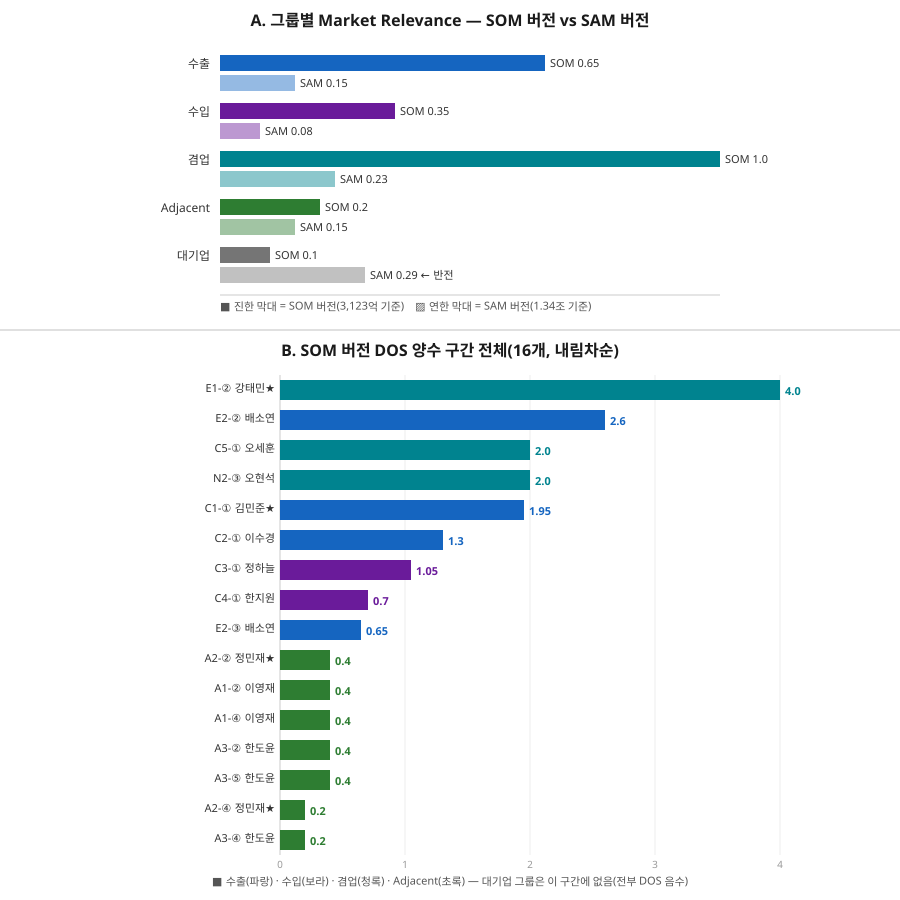

# DOS 문서 — 36개 Pain 전체 DOS 점수표(SAM 버전·SOM 버전)

이 문서는 06챕터의 **DOS(Discovered Opportunity Score) 산출 결과 문서**다. [00_방법론.md](00_방법론.md) 4~5절이 정의한 DOS 방법론을 06챕터 Pain 36개 전체(예시 발췌가 아니라 전수)에 그대로 적용한다.

## 개요 — DOS를 어떻게 도출했는가

1. **정의([00_방법론.md](00_방법론.md) 4.2절)**: `DOS = (Importance − Satisfaction) × Market Relevance`. AOS와 달리 시장 규모·맥락(Market Relevance)을 곱해 "발견된 기회"를 산출한다.
2. **입력값**: Importance·Satisfaction은 [02_AOS매트릭스.md](02_AOS매트릭스.md)에서 이미 산출한 36개 Pain의 원점수를 그대로 쓴다. 재평가하지 않는다.
3. **Market Relevance 결정**: [03_MarketRelevance_판단.md](03_MarketRelevance_판단.md)에서 [04_TAM-SAM-SOM_마켓세그먼트/08_TAM_SAM_SOM_시장세그먼트맵.md](../04_TAM-SAM-SOM_마켓세그먼트/08_TAM_SAM_SOM_시장세그먼트맵.md)(TAM-SAM-SOM 산출)를 근거로 페르소나를 5개 그룹(수출·수입·겸업·Adjacent·대기업)으로 나누고, 그룹별 비중을 판단했다.
4. **이 문서의 작업**: 그 비중을 **분모를 SAM(1.34조 달러)으로 쓸 때**와 **분모를 SOM 타겟 세그먼트(3,123억 달러)로 쓸 때** 두 갈래로 계산해, 36개 Pain 전체의 DOS를 빠짐없이 산출했다(예시 발췌 없음).

## 인사이트 요약

- SOM 직접 3그룹(수출·수입·겸업)은 SAM 대비 SOM 비율(3,123/13,412≈0.233)만큼 **균일하게 축소**되므로 두 버전 간 순위가 거의 그대로 유지된다. 반면 **Adjacent와 대기업(Non-user 최지훈)은 이 비율을 따르지 않아 두 버전에서 상대적 위상이 달라진다** — 이게 이 문서의 핵심 발견이다.
- 가장 뚜렷한 반전: 대기업 세그먼트는 SOM 관점(0.1, 최저)에서는 존재감이 거의 없지만, SAM 관점(0.29, 전체 5그룹 중 최대)에서는 이론상 가장 큰 시장이다 — 다만 최지훈의 3개 Pain 모두 Satisfaction>Importance라 DOS가 음수이므로, SAM 버전에서는 오히려 "회피 신호"가 더 커진다(0.1 배율일 때보다 음수 폭이 커짐).
- Adjacent(정민재·이영재·한도윤)는 SOM 관점에서 겸업 그룹의 1/5(0.2 vs 1.0)로 왜소해 보이지만, SAM 관점에서는 겸업 그룹과 비슷한 크기(0.15 vs 0.23)로 좁혀진다 — SOM이라는 이미 좁힌 타겟 안에서만 보면 Adjacent의 확장 잠재력이 과소평가될 수 있다는 뜻이다.

## 1. Market Relevance 두 버전 비교

| 그룹 | 페르소나 | SOM 버전 | SAM 버전 | SAM 버전 산출 근거 |
|---|---|---|---|---|
| 수출 | 김민준★, 이수경, 배소연 | 0.65 | **0.15** | 2,013억 ÷ SAM(13,412억) = 15.0% |
| 수입 | 정하늘, 한지원 | 0.35 | **0.08** | 1,110억 ÷ SAM(13,412억) = 8.3% |
| 겸업 | 오세훈, 강태민★, 오현석 | 1.0 | **0.23** | 3,123억(SOM 타겟 세그먼트 전체) ÷ SAM(13,412억) = 23.3% |
| Adjacent | 정민재★, 이영재, 한도윤 | 0.2(잠정) | **0.15(잠정)** | SAM에 아예 미포함된 영역(08문서 한계)이라 실측 불가 — SOM판보다 다소 낮춰 "더 큰 분모 앞에서는 더 작아 보인다"는 감각만 반영 |
| 대기업(Non-user) | 최지훈★ | 0.1(잠정) | **0.29** | 대기업 USD-KRW 수출(3,948억) ÷ SAM(13,412억) = 29.4% — 07문서가 SOM에서 제외한 세그먼트지만 SAM 안에서는 가장 큰 덩어리 |

**그림. (A) 그룹별 Market Relevance — SOM 버전(진한 막대) vs SAM 버전(연한 막대).** 수출·수입·겸업 3그룹은 SAM 버전 막대가 SOM 버전의 약 1/4로 균일하게 줄어드는 반면, 대기업만 SAM 버전 막대가 SOM 버전보다 오히려 길다("반전" 표시). **(B) SOM 버전 DOS가 양수인 16개**를 내림차순 막대로 나열했다 — 겸업(청록)·수출(파랑)이 상위권을 차지하고, Adjacent(초록)는 전부 0.4 이하에 몰려 있으며, 대기업(회색)은 이 구간에 아예 등장하지 않는다(전부 음수라서 제외).

## 2. SOM 버전 DOS 점수표 (36개, DOS 내림차순)

DOS = (Importance − Satisfaction) × Market Relevance(SOM 버전).

| 순위 | # | 페르소나 | Pain | Imp | Sat | Market Rel | DOS | Insight |
|---|---|---|---|---|---|---|---|---|
| 1 | E1-② | 강태민★ | 분기말 동시 마감 시 은행별 컷오프 시간이 달라 어디서 밀릴지 예측 못 해 실제 실패(위약금)로 이어짐 | 5 | 1 | 1.0 | **4.0** | 겸업·SOM 전체 대표, 최우선 검증 |
| 2 | E2-② | 배소연 | 처리지연을 대수롭지 않게 여기다 계약상 지급 마감을 실제로 놓쳐 위약금이 발생함 | 5 | 1 | 0.65 | **2.6** | 수출 세그먼트, 강태민 다음 우선순위 |
| 3 | C5-① | 오세훈 | 수출입을 동시에 해 세 마찰(FX스프레드·처리지연·유동성비효율)이 겹쳐 무엇부터 손봐야 할지 모름 | 4 | 2 | 1.0 | **2.0** | 겸업·SOM 전체 대표 |
| 3 | N2-③ | 오현석 | 토큰화 예금 인프라가 아직 파일럿 단계라 회사 자금을 노출하는 데 대한 보안·법적 최종성 우려가 큼 | 4 | 2 | 1.0 | **2.0** | 겸업·SOM 전체 대표 |
| 5 | C1-① | 김민준★ | 거래처가 지급지시를 한 뒤에도 어느 경로로 언제 도착할지 알 수 없어 은행 포털을 개별 확인해야 함 | 5 | 2 | 0.65 | **1.95** | 수출 세그먼트 |
| 6 | C2-① | 이수경 | 여러 거래가 동시에 겹치면 스프레드시트로 하나씩 추적해야 해 놓치는 건이 생김 | 4 | 2 | 0.65 | **1.3** | 수출 세그먼트 |
| 7 | C3-① | 정하늘 | 선지급 후 확인까지 시차가 커 자금계획을 세울 수 없음 | 5 | 2 | 0.35 | **1.05** | 수입 세그먼트, 시장은 작지만 순위 유지 |
| 8 | C4-① | 한지원 | 환전 스프레드가 매입원가에 직접 반영돼 원가 계산이 매번 흔들림 | 4 | 2 | 0.35 | **0.7** | 수입 세그먼트 |
| 9 | E2-③ | 배소연 | 마감 실패 이후 프리미엄 수수료를 주고 특급송금으로 임시 대응하지만 비용이 크고 반복될 수 있음 | 3 | 2 | 0.65 | **0.65** | 수출 세그먼트 |
| 10 | A2-② | 정민재★ | 같은 그룹인데 계열사간 이동은 빠르고 본사와의 결제는 왜 그대로인지 설명해 줄 자료가 없음 | 4 | 2 | 0.2 | **0.4** | Adjacent, Relevance 낮아 순위 밀림 |
| 10 | A1-② | 이영재 | 개인 명의 트래블월렛은 즉시 결제되는데 회사의 무역대금 결제는 여전히 느리고 비쌈 | 4 | 2 | 0.2 | **0.4** | Adjacent |
| 10 | A1-④ | 이영재 | 해외영업팀의 문제제기가 부서간 사일로에 막혀 자금팀에 아예 전달되지 않음 | 3 | 1 | 0.2 | **0.4** | Adjacent |
| 10 | A3-② | 한도윤 | 싱가포르-태국 지사간 결제는 즉시 처리되는데 같은 회사인 본사와의 결제는 왜 안 되는지 설명이 없음 | 4 | 2 | 0.2 | **0.4** | Adjacent |
| 10 | A3-⑤ | 한도윤 | 반려도 진행도 아닌 애매한 상태로 장기 보류돼 해마다 다시 상정해야 함 | 3 | 1 | 0.2 | **0.4** | Adjacent |
| 15 | A2-④ | 정민재★ | 외환신고·AML·회계·내부통제 기준이 아직 불명확해 본사팀 검토가 계속 길어짐 | 3 | 2 | 0.2 | **0.2** | Adjacent |
| 15 | A3-④ | 한도윤 | 해외지사 건의라는 이유로 국내 안건에 밀려 본사 검토 우선순위에서 뒤로 처짐 | 3 | 2 | 0.2 | **0.2** | Adjacent |
| 17 | C1-⑤ | 김민준★ | 은행별 FX비용 비교는 쉬워졌지만 실제 전환(은행 변경)까지는 별도 협상이 필요함 | 3 | 3 | 0.65 | **0.0** | Imp=Sat, 중립 |
| 17 | C3-⑤ | 정하늘 | 확정 시점 확인으로 계획 정확도는 개선됐지만 여러 은행에 관계가 분산돼 협상력은 여전히 약함 | 3 | 3 | 0.35 | **0.0** | 중립 |
| 17 | C4-④ | 한지원 | 은행별 환전 스프레드 비교는 가능해졌지만 실제 절감폭은 건별로 차이가 큼 | 3 | 3 | 0.35 | **0.0** | 중립 |
| 17 | C5-④ | 오세훈 | 마찰이 가장 큰 코리도부터 우선 도입했지만 나머지 코리도는 여전히 예전 방식 그대로임 | 3 | 3 | 1.0 | **0.0** | 중립(Relevance는 최대지만 Imp=Sat) |
| 17 | A2-① | 정민재★ | 해외법인간 스테이블코인 송금 PoC는 성공했지만 1회성 실증이라 일상 업무로 이어지지 않음 | 3 | 3 | 0.2 | **0.0** | 중립 |
| 17 | A1-⑤ | 이영재 | 출장 때마다 같은 괴리를 반복 체감하지만 별다른 계기 없이 개인적 아쉬움으로만 누적됨 | 2 | 2 | 0.2 | **0.0** | 중립 |
| 17 | N2-⑤ | 오현석 | 동종업계의 도입 사례가 없으면 계속 관망 상태로 보류함 | 2 | 2 | 1.0 | **0.0** | 중립 |
| 24 | N1-③ | 최지훈★ | 지급지시 권한과 운영을 신규 서비스에 넘기는 리스크가 기대되는 이득보다 크게 느껴짐 | 2 | 4 | 0.1 | **-0.2** | 대기업, SOM 제외라 회피 신호 작음 |
| 24 | N1-④ | 최지훈★ | 검증되지 않은 서비스에 지급지시 권한·운영을 넘기는 리스크 회피 성향으로 내부 결재에서 전환을 거부함 | 3 | 5 | 0.1 | **-0.2** | 대기업 |
| 26 | C4-⑤ | 한지원 | 원가 예측은 안정화됐지만 선물환 헤지 비용 부담은 별도로 남음 | 2 | 3 | 0.35 | **-0.35** | 수입 세그먼트 |
| 27 | N1-① | 최지훈★ | 은행 우대·전용 딜링데스크·자체 TMS로 세 마찰이 모두 이미 낮아 새 서비스를 찾을 동기 자체가 없음 | 1 | 5 | 0.1 | **-0.4** | 대기업 |
| 28 | C2-⑤ | 이수경 | 반복 사용 단계까지 왔어도 예외 발생 건은 여전히 수동으로 처리해야 함 | 2 | 3 | 0.65 | **-0.65** | 수출 세그먼트 |
| 28 | E2-⑤ | 배소연 | 확정 초단기 옵션을 도입해 마감 걱정은 줄었지만 옵션 비용이 일반 처리보다 높음 | 2 | 3 | 0.65 | **-0.65** | 수출 세그먼트 |
| 30 | C3-⑥ | 정하늘 | 조건 변경 시 대안이 부족해 락인 우려가 남음 | 2 | 4 | 0.35 | **-0.7** | 수입 세그먼트 |
| 31 | C5-⑤ | 오세훈 | 남은 코리도를 단계적으로 전환하는 동안 두 방식을 병행해야 하는 부담이 있음 | 2 | 3 | 1.0 | **-1.0** | 겸업, Relevance 커서 음수도 크게 반영 |
| 31 | E1-⑥ | 강태민★ | 위험예측·경고 기능을 도입한 뒤에도 예외 발생률이 기대만큼 안 줄면 재검토해야 할 위험이 남음 | 2 | 3 | 1.0 | **-1.0** | 겸업 |
| 31 | N2-① | 오현석 | 기존 코레스뱅킹의 마찰은 인정하면서도 새 대안에 대한 확신이 없어 검토를 미룸 | 2 | 3 | 1.0 | **-1.0** | 겸업 |
| 34 | C1-⑥ | 김민준★ | 협상력이 약해 서비스 조건이 바뀌면 대안이 마땅치 않은 락인 리스크가 있음 | 2 | 4 | 0.65 | **-1.3** | 수출 세그먼트 |
| 34 | C2-④ | 이수경 | 신규 대시보드 도입 초기에는 기존 스프레드시트와 데이터 정합성을 확인해야 함 | 2 | 4 | 0.65 | **-1.3** | 수출 세그먼트 |
| 36 | E1-⑤ | 강태민★ | 대체경로가 자동전환이 아니라 제안+승인이라 여전히 본인 판단이 필요함 | 2 | 4 | 1.0 | **-2.0** | 겸업, Relevance 최대라 음수 폭도 최대 |

## 3. SAM 버전 DOS 점수표 (36개, DOS 내림차순)

DOS = (Importance − Satisfaction) × Market Relevance(SAM 버전).

| 순위 | # | 페르소나 | Pain | Imp | Sat | Market Rel | DOS | Insight |
|---|---|---|---|---|---|---|---|---|
| 1 | E1-② | 강태민★ | 분기말 동시 마감 시 은행별 컷오프 시간이 달라 어디서 밀릴지 예측 못 해 실제 실패(위약금)로 이어짐 | 5 | 1 | 0.23 | **0.92** | 겸업, SOM 버전과 동일하게 1위 유지 |
| 2 | E2-② | 배소연 | 처리지연을 대수롭지 않게 여기다 계약상 지급 마감을 실제로 놓쳐 위약금이 발생함 | 5 | 1 | 0.15 | **0.6** | 수출 세그먼트 |
| 3 | C5-① | 오세훈 | 수출입을 동시에 해 세 마찰(FX스프레드·처리지연·유동성비효율)이 겹쳐 무엇부터 손봐야 할지 모름 | 4 | 2 | 0.23 | **0.46** | 겸업 |
| 3 | N2-③ | 오현석 | 토큰화 예금 인프라가 아직 파일럿 단계라 회사 자금을 노출하는 데 대한 보안·법적 최종성 우려가 큼 | 4 | 2 | 0.23 | **0.46** | 겸업 |
| 5 | C1-① | 김민준★ | 거래처가 지급지시를 한 뒤에도 어느 경로로 언제 도착할지 알 수 없어 은행 포털을 개별 확인해야 함 | 5 | 2 | 0.15 | **0.45** | 수출 세그먼트, 겸업 그룹과 거의 근접 |
| 6 | C2-① | 이수경 | 여러 거래가 동시에 겹치면 스프레드시트로 하나씩 추적해야 해 놓치는 건이 생김 | 4 | 2 | 0.15 | **0.3** | 수출 세그먼트 |
| 6 | A2-② | 정민재★ | 같은 그룹인데 계열사간 이동은 빠르고 본사와의 결제는 왜 그대로인지 설명해 줄 자료가 없음 | 4 | 2 | 0.15 | **0.3** | Adjacent — SOM 버전(0.4)보다 상대적으로 수출 그룹과 격차가 좁혀짐 |
| 6 | A1-② | 이영재 | 개인 명의 트래블월렛은 즉시 결제되는데 회사의 무역대금 결제는 여전히 느리고 비쌈 | 4 | 2 | 0.15 | **0.3** | Adjacent |
| 6 | A1-④ | 이영재 | 해외영업팀의 문제제기가 부서간 사일로에 막혀 자금팀에 아예 전달되지 않음 | 3 | 1 | 0.15 | **0.3** | Adjacent |
| 6 | A3-② | 한도윤 | 싱가포르-태국 지사간 결제는 즉시 처리되는데 같은 회사인 본사와의 결제는 왜 안 되는지 설명이 없음 | 4 | 2 | 0.15 | **0.3** | Adjacent |
| 6 | A3-⑤ | 한도윤 | 반려도 진행도 아닌 애매한 상태로 장기 보류돼 해마다 다시 상정해야 함 | 3 | 1 | 0.15 | **0.3** | Adjacent — 수출 세그먼트와 동일 순위대까지 올라옴 |
| 12 | C3-① | 정하늘 | 선지급 후 확인까지 시차가 커 자금계획을 세울 수 없음 | 5 | 2 | 0.08 | **0.24** | 수입 세그먼트 — SOM 버전(7위)보다 순위 하락 |
| 13 | C4-① | 한지원 | 환전 스프레드가 매입원가에 직접 반영돼 원가 계산이 매번 흔들림 | 4 | 2 | 0.08 | **0.16** | 수입 세그먼트 |
| 14 | E2-③ | 배소연 | 마감 실패 이후 프리미엄 수수료를 주고 특급송금으로 임시 대응하지만 비용이 크고 반복될 수 있음 | 3 | 2 | 0.15 | **0.15** | 수출 세그먼트 |
| 14 | A2-④ | 정민재★ | 외환신고·AML·회계·내부통제 기준이 아직 불명확해 본사팀 검토가 계속 길어짐 | 3 | 2 | 0.15 | **0.15** | Adjacent |
| 14 | A3-④ | 한도윤 | 해외지사 건의라는 이유로 국내 안건에 밀려 본사 검토 우선순위에서 뒤로 처짐 | 3 | 2 | 0.15 | **0.15** | Adjacent |
| 17 | C1-⑤ | 김민준★ | 은행별 FX비용 비교는 쉬워졌지만 실제 전환(은행 변경)까지는 별도 협상이 필요함 | 3 | 3 | 0.15 | **0.0** | 중립 |
| 17 | C3-⑤ | 정하늘 | 확정 시점 확인으로 계획 정확도는 개선됐지만 여러 은행에 관계가 분산돼 협상력은 여전히 약함 | 3 | 3 | 0.08 | **0.0** | 중립 |
| 17 | C4-④ | 한지원 | 은행별 환전 스프레드 비교는 가능해졌지만 실제 절감폭은 건별로 차이가 큼 | 3 | 3 | 0.08 | **0.0** | 중립 |
| 17 | C5-④ | 오세훈 | 마찰이 가장 큰 코리도부터 우선 도입했지만 나머지 코리도는 여전히 예전 방식 그대로임 | 3 | 3 | 0.23 | **0.0** | 중립 |
| 17 | A2-① | 정민재★ | 해외법인간 스테이블코인 송금 PoC는 성공했지만 1회성 실증이라 일상 업무로 이어지지 않음 | 3 | 3 | 0.15 | **0.0** | 중립 |
| 17 | A1-⑤ | 이영재 | 출장 때마다 같은 괴리를 반복 체감하지만 별다른 계기 없이 개인적 아쉬움으로만 누적됨 | 2 | 2 | 0.15 | **0.0** | 중립 |
| 17 | N2-⑤ | 오현석 | 동종업계의 도입 사례가 없으면 계속 관망 상태로 보류함 | 2 | 2 | 0.23 | **0.0** | 중립 |
| 24 | C4-⑤ | 한지원 | 원가 예측은 안정화됐지만 선물환 헤지 비용 부담은 별도로 남음 | 2 | 3 | 0.08 | **-0.08** | 수입 세그먼트 |
| 25 | C2-⑤ | 이수경 | 반복 사용 단계까지 왔어도 예외 발생 건은 여전히 수동으로 처리해야 함 | 2 | 3 | 0.15 | **-0.15** | 수출 세그먼트 |
| 25 | E2-⑤ | 배소연 | 확정 초단기 옵션을 도입해 마감 걱정은 줄었지만 옵션 비용이 일반 처리보다 높음 | 2 | 3 | 0.15 | **-0.15** | 수출 세그먼트 |
| 27 | C3-⑥ | 정하늘 | 조건 변경 시 대안이 부족해 락인 우려가 남음 | 2 | 4 | 0.08 | **-0.16** | 수입 세그먼트 |
| 28 | C5-⑤ | 오세훈 | 남은 코리도를 단계적으로 전환하는 동안 두 방식을 병행해야 하는 부담이 있음 | 2 | 3 | 0.23 | **-0.23** | 겸업 |
| 28 | E1-⑥ | 강태민★ | 위험예측·경고 기능을 도입한 뒤에도 예외 발생률이 기대만큼 안 줄면 재검토해야 할 위험이 남음 | 2 | 3 | 0.23 | **-0.23** | 겸업 |
| 28 | N2-① | 오현석 | 기존 코레스뱅킹의 마찰은 인정하면서도 새 대안에 대한 확신이 없어 검토를 미룸 | 2 | 3 | 0.23 | **-0.23** | 겸업 |
| 31 | C1-⑥ | 김민준★ | 협상력이 약해 서비스 조건이 바뀌면 대안이 마땅치 않은 락인 리스크가 있음 | 2 | 4 | 0.15 | **-0.3** | 수출 세그먼트 |
| 31 | C2-④ | 이수경 | 신규 대시보드 도입 초기에는 기존 스프레드시트와 데이터 정합성을 확인해야 함 | 2 | 4 | 0.15 | **-0.3** | 수출 세그먼트 |
| 33 | E1-⑤ | 강태민★ | 대체경로가 자동전환이 아니라 제안+승인이라 여전히 본인 판단이 필요함 | 2 | 4 | 0.23 | **-0.46** | 겸업 |
| 34 | N1-③ | 최지훈★ | 지급지시 권한과 운영을 신규 서비스에 넘기는 리스크가 기대되는 이득보다 크게 느껴짐 | 2 | 4 | 0.29 | **-0.58** | 대기업 — SOM 버전(-0.2)보다 회피 신호가 3배 가까이 커짐 |
| 34 | N1-④ | 최지훈★ | 검증되지 않은 서비스에 지급지시 권한·운영을 넘기는 리스크 회피 성향으로 내부 결재에서 전환을 거부함 | 3 | 5 | 0.29 | **-0.58** | 대기업 |
| 36 | N1-① | 최지훈★ | 은행 우대·전용 딜링데스크·자체 TMS로 세 마찰이 모두 이미 낮아 새 서비스를 찾을 동기 자체가 없음 | 1 | 5 | 0.29 | **-1.16** | 대기업 — SAM 버전 내 최저점(두 버전 통틀어는 SOM 버전 E1-⑤의 -2.0이 더 낮음), "크지만 겨냥할 필요 없는 시장"이 정량적으로 가장 뚜렷하게 확인됨 |

## 4. 인사이트 — 두 버전을 함께 볼 때

- **SOM 직접 3그룹(수출·수입·겸업, 24개 Pain)은 어느 버전을 써도 결론이 같다.** 세 그룹의 SAM 버전 Relevance가 SOM 버전의 약 23%로 균일하게 줄어들 뿐이라(3,123/13,412), 순위는 두 표에서 거의 그대로 유지된다. 즉 **Core·Extreme·오현석 대상 우선순위 판단에는 SAM이냐 SOM이냐가 실질적 영향을 주지 않는다** — 어느 분모를 쓰든 강태민②·배소연②·오세훈①·오현석③이 최상위권이다.
- **Adjacent(정민재·이영재·한도윤)는 SAM 버전에서 존재감이 커진다.** SOM 버전에서는 10~15위(수출·수입 그룹보다 아래)였지만, SAM 버전에서는 6위까지 올라와 수출 그룹(김민준 제외)과 같은 순위대에 선다 — SOM이라는 좁은 타겟 안에서만 보면 저평가되지만, 전체 시장(SAM) 관점에서는 무시하기 어려운 크기라는 뜻이다. 05챕터가 "존재확률 재검토 필요"로 남긴 정민재 건에 힘을 실어주는 정량적 근거다.
- **대기업(최지훈)은 두 버전이 정반대 이야기를 한다.** SOM 버전에서는 Relevance가 가장 낮아(0.1) 있으나마나 한 하위권이지만, SAM 버전에서는 Relevance가 5그룹 중 가장 크다(0.29, 전체 코리도의 29%). 그런데도 최지훈의 3개 Pain은 전부 DOS가 음수이고 SAM 버전에서 그 음수 폭이 더 커진다 — **"시장은 크지만 이 세그먼트의 고객은 이미 만족해 우리가 해결할 게 없다"**는 07챕터의 제외 판단이, 시장 크기를 키워봐도(SAM) 결론이 안 바뀐다는 것을 정량적으로 재확인한 사례다.
- **"중립(DOS=0)" 7개는 두 버전에서 항상 같다.** Importance=Satisfaction인 항목(C1-⑤·C3-⑤·C4-④·C5-④·A2-①·A1-⑤·N2-⑤)은 Market Relevance가 어떤 값이든 0×Relevance=0이라 버전과 무관하게 항상 0이다 — DOS가 시장가중치를 곱하는 구조라도, 애초에 Imp-Sat 격차가 없는 항목은 어떤 시장에서도 "기회"로 잡히지 않는다는 걸 보여준다.
- 결론적으로 **DOS 우선순위 판단에는 SOM 버전을 기본으로 쓰고**, Adjacent처럼 "지금 타겟 밖에 있지만 확장 여지가 있는" 항목을 재평가할 때는 SAM 버전을 보조 지표로 참고하는 방식을 권한다.

## 참고자료

- `이미지/DOS_점수표.svg` — Market Relevance 그룹 비교, SOM 버전 DOS 양수 구간 시각화
- [00_방법론.md](00_방법론.md) 4~5절 — DOS 정의·산출 방법론
- [03_MarketRelevance_판단.md](03_MarketRelevance_판단.md) — 그룹별 세그먼트 매핑과 SOM 버전 Market Relevance 근거
- [02_AOS매트릭스.md](02_AOS매트릭스.md) — 36개 Pain의 Importance·Satisfaction 원점수
- [04_TAM-SAM-SOM_마켓세그먼트/08_TAM_SAM_SOM_시장세그먼트맵.md](../04_TAM-SAM-SOM_마켓세그먼트/08_TAM_SAM_SOM_시장세그먼트맵.md) — SAM(1.34조 달러)·SOM 타겟 세그먼트(3,123억 달러) 산출 근거
