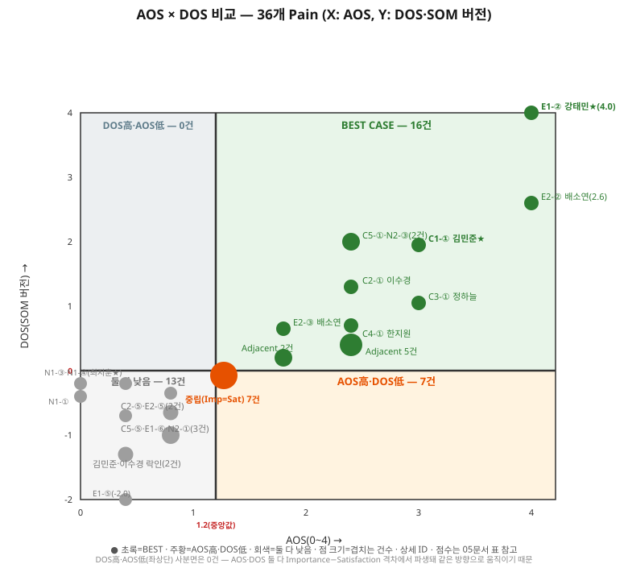
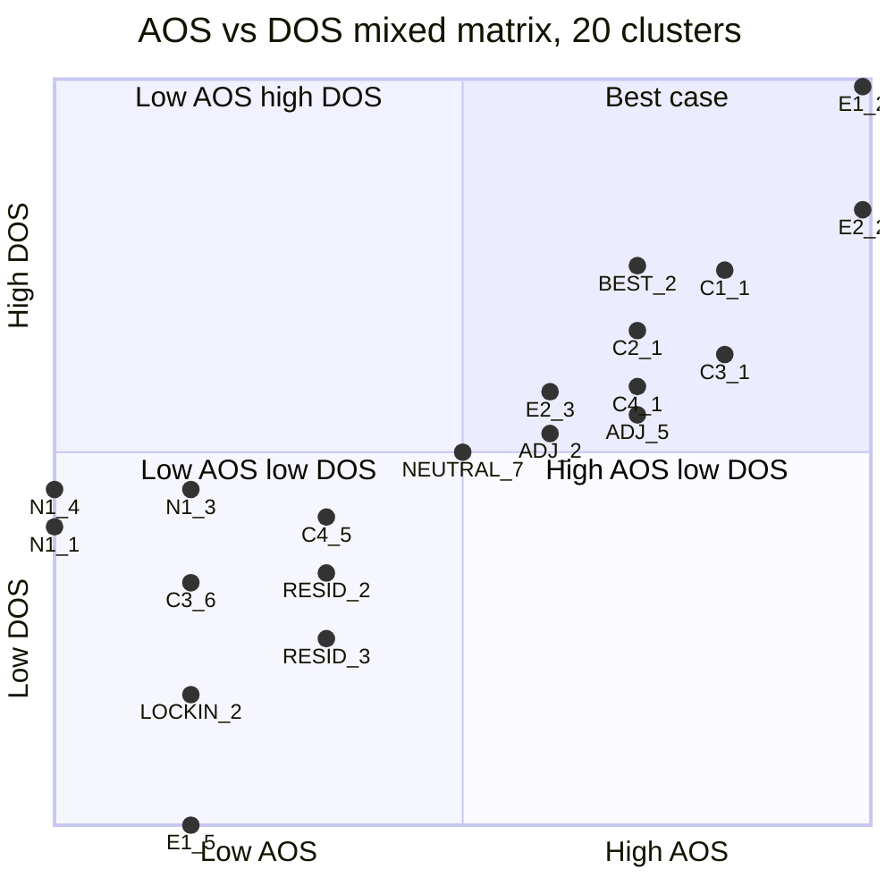

# AOS × DOS 비교 — 36개 Pain 전체 판정

## 개요

이 문서는 `00_방법론.md` 5절(AOS·DOS가 충돌할 때의 판단 기준)을 36개 Pain 전체에 실제로 적용한 결과다. AOS(`02_AOS매트릭스.md`)와 DOS·SOM 버전(`04_DOS_SAM-SOM버전.md`)을 나란히 놓고, 두 지표가 각각 High/Low일 때의 조합으로 4개 케이스에 배치했다.

- **기준선**: AOS는 36개 중앙값인 **1.2**를 기준으로 High(≥1.2)/Low(<1.2)를 가른다. DOS는 **0을 기준**으로 High(양수)/Low(0 이하)를 가른다 — 05_AOS매트릭스.md에서 이미 확인했듯 36개 DOS(SOM 버전)의 중앙값 자체가 정확히 0이라, "양수=시장가중 기회 있음"이라는 직관적 해석과 통계적 중앙값이 일치한다.
- **4개 케이스**(00_방법론.md 5절 원문 기준): ① BEST CASE(AOS·DOS 둘 다 높음) ② AOS 높음·DOS 낮음("고객은 고통스럽지만 시장은 작다") ③ DOS 높음·AOS 낮음("시장은 크지만 고객은 덜 고통스럽다") ④ 둘 다 낮음(원문에 없는 케이스지만 저우선순위로 분류).

## 인사이트 요약

- **36개 중 16개(44%)가 BEST CASE**, 7개(19%)가 "AOS 높음·DOS 낮음", 13개(36%)가 "둘 다 낮음"이다. **"DOS 높음·AOS 낮음"은 0개**다.
- 0개인 이유는 이번 36개 표본에 한정된 결과다 — 일반적으로 이 조합이 수학적으로 불가능한 것은 아니다. AOS와 DOS 둘 다 결국 **Importance와 Satisfaction의 격차**에서 나오므로(AOS는 비율로, DOS는 차이로 계산 방식만 다르다) 대체로 같은 방향으로 움직이지만, 예외가 존재한다 — 예를 들어 Imp=5·Sat=4(격차=1)는 DOS>0(시장가중 기회 있음)이면서도 AOS=5×(1−4/5)=**1.0**으로 중앙값(1.2)에 못 미쳐 Low로 분류된다. 즉 "이 데이터 구조상 성립하기 어렵다"가 아니라, 이번 36개 표본에 Imp=5·Sat=4 같은 조합이 우연히 없었을 뿐이다 — 표본이 늘어나면 이 사분면이 채워질 수 있다.
- "AOS 높음·DOS 낮음" 7개는 전부 정확히 같은 좌표(AOS 1.2, DOS 0.0)에 몰려 있다 — **Importance=Satisfaction인 항목(김민준⑤·정민재①·정하늘⑤·한지원④·오세훈④·이영재⑤·오현석⑤)**이 전부 여기 속한다. 격차가 0이라 DOS는 0이지만, AOS 공식(`Imp×(1−Sat/5)`)은 Imp=Sat=3일 때도 1.2, Imp=Sat=2일 때도 1.2가 나와 우연히 중앙값과 정확히 일치한다.
- BEST CASE 16개 중 7개(A2-②④, A1-②④, A3-②④⑤)가 Adjacent(정민재·이영재·한도윤) 소속이다 — Adjacent 9개 Pain 중 A2-①·A1-⑤ 2개는 "AOS 높음·DOS 낮음" 그룹에 속해 BEST CASE에서 제외된다 — AOS·DOS 판정만 보면 이들도 "최우선"이지만, `03_MarketRelevance_판단.md`가 이미 지적했듯 Market Relevance 자체가 잠정치(0.2)라 이 판정은 **시장 규모를 실측하기 전까지는 잠정 BEST**로 읽어야 한다.

## 1. 시각화

**그림. AOS × DOS 산점도** — X축 AOS(0~4), Y축 DOS·SOM 버전(-2~4). 오른쪽 위(초록, BEST) 16건에 강태민②·배소연②가 가장 멀리 위치하고, 오른쪽 아래(주황) 7건은 전부 "중립(Imp=Sat)" 한 점에 겹쳐 있다. 왼쪽 아래(회색) 13건은 최지훈(대기업)·강태민⑤·잔존 마찰류가 몰려 있다. 왼쪽 위(DOS 높음·AOS 낮음) 사분면은 비어 있다.

### 1.1 Mermaid 버전 (혼합 매트릭스)

같은 데이터를 mermaid `quadrantChart`로도 추출했다. 36개 중 좌표가 겹치는 항목은 위 SVG와 동일하게 20개 클러스터로 묶었고, 두 분할 기준(AOS 1.2·DOS 0)이 quadrantChart의 고정된 0.5/0.5 분할선에 오도록 좌표를 구간별로 재정규화했다(1.2 이하는 0~0.5, 1.2 초과는 0.5~1로 선형 변환하는 식). 이 저장소에서 quadrantChart가 라벨 문자와 무관하게 반복적으로 렉싱 오류를 낸 이력이 있어, 라벨을 전부 영문·언더스코어로 단순화했다 — ID→항목 대응은 아래 표 참고. 이 차트가 깨지면 위 SVG를 기준으로 본다.

**왜 36개가 아니라 20개인가.** AOS와 DOS는 둘 다 오직 **Importance·Satisfaction 두 값**(과 Market Relevance 그룹)만으로 결정되는 계산식이다(AOS=Imp×(1−Sat/5), DOS=(Imp−Sat)×Relevance). 그래서 (Importance, Satisfaction, Relevance 그룹)이 똑같은 두 Pain은 서로 다른 페르소나·다른 문제 내용이라도 **좌표가 완전히 똑같아진다** — 예를 들어 NEUTRAL_7의 7개 항목은 전부 Imp=Sat(=3,3 또는 2,2)라 AOS·DOS가 모두 (1.2, 0.0)으로 겹치고, ADJ_5의 5개 항목은 Adjacent 그룹(Relevance 0.2)이면서 (Imp,Sat)이 (4,2) 또는 (3,1)로 같은 조합이라 (2.4, 0.4)에 겹친다. 36개를 좌표에 그대로 찍으면 이렇게 겹치는 지점에서 점이 뒤덮여 구분이 안 되므로, **동일 좌표를 공유하는 항목을 하나의 클러스터로 묶어** 20개 점으로 줄이고 각 점에 몇 개·어떤 항목이 겹쳐 있는지는 표와 라벨로 따로 표시했다 — 데이터를 누락한 게 아니라 겹치는 점을 시각적으로 하나로 합친 것뿐이며, 36개 전체 원본은 이 문서 2·5절 표와 `04_DOS_SAM-SOM버전.md` 2~3절(SOM·SAM 버전 36개 순위표)에서 빠짐없이 확인할 수 있다.

| 라벨 | 항목(#) | AOS | DOS |
|---|---|---|---|
| C1_1 | C1-① 김민준★ | 3.0 | 1.95 |
| NEUTRAL_7 | Imp=Sat 7건(C1-⑤·A2-①·C3-⑤·C4-④·C5-④·A1-⑤·N2-⑤) | 1.2 | 0.0 |
| LOCKIN_2 | C1-⑥·C2-④ | 0.4 | -1.3 |
| C2_1 | C2-① 이수경 | 2.4 | 1.3 |
| RESID_2 | C2-⑤·E2-⑤ | 0.8 | -0.65 |
| C3_1 | C3-① 정하늘 | 3.0 | 1.05 |
| C3_6 | C3-⑥ 정하늘 | 0.4 | -0.7 |
| C4_1 | C4-① 한지원 | 2.4 | 0.7 |
| C4_5 | C4-⑤ 한지원 | 0.8 | -0.35 |
| BEST_2 | C5-①·N2-③ | 2.4 | 2.0 |
| RESID_3 | C5-⑤·E1-⑥·N2-① | 0.8 | -1.0 |
| ADJ_5 | A2-②·A1-②·A1-④·A3-②·A3-⑤ | 2.4 | 0.4 |
| ADJ_2 | A2-④·A3-④ | 1.8 | 0.2 |
| E1_2 | E1-② 강태민★(최고점) | 4.0 | 4.0 |
| E1_5 | E1-⑤ 강태민★ | 0.4 | -2.0 |
| E2_2 | E2-② 배소연 | 4.0 | 2.6 |
| E2_3 | E2-③ 배소연 | 1.8 | 0.65 |
| N1_1 | N1-① 최지훈★ | 0.0 | -0.4 |
| N1_3 | N1-③ 최지훈★ | 0.4 | -0.2 |
| N1_4 | N1-④ 최지훈★ | 0.0 | -0.2 |

## 2. BEST CASE — AOS·DOS 둘 다 높음 (16개)

| # | 페르소나 | Pain | AOS | DOS(SOM) |
|---|---|---|---|---|
| E1-② | 강태민★ | 분기말 동시 마감 시 은행별 컷오프 시간이 달라 어디서 밀릴지 예측 못 해 실제 실패(위약금)로 이어짐 | 4.0 | 4.0 |
| E2-② | 배소연 | 처리지연을 대수롭지 않게 여기다 계약상 지급 마감을 실제로 놓쳐 위약금이 발생함 | 4.0 | 2.6 |
| C1-① | 김민준★ | 거래처가 지급지시를 한 뒤에도 어느 경로로 언제 도착할지 알 수 없어 은행 포털을 개별 확인해야 함 | 3.0 | 1.95 |
| C3-① | 정하늘 | 선지급 후 확인까지 시차가 커 자금계획을 세울 수 없음 | 3.0 | 1.05 |
| C5-① | 오세훈 | 수출입을 동시에 해 세 마찰(FX스프레드·처리지연·유동성비효율)이 겹쳐 무엇부터 손봐야 할지 모름 | 2.4 | 2.0 |
| N2-③ | 오현석 | 토큰화 예금 인프라가 아직 파일럿 단계라 회사 자금을 노출하는 데 대한 보안·법적 최종성 우려가 큼 | 2.4 | 2.0 |
| C2-① | 이수경 | 여러 거래가 동시에 겹치면 스프레드시트로 하나씩 추적해야 해 놓치는 건이 생김 | 2.4 | 1.3 |
| C4-① | 한지원 | 환전 스프레드가 매입원가에 직접 반영돼 원가 계산이 매번 흔들림 | 2.4 | 0.7 |
| A2-② | 정민재★ | 같은 그룹인데 계열사간 이동은 빠르고 본사와의 결제는 왜 그대로인지 설명해 줄 자료가 없음 | 2.4 | 0.4 |
| A1-② | 이영재 | 개인 명의 트래블월렛은 즉시 결제되는데 회사의 무역대금 결제는 여전히 느리고 비쌈 | 2.4 | 0.4 |
| A1-④ | 이영재 | 해외영업팀의 문제제기가 부서간 사일로에 막혀 자금팀에 아예 전달되지 않음 | 2.4 | 0.4 |
| A3-② | 한도윤 | 싱가포르-태국 지사간 결제는 즉시 처리되는데 같은 회사인 본사와의 결제는 왜 안 되는지 설명이 없음 | 2.4 | 0.4 |
| A3-⑤ | 한도윤 | 반려도 진행도 아닌 애매한 상태로 장기 보류돼 해마다 다시 상정해야 함 | 2.4 | 0.4 |
| E2-③ | 배소연 | 마감 실패 이후 프리미엄 수수료를 주고 특급송금으로 임시 대응하지만 비용이 크고 반복될 수 있음 | 1.8 | 0.65 |
| A2-④ | 정민재★ | 외환신고·AML·회계·내부통제 기준이 아직 불명확해 본사팀 검토가 계속 길어짐 | 1.8 | 0.2 |
| A3-④ | 한도윤 | 해외지사 건의라는 이유로 국내 안건에 밀려 본사 검토 우선순위에서 뒤로 처짐 | 1.8 | 0.2 |

## 3. AOS 높음·DOS 낮음 — "고객은 고통스럽지만 시장은 작다" (7개)

| # | 페르소나 | Pain | AOS | DOS(SOM) |
|---|---|---|---|---|
| C1-⑤ | 김민준★ | 은행별 FX비용 비교는 쉬워졌지만 실제 전환(은행 변경)까지는 별도 협상이 필요함 | 1.2 | 0.0 |
| A2-① | 정민재★ | 해외법인간 스테이블코인 송금 PoC는 성공했지만 1회성 실증이라 일상 업무로 이어지지 않음 | 1.2 | 0.0 |
| C3-⑤ | 정하늘 | 확정 시점 확인으로 계획 정확도는 개선됐지만 여러 은행에 관계가 분산돼 협상력은 여전히 약함 | 1.2 | 0.0 |
| C4-④ | 한지원 | 은행별 환전 스프레드 비교는 가능해졌지만 실제 절감폭은 건별로 차이가 큼 | 1.2 | 0.0 |
| C5-④ | 오세훈 | 마찰이 가장 큰 코리도부터 우선 도입했지만 나머지 코리도는 여전히 예전 방식 그대로임 | 1.2 | 0.0 |
| A1-⑤ | 이영재 | 출장 때마다 같은 괴리를 반복 체감하지만 별다른 계기 없이 개인적 아쉬움으로만 누적됨 | 1.2 | 0.0 |
| N2-⑤ | 오현석 | 동종업계의 도입 사례가 없으면 계속 관망 상태로 보류함 | 1.2 | 0.0 |

00_방법론.md 5절 원문의 전략 방향(**"반복적으로 고객을 확보·유지하는 데 용이한 비즈니스"**)을 그대로 적용하면, 이 7개는 시장 규모를 키우기보다 **개별 고객 리텐션·반복 사용 유도**로 접근해야 한다는 뜻이다.

## 4. DOS 높음·AOS 낮음 — "시장은 크지만 고객은 덜 고통스럽다" (0개)

해당 없음. 이유는 위 인사이트 요약 참고.

## 5. 둘 다 낮음 — 저우선순위 (13개)

| # | 페르소나 | Pain | AOS | DOS(SOM) |
|---|---|---|---|---|
| C2-⑤ | 이수경 | 반복 사용 단계까지 왔어도 예외 발생 건은 여전히 수동으로 처리해야 함 | 0.8 | -0.65 |
| C4-⑤ | 한지원 | 원가 예측은 안정화됐지만 선물환 헤지 비용 부담은 별도로 남음 | 0.8 | -0.35 |
| C5-⑤ | 오세훈 | 남은 코리도를 단계적으로 전환하는 동안 두 방식을 병행해야 하는 부담이 있음 | 0.8 | -1.0 |
| E1-⑥ | 강태민★ | 위험예측·경고 기능을 도입한 뒤에도 예외 발생률이 기대만큼 안 줄면 재검토해야 할 위험이 남음 | 0.8 | -1.0 |
| E2-⑤ | 배소연 | 확정 초단기 옵션을 도입해 마감 걱정은 줄었지만 옵션 비용이 일반 처리보다 높음 | 0.8 | -0.65 |
| N2-① | 오현석 | 기존 코레스뱅킹의 마찰은 인정하면서도 새 대안에 대한 확신이 없어 검토를 미룸 | 0.8 | -1.0 |
| C1-⑥ | 김민준★ | 협상력이 약해 서비스 조건이 바뀌면 대안이 마땅치 않은 락인 리스크가 있음 | 0.4 | -1.3 |
| C2-④ | 이수경 | 신규 대시보드 도입 초기에는 기존 스프레드시트와 데이터 정합성을 확인해야 함 | 0.4 | -1.3 |
| C3-⑥ | 정하늘 | 조건 변경 시 대안이 부족해 락인 우려가 남음 | 0.4 | -0.7 |
| E1-⑤ | 강태민★ | 대체경로가 자동전환이 아니라 제안+승인이라 여전히 본인 판단이 필요함 | 0.4 | -2.0 |
| N1-③ | 최지훈★ | 지급지시 권한과 운영을 신규 서비스에 넘기는 리스크가 기대되는 이득보다 크게 느껴짐 | 0.4 | -0.2 |
| N1-① | 최지훈★ | 은행 우대·전용 딜링데스크·자체 TMS로 세 마찰이 모두 이미 낮아 새 서비스를 찾을 동기 자체가 없음 | 0.0 | -0.4 |
| N1-④ | 최지훈★ | 검증되지 않은 서비스에 지급지시 권한·운영을 넘기는 리스크 회피 성향으로 내부 결재에서 전환을 거부함 | 0.0 | -0.2 |

이 13개 중 6개(C2-⑤·C4-⑤·C5-⑤·E1-⑥·E2-⑤·N2-①)는 **도입 후 잔존 마찰**(강태민·오세훈의 위험예측 기능 도입 후 남은 승인 부담 등)이라 이미 어느 정도 관리되고 있는 항목이고, 나머지는 최지훈(대기업, 3개) + 락인 리스크류다. 최지훈의 3개 Pain 전부가 이 13개 안에 있다는 것은 07챕터·03문서의 "대기업 제외" 판단이 AOS·DOS 양쪽에서 모두 재확인된다는 뜻이다.

## 참고자료

- `06_시장기회분석/00_방법론.md` 5절 — AOS·DOS 판단 기준 원문
- `06_시장기회분석/02_AOS매트릭스.md` — 36개 Pain의 AOS 원점수
- `06_시장기회분석/04_DOS_SAM-SOM버전.md` — 36개 Pain의 DOS(SOM·SAM 버전) 원점수
- `이미지/AOS_DOS_비교.svg` — AOS×DOS 산점도
