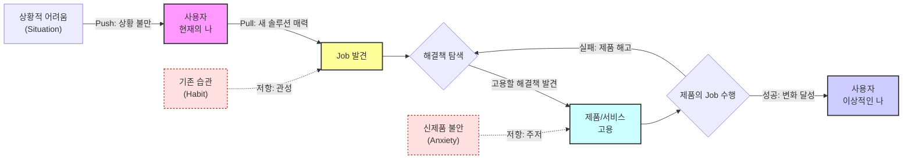

# 07 - 고객 상황을 객관화하는 JTBD(Jobs-To-Be-Done) 분석 (방법론)

## 한눈에 보기

- 목적: 06챕터가 AOS·DOS로 우선순위를 매겼지만 여전히 잠정치·가설에 의존하던 항목들을 실제 인터뷰로 검증하는 단계다. JTBD는 "이 사람이 누구인가"가 아니라 "이 사람이 어떤 변화를 위해 무엇을 고용했는가"를 추적하는 동적 모델링이다.
- 핵심 프레임: 고객의 전환 행동은 두 개의 미는 힘(Push·Pull)과 두 개의 막는 힘(Habit·Anxiety)의 균형으로 결정된다. 넷 중 하나라도 데이터 없이 넘어가면 "왜 전환했는지/안 했는지"를 설명할 수 없다.
- JTBD가 페르소나 중심 사고와 다른 점은 두 가지다 — ① 정적 속성(누구인가)이 아니라 동적 행위(어떤 변화를 추구하는가)를 모델링한다 ② 사용자는 자기 행동 동기를 정확히 모르거나(모름·오해) 솔직히 말하지 않는(숨김·꾸밈) 경우가 많아, 표면적 답변이 아니라 심층 인터뷰 구조가 필요하다.
- 06챕터에서 넘어온 검증 대상: ① 강태민②·배소연②(공동 1위)의 "실제 위약금 발생" 여부·빈도 ② Adjacent(정민재·이영재·한도윤) 3명의 실제 세그먼트 규모 ③ 대기업(최지훈) 세그먼트의 실질 접근 가능성. 이 방법론은 세 가지 모두를 인터뷰로 확인하기 위한 도구다.

## 1. JTBD 관점에서 보는 고객의 문제해결 활동 구조

고객은 정적인 상태가 아니라 "현재의 나"에서 "이상적인 나"로 이동하는 여정 위에 있다. 이 여정의 각 구간에서 두 힘이 밀고, 두 힘이 막는다.

**그림 1. Forces of Progress(전환을 이끄는/막는 4가지 힘)** — 습관(Habit)은 "탐색을 시작할지" 결정하는 지점을, 불안(Anxiety)은 "고용을 확정할지" 결정하는 지점을 붙잡는다. 제품이 Job 수행에 실패하면 고객은 제품을 해고하고 다시 탐색(C)으로 돌아간다.

### 1.1 전환을 이끄는/막는 4가지 힘

| 구분 | 힘 | 설명 | 예시 발화 |
|---|---|---|---|
| 이끄는 힘(Driving) | 상황 불만(Situation Push) | 현재 상태에서 고객을 밀어내는 힘. 이 힘이 약하면 탐색 자체가 시작되지 않는다 | "아, 지금 쓰는 이거 너무 불편해", "이대로는 안 되겠어" |
| 이끄는 힘(Driving) | 새 솔루션의 매력(Situation Pull) | 고객을 새로운 상태로 끌어당기는 힘 | "저거 쓰면 훨씬 편해지겠는데?" |
| 막는 힘(Restraining) | 기존 습관의 관성(Habit) | 고객을 현재 상태에 머무르게 하는 힘. 종종 가장 강력하다 | "불편하긴 해도 익숙해서 쓸 만해", "바꾸는 것 자체가 귀찮아" |
| 막는 힘(Restraining) | 새것에 대한 불안(Anxiety) | 새 솔루션 도입 시 예상되는 손실·마찰에 대한 두려움 | "괜히 바꿨다가 더 복잡하면?", "사용법 다시 배워야 하나?" |

### 1.2 JTBD 중심 사고 vs 페르소나 중심 사고

| 구분 | 페르소나 중심 사고 | JTBD 중심 사고 |
|---|---|---|
| 초점 | 사용자가 누구인가(인구통계 등 정적 속성) | 사용자가 어떤 변화를 추구하는가(행위·동기의 동적 모델) |
| 전제 | 속성을 알면 행동을 예측할 수 있다 | 속성보다 상황(Situation)이 행동을 결정한다 |
| 데이터 신뢰도 문제 | 응답자가 자기 속성은 비교적 정확히 답한다 | 응답자는 자기 행동 동기를 정확히 모르거나(모름·오해) 솔직히 말하지 않는다(숨김·꾸밈) |
| 적합한 조사 방법 | 설문·속성 분류 | 전환 사건을 추적하는 심층 인터뷰 |

이 표의 마지막 행이 2절 인터뷰 방법론이 필요한 이유다 — 사용자에게 "왜 전환했나요?"라고 직접 물으면 정확하지 않은 답이 돌아온다.

## 2. JTBD 인터뷰 방법론

### 2.1 인터뷰 준비 및 구조

- **시간 배정**: 60~90분. 생성 연구(generative research) 세션과 유사하며, 이 기법에 익숙하지 않은 참가자는 편안해지는 데 시간이 걸린다.
- **참가자 모집(3그룹 스크리닝)**: JTBD의 핵심이 전환 행동(switching behavior) 이해이므로, 아래 세 그룹을 모집한다.

| 모집 그룹 | 목적 |
|---|---|
| 최근에 제품/서비스 사용을 시작한 사람 | 무엇이 전환을 이끌었는가(Push·Pull) 확인 |
| 최근에 제품/서비스 사용을 중단한 사람 | 무엇이 이탈로 이어졌는가, 경쟁 제품으로 끈 힘은 무엇인가 확인 |
| 제품/서비스를 아직 들어본 적 없는 사람 | 진입장벽·습관·불안이 무엇인지 확인 |

### 2.2 심층 목표 파헤치기

- **표면적 답변을 피한다**: "왜 다른 제품으로 전환했나요?"처럼 직설적으로 물으면 더 깊은 목표에 도달하지 못한다.
- **'전환 사건(switch event)'에 집중한다**: 인터뷰이가 대화 방향을 이끌도록 허용하되, 연구자는 참가자가 변화를 일으키게 된 구체적 사건에 초점을 맞춘다.
- **스토리텔링을 유도한다**: 사용자가 무언가를 하기로 결정한 배경을 이야기 형태로 끌어낸다.

### 2.3 핵심 질문 전략

**대안 및 맥락 파악 질문** — 경쟁 대안과 전환 행동을 먼저 파악한다.

| # | 질문 |
|---|---|
| 1 | 제품/서비스를 시도하기 전에 다른 어떤 해결책을 고려했습니까? |
| 2 | 이러한 해결책을 고려할 때 무엇을 찾고 있었습니까? |
| 3 | 무엇을 해결하려고 했습니까? |
| 4 | 이 제품/서비스들을 어떻게 찾아보았는지 이야기해 주십시오. |
| 5 | 실제로 사용해 본 다른 해결책은 무엇입니까? |
| 6 | 시도하거나 사용해 본 다른 해결책 중에서 좋았던 점과 싫었던 점은 무엇입니까? |
| 7 | 이 제품/서비스를 사용할 수 없었다면 대신 무엇을 했을 것입니까? |
| 8 | 주변 사람들이 시도하거나 사용해 본 해결책은 무엇입니까? |
| 9 | 과거와 비교했을 때 지금 무엇을 하고 있습니까? |

**맥락 및 감정적 질문** — 경쟁 대안 파악 이후, 더 감정적인 질문으로 깊이 파고든다.

| # | 질문 |
|---|---|
| 1 | 문제를 해결할 무언가가 필요하다는 것을 언제 처음 깨달았습니까? |
| 2 | 고려 중인 선택에 대해 다른 사람과 이야기했습니까? 대화는 어땠습니까? |
| 3 | 이 제품/서비스를 사용하면 어떤 모습일지 상상했습니까? |
| 4 | 제품/서비스로부터 무엇을 원했습니까? |
| 5 | 이 제품/서비스를 구매·사용하는 것에 대해 불안감이 있었습니까? |
| 6 | 사용하는 것에 대해 걱정하게 만드는 요소가 있었습니까? |

**스토리텔링을 위한 연상 유도 질문** — 기억은 사람·장소·냄새·소리와의 연상으로 회상되는 경우가 많다.

| # | 질문 |
|---|---|
| 1 | 그때는 하루 중 몇 시였습니까? |
| 2 | 집에 있었습니까, 직장에 있었습니까? |
| 3 | 뒤에서 TV가 켜져 있었습니까? |
| 4 | 당신은 어떤 상태였습니까? |

### 2.4 경청해야 할 4가지 전환 동인

인터뷰 진행 중 아래 네 가지가 1.1절 4가지 힘과 그대로 대응된다 — 답변을 들으며 어느 힘에 해당하는지 실시간으로 분류한다.

| 전환 동인 | 리스닝 포인트 |
|---|---|
| 상황의 푸시(Push) | 특정 상황 중 무엇이 그들을 새로운 해결책을 찾도록 이끌었는가 |
| 새로운 해결책의 풀(Pull) | 새로운 해결책의 어떤 점이 그것을 시도하고 싶게 만들었는가 |
| 발목을 잡는 습관(Habit) | 새로운 해결책을 시도하는 것을 방해할 수 있는 습관은 무엇이었는가 |
| 새로운 해결책에 대한 불안(Anxiety) | 새로운 해결책을 시도·사용하는 것에 대해 어떤 불안감을 느꼈는가 |

## 3. 06챕터 검증 대상과의 연결

06챕터가 남긴 세 가지 미검증 항목은 2.1절의 3그룹 모집 기준에 그대로 대응된다 — 06챕터의 페르소나 스펙트럼 자체가 JTBD 모집 스크리닝의 근거가 된다. 이 표는 06챕터의 "최우선 가설 검증" 축이며, 페르소나 스펙트럼의 핵심(Core)·확장(Adjacent) 그룹을 AOS·DOS 혁신기회·니치마켓 사분면과 교차한 별도 우선순위 축은 [01_인터뷰대상_우선순위.md](01_인터뷰대상_우선순위.md)에서 다룬다 — 두 축은 목적이 다르므로 실제 스크리닝에서는 통합해야 한다(해당 문서 6절 참고).

| 06챕터 검증 대상 | 매핑되는 모집 그룹 | 확인할 힘 |
|---|---|---|
| 강태민②·배소연②(공동 1위) — 실제 위약금 발생 여부·빈도 | 최근 유사한 마감 실패·위약금을 겪은 사람(Extreme) | Push(상황 불만)의 실재 여부와 강도 |
| Adjacent(정민재·이영재·한도윤) — 실제 세그먼트 규모 | 계열사간 자금이동에 디지털 레일을 실제로 써 본 사람(최근 사용 시작자) | Pull(새 솔루션의 매력)이 실제로 존재하는지 |
| 대기업(최지훈) — 세그먼트 실질 접근 가능성 | 제품/서비스를 들어본 적 없거나 검토 후 거부한 사람(Non-user) | Habit·Anxiety(전환을 막는 힘)의 정체 |

## 이 챕터의 진행 상태

- [x] 방법론 정리 → [00_방법론.md](00_방법론.md)(4가지 힘 프레임, JTBD vs 페르소나 비교, 인터뷰 준비·질문 전략·경청 포인트, 06챕터 검증 대상 매핑)
- [x] 01단계 — 인터뷰 대상자 스크리닝 설계 → [01_인터뷰대상_우선순위.md](01_인터뷰대상_우선순위.md)(핵심·확장 × 혁신기회·니치마켓 교차, 18개 Pain 선정, 3절 기준과 통합 방법 정리)
- [x] 01단계 — 질문지 확정 → [02_인터뷰_문항지.md](02_인터뷰_문항지.md)(11명 대상 공통 문항지 + 페르소나별 추가 문항지, 데모 체험 후 응답 시나리오)
- [ ] 02단계 — 인터뷰 수행·전사, Push/Pull/Habit/Anxiety 코딩
- [ ] 03단계 — 06챕터 AOS·DOS 순위 재검토(가설 확정/기각)

## 참고자료

- [01_인터뷰대상_우선순위.md](01_인터뷰대상_우선순위.md) — 핵심·확장 페르소나 × 혁신기회·니치마켓 교차 우선순위(18개)
- [02_인터뷰_문항지.md](02_인터뷰_문항지.md) — 11명 대상 공통·페르소나별 인터뷰 문항지
- [../06_시장기회분석/00_방법론.md](../06_시장기회분석/00_방법론.md) — 이 챕터로 이월된 AOS·DOS 판단 기준·유의점
- [../06_시장기회분석/01_Pain리스트_Goal추론.md](../06_시장기회분석/01_Pain리스트_Goal추론.md) "외부 근거 보충" 절 — 강태민②·배소연②의 미검증 가설 배경
- [../06_시장기회분석/03_MarketRelevance_판단.md](../06_시장기회분석/03_MarketRelevance_판단.md) — Adjacent·대기업 Market Relevance가 잠정치인 이유
- [../05_페르소나_고객여정지도/01_페르소나스펙트럼_분석보고서.md](../05_페르소나_고객여정지도/01_페르소나스펙트럼_분석보고서.md) — 인터뷰 스크리닝 기준이 되는 페르소나 스펙트럼(Core·Adjacent·Extreme·Non-user)
