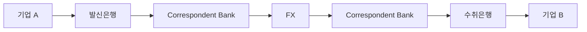
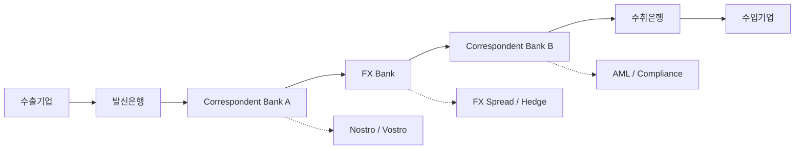
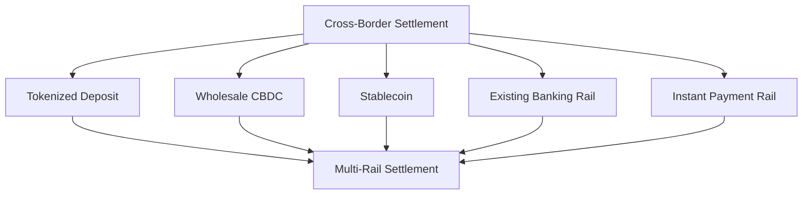
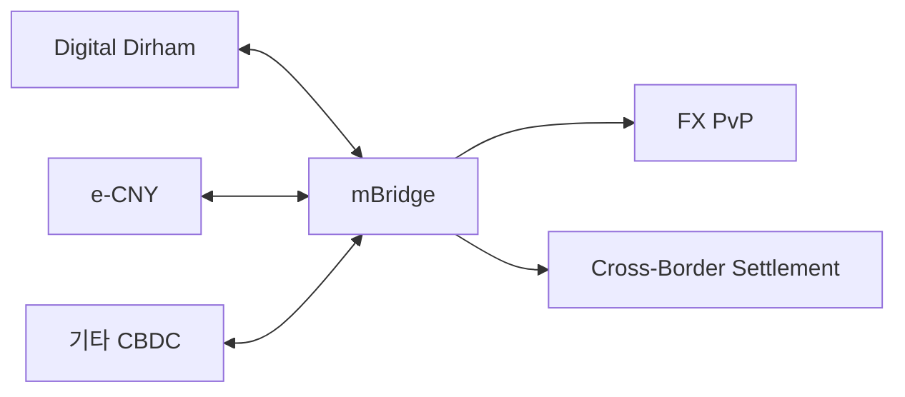
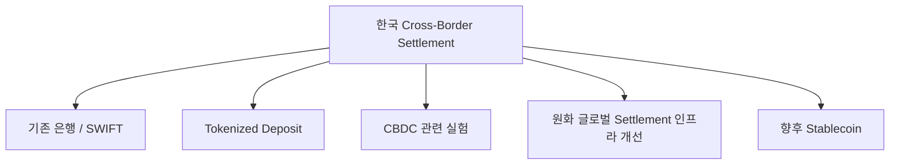
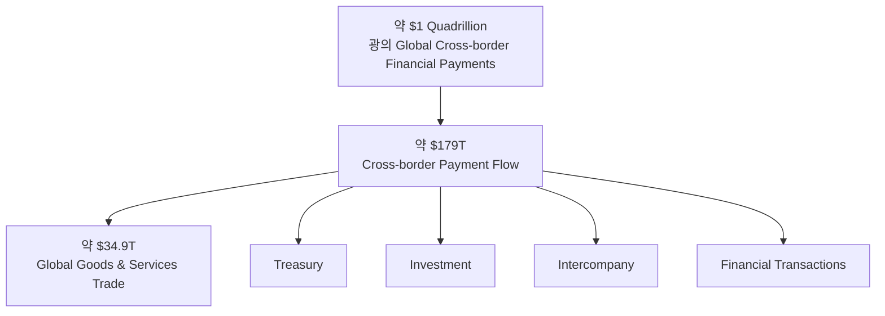
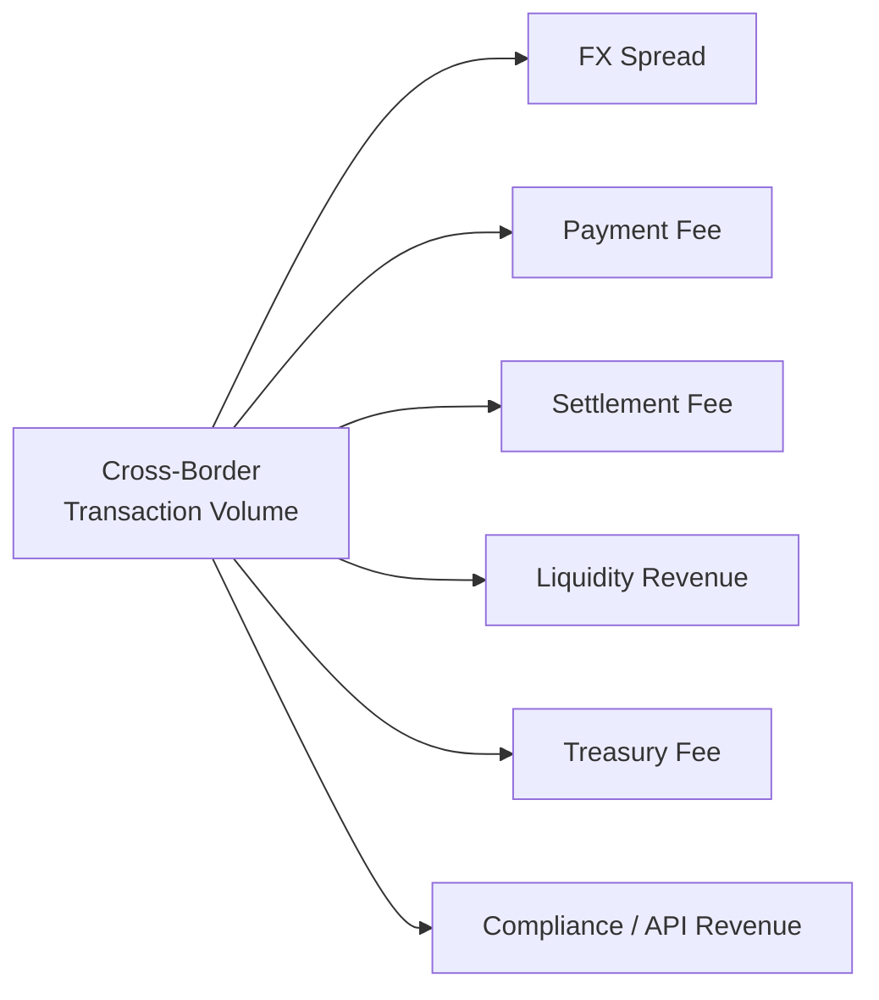
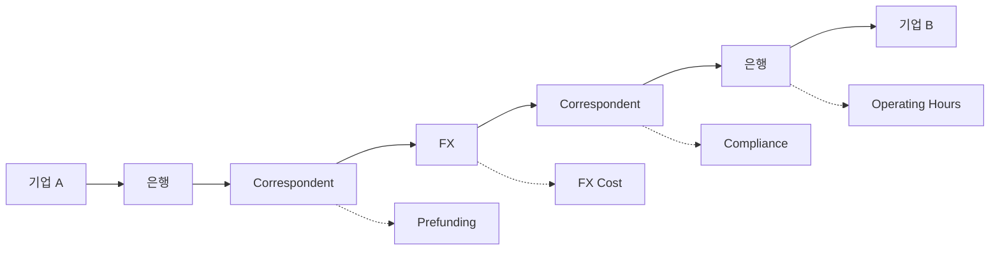
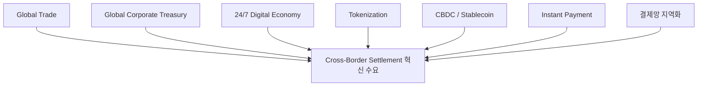
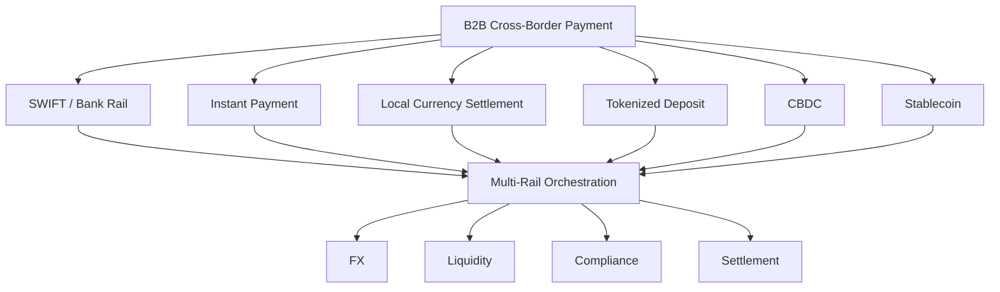

# B2B 국경간 이종통화 결제·정산 인프라 시장 분석
### 글로벌 주요국 도입 사례 및 시장 성장성 비교

---

## Executive Summary

### 연구 주제

**시장 정의**

> **B2B 국경간 이종통화 결제·정산 인프라 시장**  
> 서로 다른 통화를 사용하는 기업과 금융기관이 국경간 자금을 지급·환전·정산하는 과정에서 필요한 금융·기술 인프라 시장

### 핵심 문제

현재 국경간 B2B 거래는 일반적으로 다음과 같은 다단계 구조를 거친다.



이 과정에서 **중개수수료, FX Spread, 1~5영업일의 처리시간, Prefunding, 중복 AML/KYC, 시차와 영업시간 차이** 등의 구조적 마찰이 발생한다.

### 글로벌 변화

이를 해결하기 위해 각국은 하나의 기술이 아니라 서로 다른 Settlement Architecture를 실험하고 있다.

| 주요 접근 | 대표 사례 |
|---|---|
| 기존 금융망 고도화 | SWIFT GPI, ISO 20022 |
| 실시간 지급망 연결 | PayNow–PromptPay |
| Local Currency Settlement | INR 기반 무역정산 |
| CBDC / Multi-CBDC | mBridge |
| Tokenized Deposit | Project Agorá, Ensemble |
| Stablecoin | USDC 등 민간 디지털 결제자산 |

### 핵심 결론

> **현재 경쟁의 본질은 ‘Stablecoin vs CBDC’가 아니라, 어떤 Settlement Architecture가 FX·Liquidity·Compliance·Settlement를 가장 효율적으로 통합할 것인가에 있다.**

아직 압도적인 글로벌 표준은 형성되지 않았다.

- **인도:** 상용화는 가장 앞섰으나 기존 은행망 기반
- **UAE:** Multi-CBDC 실거래 확장
- **홍콩:** Tokenized Deposit의 실가치 거래 진입
- **싱가포르:** 가장 적극적인 Multi-Rail 전략
- **일본:** 기존 은행화폐를 Tokenize하는 기관 중심 접근
- **한국:** 복수 모델을 검증하는 초기 전환 단계

---

# 1. 시장 문제 정의

## 1.1 기존 Settlement 구조

전통적인 국경간 이종통화 결제는 다음과 같은 방식으로 이루어진다.



일반적으로 발신은행, 복수의 코르레스은행, FX 기관 및 수취은행을 순차적으로 통과하는 구조다.

## 1.2 구조적 마찰

| 문제 | 원인 | 기업·금융기관 영향 |
|---|---|---|
| **높은 비용** | 중개기관 수수료 + FX Spread | 거래원가 증가 |
| **느린 Settlement** | 순차 처리 + 영업시간 | 1~5영업일 |
| **Prefunding** | Nostro/Vostro 계좌 | 자본 비효율 |
| **FX Risk** | 환전·정산 시점 불일치 | Hedge 비용 |
| **Compliance 중복** | 기관별 AML/KYC | 비용·시간 증가 |
| **낮은 상호운용성** | 국가·기관별 시스템 차이 | 자동화 제약 |
| **Reconciliation** | 데이터·메시지 불일치 | 운영비용 증가 |

첨부 조사에서도 FX Spread, 선예치 유동성, 중복 규제검증, 영업시간 차이 등이 주요 마찰로 확인된다.

---

# 2. 글로벌 국가 비교

## 2.1 시장 환경

> 국가별 무역통계의 범위가 동일하지 않으므로 아래 수치는 절대적인 국가 순위보다 **대규모 국제거래 수요의 존재 여부**를 판단하기 위한 지표로 활용한다.

| 구분 | 🇯🇵 일본 | 🇭🇰 홍콩 | 🇸🇬 싱가포르 | 🇦🇪 UAE | 🇮🇳 인도 | 🇰🇷 한국 |
|---|---|---|---|---|---|---|
| **2025 무역규모** | 약 ¥223.5조 | 약 HK$10.9조 | 약 S$1.40조 | 비석유 무역 약 AED3.8조 | 상품+서비스 약 $1.84조 | 상품무역 약 $1.34조 |
| **주요 통화** | USD·JPY | USD·HKD·RMB | USD·SGD 등 | USD·AED·CNY | USD·INR | **USD 중심** |
| **시장 특징** | 제조·수출 강국 | 중국-글로벌 금융 Gateway | 글로벌 FX·Treasury Hub | 무역·금융 허브 | 대형 무역경제 + INR 국제화 | 제조·수출 중심 + 높은 USD 의존 |
| **한국 비교 적합성** | **매우 높음** | 높음 | 높음 | 중간 | 중간 | - |

한국은 특히 국제 거래에서 USD 의존도가 높아, **KRW 기업이 USD 중심 글로벌 Settlement System에 연결되는 과정** 자체가 중요한 분석 대상이다.

---

# 3. 각국이 선택한 Settlement Architecture

| 항목 | 🇯🇵 일본 | 🇭🇰 홍콩 | 🇸🇬 싱가포르 | 🇦🇪 UAE | 🇮🇳 인도 | 🇰🇷 한국 |
|---|---|---|---|---|---|---|
| **주요 전략** | Tokenized Deposit | Tokenized Deposit + e-HKD | Multi-Rail Digital Settlement | Multi-CBDC | Local Currency Settlement | 복수 모델 검증 |
| **Settlement Asset** | 은행예금 + 중앙은행 준비금 | Tokenized HKD Deposit | Tokenized Bank Liability·wCBDC·Stablecoin | Digital Dirham·CBDC | INR 은행예금 | KRW 예금·중앙은행화폐 |
| **주요 프로젝트** | Project Agorá | Ensemble / EnsembleTX | BLOOM / Project Guardian | mBridge | INR Trade Settlement | Agorá / Hangang |
| **기본 방향** | 기존 은행화폐 Tokenization | 실가치 Token Settlement | 복수 Rail 경쟁·연결 | Sovereign Digital Money 직접 연결 | USD 우회 | 기존 금융망 + Tokenization |

---

# 4. 국가별 도입성과

## 4.1 비교 결과

| 항목 | 🇯🇵 일본 | 🇭🇰 홍콩 | 🇸🇬 싱가포르 | 🇦🇪 UAE | 🇮🇳 인도 | 🇰🇷 한국 |
|---|---|---|---|---|---|---|
| **운영 단계** | Prototype → Real-value Test | **Real-value Pilot** | **Live Trial + Pilot** | **MVP / 실거래 확대** | **상용 운영** | Prototype / Pilot |
| **금융기관 참여** | BOJ + 일본 대형은행, Agorá 참여 | 주요 은행 7곳 수준 | DBS·OCBC·UOB 등 | 복수 UAE 금융기관 | 26개 인도은행 및 해외은행 | 국내 주요은행 참여 |
| **기업 사용자** | 아직 제한적 | Pilot 기업 | Treasury·Trade 대상 | 금융기관 중심 | **실제 수출입기업** | 국경간 상용기업 제한 |
| **실거래** | 제한적 | 실가치 거래 시작 | 일부 실거래 | **대규모 확대 중** | **상용 거래** | 아직 제한적 |
| **핵심 성과** | 기술·규제 검증 | Tokenized HKD 실거래 | Multi-Rail 가능성 검증 | Cross-border CBDC 확장 | USD 우회 Settlement 제도화 | 인프라 기반 구축 |
| **상용화** | △ | △ | △ | △ | **○** | △ |

---

# 5. 국가별 평가

## 🇯🇵 일본 — 기술 검증 단계

### 접근

**Tokenized Commercial Bank Deposit + Tokenized Central Bank Reserve**

### 평가

- 한국과 가장 유사한 산업·은행 구조
- 은행 중심 금융시스템을 유지하면서 Tokenization 추진
- Project Agorá 등 글로벌 기관형 인프라 참여
- 대규모 상용 기업 사용은 아직 제한적

### 현재 판단

> **기술 및 제도 검증 성공 / 상용 확산 전 단계**

**성장성: ★★★★☆**

---

## 🇭🇰 홍콩 — 실가치 Tokenized Settlement 진입

### 접근

**Tokenized Deposit + e-HKD + Digital Asset Infrastructure**

### 특징

홍콩은 특정 Settlement Asset 하나를 고정하기보다 여러 Digital Money를 동시에 검증한다.

```text
Tokenized Deposit
        +
     e-HKD
        +
   Stablecoin
        ↓
Digital Settlement Infrastructure
```

### 현재 판단

> **Sandbox에서 실제 가치가 이동하는 Pilot 단계로 진입**

**성장성: ★★★★★**

---

## 🇸🇬 싱가포르 — Multi-Rail 전략

### 접근



### 특징

- 글로벌 FX·Treasury Hub
- 은행·핀테크·Stablecoin 사업자 동시 참여
- 특정 기술보다 **Rail 간 상호운용성**을 중시
- Corporate Treasury와 Trade Finance까지 확장

### 현재 판단

> **글로벌 Multi-Rail Settlement의 가장 중요한 선행시장 중 하나**

**성장성: ★★★★★**

---

## 🇦🇪 UAE — Multi-CBDC 실거래 확대

### 접근

**Digital Dirham + mBridge**



### 특징

- 중앙은행 주도
- 실제 가치가 이동하는 Cross-border CBDC 거래
- 금융·무역허브 특성과 결합
- 중국 등 주요 무역상대국과 직접 Digital Settlement 가능

### 현재 판단

> **Cross-border Digital Currency 가운데 가장 강한 실거래 사례 중 하나**

다만 거래가 특정 국가·통화에 집중되어 있어 범용 글로벌 Network로 평가하기에는 아직 이르다.

**성장성: ★★★★★**

---

## 🇮🇳 인도 — 가장 중요한 비디지털 반례

### 접근

**International Trade Settlement in INR**

```text
기존

INR → USD → 상대국 통화

       ↓

개선

INR ↔ 상대국 통화
```

### 특징

- 별도 Blockchain이나 Stablecoin 없이 기존 은행망 활용
- USD 중간 환전 감소
- INR 국제사용 확대
- 실제 수출입기업 사용 가능

### 의미

> **국경간 이종통화 문제를 해결하기 위해 반드시 새로운 Digital Currency가 필요한 것은 아니다.**

### 현재 판단

**제도적 상용화: 높음  
실제 전체 무역 침투율: 아직 제한적**

**성장성: ★★★★☆**

---

## 🇰🇷 한국 — 인프라 전환기

한국은 아직 하나의 Settlement Architecture를 확정하지 않았다.

현재 다음 경로가 동시에 존재한다.



### 특징

- 대규모 상품무역
- 높은 USD 결제 의존
- 대형 은행 중심 금융구조
- 외환·자본시장 규제 존재
- 글로벌 Tokenized Settlement 프로젝트 참여

### 현재 판단

> **시장·제도·기술 Architecture가 아직 형성되는 초기 단계**

**성장성: ★★★★☆**

---

# 6. 글로벌 시장 규모

## 6.1 시장 규모는 하나의 숫자로 보면 안 된다

본 시장은 **거래금액(Transaction Value)**과 **결제 인프라 사업자의 Revenue Pool**을 분리할 필요가 있다.

### 시장 구조



## 6.2 주요 시장 Anchor

| Layer | 규모 | 의미 |
|---|---:|---|
| **글로벌 무역** | 약 **$34.9T** | B2B 무역대금 결제의 실물경제 기반 |
| **Cross-border Payment Flow** | 약 **$179T** | 무역 + 기업 Treasury + 투자·금융거래 |
| **광의 Cross-border Financial Payments** | 약 **$1 Quadrillion** | 금융기관 간 대규모 거래까지 포함 |

### 시장 정의상 가장 유용한 기준

**$1 Quadrillion**을 B2B 결제시장으로 직접 사용하면 과대평가된다.

반대로 **$34.9T 무역시장**만 사용하면 Treasury·Intercompany·금융거래를 과소평가한다.

따라서 현 단계에서는

> **약 $179T의 Cross-border Payment Flow를 상위 Transaction Universe로 두고, 그중 B2B·이종통화·인프라 적용 가능 거래를 점차 좁혀가는 방식**

이 가장 적절하다.

---

# 7. 인프라 사업시장은 별도로 계산해야 한다

Transaction Volume이 곧 사업자 매출은 아니다.



따라서 향후 TAM/SAM을 산정할 때는 다음 방식이 적절하다.

### 방식 A — Transaction-based

> **적용 가능한 Transaction Volume × Infrastructure Take Rate**

### 방식 B — Revenue Pool 기반

> **FX Revenue  
> + Payment Fee  
> + Settlement Fee  
> + Liquidity Revenue  
> + Treasury Revenue  
> + Compliance/API Revenue**

---

# 8. 시장 성장의 구조적 원인

## 8.1 기존 금융시스템의 마찰



### 주요 구조적 원인

| 원인 | 결과 |
|---|---|
| Correspondent Banking 다단계 | 비용·시간 증가 |
| FX 중개 | Spread 및 환율위험 |
| Nostro/Vostro Prefunding | 유동성 비효율 |
| 국가별 규제 | Compliance 중복 |
| 시차·영업시간 | 24/7 정산 제약 |
| 데이터 표준 차이 | Reconciliation 비용 |
| 비기축통화의 낮은 유동성 | 중개 Chain 증가 |

첨부 리서치 역시 비용, 시간, 유동성, FX, 규제·운영 마찰을 핵심 문제로 구분한다.

---

# 9. 시장 성장을 가속하는 외부 변화



### 핵심 성장 동인

1. **기업활동의 글로벌화**
   - 수출입뿐 아니라 해외법인·공급망·Marketplace 확대

2. **24/7 경제**
   - 기존 은행 영업시간 기반 결제체계와 디지털 경제 간 불일치

3. **기업 Treasury 효율화**
   - 국가별 사전 유동성을 줄이고 자본효율성을 높이려는 요구

4. **Tokenization**
   - 현금·예금·증권 등이 동일한 Digital Infrastructure에서 거래될 가능성 증가

5. **CBDC·Stablecoin 등장**
   - 새로운 Digital Settlement Asset의 선택지 확대

6. **Instant Payment Network 확대**
   - 기존 은행망 자체도 빠르게 개선

7. **결제망의 다극화**
   - 단일 글로벌 Network보다 지역·통화권별 Infrastructure 확대

---

# 10. 산업 구조의 향후 방향

## 하나의 기술이 모든 결제를 대체할 가능성은 낮다

향후 시장은 다음과 같은 형태로 발전할 가능성이 높다.



즉 장기적으로 중요한 경쟁영역은 단순한 Digital Currency 발행보다

> **다양한 Settlement Rail과 Asset을 연결하고 FX·Liquidity·Compliance·Settlement를 통합하는 Infrastructure**

가 될 가능성이 있다.

---

# 11. 국가별 성장성 평가

| 국가 | 성장성 | 이유 | 핵심 리스크 |
|---|---|---|---|
| 🇯🇵 일본 | ★★★★☆ | 대규모 무역·FX + 대형은행 | 기존 시스템의 높은 완성도 |
| 🇭🇰 홍콩 | ★★★★★ | 중국-글로벌 Gateway + Digital Asset | 중국·글로벌 규제 접점 |
| 🇸🇬 싱가포르 | ★★★★★ | FX·Treasury Hub + Multi-Rail | 내수보다 금융중개 중심 |
| 🇦🇪 UAE | ★★★★★ | 무역허브 + 국가주도 Digital Settlement | 국가·통화별 거래집중 |
| 🇮🇳 인도 | ★★★★☆ | 대형 무역경제 + INR 국제화 | INR 유동성·Convertibility |
| 🇰🇷 한국 | ★★★★☆ | 대규모 무역 + 높은 USD 의존 | KRW 국제유동성·외환규제 |

> **해당 별점은 공식 시장 CAGR이 아니라 현재 제도·수요·상용화 가능성을 기반으로 한 정성적 평가다.**

---

# 12. 핵심 시사점

## Insight 1. 문제는 Digital Currency 자체가 아니다

출발점은

> **B2B Cross-Border Cross-Currency Settlement Friction**

이다.

CBDC, Stablecoin, Tokenized Deposit 등은 이를 해결하기 위한 **수단**이다.

---

## Insight 2. 국가별 최적해는 다르다

국가가 선택하는 Architecture는 다음 변수에 영향을 받는다.

- 자국통화의 국제화 수준
- USD 의존도
- 외환시장 개방도
- 자본통제
- 기존 은행산업 구조
- 국제금융허브 여부
- 무역구조
- 기존 지급결제망 수준

---

## Insight 3. 아직 글로벌 승자는 없다

현재 시장은 다음 상태다.

```text
Local Currency Settlement ── 상용화
          │
Tokenized Deposit ───────── 실가치 Pilot
          │
Multi-CBDC ──────────────── 실거래 확대
          │
Stablecoin ──────────────── 초기 상용
          │
Multi-Rail Orchestration ── 초기 형성
```

따라서 시장구조는 아직 확정되지 않았다.

---

# 13. 다음 연구 단계

현재까지는

> **“어떤 문제가 있고, 각국이 무엇을 시도하고 있는가?”**

를 확인했다.

다음 단계에서는 다음 인과관계를 분석해야 한다.

### 핵심 질문

> **왜 각 국가는 서로 다른 Settlement Architecture를 선택했는가?**

### 주요 설명 변수

| 변수 | 분석 질문 |
|---|---|
| **USD 의존도** | USD 의존도가 높을수록 어떤 방식이 유리한가? |
| **통화 국제화** | 국제적으로 사용되는 통화인지가 Architecture 선택에 어떤 영향을 주는가? |
| **FX 개방도** | 자유로운 환전이 가능한가? |
| **자본통제** | 국가가 Cross-border Flow를 얼마나 통제하는가? |
| **은행시장 구조** | 은행 중심인가, Fintech 중심인가? |
| **기존 지급망** | 이미 빠르고 효율적인 결제망을 가지고 있는가? |
| **무역구조** | 주요 거래상대국과 통화는 무엇인가? |
| **정책 목표** | 효율화인가, 통화 국제화인가, 금융주권인가? |

---

# 14. Final Takeaway

## 시장

> **B2B 국경간 이종통화 결제·정산 인프라**

## 시장 규모

> 수십조~수백조 달러의 Cross-border Transaction Flow를 기반으로 하는 대형 금융 인프라 시장

## 문제

> 기존 시스템은 FX·Liquidity·Compliance·Settlement가 여러 기관과 시스템에 분절되어 있다.

## 변화

> 기존 은행망 개선, Local Currency Settlement, Tokenized Deposit, CBDC, Stablecoin 등 복수 Architecture가 동시에 등장하고 있다.

## 현재 경쟁상황

> **확실한 승자는 아직 존재하지 않는다.**

## 핵심 경쟁지점

> Settlement Asset 자체보다 **FX + Liquidity + Compliance + Settlement를 얼마나 효율적으로 통합할 수 있는가**

## 다음 연구 방향

> **국가별 Architecture 선택의 원인을 분석한 뒤 한국에 가장 적합한 Settlement Model에 대한 가설을 수립한다.**