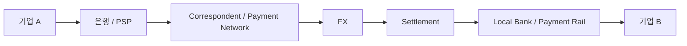
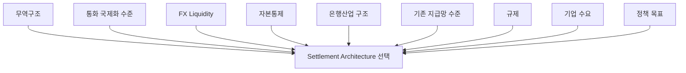

# Deep Research Meta Prompt
## 글로벌 B2B 국경간 이종통화 결제·정산 인프라 국가 비교 연구

---

# 0. 연구 개요

## 연구 주제

**B2B 국경간 이종통화 결제·정산 인프라 시장**

## 문제 정의

> 서로 다른 통화권의 기업들이 국경간 거래를 결제·정산할 때 발생하는 구조적 마찰과, 이를 해결하기 위해 등장한 새로운 디지털 및 금융 결제·정산 인프라

## 현재까지 확인한 1단계 연구 질문

> **“B2B 국경간 이종통화 결제·정산은 현재 어떠한 구조로 이루어지며, 이 과정에서 기업과 금융기관은 어떤 구조적 마찰을 겪고 있는가? 또한 이러한 문제를 해결하기 위해 기존 금융망 개선, CBDC, 토큰화 예금, 스테이블코인 등 어떤 새로운 결제·정산 인프라가 시도되어 왔는가?”**

1단계에서는 다음 대안군이 존재함을 확인했다.

- Correspondent Banking / SWIFT 개선
- RTGS 및 ISO 20022
- 국가 간 Instant Payment System 연결
- Local Currency Settlement
- CBDC / Wholesale CBDC / Multi-CBDC
- Tokenized Deposit
- Unified Ledger
- Stablecoin
- On-chain FX
- 기타 새로운 Cross-Border Settlement Infrastructure

---

# 1. 이번 연구의 핵심 목적

이번 연구에서는 특정 기술을 우월하다고 전제하지 않는다.

핵심 목적은 다음이다.

> **한국과 경제·무역·통화·금융구조가 유사하거나, B2B 국경간 이종통화 결제·정산 혁신을 선도하는 국가들이 동일한 문제를 어떤 방식으로 해결하고 있는지 비교한다.**

그리고 각각의 방식이

1. 실제로 도입되었는가?
2. 실제 돈이 움직이고 있는가?
3. 누가 사용하고 있는가?
4. 거래 규모는 얼마나 되는가?
5. 기존 방식보다 실제로 효율적인가?
6. PoC를 넘어 상용화되고 있는가?
7. 향후 얼마나 확장될 가능성이 있는가?

를 검증한다.

---

# 2. 핵심 연구 질문

이번 연구에서 반드시 답해야 하는 질문은 다음이다.

> **한국과 유사한 국가 또는 국경간 금융인프라 선도국은 B2B 이종통화 결제·정산의 구조적 마찰을 줄이기 위해 어떤 방식을 선택하고 있으며, 각 방식은 실제 도입·이용·거래규모·비용·속도·상용화 측면에서 어느 정도의 성과를 보이고 있는가?**

추가적으로 다음을 판단한다.

> **어떤 경제·제도·금융환경에서 어떤 Settlement Architecture가 상대적으로 더 잘 작동하는가?**

---

# 3. 연구 원칙

## 특정 기술을 정답으로 전제하지 않는다

다음 가설을 미리 사실로 인정하지 않는다.

- Stablecoin이 가장 효율적이다.
- CBDC가 가장 안전하다.
- Tokenized Deposit이 은행 시스템의 최종 진화형이다.
- Blockchain이 반드시 필요하다.
- 기존 SWIFT/은행망은 장기적으로 대체된다.
- Digital Money가 기존 Local Currency Settlement보다 효율적이다.

오히려 **기존 시스템 개선이 새로운 Digital Money보다 효율적인 사례도 적극적으로 탐색한다.**

---

# 4. 비교 국가 선정

국가는 목적에 따라 구분한다.

## A. 한국 구조 비교군

한국과 경제·산업·금융구조가 비교적 유사한 국가.

우선 검토:

- 일본
- 대만

평가 기준:

- 제조업 및 수출 의존도
- 독자 법정통화 보유
- 국제거래에서 USD 등 외화 사용
- 은행 중심 금융구조
- 외환시장 구조
- 자본이동 규제 수준
- 무역 규모

---

## B. 글로벌 선도시장

새로운 Cross-Border Settlement Infrastructure를 적극적으로 실험·상용화하는 국가.

우선 검토:

- 싱가포르
- 홍콩
- UAE

---

## C. 대형 정책실험 국가

규모와 정책 영향력이 크고 기존 방식과 다른 Architecture를 실험하는 국가.

우선 검토:

- 중국
- 인도

---

# 5. 국가 선정 자체도 검증

위 국가를 무조건 사용하지 마라.

다음 기준으로 **최종 비교국 5~7개**를 선정한다.

| 기준 | 평가 |
|---|---|
| 연간 수출입 규모 | |
| GDP 대비 무역 비중 | |
| 독자 법정통화 | |
| B2B Cross-Border Payment 규모 | |
| FX 시장 특성 | |
| 새로운 Settlement Infrastructure 실험 | |
| 실거래 여부 | |
| 공개 데이터 가용성 | |
| 한국과의 비교 가능성 | |

필요하다면 더 적절한 국가를 추가하거나 기존 후보를 제외하라.

---

# 6. 국가별 기존 구조부터 파악

각 국가마다 새로운 기술부터 조사하지 말고 먼저 **현재 기업들이 어떻게 결제하는지** 파악한다.

다음 Flow를 작성한다.



각 단계에서 조사:

- 주요 참여기관
- 주요 사용통화
- Correspondent Bank 필요 여부
- FX 발생 위치
- Settlement 방식
- Prefunding 여부
- 평균 처리시간
- 비용구조
- 규제·Compliance
- 기업의 주요 Pain Point

---

# 7. 국가별 '문제'를 먼저 정의

각 국가에서 실제로 무엇을 개선하려 했는지 확인한다.

예:

- 높은 Cross-Border Fee
- FX Spread
- USD 중개통화 의존
- Nostro/Vostro Prefunding
- 느린 Settlement
- 영업시간 제약
- 낮은 Transparency
- AML/KYC 중복
- Reconciliation
- 국가 간 Payment Rail 단절
- Correspondent Banking 접근성 감소
- Local Currency 국제화
- 외환 유동성 부족

각 문제에 대해 **정부·중앙은행·금융기관이 공식적으로 문제라고 언급한 근거**를 우선 사용한다.

---

# 8. 각 국가가 선택한 해결방식

다음 Architecture를 동일한 수준에서 비교한다.

## ① Existing Financial Rail Upgrade

예:

- SWIFT GPI
- ISO 20022
- RTGS 연장
- 24/7 Settlement

---

## ② Instant Payment Interlinking

예:

- 국가 FPS ↔ 국가 FPS
- PayNow–PromptPay 유형

---

## ③ Local Currency Settlement

예:

- INR ↔ AED
- Local Currency Trade Settlement

---

## ④ CBDC / Multi-CBDC

예:

- mBridge
- Wholesale CBDC
- Cross-border CBDC

---

## ⑤ Tokenized Deposit / Unified Ledger

예:

- Project Agorá
- Project Ensemble
- Commercial Bank Deposit Token

---

## ⑥ Stablecoin Infrastructure

예:

- Regulated Stablecoin
- Stablecoin Settlement
- Fiat ↔ Stablecoin Gateway
- B2B Stablecoin Payment

---

## ⑦ 기타

실제 시장에서 중요하다면 새로운 분류를 추가한다.

---

# 9. 프로젝트 단위 분석

각 국가에서 대표적인 프로젝트·서비스를 찾는다.

각 프로젝트를 다음 Template으로 작성한다.

### Project

**프로젝트명**

**국가**

**운영주체**

**문제**

무엇을 해결하려 했는가?

**Architecture**

어떤 방식인가?

**Settlement Asset**

- Commercial Bank Money
- Central Bank Money
- CBDC
- Tokenized Deposit
- Stablecoin
- Fiat
- 기타

**Participants**

- 중앙은행
- 은행
- 기업
- Payment Company
- Fintech
- 기타

**Stage**

- Research
- PoC
- Sandbox
- Pilot
- Real-value Pilot
- Early Commercial
- Commercial
- Scaled Commercial

**Start Date**

**Current Status**

**Transaction Scale**

**Adoption**

**Performance**

**Limitations**

**Expansion Plan**

---

# 10. '성공'의 정의

단순히 프로젝트가 존재한다고 성공으로 평가하지 않는다.

성공도를 다음 **5개 축**으로 평가한다.

## 1. Adoption

- 참여 금융기관 수
- 참여기업 수
- 실제 고객 수
- 국가 수
- 연결 통화 수
- Corridor 수

---

## 2. Transaction Scale

- 누적 거래건수
- 누적 거래금액
- 일평균 Settlement Value
- 월평균 Settlement Value
- 연간 Transaction Value

---

## 3. Efficiency

기존 방식 대비:

- Settlement Time
- Total Fee
- FX Spread
- Liquidity Requirement
- Prefunding
- Failure Rate
- Reconciliation Cost
- Processing Cost

---

## 4. Commercialization

다음 단계 중 어디까지 도달했는가?

```text
Research
   ↓
PoC
   ↓
Sandbox
   ↓
Pilot
   ↓
Real-value Pilot
   ↓
Early Commercial
   ↓
Commercial
   ↓
Scaled Infrastructure
```

---

## 5. Scalability

- 국가 확대
- 통화 확대
- 금융기관 확대
- 기업 확대
- 거래한도 확대
- 다른 Payment Rail과 연결
- 기술적 확장성
- Regulatory Scalability

---

# 11. 이용규모 측정

B2B Infrastructure를 Consumer App처럼 MAU만으로 평가하지 않는다.

## Retail / SME Infrastructure

다음 지표 사용:

- 사용자 수
- Merchant 수
- 기업 고객 수
- 거래건수
- 거래금액

## Wholesale Infrastructure

다음 지표 사용:

- 참여 금융기관 수
- 참여 기업 수
- 거래금액
- 일평균 Settlement Value
- 연결 통화 수
- 연결 국가 수

## 국가 단위 Infrastructure

가능하면 다음을 측정:

- 전체 Cross-Border Payment 중 점유율
- 전체 무역결제 중 이용 비중
- 자국통화 Settlement 비중
- 기존 Correspondent Banking 대체 비중

---

# 12. 성과 비교

각 프로젝트에 대해 가능하면 Before / After를 작성한다.

| KPI | 기존 방식 | 새로운 방식 | 개선 |
|---|---:|---:|---:|
| Settlement Time | | | |
| Transaction Fee | | | |
| FX Cost | | | |
| Prefunding | | | |
| Intermediaries | | | |
| Reconciliation | | | |
| Operating Hours | | | |
| Failure Rate | | | |

공식적인 Before/After 데이터가 없다면 억지로 추정하지 말고

**Evidence Insufficient**

라고 표시한다.

---

# 13. 기업 관점 성과

중앙은행이나 금융기관 관점만 조사하지 않는다.

가능하면 실제 사용하는 **수출기업·수입기업·글로벌 기업·SME** 관점에서 조사한다.

다음 질문에 답한다.

- 기업은 실제 무엇이 편해졌는가?
- 실제 비용이 감소했는가?
- 운전자본 효율성이 개선됐는가?
- Treasury가 개선됐는가?
- FX Risk가 감소했는가?
- 24/7 Settlement의 가치가 있었는가?
- 기존 은행 대비 Switching Incentive가 충분한가?

실제 기업 Testimonial 또는 Case Study를 우선한다.

---

# 14. 실패·정체 사례도 조사

성공사례만 찾지 않는다.

다음 사례도 적극적으로 탐색한다.

- PoC 이후 중단
- Pilot 이후 상용화 실패
- 낮은 기업 Adoption
- 거래량 부족
- 규제 문제
- 은행 참여 부족
- 국가 간 Governance 실패
- 유동성 부족
- Network Effect 부족
- 기존 시스템 대비 경제성 부족

각 실패 사례에서

> **왜 기술적으로 가능했지만 시장에서는 확산되지 못했는가?**

를 분석한다.

---

# 15. 국가별 Trade Structure 분석

각 국가의 결제 방식 선택이 산업구조와 관련 있는지 확인한다.

각 국가에서 조사:

- 전체 수출
- 전체 수입
- 주요 무역국
- 주요 산업
- 무역의 주요 결제통화
- USD 비중
- 자국통화 비중
- 주요 Currency Pair
- Cross-border Payment 규모
- 기업 규모별 해외거래 비중

---

# 16. 왜 국가마다 선택이 다른가?

다음 변수를 중심으로 Causal Analysis한다.



특히 다음을 판단한다.

> 왜 어떤 국가는 CBDC를 선택하는가?

> 왜 어떤 국가는 Tokenized Deposit을 선택하는가?

> 왜 어떤 국가는 Stablecoin을 허용하는가?

> 왜 어떤 국가는 Local Currency Settlement만으로 접근하는가?

> 왜 어떤 국가는 기존 금융망 고도화를 우선하는가?

---

# 17. 기존 금융망의 반격도 포함

Digital Money만 분석하면 안 된다.

SWIFT, Correspondent Banking, RTGS 등 기존 금융망의 개선 속도도 조사한다.

다음 질문에 답한다.

- SWIFT GPI가 실제로 얼마나 빨라졌는가?
- ISO 20022가 어떤 마찰을 제거하고 있는가?
- RTGS 운영시간 확대 효과는?
- Instant Payment Interlinking은 Stablecoin/CBDC의 필요성을 줄이는가?
- 기존 Banking Rail이 충분히 개선되면 새로운 Digital Money의 경제적 이점이 줄어드는가?

---

# 18. Growth Potential 분석

아직 초기 시장이므로 단일 CAGR만으로 성장성을 평가하지 않는다.

성숙도에 따라 다른 지표를 사용한다.

## PoC 단계

- 참여기관 증가율
- 참여국 증가
- 통화 증가
- 후속 Pilot 여부

## Pilot 단계

- Real-value Transaction 전환
- 거래금액 증가
- 기업 참여 증가

## Early Commercial

- 고객 증가율
- Transaction Value 증가율
- Corridor 확대

## Commercial

- Revenue
- Transaction CAGR
- 시장점유율
- Cross-Border Payment 침투율

---

# 19. 성장 잠재력 평가 모델

각 국가·프로젝트에 다음 점수를 부여한다.

각 항목 **1~5점**.

| 평가 | 점수 |
|---|---:|
| Market Need | /5 |
| Transaction Scale | /5 |
| Adoption | /5 |
| Efficiency Improvement | /5 |
| Regulatory Readiness | /5 |
| Commercialization | /5 |
| Network Expansion | /5 |
| Scalability | /5 |

총점만 제시하지 말고 각 점수의 근거를 설명한다.

---

# 20. 잠재 시장 규모

시장 규모는 다음 구조로 접근한다.

```text
Total B2B Cross-Border Payment
             ↓
Cross-Currency Transaction
             ↓
Addressable Settlement Flow
             ↓
New Infrastructure Applicable Flow
             ↓
Realistic Adoption
```

가능하면 국가별로 다음을 계산한다.

### TAM

전체 B2B Cross-Border Cross-Currency Settlement 규모

### SAM

새로운 Settlement Infrastructure가 적용 가능한 거래

### Potential Adoption

향후 5~10년 현실적으로 전환 가능한 거래

단, 데이터가 부족하다면 억지로 시장규모를 생성하지 않는다.

---

# 21. 국가별 종합 Scorecard

최종적으로 다음 표를 작성한다.

| 항목 | 일본 | 홍콩 | 싱가포르 | UAE | 인도 | 기타 비교국 |
|---|---:|---:|---:|---:|---:|---:|
| 무역규모 | | | | | | |
| Cross-border Settlement Need | | | | | | |
| 주요 해결방식 | | | | | | |
| 실거래 여부 | | | | | | |
| 거래규모 | | | | | | |
| 참여기관 | | | | | | |
| 기업 Adoption | | | | | | |
| 속도 개선 | | | | | | |
| 비용 개선 | | | | | | |
| Commercialization | | | | | | |
| Regulatory Readiness | | | | | | |
| Scalability | | | | | | |
| Growth Potential | | | | | | |

---

# 22. Architecture 비교표

국가가 아니라 **방식 자체**도 별도로 비교한다.

| Architecture | 문제 해결력 | 실제 거래규모 | 상용화 | 규제 복잡성 | 확장성 |
|---|---:|---:|---:|---:|---:|
| Existing Rail Upgrade | | | | | |
| IPS Interlinking | | | | | |
| Local Currency Settlement | | | | | |
| CBDC / Multi-CBDC | | | | | |
| Tokenized Deposit | | | | | |
| Stablecoin | | | | | |

---

# 23. 가장 중요한 최종 분석

연구 마지막에는 단순 사례 요약이 아니라 다음 질문에 답한다.

## Q1.

현재 **실제 B2B Cross-Border Settlement에서 가장 상용화가 앞선 방식은 무엇인가?**

---

## Q2.

PoC에서는 성과가 좋지만 상용화되지 못하는 방식은 무엇이며, 이유는 무엇인가?

---

## Q3.

기존 금융망 개선만으로 해결되는 문제와 새로운 Digital Money가 필요한 문제를 구분할 수 있는가?

---

## Q4.

CBDC, Tokenized Deposit, Stablecoin은 서로 대체재인가, 보완재인가?

---

## Q5.

Local Currency Settlement는 Digital Money 없이도 상당한 비용·FX 문제를 해결할 수 있는가?

---

## Q6.

실제 기업 Adoption을 가장 강하게 만드는 변수는 무엇인가?

- 비용
- 속도
- Liquidity
- FX
- 24/7
- Compliance
- Treasury
- 기타

---

## Q7.

국가별로 Settlement Architecture 선택이 다른 가장 중요한 원인은 무엇인가?

---

## Q8.

현재 가장 높은 Growth Potential을 가진 모델은 무엇인가?

---

# 24. 한국 적용 전 단계

이번 연구에서는 **아직 한국에 최종 솔루션을 제안하지 않는다.**

대신 마지막에 다음을 정리한다.

## 한국과 유사한 조건

다른 국가에서 발견된 공통점.

## 한국과 다른 조건

다른 국가 사례를 그대로 적용하기 어려운 이유.

## Korea-Relevant Lessons

한국에 적용할 가치가 높은 구조적 교훈.

## Hypotheses for Korea

다음 연구단계에서 검증해야 할 가설만 제시한다.

예:

- H1. 한국에서는 기존 금융망 개선이 가장 현실적이다.
- H2. Tokenized Deposit 방식이 은행 중심 구조에 적합할 수 있다.
- H3. Stablecoin은 특정 기업·Corridor에서 상대적 우위가 있을 수 있다.
- H4. Local Currency Settlement 확대가 일부 문제를 더 낮은 규제비용으로 해결할 수 있다.
- H5. 복수 Rail을 연결하는 Orchestration Infrastructure가 필요할 수 있다.

**어느 가설도 현재 단계에서 정답으로 확정하지 않는다.**

---

# 25. 필수 시각화

최종 결과는 텍스트 중심 보고서로 작성하지 말고 다음 시각화를 반드시 포함한다.

## ① Research Map


## ② 국가별 Settlement Architecture Map

국가마다 현재 구조 → 신규 구조를 비교.

## ③ Country × Solution Matrix

국가별 어떤 방식을 채택하고 있는지 표시.

## ④ Commercialization Maturity Map

Research → PoC → Pilot → Commercial 단계 표시.

## ⑤ Adoption & Transaction Scale 비교표

## ⑥ Performance Before / After 표

## ⑦ 국가별 Growth Potential Scorecard

## ⑧ Architecture Comparison Matrix

## ⑨ Failure / Bottleneck Map

## ⑩ Korea Implication Map

---

# 26. 출력 구조

보고서는 반드시 다음 순서로 작성한다.

# Executive Summary

핵심 발견 7~10개.

가능하면 **한 페이지 안에서 전체 결론이 보이게 작성한다.**

---

# 1. Research Scope & Methodology

# 2. Country Selection

# 3. Global Cross-Border Settlement Landscape

# 4. Japan

# 5. Hong Kong

# 6. Singapore

# 7. UAE

# 8. India

# 9. Other Relevant Benchmark

# 10. Country Comparison

# 11. Architecture Comparison

# 12. Adoption & Transaction Scale

# 13. Efficiency & Economics

# 14. Commercialization

# 15. Failure Cases

# 16. Growth Potential

# 17. Key Drivers of Architecture Choice

# 18. Implications for Korea

# 19. Hypotheses for Next Research Stage

---

# 27. Evidence Standard

가능한 한 **2024~2026년 최신 자료**를 우선한다.

우선순위:

1. 중앙은행
2. 금융당국·정부
3. BIS / CPMI / FSB
4. IMF / World Bank
5. SWIFT 등 공식 Payment Network
6. 은행 및 금융기관 공식자료
7. 기업 공식자료
8. 학술논문
9. Reuters / Bloomberg / FT 등 주요 언론
10. Industry Research

---

# 28. 수치 검증 원칙

다음에는 반드시 출처를 붙인다.

- 무역규모
- Payment Volume
- Transaction Value
- 사용자·참여기관 수
- Settlement Time
- Fee
- FX Spread
- 비용절감률
- 프로젝트 거래건수
- 프로젝트 참여기업
- 향후 목표치

복수 자료가 충돌하면 차이를 명시한다.

---

# 29. Fact와 판단을 구분

모든 중요한 내용은 다음 중 하나로 분류한다.

**[FACT]**  
공식자료로 확인됨.

**[ESTIMATE]**  
공개 데이터를 기반으로 추정.

**[CLAIM]**  
사업자·정부가 주장하지만 독립 검증이 부족함.

**[INTERPRETATION]**  
자료를 기반으로 한 분석.

**[HYPOTHESIS]**  
다음 단계에서 추가 검증해야 할 가설.

**[EVIDENCE INSUFFICIENT]**  
판단할 근거가 부족함.

---

# 30. Research Guardrail

다음 오류를 피한다.

### 오류 1
PoC 거래규모를 실제 시장규모처럼 표현하지 않는다.

### 오류 2
Blockchain Transaction Volume을 B2B Payment Volume과 동일시하지 않는다.

### 오류 3
프로젝트 참여은행 수를 기업 Adoption으로 해석하지 않는다.

### 오류 4
처리속도 개선과 전체 End-to-End Settlement 개선을 구분한다.

### 오류 5
기술적으로 성공한 프로젝트와 상업적으로 성공한 프로젝트를 구분한다.

### 오류 6
정부 발표 목표를 실제 Adoption으로 표현하지 않는다.

### 오류 7
Stablecoin/CBDC/Tokenized Deposit 중 하나를 미리 정답으로 정하지 않는다.

---

# 31. 최종 Verdict

연구 마지막에는 다음 두 가지 결과를 반드시 제시한다.

## A. 글로벌 Settlement Architecture의 현재 상태

다음 중 각각 어디에 해당하는지 판단한다.

- **Scaled Commercial**
- **Early Commercial**
- **Real-value Pilot**
- **Technical Validation**
- **Policy Experiment**
- **Weak / Stalled**

---

## B. 한국이 다음 단계에서 검증해야 할 것

국가 비교를 기반으로 한국에 가장 관련성이 높은 가설을 **3~5개** 도출한다.

단,

> **“한국도 이 방식을 도입해야 한다.”**

라고 바로 결론내리지 않는다.

최종 목적은 솔루션 결정이 아니라,

> **“어떤 조건에서 어떤 B2B 국경간 이종통화 결제·정산 인프라가 가장 효과적으로 작동하는가?”**

라는 질문에 답하고, 이를 바탕으로 **한국 시장에 대한 다음 단계의 검증 가능한 가설을 만드는 것**이다.