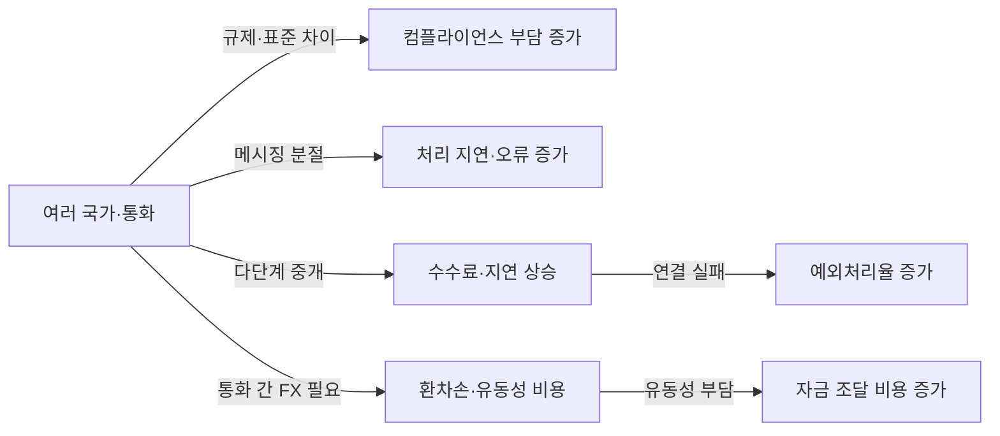
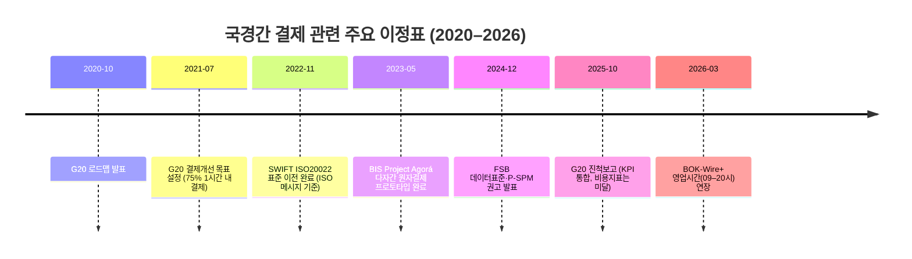

# Executive Summary  
B2B 국경간 결제·정산에서는 **단순한 송금 속도 부족**을 넘어, **서로 다른 국가의 통화·지급망·규제·데이터 시스템**이 연결되면서 발생하는 복합적 마찰이 핵심입니다. 예를 들어 다수 국가·통화를 거치는 거래는 다단계 중개은행(chain of correspondents)을 거쳐야 하고, 상이한 AML/KYC·제재 규제와 데이터표준 미비로 처리에 지연·비용이 가중됩니다. 주요 마찰 유형으로는 **(1) 법·규제 분절**(상이한 AML/KYC·제재 규제), **(2) 메시징·데이터 표준 미흡**(ISO20022 미도입, 비구조화 포맷), **(3) 중개은행 네트워크 분절**(인수기관 및 코리어스은행 단계), **(4) 유동성·프리펀딩 부담**(다중 통화예비자금 필요), **(5) 환전·환율 비용**(FX 변환 과정과 스프레드), **(6) 운영시간 불일치**(시차·영업일 차이) 등이 있습니다. 이들 마찰은 각각 측정 가능한 지표(예: 예금 운영 시간, 처리시간, 결제비용, 중개은행 수, 예외처리율 등)로 나타나며, 전 세계적으로 수십조 달러 규모의 무역·자금 흐름에 영향을 줍니다. 예컨대 SWIFT gpi를 분석한 결과, 전신료 제외 평균 처리시간은 **2시간 미만**이나 코리어 단계가 늘어날수록 지연이 커지며 저소득국에서는 수일 걸리기도 합니다. 이 보고서는 공식·학술 자료와 국내외 사례를 통해 각 마찰의 원인과 영향을 검증하고, **국가별 차이**(한국·일본·싱가포르·홍콩·중국·UAE·인도·EU/미국 등)를 분석합니다. 정책·기술 이니셔티브(예: G20 로드맵, ISO20022, RTGS 연계, CBDC/스테이블코인 실험) 현황과 한계도 살펴, 국경간 결제 인프라의 실질적 개선 방향을 제시합니다. 핵심 결론은 “기술 혁신도 중요하지만, **통합 표준·상호운용성·경쟁 촉진** 없이는 마찰이 근본적으로 해소되지 않는다”는 점입니다. 

## 1. 구조적 마찰 유형 개요  
B2B 국경간 결제에서는 다음과 같은 **주요 마찰**이 동시다발적으로 발생합니다:  

- **법·규제 분절 (Regulatory Fragmentation):** 국가별 AML/KYC, 자금세탁방지·테러자금규제, 통화전쟁법 등 규제·감독기준이 상이합니다. 이로 인해 결제마다 복수의 규제 준수 절차가 반복돼야 합니다. 예를 들어 EU·미국·아시아 국가 간 거래에서는 각국의 제재 리스트·데이터보호법 규정을 동시에 검토해야 하므로 처리시간과 비용이 증가합니다.  
- **메시징·데이터 표준 미흡 (Data/Standards Fragmentation):** SWIFT 메시징·포맷과 각국 내부 시스템 간 호환성이 부족합니다. ISO 20022 같은 통합 표준이 도입되지 않은 곳에서는 결제 정보가 비구조화되어 전산 처리·자동화가 어렵고, 수동 재처리와 오류가 잦아집니다. 결과적으로 **STP(Straight Through Processing)**가 저해되고, 회계·조정 비용과 예외처리률이 증가합니다.  
- **중개은행 네트워크 분절 (Correspondent Banking Fragmentation):** 대부분의 국경간 거래는 다단계 코리어(개설행)로 처리됩니다. BIS 보고서에 따르면 거래당 평균 1개 이상의 중개은행을 거치며, *“거리가 먼 곳”*이나 거래량이 적은 통화일수록 중개 단계가 많아집니다. 각 중개은행마다 수수료와 준수 심사가 추가되고, 다단계로 진행될수록 지연 및 비용이 가중됩니다. 실제로 글로벌 추세는 코리어 은행 수와 연결 경로 수가 지속 감소하고 있으며, 특히 신흥국간 연결이 위축되고 있습니다.  
- **유동성·프리펀딩 분절 (Liquidity Fragmentation):** 서로 다른 통화권 결제에서는 미리 각국에 자금(노스트로 계좌)을 확보해야 합니다. 모든 중개은행·당사자가 자기 통화로 자금을 준비(프리펀딩)해야 하므로 기업과 은행의 운전자본 비용이 커집니다. 영업시간 겹침 부족 시 이 자금이 오랫동안 묶이거나 여분이 필요해져 유동성 조달 비용과 위험이 증가합니다.  
- **환전·환율 비용 (FX Fragmentation):** 최종 수취국과 지급국 통화가 다르면 FX 전환이 필수입니다. 통화유동성이 좁은 시장에서는 스프레드가 크고, 주요 기축통화(예: USD)를 중개통화로 쓰는 경우가 많습니다. 이는 환전비용과 환위험(환율변동 위험)을 발생시킵니다. 예를 들어 KRW→JPY 거래에도 대개 USD를 거치면서 추가 비용이 붙습니다.  
- **운영시간 차이 (Time Fragmentation):** 국가별 결제 시스템의 영업시간, 영업일이 서로 다릅니다. 예를 들어 서유럽·미국 은행이 한국·동아시아 영업일보다 일찍 마감하거나 반대로 늦게 개장하면, 물리적 처리 지연이 생깁니다. BIS 연구에 따르면 이런 영업시간 불일치는 결제 지연을 유발하고 유동성 부담·리스크를 증대시킵니다. 2026년 3월 한국은행은 BOK-Wire+ RTGS의 운영시간을 09:00–20:00으로 확대했으나, 여전히 글로벌 풀타임(24/7)과는 차이가 있습니다.  

위 마찰들은 서로 겹치며 복합적으로 작용합니다. 다음 머메이드 다이어그램은 이들 요소 간 인과관계를 요약한 예시입니다.  

## 2. 마찰별 인과 분석과 지표  

### 2.1 법·규제 분절  
**설명:** 국가마다 송금·외환거래에 대한 규제가 다르고, 특히 AML/KYC, 자금세탁방지, 제재(Regulatory Sanctions) 규정이 서로 연동되지 않습니다. 결과적으로 기업이 국경간 거래를 할 때 **여러 국가의 규제를 동시에 충족**시켜야 합니다. 각 중개은행과 지급은행은 서로 다른 규제환경 하에서 독립적으로 심사를 수행하므로, 결제 전후로 수동 심사·서류확인·조사(Investigation)가 반복됩니다. FSB 보고서는 데이터 표준과 규제 분절이 자동처리를 저해하고 비용·속도를 악화시킨다고 지적합니다.  

- **인과 관계:** 예컨대 A국 은행에서 “KYC 완료” 처리하고 메시지를 보내면, B국 은행은 별도의 KYC, 제재조회를 다시 합니다. 이 중복 노력이 시간이 많이 걸리며(재심사 지연, 재조정) 비용도 커집니다. 국가별 감독당국 규정이 어긋날 경우(예: 자금출처증빙, 정보보유 규제 차이) 추가적 통관절차나 승인이 필요합니다.  
- **지표:** 마찰 강도를 나타내는 지표로는 ‘국경간 결제 건당 필요한 검증 단계 수’, ‘예외/거절건률’, ‘규제검토에 소요된 평균 시간’ 등이 있습니다. 구체적 수치는 공개 자료가 적으나, BIS은 “규제·데이터 표준의 분절”을 비용·속도 악화의 핵심 원인으로 꼽고 있습니다. 예를 들어 SWIFT gpi 분석에서, 수취은행 내부에서의 승인 대기 시간이 전체 지연의 주요 원인으로 지적됐습니다.  

- **사례:** Project Agorá(금융결제국제협회)는 암호화된 단일 원장(shared ledger)을 활용해 한 번의 규제정보 등록으로 모든 중앙은행·참여은행의 준수를 자동화하는 방안을 탐구했습니다. Agorá 프로토타입은 “사전 심사(pre-screening)”를 결제 흐름에 통합하고, 결제와 규제검증이 동시에 이루어지도록 함으로써 중복 심사와 지연을 크게 줄일 수 있음을 시연했습니다.  

### 2.2 메시징·데이터 표준 미흡  
**설명:** 국제결제에서는 송금 지시·정보전달에 쓰이는 메시징 표준이 통합되지 않아 마찰이 발생합니다. 기존의 SWIFT MT 메시지와 일부 로컬 시스템은 비구조화(or Legacy) 포맷으로 각국 간 정보 교환이 원활치 않습니다. 최신 ISO 20022 메시지가 보급되었으나 아직 **일관된 데이터 스키마**가 정착 중입니다. 결과적으로 은행 간 송금시 필수 정보를 완전하게 전달하지 못해 수취은행이 수신 고객 계좌 확인과 수수료 계산 등을 수동으로 처리해야 합니다. 또한 응용 프로그래밍 인터페이스(API) 표준이 부족하여 핀테크·비은행 참여자가 시스템에 직접 연결하기 어렵습니다.  

- **인과 관계:** 송금 정보가 불충분하거나 포맷이 달라 재가공이 필요하면 자동화가 중단되고, 사람이 개입하는 오퍼레이션 단계가 생깁니다. 데이터 불일치는 또한 회계·조정에서 반복 데이터 매칭을 유발하여 ‘Reconciliation 비용’을 증가시킵니다. 예를 들어 사업자번호·거래정보가 누락된 메시지를 받은 은행은 서류를 재요청하거나 오류를 수정하느라 처리시간이 길어집니다.  

- **지표:** “STP(자동처리) 비율”, “메시지 오류율”, “완결까지 걸린 추가 통신 횟수” 등이 주요 지표입니다. 한국은행에 따르면 SWIFT를 활용한 해외송금에서 발생하는 오류 및 재처리 수수료도 기업 부담으로 전가됩니다. BIS/CPMI 보고서는 ISO20022의 공통 데이터 요구사항이 개발되었음을 강조하며, 이를 통해 구조화된 정보로 처리 속도와 투명성을 높일 수 있을 것으로 전망합니다.  

- **사례:** SWIFT GPI(GPI) 프로그램이 대표적 개선 사례입니다. GPI 가입 은행 간엔 표준 메시지를 통해 거래 추적과 수수료 정보를 공유하여 투명성을 높였고, 수동 리컨실레이션을 줄였습니다. BIS 분석에 따르면 GPI를 통해 **50% 이상**의 건이 30분 내에 처리되도록 개선되었습니다. 그러나 GPI조차도 FX·유동성 문제는 해결하지 못했으므로 여전히 구조적 마찰 일부가 남아있습니다.  

### 2.3 중개은행 네트워크 분절  
**설명:** 전통적 국경간 결제는 환거래은행(코리어방식)을 기반으로 합니다. 은행 A가 B에 자금을 보내면, 국내 은행 A → A의 해외 코리어 → B의 코리어 → 은행 B로 이어지는 다단계 경로를 밟습니다. BIS 분석에 따르면 거래당 평균 **약 1개** 정도의 중개은행을 거치며, 거리가 멀거나 거래량이 적을수록 단계수가 늘어납니다. 각 단계마다 비용(수수료)과 처리 지연이 추가됩니다. 더구나 2010년대 이후 국제 규제가 강화되며 여러 은행이 위험을 우려해 동맹을 줄여, 코리어 은행 수가 지속 감소하고 있습니다. 이로 인해 일부 소규모 통화나 개발도상국의 거래는 연결 자체가 어려워지고, 코리어 은행이 제공하는 유동성 수단을 상실해 비용과 리스크가 높아졌습니다.  

- **인과 관계:** 각 중개은행은 자체 리스크 관리 절차(KYC, 내부 승인 등)를 수행하고, 거래정보를 자사 포맷으로 처리합니다. 단계가 늘어날수록 이 과정이 중첩되며 처리 시간이 길어집니다. 예를 들어 A→C→B의 두 단계 코리어에서는 A→B의 단일 직행 대비 두 배의 메시지 교환과 감사절차가 필요합니다. BIS 연구에 따르면 단계 하나당 지연시간은 한도 내로 크지는 않으나, 누적될 경우 결제 소요 시간이 크게 늘어납니다.  

- **지표:** “코리어 은행 수”, “평균 거래 단계 수”, “코리어 경로 실패 비율” 등이 마찰 측정치입니다. G20 사계보고서에서 현재 글로벌 소매 및 도매 지급의 평균 단계 수는 1.6 정도였습니다. BIS/CPMI “Next-generation Correspondent Banking” 보고서는 2011~2022년 사이 **활성 코리어 관계**와 **통로 수**가 각 지역에서 감소했다고 지적합니다. 한국 기업의 경우 주요 파트너 국가별로 코리어 은행을 다르게 활용하기도 합니다. 예를 들어 한국→유럽 루트는 통상 EUR 계좌를 가진 한국은행과 직접 이어지지만, 한국→필리핀 루트는 여러 중개은행을 거칠 수 있습니다.  

- **사례:** Project Agorá와 BIS 실험에서 코리어 문제를 해결하려는 시도가 이뤄졌습니다. Agorá 프로토타입은 토큰화 예금(tokenized deposit) 방식으로 국내 예금을 디지털형태로 바꾸고 이를 공동 원장에서 결제함으로써, **전통적 코리어를 거치지 않고 다자간 PvP(지급-지급 상계결제)**를 가능하게 했습니다. 결과적으로 거래처리 단계와 시간을 획기적으로 줄일 수 있음을 확인했습니다.  

### 2.4 유동성 분절 및 프리펀딩  
**설명:** 다중 통화 거래에서는 각 통화별 자금이 별도로 필요합니다. 은행 A는 해외 거래를 위해 자사 KRW 계좌뿐 아니라 USD·EUR 등 각 중개은행의 현지 계좌에 미리 예치(프리펀딩)해두어야 합니다. 이 과정에서 예치한 자금은 반환 시점까지 묶여 운전 자본이 증가합니다. BIS 보고에 따르면 국경간 결제에서는 인출 채권보다 예치 채무가 더 많아 평균적으로 해외예비자금 보유량이 많고, 이는 공급자금의 자금비용 부담으로 이어집니다. 통화 간 유동성이 분절되면 각 통화마다 별도 예치가 필요하므로 자금 부담이 곱절 이상 커질 수 있습니다.  

- **인과 관계:** 예를 들어 한국 기업이 USD로 수입 대금을 지급하려면, 거래 은행은 거래 전에 한국은행이나 코리어 은행의 USD 계좌에 충분한 자금을 확보해야 합니다. RTGS 영업종료 후에는 자금을 미리 조달해야 하므로, 잘못 예측하면 다음 영업일까지 자금이 묶입니다. BIS 연구는 “영업시간 연장으로 크로스보더 속도 개선과 유동성 관리 향상이 가능”함을 강조합니다.  

- **지표:** “노스트로 계좌 잔액”, “예치수익률 차이”, “LCR(유동성커버리지비율) 충족비용” 등을 통해 추정할 수 있습니다. 예를 들어 해외 예치금에서 발생하는 이자 손실이나 외환보유 이율 차익 기회비용이 연간 수십억 달러에 달할 수 있습니다. BIS 보고서에 따르면 주요 은행들은 예치자금에 연간 수백만~수천만 달러 수준의 기회비용을 겪는 것으로 추정됩니다. 한국에서는 수출입은행, 산업은행 등이 스마트 딜(Smart Deal) 같은 FX 플랫폼을 운영해 일부 자금을 상계 처리함으로써 이 비용을 절감하고 있습니다.  

- **사례:** RTGS 운영시간을 조정하는 것도 유동성 문제 대응책입니다. 예컨대 한국은행이 BOK-Wire+를 저녁 8시까지 연장한 것은 시간 불일치로 인한 자금 이체 지연과 자금 묶임을 줄이기 위함입니다. 유럽중앙은행과 BIS도 RTGS 연장과 24/7 운영을 통해 PvP(지급대지급) 기회를 확대하고 결제 위험을 낮출 것을 권장하고 있습니다.  

### 2.5 환전과 환율 비용  
**설명:** 국경간 결제에서는 지급통화(Payment Currency)와 수취통화(Receipt Currency)가 다를 경우 FX 전환이 필요합니다. 이 과정에서 발생하는 **환전 비용**(FX 스프레드)과 **환율 변동 위험**이 기업과 은행의 부담이 됩니다. 특히 인하우스 FX 시장이 발달하지 않은 통화일수록 시장 깊이가 얕아 스프레드가 커지고, 주요 통화를 교량 통화(bridge currency)로 사용하면 이중환전 비용이 추가됩니다.  

- **인과 관계:** 예를 들어 한국 기업이 JPY로 수출 대금을 청구하면 원화로 환전할 필요가 없지만, USD 청구 시 KRW→USD로 전환해야 합니다. 이때 매매기준율과 매도율의 차이(스프레드)가 발생합니다. 또한, USD/KRW와 USD/JPY 시장보다 KRW/JPY 직접시장 유동성이 부족해 결과적으로 USD 경유로 세 단계 환전을 해야 하면 비용과 위험이 늘어납니다. 스테이블코인을 중개통화로 사용해도, 코인↔법정화폐 환전 시 비슷한 비용이 발생함이 실증되었습니다.  

- **지표:** “평균 FX 스프레드(%), 환전 발생 거래액 대비 비용”이 대표적입니다. 국제은행간연합(BIS) 자료를 보면 주요 기축통화쌍은 거래당 수십~수백 베이시스포인트의 비용이 소요됩니다. 예컨대 EUR–USD는 2–4bp, USD–KRW는 40–50bp 수준으로 알려져 있습니다. 한편 국제결제은행 총회(CPMI) 보고서에 따르면 국경간 결제 시 평균 환전비용은 통화 쌍마다 다르며, 전통 채널 대비 디지털 채널에서 더 높은 비용이 될 수도 있습니다.  

- **사례:** CBDC나 토큰화 예금 실험에서 FX 문제를 직접 해결하려는 시도도 있습니다. 예를 들어 BIS의 Agorá는 한 번의 원장상에서 다중 통화를 아톰(원자) 결제하여 중간 다리를 없애는 방식을 실험했습니다. 이론적으로는 거래당 두 통화의 예금이 동시에 교환되어 환율위험을 제거합니다. 그러나 법적·규제적 난제와 참여 주체간 프레임워크 구축이 필요해 상용화는 아직 요원합니다.  

### 2.6 운영시간 및 처리시간  
**설명:** 각국 결제 인프라의 운영시간과 영업일 불일치는 결제 전체 시간을 늘리고 리스크를 가중시킵니다. 예를 들어 한국의 RTGS가 영업종료(오후 8시) 후 미국 동부은행 영업시간이 종료됐거나, 반대로 한국 휴일에 미국·유럽 RTGS는 개장하는 경우, 즉각적인 결제가 불가능해집니다. 이로 인해 자금이 하루씩 지연되거나 별도의 연결시간(overnight 등)이 필요합니다. BIS/CPMI 연구에서 RTGS 운영시간 연장은 “유동성 관리 개선과 PvP 가능성을 늘려 비용 절감”에 도움이 된다고 평가합니다. 한국도 2026년 전영업일 대상(월~금)으로 시간 확장을 시행하여 이 문제를 일부 해소하고 있습니다.  

- **인과 관계:** 영업시간 불일치로 동기화되지 못한 자금은 자칫 결제 실패나 대기 상태가 됩니다. 예를 들어 뉴욕 세션 종료 후 도쿄·서울 시장이 오후 시간인데, 이미 미국에서 자금이 끌어다 쓰인 상태라면 추가 자금조달이 필요합니다. BIS는 “시간 단절이 크면 유동성 비용과 정산 위험도 높아진다”고 지적합니다. 반대로 네트워크를 연계해 24/7으로 운영하면 PvP로 신속 결제가 가능해집니다.  

- **지표:** “RTGS/FPS 일일 운영시간(시간/주)”, “각국/코리어 중 운영 겹치는 시간(시차)”, “결제완료까지 걸린 실제 소요시간” 등으로 측정할 수 있습니다. SWIFT gpi 기준 글로벌 백오피스 이동시간을 보면, 중개단계가 적고 시간 겹침이 많은 코리어에서는 평균 수십 분 내 완료되지만, 시간 불일치가 큰 경우 수시간~수일이 소요되었습니다.  

## 3. 국가·지역별 비교 분석  

국가별로 **인프라·규제·무역구조**가 다르므로, 동일 마찰이라도 정도가 달라집니다. 주요 권역별 특징은 다음과 같습니다:

- **한국:** BOK-Wire+ RTGS(09:00–20:00)와 코리어 뱅킹(주로 USD중개) 체계를 사용합니다. Smart Deal FX 플랫폼을 통한 일부 직접 결제를 제공하지만, 대부분 SWIFT 기반입니다. ISO 20022 채택은 진행 중이며, FSB 로드맵 이행을 위해 ISO20022 PCR(2023) 수용 후 메시지 통합작업을 진행 중입니다. 한국은 전통적으로 **원화-외화 FX시장**(특히 KRW–USD)이 다른 주요국 대비 깊은 편이나, 비거래통화(KRW-JPY 등)로의 유동성은 부족합니다.  
- **일본:** BOJ-NET RTGS(평일 09:00–17:00)와 Fasts(즉시결제)를 보유합니다. BOJ는 RTGS 운영시간을 17:00에서 19:00까지 연장할 계획이며, 단일화폐(JPY) 내에서는 국경간 장벽이 없습니다. 다만 한국-일본 거래에서는 USD를 중간 통화로 사용하는 경우가 많아 USD 유동성에 의존합니다.  
- **싱가포르:** FAST(즉시결제 시스템)을 포함한 여러 결제망과 강력한 FX 파트너 네트워크를 갖추고 있습니다. MAS는 BIS 프로젝트(Agorá, mBridge)에 적극 참여했으며, *다자간 지급 결합(MPS)* 시험에도 나섰습니다. 싱가포르는 금융 허브로 USD, SGD 등 다중 통화가 사용되고 SWIFT gpi 도입률이 높으며, 비교적 높은 자동화 수준을 유지하고 있습니다.  
- **홍콩:** HSBC 등 글로벌 은행 다수의 허브로, HKD 뿐만 아니라 위안화(CNH/CNY) 결제도 지원합니다. CIPS(중국 대외결제시스템)과 연결성을 갖췄으나 자금세탁규제는 중국 내 규제에 종속되지는 않습니다. 홍콩도 디지털 화폐 테스트(예: eHKD 내부망)와 BIS 실험에 활발히 참여 중입니다. 예를 들어 Hong Kong Monetary Authority는 mBridge에 참여하여 CNY/CNH 등 통화 실험을 진행했습니다.  
- **중국:** CIPS와 SWIFT를 중첩 운영하며, eCNY(디지털 위안) 해외결제 파일럿을 진행했습니다. 중국은 통제를 강화한 자본흐름 정책 때문에 외국인 직접투자와 결제가 국가 승인을 받으며, 국제 결제망 접근성이 제한적일 수 있습니다. 그러나 인민은행 차원에서 주요 국가(홍콩·UAE·태국)와 디지털 위안 실험을 해왔습니다.  
- **UAE:** UAE 중앙은행과 BIS가 협력한 다수중앙은행(Digital Currency) 프로젝트(eg. mBridge)의 발상지입니다. AED와 USD 양방향 결제에서 SWIFT와 자체 RTGS(UAEFTS)가 활용되며, 상당 부분 CIPS(Switch 대신) 연결도 시도되고 있습니다.  
- **인도:** 통합 결제 시스템(IMPS/NEFT)과 직불계좌(UPI)를 잘 구축했으나 해외 거래시 대부분 USD를 매개로 합니다. RBI는 인도 루피 보호정책을 강하게 유지하므로 INR-상대 통화 거래엔 신중합니다. 최근에는 UAE·싱가포르와 실시간 다중통화 결제 고도화를 추진 중입니다.  
- **EU/유로화(통합시장):** 유로존 내부는 SEPA(단일유로시장)로 실질적 국내 결제처럼 통합되어 마찰이 거의 없습니다. T2/T2S 시스템으로 통합 결제가 이뤄집니다. 다만 EUR 외부 국가와 거래할 때는 위에서 언급된 마찰이 발생합니다. 유럽은 TARGET24/7과 PvP 실험(워크업)도 검토 중입니다.  
- **미국:** Fedwire, CHIPS(달러대형결제 시스템)과 최근 공개된 FedNow(2023년)로 국내외 결제망을 운영합니다. 미국은 기축통화국으로서 국제거래 통화로 USD 비율이 높으며, 많은 상대국이 USD 결제를 중개로 합니다. 동시에 강력한 규제(OFAC, FinCEN)가 적용되어 국제 거래 때 규제 검증이 필수입니다. 스타트업과 은행의 달러 스테이블코인(예: USDC)이 빠르게 성장 중이며, COSMOS나 JPM Coin 같은 대형 실험도 있었습니다.  

아래 표는 각 국·지역의 인프라·특징과 관련 프로젝트를 요약합니다. 

| 국가/지역 | 주요 결제망 및 특성                         | 국경간 연계 프로젝트·사례                     |
|:---------:|:-----------------------------------------:|:---------------------------------------:|
| **한국**   | BOK-Wire+ RTGS (09:00–20:00), 智能딜(Smart Deal) FX 플랫폼 | BIS Agorá 참여, ISO20022 도입 중 (KFTC)        |
| **일본**   | BOJ-NET RTGS (09:00–17:00→7:00 확대예정)    | BIS Stella 참여(유럽ECB 협업 실험)           |
| **싱가포르**| FAST(즉시결제), RTGS 연계, 다중통화 지원           | MAS Ubin/Project Helios 참여, ASEAN 연계 프로젝트 |
| **홍콩**   | HKD RTGS, CIPS 연결, 다양한 통화 지원          | mBridge 참여(위안화 교차국실험), eHKD 내부실험 |
| **중국**   | CIPS, CBDC eCNY 실험 (대외결제)               | 디지털 위안 해외 패스포트(iCBDC 합동실험)      |
| **UAE**    | AED RTGS, 높아진 SWIFT 가맹도              | BIS mBridge/Agorá 발상지, 프로젝트 조인트 추진 |
| **인도**   | RTGS + IMPS/NEFT (24h), UPI (국내즉시결제)      | UAE 인도RuSpace 참여, 선박토큰 결제(실험)      |
| **EU/SEPA**| EURO TARGET2 (RTGS), SEPA(단일유로)         | TIPS 24/7, ECB 디지털유로 연구 참여          |
| **미국**   | Fedwire, CHIPS, FedNow (2023~), SWIFT 가입     | JPM Coin, USDC 등 스테이블코인 실험, FedNow 출시 |

## 4. 정책·산업적 함의 및 향후 과제  

- **정책적 시사점:** 국경간 결제의 근본적 개선을 위해서는 기술 단일화뿐 아니라 **국제 규제·기술 표준 정합성 강화**가 필수적입니다. FSB·CPMI는 이미 ISO20022 메시지 표준·데이터요구사항을 개발했으며, 각국 중앙은행들은 운영시간 연장·RTGS 연계·PvP 확장을 추진 중입니다. 또한 스테이블코인과 CBDC 제도화로 새로운 rails를 만들려는 시도가 있으나, BIS는 이를 *“기존 분절을 치환(replace)”이 아니라 “여전히 FX·온오프램프 이슈가 남는 대체 옵션”*으로 보고 있습니다. 국내외 규제당국은 디지털자산과 전통 금융 간 브릿지(온오프 램프) 규정을 마련 중이며, 향후 다양한 통화 토큰의 상호인정 방안을 검토해야 할 것입니다.  
- **산업계 과제:** 은행·핀테크 기업은 기술 혁신뿐 아니라 **운영 모델 혁신**을 도모해야 합니다. 예컨대 실시간자금관리(CFT)와 같은 신사업을 확대해 각 통화별 자금 부담을 줄이고, AI/블록체인으로 규제 준수 과정을 자동화해야 합니다. 민간 협의체도 다자간 연결망 구축(예: FPS 링크, Corda Settler)과 글로벌 표준 동기화 노력을 지속할 필요가 있습니다. SWIFT gpi 경험에서 알 수 있듯, 단일 솔루션 만으로는 효과가 제한적이므로 복합 솔루션(예: ISO20022+ 블록체인 예금+ 포괄규제기준)을 조합해야 합니다.  
- **잔여 리스크:** 결제 네트워크의 복원력, 데이터 프라이버시, 사이버 보안 등은 여전히 중요한 리스크 요인입니다. 분절된 여러 시스템을 연결할수록 중앙화된 공격면(attack surface)이 넓어질 수 있습니다. 또한 규제 격차 완화 과정에서 자국 금융주권 이슈와 법적 최종성(finality)의 충돌도 예상됩니다.  

### 다음 단계 제안  
이상의 분석을 바탕으로 **효과적 SAM(Effective SAM) 추정**을 위한 추가 작업을 제안합니다. 현재 SAM(Core)은 한국↔해외 상품·서비스 무역대금 약 1.3–1.6조 USD 수준(2025년 기준)이지만, 이 중 **이종통화 결제 부분**을 가려내어야 합니다. 예를 들어 통화통계를 활용해 실제 FX가 동반된 지급건수를 추정하고, 국가별 통화쌍 커버리지(예: USD-KRW vs EUR-KRW 비중)를 적용할 수 있습니다. 또한 산업 데이터(해외법인 배당·차입, 국제 금융기관 거래)로 기업 Treasurer 자금이동 규모를 보완 추정할 필요가 있습니다. 

**결론:** B2B 국경간 결제의 본질적 마찰은 **단순 속도 개선이 아니라 국가·통화 분절에 기인**합니다. 결과적으로 미래 시장에서는 “여러 결제 네트워크와 자산(법정화폐, CBDC, 스테이블코인 등)을 연결하고, 그 위에서 FX·유동성·준수를 오케스트레이션하는 **통합계층(플랫폼)**”의 역할이 중요해질 것입니다. 이번 분석을 토대로 각 마찰별 실증 데이터를 축적하고, 특히 *cross-currency 거래 비중*에 따른 SAM(유효시장규모) 계산을 수행하는 것이 다음 과제입니다.  

**Sources:** FSB·BIS 보고서, SWIFT gpi 분석, 한국은행·관세청 등 공식 통계, 학술·업계 리포트를 인용. (관련 데이터 출처는 본문과 표에 명시)