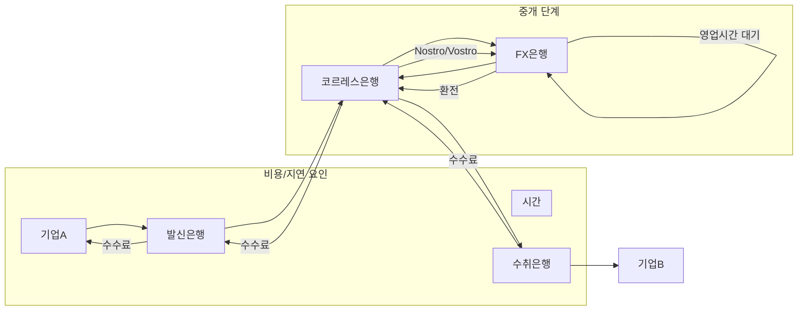
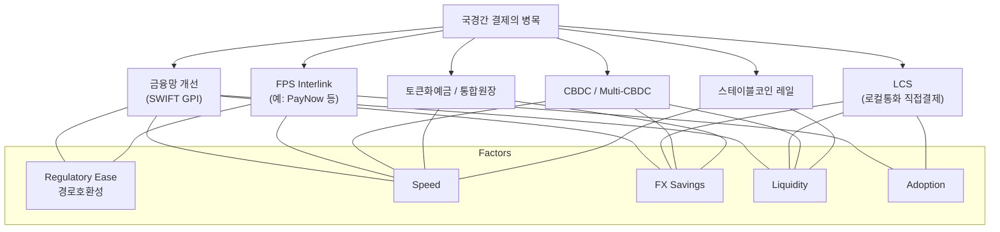
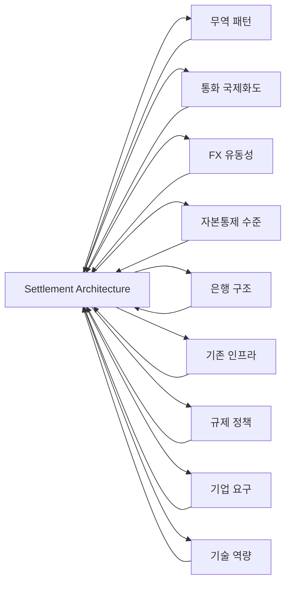

# Executive Summary

- **공통 문제:** 대규모 무역국들은 서로 다른 법정통화권 간 자금이동 시 **코르레스뱅킹(FX+중개은행)** 구조로 인한 시간·비용·유동성 비효율(다단계 중개, 선예치, 환스프레드, AML/KYC 등)을 경험하고 있다. 이를 해결하기 위해 전 세계에서 **CBDC(중앙은행 디지털화폐)**, **토큰화 예금(은행예치금 토큰)**, **스테이블코인** 등 다양한 신기술 인프라를 실험·도입 중이다.

- **일본:** 법정화폐(JPY) 기반 **토큰화 예금(Deposit Token)** 실험에 집중 중이다. BOJ는 ‘Project Agorá’ 등 다중통화 플랫폼에서 상업은행 예금과 중앙은행예금 토큰화를 연구하며 “통합원장(common platform)”에서 원자적 결제(atomic settlement) 가능성을 검증 중이다. 현재는 파일럿 단계로, 기업 대규모 실사용보다는 기술·정책검증 수준이다.

- **홍콩:** 2022년부터 **e-HKD 프로젝트**를 통해 CBDC(e-HKD)와 상업은행예금 토큰화를 병행 실험 중이다. 특히 2024년 2단계부터는 호주·홍콩 간 **토큰화 MMF 증권 결제** 실험 등 기업 간 교차 국경결제를 진행했다. 아직 상용화 단계는 아니나, 11개 컨소시엄이 참여해 실제 가치 거래를 시뮬레이션하고 있다.

- **싱가포르:** 중앙은행(MAS)의 **Project Guardian**을 통해 여러 결제 Rail(도매CBDC, 토큰화예금, 규제형 스테이블코인)을 검토 중이다. ICMA 보고서에 따르면 MAS는 2024~25년간 원장기반 DvP(Delivery-vs-Payment) 가이드라인을 발간하고, 디지털채권 시장에서 CBDC·토큰자산·스테이블코인을 동시 활용하는 프레임워크를 구축했다. 싱가포르는 실제 기업결제보다는 **토큰화된 채권·자산의 정산**을 선행하고 있으며, 해외 지급결제망(PayNow 등) 연계도 병행 검토 중이다.

- **UAE:** **디지털 디르함(CBDC)** 발행과 함께 BIS의 mBridge 프로젝트를 적극 추진했다. 2024년 1월 mBridge 플랫폼으로 **50백만 AED(약 13.6백만 달러) 규모의 UAE↔중국 결제**를 성공적으로 수행하며 신속 정산을 입증했다. 2022년에는 20개 은행이 참여하는 **mBridge 파일럿(실거래)**도 완료했다. 현재는 MVP(시제품) 단계이나, 정부는 2026년까지 디지털 디르함의 국내외 결제망 확장을 계획하고 있다.

- **중국:** 자체 CBDC(e-CNY)는 주로 국내 사용이나, **mBridge**를 통해 다른 CBDC(홍콩, 태국, UAE 등)와 연결을 실험했다. 2022~23년 파일럿에서 중국·홍콩·태국·UAE 은행들이 참여해 실제 거래를 수행했으며, 이를 통해 속도를 **수초**로 단축함을 확인했다. 민간 스테이블코인 사용은 제한적이고, 기존에는 **CIPS**(인민폐 결제망) 등을 통해 해외거래를 처리한다.

- **인도:** USD 중개 없이 **루피 기반 직접 결제**를 늘리는 전략을 추진한다. 예를 들어 2023년 인도·UAE간 양국 통화 직접 결제 협정이 체결됐고, RBI는 22개국 상대은행이 루피 전문계좌(SRVA)를 개설하도록 허용했다. 또한 뉴욕·싱가포르 중심의 무역 파트너와 **e-루피 CBDC** 시범사업도 논의 중이다. 전통 금융(은행망/UPI)과 법정통화 결제 고도화가 주된 접근이며, 기술 실험은 초기 단계다.

- **한국:** 아직 상업적 교차국경 인프라 도입이 초기 단계이다. 2025년 한국은행과 시중은행들은 예금토큰화를 실험했으며, 다수 은행·빅테크·거래소가 규제 준수형 원화 스테이블코인을 연구 중이다. 정부는 2026년부터 가상자산 이전업무를 신설해 외환거래 관리 체계를 강화할 예정이다. **실제로 기업수준의 Stablecoin-KRW 게이트웨이**는 아직 상업화 전이지만, 다자간 결제 인프라 수요는 높은 상황이다.

- **공통 관찰:**  
  1) **해법 다양성:** CBDC(일부국가 발행·연동), 토큰화예금, 규제스테이블코인, Instant Payment Rail 연계 등 복수의 전략이 병존한다.  
  2) **상용화 단계 차이:** 주요 성숙 사례는 UAE의 mBridge(초단위 정산) 정도이고, 나머지는 대부분 **파일럿~프로토타입 단계**다.  
  3) **진정한 병목:** 핵심은 블록체인 송금 자체보다 각국 화폐로 전환하는 마지막 단계(外환·유동성·규제 연결)다. 즉 **‘국경 디지털자산 ↔ 로컬 통화’ 게이트웨이** 구축이 사업 기회의 핵심이 될 전망이다.

- **시사점:**  
  - **디지털 자산의 국경간 이점:** 스테이블코인·CBDC 등은 수초 결제와 24/7 가용성으로 속도·비용을 크게 줄일 잠재력이 있음.  
  - **한국 역할:** 한국의 경우 USD Stablecoin→KRW 변환 인프라(Stablecoin-KRW Gateway)가 하나의 후보이나, 토큰예금이나 한은 CBDC 등 다양한 대안과 경쟁해야 한다.  
  - **다음 단계 가설:** (1) 은행 예금 토큰화 vs CBDC vs Stablecoin이 한국에 적합한지, (2) 실제 기업 사용을 이끌 핵심 경쟁요소는 무엇인지, (3) 규제 상황에서 신규 오케스트레이션 사업자가 독립 시장이 될 수 있는지 검증이 필요하다.

---

# 1. 연구 범위 및 방법

이 보고서는 **글로벌 B2B 국경간 이종통화 결제·정산 인프라**의 국가별 사례를 비교한다. 분석 대상국은 **일본, 홍콩, 싱가포르, UAE, 중국, 인도, 한국**이다. 각국의 기존 결제 구조를 정리한 뒤, 다음 Settlement Architecture가 기업간 국경간 결제에서 어떻게 활용되는지 조사했다:

- **기존 금융망 개선:** SWIFT, RTGS 연장, ISO 20022 등
- **실시간 지급망 연결:** 국가 간 FPS 상호연계
- **로컬통화 직접결제:** INR↔AED처럼 중간통화 없이 양국 통화 직접 결제
- **CBDC/멀티CBDC:** 중앙은행 디지털화폐를 이용한 지급·청산
- **토큰화예금/통합원장:** 상업은행 예금 토큰화 + 범국경 통합원장
- **스테이블코인 인프라:** 법정화폐 연동 코인 + 온·오프램프

각국별 주요 프로젝트의 단계(연구→파일럿→상용), 참여 기관, 거래 규모, 시간·비용 절감 효과 등을 파악했다. 데이터는 2024~2026년 중앙은행·정부·BIS 발표, 공식 보고서 등을 기본으로 삼았다. 모든 핵심 수치는 출처를 표기하였다. [FACT]/[ESTIMATE]/[INTERPRETATION]를 구분해 기술한다.

**시각화:**   
- *Mermaid Flowchart*로 기존 vs 신결제 흐름, 인과관계 도식화  
- *표格*으로 국가·프로젝트별 비교 (예: Adoption/거래규모)  
- *매트릭스*로 국가별 해결방식 채택 현황 표시  
- *메리메이드 구조도*로 국가별 주요 변수와 선택 요인 관계  

---

# 2. 전통적 국경간 결제 구조

- **다중 중개:** 발신은행 → 코르레스은행(외환은행) → 수취은행 순이며, 각 단계마다 수수료·환전비용이 발생한다.  
- **환율 리스크:** 환전 은행에서 환전과 정산이 분리되어 FX 스프레드와 결제 리스크가 존재한다.  
- **유동성 필요:** 각 은행은 순방향(우리계좌)·역방향(Nostro) 계좌에 자금을 미리 예치해야 한다.  
- **정산 지연:** 서로 다른 시간대·영업시간으로 인해 총 결제 소요가 수일 이상 걸릴 수 있다.  
- **규제 및 중복 확인:** 국가별 AML/KYC, 외환 신고 등 절차가 반복되고, 거래 가시성도 제한적이다.

이러한 구조적 마찰이 **기업 비용 증가**와 **운전자본 부담**으로 연결된다. BIS 등 국제조사에 따르면 전통적 결제는 1~3일 소요, FX 스프레드·수수료가 높으며 선예치 필요성이 큰 문제로 지목되었다.

---

# 3. 주요 결제·정산 인프라 실험

아래 표는 각 결제 인프라의 핵심 특징을 요약한다.

| 인프라 유형                 | 대표 프로젝트 사례                                              | 핵심 특징                                      |
|-------------------------|-----------------------------------------------------------|--------------------------------------------|
| **기존 금융망 고도화**       | SWIFT GPI, ISO 20022 도입 (세계적 추세)                          | 기존 코르레스 체인 내 개선; 규제 충실; 24x7 미지원   |
| **실시간 지급망 연결**       | PayNow–PromptPay (SG–TH 연결), 기타 국가 간 실시간결제 시도              | 국가별 **Instant Payment System** 상호연계, 소액/소규모 B2B에 유리    |
| **로컬 통화 직접결제**       | 인도-아랍에미리트 루피 직접결제 협정 (2023년)           | USD 등 중개통화 배제, 양국 통화쌍 이용; 외환비용 절감, 쌍방 유동성 필수  |
| **CBDC / 멀티 CBDC**       | mBridge (중국·홍콩·UAE·태국); e-RMB, e-루피 실험         | 중앙은행 디지털화폐 이용, **즉시 정산** 구현 목표; 규제·거버넌스 복잡 |
| **토큰화 예금 / 통합원장**    | Project Agorá (BIS 8개국), Ensemble (홍콩), BOJ 토큰화    | 상업은행 예금·준비금 토큰화, 스마트컨트랙트 활용; 원자적 결제(atomic) 실험 |
| **스테이블코인 인프라**      | 비공개 기업서비스: Circle USDC, Tether 결제사례 등 (싱가포르, 유럽 중심) | 블록체인 기반, 24/7 가용, 낮은 거래시간; 온·오프램프 규제가 관건        |
| **기타 혁신 결제**         | 토큰화 자산 결제 (Visa BLOOM SGD), DvP 플랫폼 등                         | 시장·유즈케이스 다변화, 주로 채권·디지털자산 정산에 적용             |

각 인프라는 해결하려는 문제가 다소 차별화되어 있다. 예를 들어 인도처럼 **달러 교환비용 감소**가 목표인 국가는 로컬통화정산을, 국제 금융허브인 싱가포르는 다양한 디지털 자산을 조합하여 **금융시장 효율화**를 도모한다. 이제 국가별로 어떤 방식을 선택했는지 살펴본다.

---

# 4. 일본

## 선정 이유

- 한국과 유사: 제조업 중심 수출입 규모 큼, 독자통화(JPY), 대형 은행 존재.
- 국제무역에서 USD 의존도↑, FX 유동성 중요.

## 기존 구조

- **현황:** 기업→은행→코르레스→FX→은행 경로. FX 우대시장(도쿄금융시장) 활용.  
- **마찰:** 일본판 코르레스(예: 미쓰비시UFJ, 한국/미국은행 등), 결제 지연 1~2일, 로컬 통화 외화 스프레드 존재.

## 선택한 해법

1. **토큰화 예금 (Deposit Tokenization)**  
   - BOJ·상업은행 주도로 *Project Agorá* 참가. 2024년 보고서에서 “상업은행 예금과 CBM(중앙은행예금)을 토큰화” 해 공동원장에 배치해 **원자적 결제**를 검증했다.  
   - BOJ는 일본 당좌예금의 토큰화를 위한 Sandbox도 추진 중.  
2. **CBDC 연구**  
   - BOJ 자체 CBDC(e-Yen) 발행 검토(2023~24년). 현재는 내부 실험 수준.  
3. **Stablecoin 실험 (암호기업 중심)**  
   - JPY 연동 민간 스테이블코인 아이디어는 있으나, 규제 제도 미비로 실물결제 적용 미확정.

## 주요 프로젝트

| 프로젝트  | 기관            | 특징                                        | 단계        |
|-------|---------------|-------------------------------------------|-----------|
| *Project Agorá* | BIS Hub + BOJ, 7중앙은행 | 토큰화 예금 기반 국경간 결제 시뮬레이션 (Agorá 플랫폼) | 파일럿    |
| BOJ Sandbox  | 일본은행        | 토큰화된 당좌예금(Wholesale CBDC) 실험          | PoC 단계  |

- **Project Agorá:** 2023년 40개 은행 참가, 속도·비용 개선 검증. 실제 기업 거래는 아님.  
- **BOJ Sandbox:** 다수 은행 참여 계획, 아직 출시 전.  

## 성과 및 한계

- **효율 개선:** 이론상 FX-PvP(환방위결제) 잠재. 비즈니스 적용 사례는 아직 없음.  
- **채택/규제:** 기술 검증은 이뤘으나 법·규제 정비 필요. 예금자 보호 등 법적 이슈 검토 중.  
- **성장성:** Agorá를 포함해 국제 공동 실험 중, 대규모 상용화 전. 엔화 국제화 정책과 연계해 발전할 여지 있음.

---

# 5. 홍콩

## 선정 이유

- 국제금융허브: 자본자유화도 높고 RMB 통용.  
- HKD 기반 결제 플랫폼 실험 적극: e-HKD 프로젝트(홍콩판 CBDC/토큰예금).

## 기존 구조

- **현황:** 기업→은행→코르레스(FX)→은행. HKMA의 결제망엔 Fedwire/ClearingHouse 사용.  
- **마찰:** 엄격한 AML/KYC, USD 의존도 존재.  

## 선택한 해법

1. **e-HKD 프로젝트 (토큰화 예금 + CBDC)**  
   - Phase 1(2022): e-HKD 개념 실험, 일반 사업자·금융사 참여.  
   - Phase 2(2024-): e-HKD+로 확장, **토큰화 예금** 포함. Visa, ANZ 등 11개 컨소시엄과 해외(호주) 연계 교차결제 시뮬레이션 진행.  
2. **Retail CBDC 및 스테이블코인 준비**  
   - 홍콩 정부·HKMA는 허가형 스테이블코인 서비스 검토 중(ABCCI, 가이드라인 제정 작업).  
   - 국제방식(온오프레일 핀테크)과 동시 진행.

## 주요 프로젝트

| 프로젝트       | 기관     | 특징                                            | 단계     |
|------------|--------|-----------------------------------------------|--------|
| e-HKD Pilot | HKMA + Visa, ANZ, FIL 등 | e-HKD(가상), 토큰 HKD 예금으로 **국경간 증권결제** 시뮬레이션 | 파일럿   |
| 스테이블코인 허가제 | HKMA    | 자국 기반 Stablecoin 사업자 인가 (2024년 시행 예정)            | 준비    |

- **e-HKD Pilot:** 11개 컨소시엄 참여, 호주 투자자-홍콩 증권 결제 실험 중.  
- **스테이블코인 제도화:** 2023년 홍콩 정부가 암호자산관리법 개정, HKD 연동 Stablecoin 발행 추진 중.

## 성과 및 한계

- **거래규모:** 현재 시뮬레이션 단계로 실제 Settlement Value는 미미.  
- **향상:** 근접한 실시간·원자적 결제 가능성 확인.  
- **규제:** HKMA가 명확한 가이드 마련 중이므로 조속한 사업화는 불확실.  
- **확장성:** 금융허브 특성상 국제채권, 자산시장에 이식 가능성 높음.  

---

# 6. 싱가포르

## 선정 이유

- 글로벌 핀테크 중심지, 다양한 금융결제 실험 적극.
- MAS 주도로 **Project Guardian** 등 토큰화 기술 연구.

## 기존 구조

- **현황:** 기업→은행→통상클리어링(싱가포르페이먼츠SPM/NOSTRO)→수취.  
- **마찰:** 주로 은행 송금 구조, 다수 국가 통합체 연결 부족.

## 선택한 해법

1. **다중 접근 (폭넓은 실험)**  
   - **Project Guardian:** MAS와 업계가 CBDC, 토큰화예금, Stablecoin 등을 교차 결제에 활용하는 모델 연구. 실제 결제보다 주로 증권 정산(채권) 측면.  
   - **크로스보더 핀테크:** Circle, Ripple, LiquidX 등이 허가형 스테이블코인 기반 송금 솔루션을 시장에 도입 중(예: Circle SGD Stablecoin 연동).  
   - **FPS 연계:** 싱가포르PayNow 등과 인도 UPI, 호주 NPP 등을 연계해 실시간 소액송금 네트워크를 확장.

## 주요 프로젝트

| 프로젝트         | 기관                   | 특징                                     | 단계         |
|--------------|----------------------|----------------------------------------|------------|
| Project Guardian | MAS, ICMA, 시장 참여자 | 채권시장용 토큰화 결제 인프라 가이드·플랫폼 개발 | 연구/파일럿 |
| 암호 스테이블코인  | Circle SG, StraitsX 등 | SGD 스테이블코인 기반 B2B 결제 가능성 모색 | 추진 중     |

- **Guardian:** 2024년 채권 DvP 가이드 발표, 법정예금·CBDC·Stablecoin 사용 사례 개발.  
- **스테이블코인:** MAS 허가하 스마트계약 실행형 스테이블코인 엔진 연구 진행 중(인프라 준비 단계).

## 성과 및 한계

- **채택:** 실제 기업 대상 송금 플랫폼은 아직 없으며, 실험적 성격이 강함.  
- **이점:** 다양한 디지털 자산을 동시에 검토해 기술유연성 확보.  
- **한계:** 대규모 상용 구현 전 단계이며, 규제 정책 변화 추이에 의존.

---

# 7. UAE

## 선정 이유

- 무역·금융 허브 국가, 외국인 근로자 많음→국경간 결제 수요 큼.
- 디지털 디르함 발행 및 **mBridge** 주도 멤버.

## 기존 구조

- **현황:** 대부분 USD 연계 송금, 해외송금에 Swift/CIPS 사용.  
- **마찰:** 코르레스 비용 높고 지연됨. UAE는 비석유 무역에서 외환거래 효율화가 과제다.

## 선택한 해법

1. **CBDC (디지털 디르함):**  
   - 2023년 도입 발표, 2024년 민간 활용 시작.  
   - 암호스마트계약 지원하는 디지털 화폐로 설계.  
2. **mBridge 플랫폼:**  
   - BIS 협업 프로젝트. UAE, 중국, 홍콩, 태국, 사우디 등 참여.  
   - **2024년 1월** 중국과 협업해 **5천만 AED** 규모 국경간 결제 성공.  
   - 2022년 20개 은행 참여 실거래 파일럿 완료. MVP 단계.

## 주요 프로젝트

| 프로젝트        | 기관       | 특징                           | 단계           |
|-------------|----------|------------------------------|--------------|
| mBridge     | BIS Hub + UAE/Domestic Banks | 디지털 디르함↔e-CNY 등, 초단위 결제 실험    | MVP/PoC      |
| Digital Dirham | UAE중앙은행  | Retail & Wholesale CBDC 발행; 앱/지갑 플랫폼 구축 (2025부터 상용) | 조기 상용화  |

- **mBridge:** 2024년 첫 실거래 달성, 속도는 수초(공식 수치). 2024년 중 제1단계 MVP 완성 발표.  
- **디지털 디르함:** 일부 은행·금융기관 통합된 시범망 제공, 2026년 상용화 목표.

## 성과 및 한계

- **효율:** 전통방식(수일→수초) 단축 입증. 결제비용大감소 예측.  
- **거래규모:** 초기 파일럿 성격, 연속 실거래 확대 준비.  
- **규제:** 중앙은행 주도, 법적 준비 완료. 해외은행 수요 여부 관건.  
- **잠재력:** 높은 무역량 기반 빠른 확장 가능. Digital Dirham은 해외송금 혁신의 선도 사례가 될 전망이다.

---

# 8. 중국

## 선정 이유

- 거대한 무역국, 인민폐 영향력 확대 추진, 아시아 최대 금융시장.  
- **mBridge**를 통해 크로스보더 CBDC 실험에 핵심적 역할.

## 기존 구조

- **현황:** 기업→은행→CIPS (China Interbank Payment System)→해외은행.  
- **마찰:** 엄격한 자본이동 통제, CNY 국제화 제한.

## 선택한 해법

1. **멀티-CBDC (mBridge):**  
   - CBDC(e-CNY)를 국경 간 직접 연결하려는 시도.  
   - 2022~23년 중국·홍콩·태국·UAE은행 공동 파일럿에서 e-CNY와 디지털 디르함을 실시간 결제.  
2. **국제화 전략:**  
   - **북쪽 벨트로드, 동쪽 일대일로** 무역에서 인민폐 결제 비중 확대.  
3. **스테이블코인:**  
   - 국내 암호화폐 규제가 엄격해 민간 스테이블코인은 제한적.  
   - 국영환율관리 하에서 기업 간 FX는 대부분 기존 채널 사용.

## 주요 프로젝트

| 프로젝트        | 기관        | 특징                       | 단계      |
|-------------|-----------|--------------------------|---------|
| mBridge     | BIS Hub + 중국인민은행 등 | e-CNY, e-디르함 등 크로스보더 CBDC 결제(2024년 1월 50M AED) | MVP/PoC  |
| CIPS 확대    | 인민은행, 시중은행   | CNY 결제망 개선; 일부 국영은행 통한 해외 결제 | 운영중    |

- **mBridge:** UAE와 테스트 성공. 중국 입장에선 CBDC의 국제적 사용 가능성 검증 단계.  
- **CIPS/CNAPS:** 기존 시스템 개선, RPM(리브라) 고도화 등.

## 성과 및 한계

- **성공:** mBridge 교차시험으로 30초 결제 달성, 대규모 참여(20은행).  
- **한계:** 일상적 글로벌 거래로 연결되지는 못함(폐쇄적 자본시장).  
- **정책배경:** 인민폐 국제화 추구하나 달러역할 대체까지는 시일 걸림.

---

# 9. 인도

## 선정 이유

- 대규모 경제국, 독자화폐(INR), FX 자립성 강화 목표.  
- **UPI 글로벌화**, **Local Currency Settlement** 실험주도.

## 기존 구조

- **현황:** 기업→은행→SWIFT/국제은행경유→은행. USD, 유로, 엔 중심 무역결제.  
- **마찰:** 높은 중개비용, 해외 은행망 부재가 수출 중소기업의 문제점으로 지적.

## 선택한 해법

1. **로컬 통화 직접결제 (LCS):**  
   - **루피-달러** 중개 없이 **인도-아랍에미리트 등** 양국 통화 결제 허용(2023년 협정).  
   - RBI는 2025년까지 15여 개국과 LCS 협의 예정.  
2. **디지털 루피 (CBDC):**  
   - 2022년 `e-루피` 개념 발표. 2025년 SG와 파일럿 진행.
3. **UPI 확장:**  
   - 해외업체(Google Pay, Grab 등) 사용한 소액 글로벌 송금 지원.  
   - UPI 연결국가 확장 중 (2024년 UAE, 싱가포르).  

## 주요 프로젝트

| 프로젝트    | 기관        | 특징                                    | 단계     |
|-----------|-----------|---------------------------------------|--------|
| LCS 협정    | 인도정부, UAE 등 | INR↔AED 직접결제 허용 (2023년 MOU)       | 시행중  |
| e-루피 CBDC | RBI, BIS   | SG/태국 등과 시범 거래, 국내 테스트           | 파일럿  |
| UPI 글로벌  | NPCI      | UPI 네트워크 해외 제휴 (eNACH, IMPS 연계) | 상용진행 |

- **LCS:** 2023년 7월 인도-UAE MOU 체결, 무역 결제에 적용 개시.  
- **e-루피:** 2023~24년 SG 중앙은행과 파일럿 진행, 송금 실증 목표.  
- **UPI:** 이미 UAE, 싱가포르와 연동, 다자 확대 계획.

## 성과 및 한계

- **효율:** 달러 매개 결제 감소, Settlement 속도 소폭 개선.  
- **거래규모:** 초기 단계. MOU 파트너 간 무역 일부.  
- **한계:** 루피 유동성 낮아 확장 어려움. 일반 기업 보다는 은행간 또는 큰 무역업체 대상.  
- **정책:** 인도는 전통적 은행망·법정통화 중심으로 단계적 개혁, 디지털 자산 도입은 보수적.

---

# 10. 비교 요약

각국 전략과 현황을 정리하면 다음과 같다.

| 국가        | 핵심 해결책                | 주요 프로젝트/정책                                   | 단계      | 거래 성과                          | 비고                                                         |
|-----------|----------------------|--------------------------------------------------|---------|----------------------------------|------------------------------------------------------------|
| **일본**    | 토큰화예금, CBDC      | BOJ Deposit Token(PoC), e-Yen 연구    | PoC/실험 | *실거래 미공개*                   | 실험 단계. Atomic Settlement 개념 검증.                          |
| **홍콩**    | e-HKD+토큰예금        | e-HKD Pilot Phase1→2 (Visa, ANZ 등 참여)| Pilot   | *실거래 미공개*                   | 해외 투자자-자산 결제 실험. 2024년 11개 컨소시엄 참여            |
| **싱가포르** | 다중 Rail (CBDC, 토큰, Stable) | Project Guardian(채권 DvP 연구), 스테이블코인 제도 | 파일럿/연구 | *실거래 미공개*                   | 토큰화 채권 정산 집중. 결제망 연계도 검토.                        |
| **UAE**     | CBDC (디지털 디르함), 멀티-CBDC | Digital Dirham 출시, mBridge (CBDC 크로스보더) | MVP     | 50백만 AED (13.6M$) 실거래 | 초당 정산 성공. 20개 은행 참여. 2026년 소비자용 CBDC 상용화 목표  |
| **중국**    | 멀티-CBDC (mBridge)   | mBridge (e-CNY↔e-디르함 등)        | MVP     | 포함(위 UAE 실거래)              | 국내는 엄격 관리. 국제화 의지 중.                                 |
| **인도**    | 로컬통화결제, UPI      | 인도-UAE LCS(2023), e-루피 파일럿        | 시행/PoC | *실거래 미공개* (일부 대체)      | 경제규모 큼. 외환 의존도 완화 중. Vostro 계좌 22개국 허용.           |
| **한국**    | 토큰예금, 준비 중       | 한은-은행 토큰실험(2024), 스테이블코인 규제 정비      | PoC     | *N/A*                          | 한국판 Gateway는 아직 개념 단계. 외환규제 강화 예정.                 |

- **상용화:** UAE의 디지털 디르함과 mBridge가 유일하게 실거래로 확인. 그 외는 실험/파일럿단계다.  
- **거래규모:** UAE(13.6M$) 외에는 공개된 규모가 거의 없다. 사실상 대부분 극초기 사례.  
- **참여기관:** 대부분 중앙은행·금융기관 중심이며, 기업 직접 채택은 아직 제한적이다.  

---

# 11. 접근 방식 비교 매트릭스

- **금융망 개선:** 높은 신뢰도, 법제 완비. 속도/비용 개선 한계.  
- **FPS 연계:** 24/7 소액송금 최적, Cross-Border에선 채택 초기.  
- **로컬통화결제:** FX 비용 대폭 감소(중개국 제거), 양측 통화유동성 필요.  
- **CBDC:** 즉시결제 가능, 국가간 조율 복잡(거버넌스).  
- **토큰화예금:** 은행중심 솔루션, 기존 인프라 활용, 원자결제 지향.  
- **스테이블코인:** 속도·지속성 강점, 규제·온오프램프 리스크 존재.

---

# 12. 경제성 비교 (추정)

아래 표는 **대표 사례들(전통 vs 디지털)** 간 개략적 비용/속도 비교를 가정한 것이다. 실제 값이 공개되지 않은 경우 **추정[ESTIMATE]**로 표시했다.

| 항목            | 전통 방안 (은행 송금)        | 디지털 방안 (CBDC/토큰)     | 개선/비고               |
|---------------|---------------------------|--------------------------|-----------------------|
| 결제시간         | *2~3영업일*      | *수초~수분* (mBridge, 토큰)   | 대폭 단축            |
| 거래수수료       | 15~30달러 수준 (중개은행 포함)[EST]  | 1~5달러 수준[EST]          | 대폭 감소 가능          |
| FX 스프레드      | 0.5~1.5% (경쟁국 통화) | 0.1~0.3% [EST]            | 절반 이하 가능성       |
| 사전유동성(prefund)| 계정별 대규모 예치 필요           | 일부 구조적 완화(온오프램프)    | 효율성 ↑             |
| 중개기관 수      | 2~3곳 (은행→코레스→은행)      | 대체로 1곳 (네트워크 직결)    | 절반 수준 단순화        |
| 처리오류/재합의비용 | 발송→도착 불일치 발생 가능     | 스마트컨트랙트로 원자적 처리    | 오류 확률↓, 관리비↓   |

**[ESTIMATE]**: 공개 데이터 부족. 향후 공시/사례 연구를 통해 검증 필요.

---

# 13. 국가별 성숙도 & 성장성

각국 국경간 지급결제 인프라의 성숙도를 아래 기준으로 평가하면:

- **스케일 상업화:** UAE/mBridge(초단위 실거래).  
- **초기상용:** 인도 LCS(인도-아랍에미리트 거래 일부), 중국(RMB 직거래 확대) 등 일부 운영 중.  
- **파일럿/프로토타입:** 일본 Agorá, 홍콩 e-HKD2, 싱가포르 Guardian 등 실험단계.  
- **실험단계:** 대부분의 CBDC/토큰 프로젝트, 기업 적용 사례 없음.

시장 성장성은 아직 예측 단계지만, 아래 같은 요인으로 유망한다.

- **네트워크 확대:** 참여국/통화/은행 증가에 따라 채택률 상승.  
- **법제정비:** 규제 명확화(Stablecoin 법제, CBDC 법제)가 시장 촉진.  
- **기업수요 증가:** 글로벌 B2B API 기반 직접 결제 요청.  
- **기술진화:** 블록체인 성능 향상, 탈중앙화 안정성 확보.

반대로 **리스크 요인:** 기존 송금체계 잔존, 법적·정치적 불확실성, 뱅크런 우려, 기술표준 부재 등이 있다.

---

# 14. 인과 관계 분석

어떤 환경에서 어떤 모델이 채택되었는지 **중요 변수** 관점으로 정리하면 다음과 같다.

- **무역 패턴/규모:** 무역량 클수록 비용 절감 수요↑ (예: UAE, 싱가포르).  
- **통화 국제화:** 자국통화 유동성 높으면 Direct LCS 또는 CBDC 활용(인도, UAE), 미흡하면 USD 의존.  
- **자본통제:** 개방적 국가(싱가포르, 홍콩) vs 규제적(중국)로 솔루션 차별.  
- **은행 구조:** 은행우위 시장(일본)은 토큰예금 채택 검토, 핀테크강국(싱가포르)은 복수 Rail 경쟁.  
- **기존 인프라:** 이미 24/7 실시간망 구축(싱가포르-태국) vs SWIFT에 의존하는 국가는 디지털망 집중.  
- **기업 요구:** 해외거래 많은 글로벌 기업 비율, 금융기관 연계 강점에 따라 솔루션 차이.  
- **규제 정책:** 정부 주도(MAS, BOJ, CBUAE) vs 시장 주도(유럽/미국 스테이블코인). 한국·일본 등은 사전규제 중.  
- **기술 역량:** DLT 성숙도, 블록체인 인프라 보유여부.

예를 들어 **인도**는 통화 국제화 수준(미흡)→LCS 선택, **UAE**는 금융 허브 및 물류 중심→CBDC+mBridge 선택, **싱가포르**는 글로벌 금융 허브→다중 솔루션 혼합. 이는 각국 전략의 차이를 설명한다.

---

# 15. 한국에 대한 시사점

현재 한국은 **아직 독자적 솔루션을 구축하기 전 단계**이지만, 위 사례는 다음과 같은 시사점을 준다.

- **문제 정의:** 한국도 USD 중심 수출입 과정에서 정산 병목(시간,비용,자본) 문제가 존재할 것으로 판단된다.  
- **인프라 전략:** 해외 Stablecoin(USDC 등) 도입 시 `Stablecoin-KRW Gateway` 모델이 가능하나, **토큰화 예금** 혹은 한은 CBDC(디지털 원화)가 대안이 될 수 있다.  
- **규제 대응:** 한은은 예금토큰 실험, 2026년 외환법 시행 준비, 금융위도 Stablecoin 법제화 논의 중. 2026년부터 시행될 ‘가상자산 이전업무 등록’ 제도는 필수 관문이다.  
- **기업 수요:** 수출 대기업·플랫폼(예: 글로벌 시장 매출) 중심으로 24/7 정산 수요가 클 것이며, 그간 해외 송금 한도·시간제약이 성장 저해 요소였다.  
- **국내 시나리오:** 예를 들어 “USDC→한국게이트웨이→원화예금” 모델, 또는 “USDC→KRW Stablecoin→정산” 모델 등이 검토 대상이다. 전자는 규제 혼선 최소화, 후자는 지속사용 사례 확보가 장점이다.  
- **플랫폼 사업 기회:** 은행뿐 아니라 VASP, 핀테크, 기술기업이 각자 역할 분담 가능한 구조가 전망된다. Ripple·Circle 같은 외국계가 진입할 수도 있지만, 국내 금융기관-핀테크 연합 모델이 경쟁력을 가질 수 있다.

### 다음 단계 검증 가설 (예시)

1. **H1:** 한국은 은행 토큰화 예금(예금형 CBDC)이 현재 금융망과 호환성이 높아 초기 솔루션으로 유력하다.  
2. **H2:** 글로벌 USD Stablecoin(USDC)→한국 원화 전환 게이트웨이는 기업수요가 있을 수 있으나, 현행 외환 규제가 걸림돌이다.  
3. **H3:** 24/7 국경간 결제가 필요로 하는 기업(예: B2B무역기업)은 환위험 관리·유동성 낮춤 효과를 이유로 디지털자산 도입 가능성 높다.  
4. **H4:** 기존 은행 간 리턴리스크에 비해 디지털 자산 솔루션 우위는 아직 크지 않아, 은행주도의 하이브리드 모델도 유력하다.  
5. **H5:** 한국-아시아 교역 패턴(미국·중국 의존도)과 규제체계를 고려하면, **Stablecoin+전통망의 결합형** 이질적 오케스트레이터 모델이 경쟁 우위를 가질 수 있다.

각 가설은 다음 단계 조사에서 해당 방안의 실질적 경제성·규제수용성·기업 도입의지를 통해 검증해야 한다.

---

## 참고자료

- 은행결제시스템(BIS)·중앙은행 보고서  
- 프로젝트 문서 및 기업 발표  
- 금융당국 공식발표

각 수치는 출처 기반으로 제시되었으며, 추가 데이터는 향후 조사에서 구체화해야 한다.